# Lab AWS — Managing Resources with Tagging

## 📋 About the Lab

This lab is part of the **AWS Re/Start Program** through **Escola da Nuvem**, focused on automating EC2 instance management using resource tags via AWS CLI and PHP SDK.

## 🎯 Objectives

Upon completing this lab, I was able to:

- ✅ Inspect and filter EC2 instances using custom tags via AWS CLI
- ✅ Use JMESPath `--query` syntax for advanced output formatting
- ✅ Batch-update tag values using a Bash script
- ✅ Stop and start EC2 instances by tag using a PHP script (Stopinator)
- ✅ Terminate non-compliant instances that lack required tags (Tag-or-Terminate)

## 🏗️ Lab Architecture

```
Lab VPC: 10.50.0.0/16
┌─────────────────────────────────────────────────┐
│                                                 │
│  ┌──────────────────────┐  ┌─────────────────┐  │
│  │   Public Subnet      │  │ Private Subnet  │  │
│  │   10.50.0.0/24       │  │ 10.50.1.0/24    │  │
│  │                      │  │                 │  │
│  │  [NAT Instance]      │  │ [Instance 1]    │  │
│  │  [Command Host]      │  │ [Instance 2]    │  │
│  │                      │  │ [Instance 3]    │  │
│  │                      │  │ [Instance 4]    │  │
│  │                      │  │ [Instance 5]    │  │
│  │                      │  │ [Instance 6]    │  │
│  └──────────────────────┘  │ [Instance 7]    │  │
│                             │ [Instance 8]    │  │
│                             └─────────────────┘  │
└─────────────────────────────────────────────────┘
```

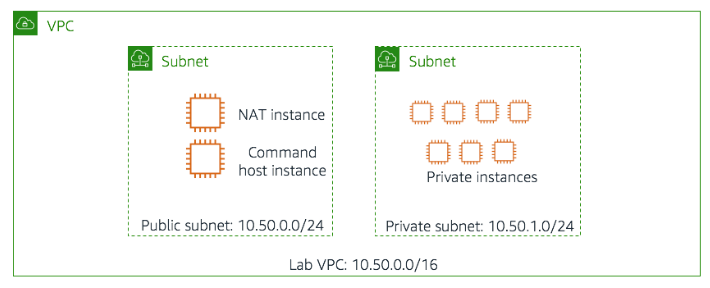

### Instance Tag Structure

All private instances carry three custom tags:

| Tag Name    | Possible Values                          |
|-------------|------------------------------------------|
| Project     | `ERPSystem` or `Experiment1`             |
| Version     | `1.0` (initially), `1.1` (after Task 1) |
| Environment | `development`, `staging`, or `production`|

## 🔧 Technologies and Services Used

- **Amazon EC2** — Virtual machines managed via tags
- **AWS CLI** — Command-line filtering and batch operations
- **JMESPath** — Query language for structured CLI output
- **PHP (AWS SDK)** — Stopinator and terminate-instances scripts
- **Bash** — Batch tag update script
- **Amazon VPC** — Isolated network with public and private subnets

## 📝 Tasks Performed

---

### Task 1: Use Tags to Manage Resources

#### 1.1 — SSH into the Command Host

Connected to the Command Host instance via SSH using the provided `.pem` key file:

```bash
chmod 400 labsuser.pem
ssh -i labsuser.pem ec2-user@<public-ip>
```

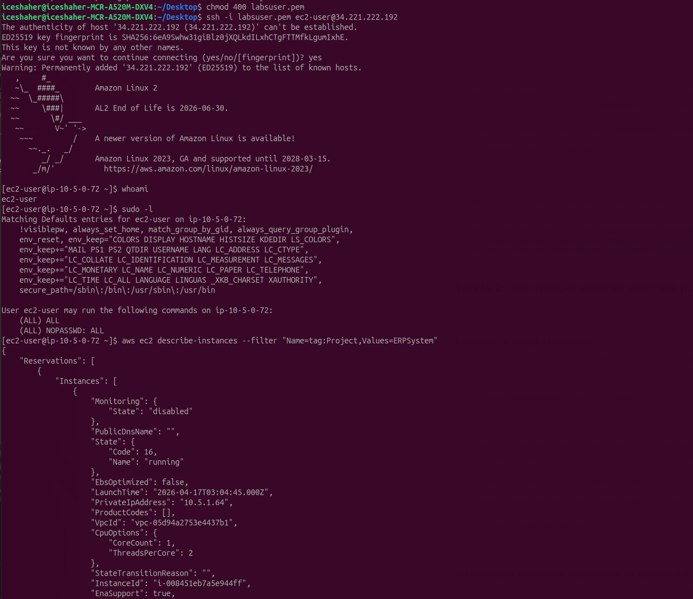
*SSH access confirmed. First CLI command `describe-instances` returns full JSON output for ERPSystem instances.*

---

#### 1.2 — Filter Instances and Format Output with JMESPath

Used the `--query` flag with JMESPath syntax to progressively refine the output:

**Step 1 — List only Instance IDs:**
```bash
aws ec2 describe-instances \
  --filter "Name=tag:Project,Values=ERPSystem" \
  --query 'Reservations[*].Instances[*].InstanceId'
```

**Step 2 — Add Availability Zone:**
```bash
aws ec2 describe-instances \
  --filter "Name=tag:Project,Values=ERPSystem" \
  --query 'Reservations[*].Instances[*].{ID:InstanceId,AZ:Placement.AvailabilityZone}'
```

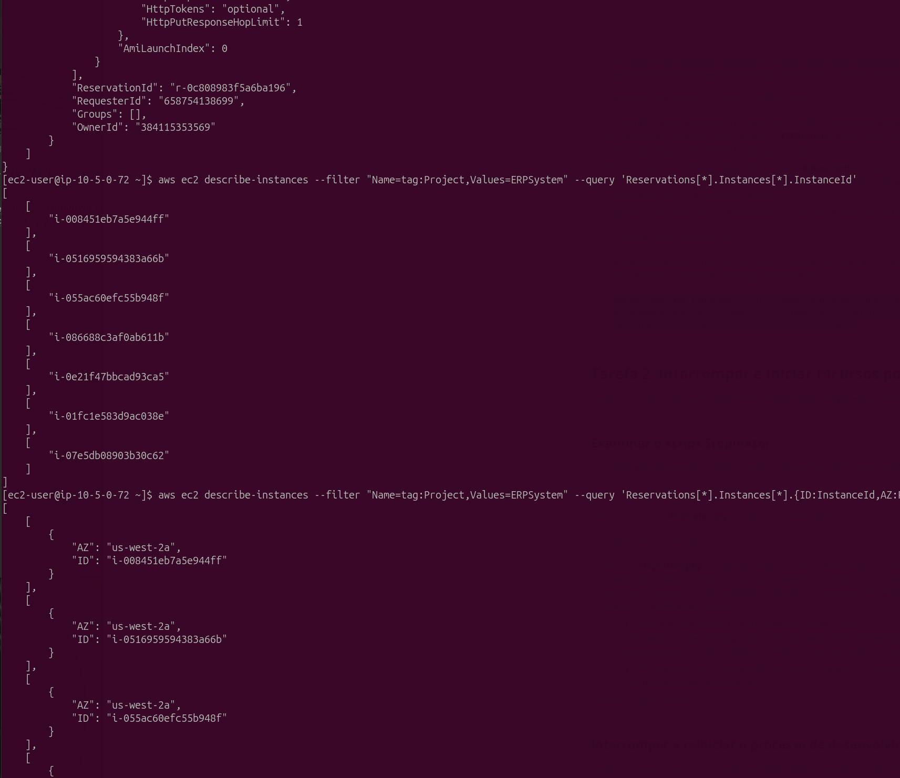
*Output progressively narrowed: first a flat list of IDs, then objects with `ID` and `AZ` fields using JMESPath aliasing.*

---

**Step 3 — Include Project, Environment, and Version tags:**
```bash
aws ec2 describe-instances \
  --filter "Name=tag:Project,Values=ERPSystem" \
  --query 'Reservations[*].Instances[*].{
    ID:InstanceId,
    AZ:Placement.AvailabilityZone,
    Project:Tags[?Key==`Project`] | [0].Value,
    Environment:Tags[?Key==`Environment`] | [0].Value,
    Version:Tags[?Key==`Version`] | [0].Value
  }'
```

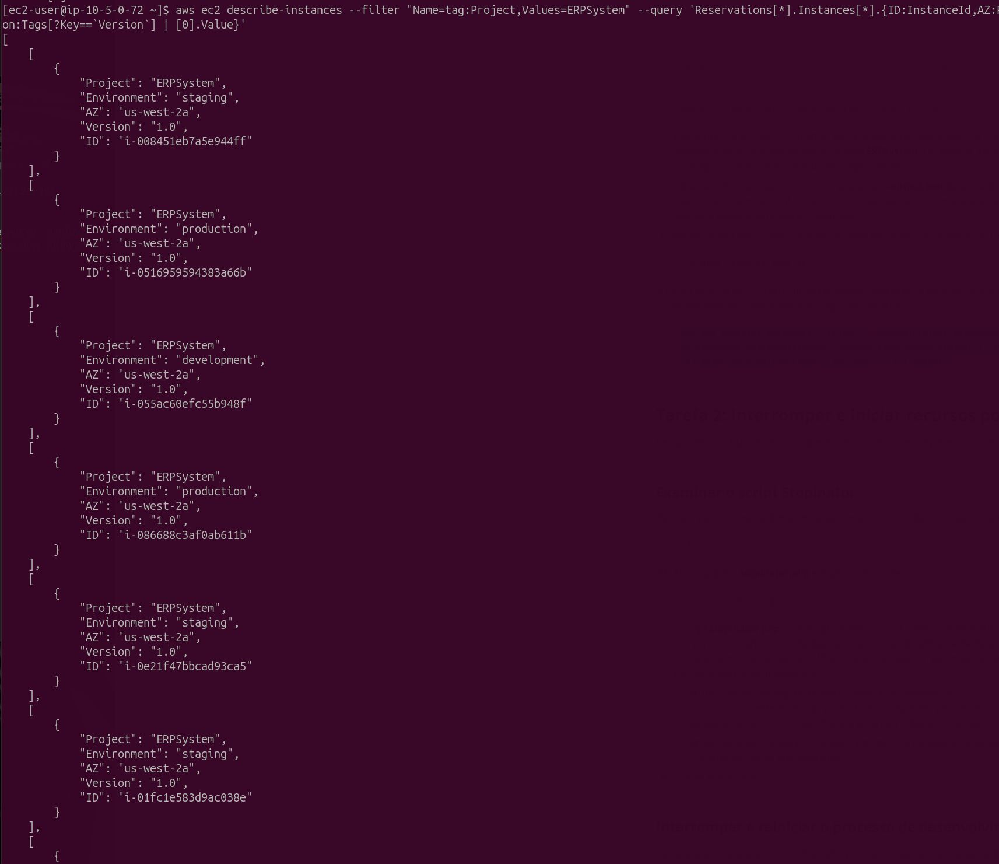
*All 7 ERPSystem instances listed with their full tag set. Staging, production, and development environments visible.*

---

#### 1.3 — Filter Development Instances and Update Version Tag

Added a second filter to isolate only `development` instances, then ran the batch update script:

```bash
# Filter: ERPSystem + development only
aws ec2 describe-instances \
  --filter "Name=tag:Project,Values=ERPSystem" \
          "Name=tag:Environment,Values=development" \
  --query 'Reservations[*].Instances[*].{ID:InstanceId,...}'

# Run the batch tag update
./change-resource-tags.sh
```

The `change-resource-tags.sh` script logic:
```bash
#!/bin/bash
ids=$(aws ec2 describe-instances \
  --filter "Name=tag:Project,Values=ERPSystem" \
           "Name=tag:Environment,Values=development" \
  --query 'Reservations[*].Instances[*].InstanceId' \
  --output text)

aws ec2 create-tags --resources $ids --tags 'Key=Version,Value=1.1'
```

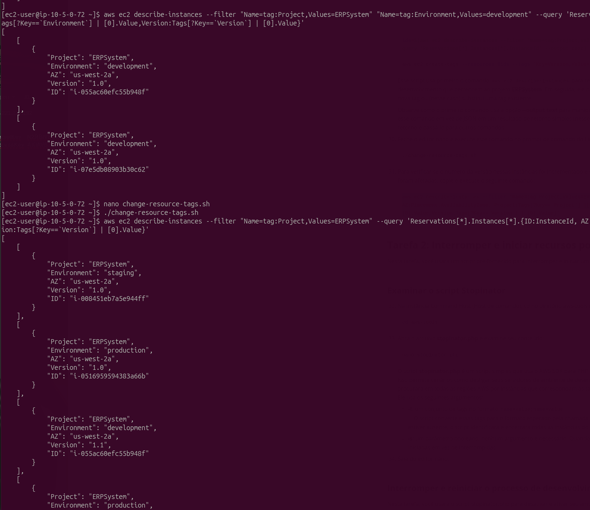
*Development instances now show `Version: 1.1` while staging and production remain at `1.0` — confirming the batch update was scoped correctly.*

---

### Task 2: Stop and Start Resources by Tag

#### 2.1 — Review the Stopinator Script

Opened `stopinator.php` in nano to understand its logic before running:

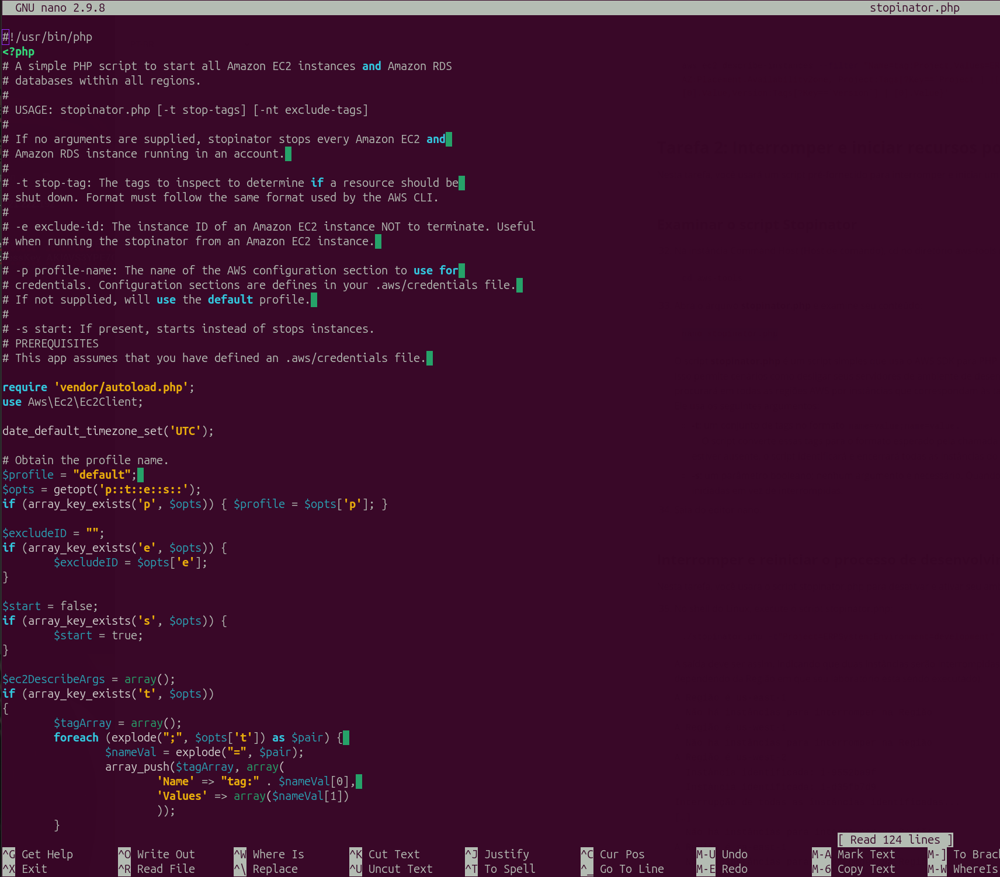
*The Stopinator iterates over all AWS regions, applies tag filters via the PHP SDK `describeInstances()`, and stops or starts matching instances depending on the `-s` flag.*

---

#### 2.2 — Stop Development Instances

```bash
cd ~/aws-tools
./stopinator.php -t"Project=ERPSystem;Environment=development"
```

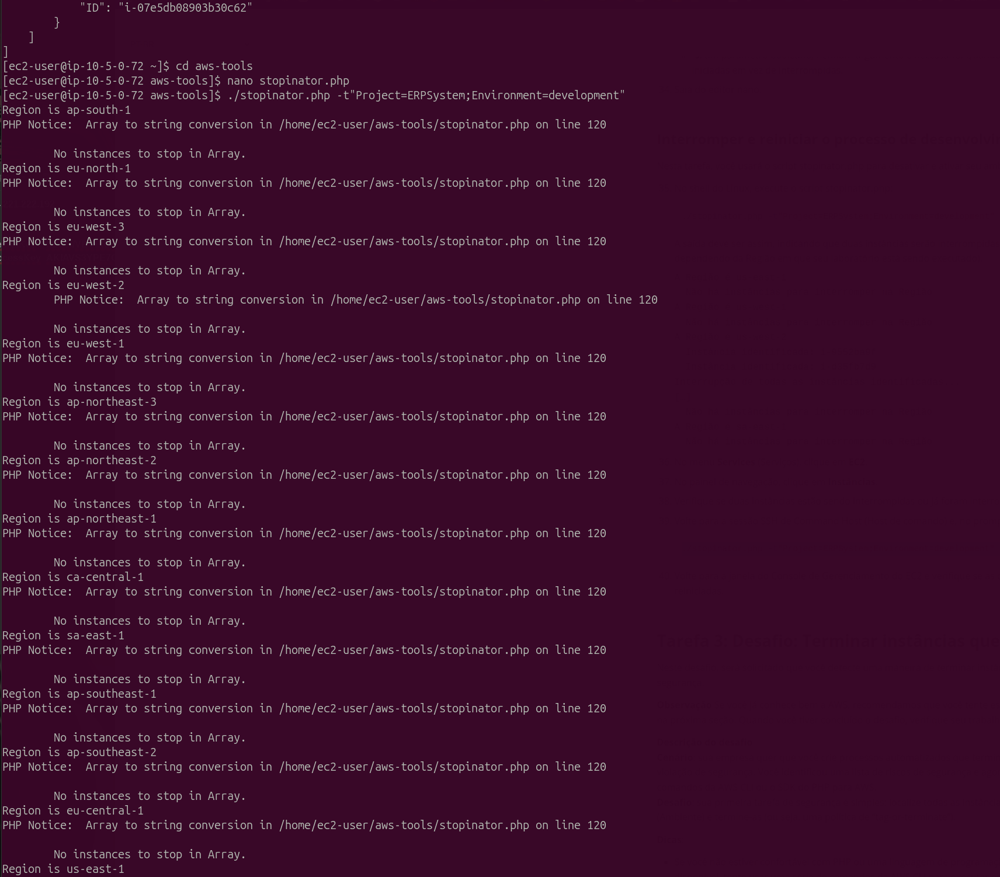
*Script scans all AWS regions. No instances found outside us-west-2.*

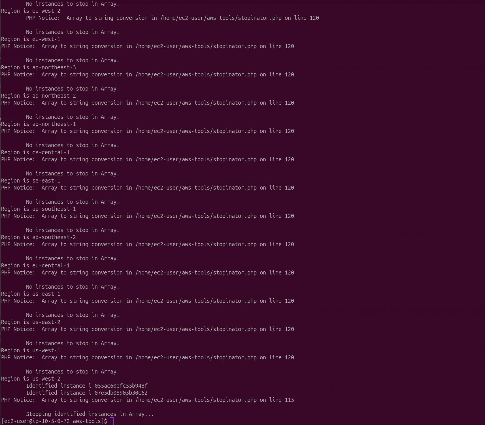
*In `us-west-2`: instances `i-055ac60efc55b948f` and `i-07e5db08903b30c62` identified and stopped.*

---

#### 2.3 — Verify Stopped Instances in Console

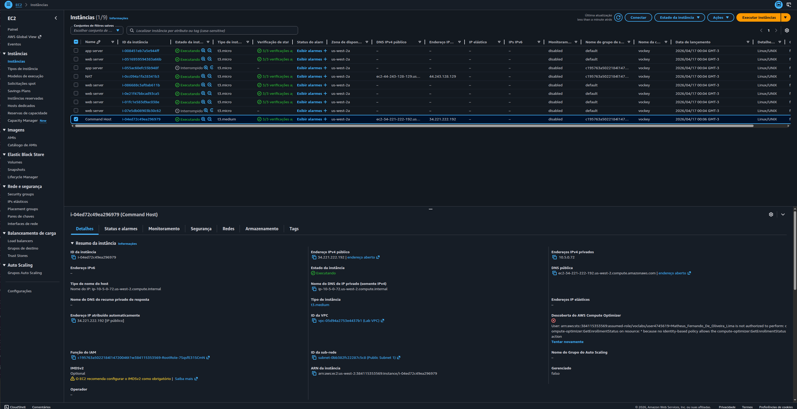
*EC2 console confirms both development instances are in **Stopped** state while all others remain running.*

---

#### 2.4 — Restart Development Instances

```bash
./stopinator.php -t"Project=ERPSystem;Environment=development" -s
```

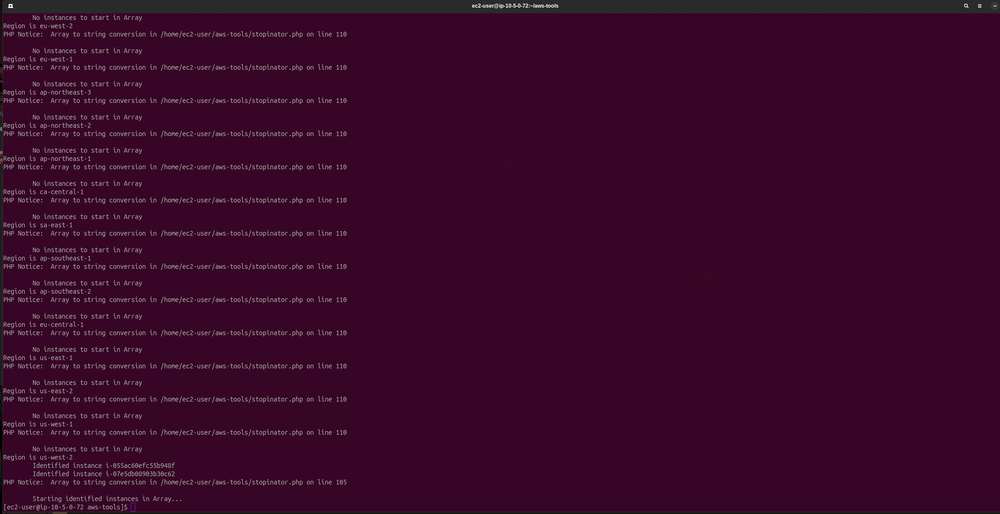
*Same two instances identified in `us-west-2` and brought back to running state with the `-s` flag.*

---

### Task 3 (Challenge): Terminate Instances Without Tags

#### 3.1 — Remove the `Environment` Tag from Two Instances

In the EC2 console, removed the `Environment` tag from 2 private instances to simulate non-compliant resources.

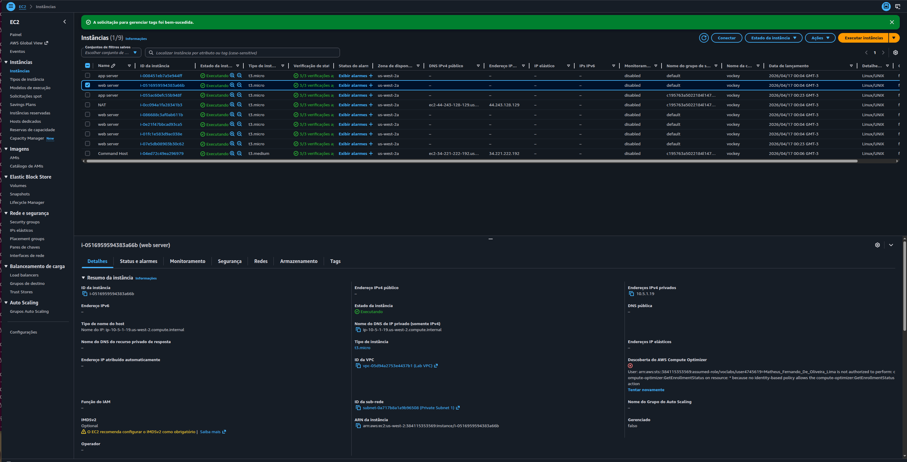
*"A solicitação para gerenciar tags foi bem-sucedida." — Environment tag removed from instance `i-05169595943a66b`.*

---

#### 3.2 — Run the Terminate-Instances Script

Collected the **Region** (`us-west-2`) and **Subnet ID** (`subnet-0a717b8a1a9b96508`) from the console, then ran:

```bash
./terminate-instances.php -region us-west-2 -subnetid subnet-0a717b8a1a9b96508
```

The `terminate-instances.php` script logic:
1. Query all instances **with** the `Environment` tag → build a hash table
2. List **all** instances in the target subnet
3. Any instance **not** in the hash table → add to terminate list
4. Call `terminateInstances()` with the non-compliant IDs

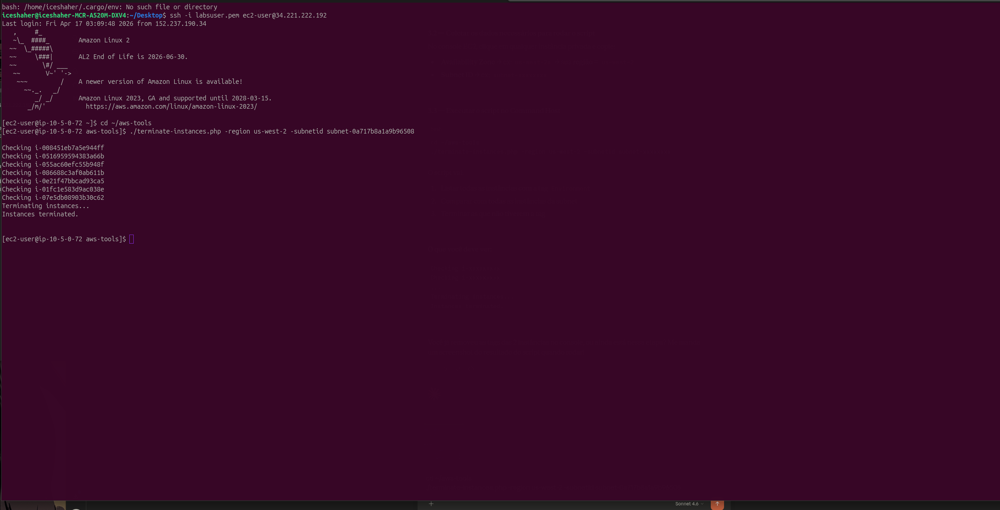
*7 instances checked. Non-tagged instances identified and terminated. Output: `Instances terminated.`*

---

## 🔐 Key Concepts Learned

### JMESPath Query Syntax

The `--query` parameter in the AWS CLI accepts JMESPath expressions for filtering and reshaping JSON output. Key patterns used:

```
# Select specific fields with aliases
Reservations[*].Instances[*].{Alias1:Field1, Alias2:Field2}

# Retrieve a tag value by key name
Tags[?Key==`Environment`] | [0].Value

# Output as plain text (useful for shell variable assignment)
--output text
```

### Tag-Based Automation

Tags transform EC2 instances from unidentifiable resources into manageable, automatable entities. The Stopinator pattern — filter by tag → act on results — is the foundation of cost management tools like AWS Instance Scheduler.

### Tag-or-Terminate Policy

A governance pattern where any instance **without** a required tag (such as `Environment`) is automatically terminated. Enforces tagging compliance without manual auditing.

```
All instances in subnet
        │
        ├─ Has "Environment" tag? ──► Keep running
        │
        └─ No "Environment" tag? ───► Terminate
```

### `--output text` vs `--output json`

| Format | Best for |
|--------|----------|
| `json` | Human-readable inspection, complex structures |
| `text` | Shell variable assignment, piping to other commands |

Using `--output text` in the tag-update script allowed direct assignment to a Bash variable without JSON parsing.

## 💡 Key Takeaways

1. **Tags are the backbone of AWS governance** — Without tags, EC2 instances are indistinguishable. With tags, they become filterable, automatable, and auditable.

2. **JMESPath unlocks the CLI** — The `--query` flag eliminates the need for `grep`/`jq` in most filtering scenarios, keeping operations within the AWS CLI.

3. **PHP SDK mirrors the CLI** — The `describeInstances()` filter format in PHP SDK is structurally identical to CLI `--filter`, making the mental model transferable between both.

4. **Tag-or-Terminate is a real governance pattern** — AWS Config Rules, SCP policies, and Lambda-based solutions all implement this same logic at enterprise scale.

5. **Stopinator = foundation of cost control** — Stopping non-production instances outside business hours can reduce EC2 spend by 60–70% on development environments.

## 🚀 How to Reproduce This Lab

### Prerequisites
- AWS Academy Lab access
- SSH client (terminal on Linux/Mac or PuTTY on Windows)
- Basic knowledge of AWS CLI and EC2

### Step-by-Step Summary

1. **SSH into Command Host** using the provided `.pem` key
2. **Task 1** — Run `describe-instances` with `--filter` and `--query` to inspect tags; run `change-resource-tags.sh` to update Version to 1.1 for development instances
3. **Task 2** — Run `stopinator.php -t"Project=ERPSystem;Environment=development"` to stop instances; verify in console; restart with `-s` flag
4. **Task 3** — Remove `Environment` tag from 2 instances in console; collect subnet ID; run `terminate-instances.php -region <region> -subnetid <subnet-id>`; verify termination

## 📊 Results

| Metric | Value |
|--------|-------|
| Instances inspected via CLI | 7 (ERPSystem) + 1 (Experiment1) |
| Tags updated (Version 1.0 → 1.1) | 2 (development instances) |
| Instances stopped by Stopinator | 2 |
| Instances restarted by Stopinator | 2 |
| Non-compliant instances terminated | 2 |
| AWS regions scanned by Stopinator | All available regions |

## 📚 Additional Resources

- [AWS CLI `describe-instances`](https://docs.aws.amazon.com/cli/latest/reference/ec2/describe-instances.html)
- [JMESPath specification](https://jmespath.org/)
- [AWS CLI `--query` parameter](https://docs.aws.amazon.com/cli/latest/userguide/cli-usage-filter.html)
- [AWS SDK for PHP — EC2](https://docs.aws.amazon.com/aws-sdk-php/v3/api/class-Aws.Ec2.Ec2Client.html)
- [AWS Tagging Best Practices](https://docs.aws.amazon.com/general/latest/gr/aws_tagging.html)

## 🏆 Related Certifications

This lab contributes to preparation for:

- **AWS Certified Cloud Practitioner**
- **AWS Certified SysOps Administrator – Associate**
- **AWS Certified Solutions Architect – Associate**

## 👨‍💻 Author

**Matheus Lima**

Student — Escola da Nuvem | AWS Re/Start Program

---

<div align="center">

[](https://aws.amazon.com/training/awsacademy/)
[](https://aws.amazon.com/ec2/)
[](https://aws.amazon.com/cli/)
[](https://aws.amazon.com/sdk-for-php/)

</div>
