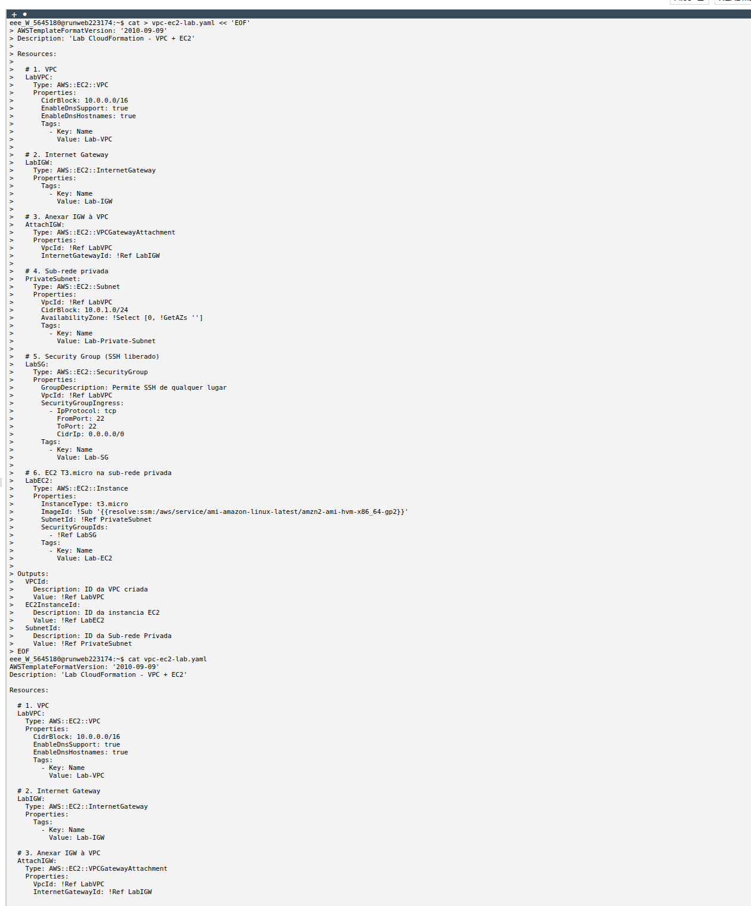
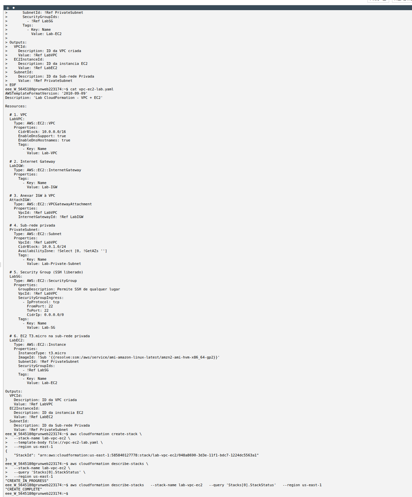

# ☁️ AWS CloudFormation — VPC + EC2 Challenge Lab

## 📋 Sobre o Lab

Este laboratório é um **Challenge Lab** do **Programa Re/Start AWS** através da **Escola da Nuvem**, focado em Infrastructure as Code (IaC) com AWS CloudFormation — criando uma VPC completa e uma instância EC2 sem interação manual com o console AWS.

## 🎯 Objetivos

Ao concluir este laboratório, pratiquei:

- ✅ Escrever um template CloudFormation YAML do zero
- ✅ Criar uma VPC com bloco CIDR `10.0.0.0/16`
- ✅ Criar e anexar um Internet Gateway à VPC
- ✅ Criar uma sub-rede privada dentro da VPC
- ✅ Configurar um Security Group com regra de entrada SSH (`0.0.0.0/0`)
- ✅ Provisionar uma instância EC2 T3.micro na sub-rede privada via IaC
- ✅ Fazer deploy da stack via AWS CLI e validar o status `CREATE_COMPLETE`

### Infraestrutura Utilizada

| Componente | Detalhes |
|---|---|
| **VPC** | `Lab-VPC` — CIDR `10.0.0.0/16` — DNS habilitado |
| **Internet Gateway** | `Lab-IGW` — anexado à `Lab-VPC` |
| **Sub-rede** | `Lab-Private-Subnet` — CIDR `10.0.1.0/24` — privada |
| **Security Group** | `Lab-SG` — TCP 22 liberado para `0.0.0.0/0` |
| **EC2** | `Lab-EC2` — `t3.micro` — Amazon Linux 2 — sub-rede privada |
| **Stack CloudFormation** | `lab-vpc-ec2` — `us-east-1` |
| **Região** | `us-east-1` (N. Virginia) |

O diferencial deste lab é a abordagem **100% IaC via AWS CLI**: toda a infraestrutura foi definida em um único template YAML e provisionada com um único comando `aws cloudformation create-stack`, sem nenhum clique manual no console.

```
┌─────────────────────────────────────────────────────┐
│                  AWS CloudFormation                  │
│              Stack: lab-vpc-ec2 (us-east-1)          │
│                                                      │
│  ┌───────────────────────────────────────────────┐  │
│  │              VPC — 10.0.0.0/16                │  │
│  │                                               │  │
│  │   ┌──────────────────────────────────────┐   │  │
│  │   │   Sub-rede Privada — 10.0.1.0/24     │   │  │
│  │   │                                      │   │  │
│  │   │   ┌──────────────────────────────┐   │   │  │
│  │   │   │   EC2 t3.micro (Lab-EC2)     │   │   │  │
│  │   │   │   Amazon Linux 2             │   │   │  │
│  │   │   │   SG: SSH 0.0.0.0/0 (:22)   │   │   │  │
│  │   │   └──────────────────────────────┘   │   │  │
│  │   └──────────────────────────────────────┘   │  │
│  │                      │                        │  │
│  │         ┌────────────┘                        │  │
│  │         ▼                                     │  │
│  │   ┌─────────────┐                             │  │
│  │   │ Internet    │                             │  │
│  │   │ Gateway     │                             │  │
│  │   │ (Lab-IGW)   │                             │  │
│  │   └─────────────┘                             │  │
│  └───────────────────────────────────────────────┘  │
└─────────────────────────────────────────────────────┘
```

## 🔧 Tecnologias e Serviços Utilizados

- **AWS CloudFormation** — Provisionamento de infraestrutura via template YAML (IaC)
- **Amazon VPC** — Rede virtual isolada com CIDR customizado
- **Amazon EC2** — Instância `t3.micro` provisionada automaticamente pelo template
- **AWS CLI** — Deploy e monitoramento da stack via linha de comando
- **Internet Gateway** — Ponto de saída da VPC para a internet
- **Security Group** — Firewall virtual com regra de entrada SSH

## 📝 Etapas Realizadas

### Tarefa 1: Reconhecer o Ambiente do Lab

Antes de criar o template, o ambiente foi verificado via AWS CLI para confirmar as credenciais e o estado inicial da conta.


*Verificação de identidade da conta e estado inicial — nenhuma instância EC2 em execução (`Reservations: []`), confirmando ambiente limpo para o lab*

**Comandos executados:**

```bash
aws sts get-caller-identity
# UserId: AROAYQZWK54RDOCAH4FGS:user4745619=Matheus_Fernando_De_Oliveira_Lima
# Account: 585840127778

aws ec2 describe-instances
# Reservations: [] → nenhuma instância existente
```

---

### Tarefa 2: Criar o Template CloudFormation

O template YAML foi escrito com todos os recursos necessários e suas dependências explícitas. A ordem de provisionamento é gerenciada automaticamente pelo CloudFormation via referências `!Ref`.

**Template `vpc-ec2-lab.yaml`:**

```yaml
AWSTemplateFormatVersion: '2010-09-09'
Description: 'Lab CloudFormation - VPC + EC2'

Resources:

  # 1. VPC
  LabVPC:
    Type: AWS::EC2::VPC
    Properties:
      CidrBlock: 10.0.0.0/16
      EnableDnsSupport: true
      EnableDnsHostnames: true
      Tags:
        - Key: Name
          Value: Lab-VPC

  # 2. Internet Gateway
  LabIGW:
    Type: AWS::EC2::InternetGateway
    Properties:
      Tags:
        - Key: Name
          Value: Lab-IGW

  # 3. Anexar IGW à VPC
  AttachIGW:
    Type: AWS::EC2::VPCGatewayAttachment
    Properties:
      VpcId: !Ref LabVPC
      InternetGatewayId: !Ref LabIGW

  # 4. Sub-rede privada
  PrivateSubnet:
    Type: AWS::EC2::Subnet
    Properties:
      VpcId: !Ref LabVPC
      CidrBlock: 10.0.1.0/24
      AvailabilityZone: !Select [0, !GetAZs '']
      Tags:
        - Key: Name
          Value: Lab-Private-Subnet

  # 5. Security Group (SSH liberado)
  LabSG:
    Type: AWS::EC2::SecurityGroup
    Properties:
      GroupDescription: Permite SSH de qualquer lugar
      VpcId: !Ref LabVPC
      SecurityGroupIngress:
        - IpProtocol: tcp
          FromPort: 22
          ToPort: 22
          CidrIp: 0.0.0.0/0
      Tags:
        - Key: Name
          Value: Lab-SG

  # 6. EC2 T3.micro na sub-rede privada
  LabEC2:
    Type: AWS::EC2::Instance
    Properties:
      InstanceType: t3.micro
      ImageId: !Sub '{{resolve:ssm:/aws/service/ami-amazon-linux-latest/amzn2-ami-hvm-x86_64-gp2}}'
      SubnetId: !Ref PrivateSubnet
      SecurityGroupIds:
        - !Ref LabSG
      Tags:
        - Key: Name
          Value: Lab-EC2

Outputs:
  VPCId:
    Description: ID da VPC criada
    Value: !Ref LabVPC
  EC2InstanceId:
    Description: ID da instancia EC2
    Value: !Ref LabEC2
  SubnetId:
    Description: ID da Sub-rede Privada
    Value: !Ref PrivateSubnet
```

---

### Tarefa 3: Deploy via AWS CLI e Validação

Com o template salvo, a stack foi criada com um único comando CLI. O status foi monitorado até a confirmação de `CREATE_COMPLETE`.


*Template YAML validado via `cat`, deploy executado com `create-stack` e status final `CREATE_COMPLETE` confirmado — infraestrutura completa provisionada via IaC*

**Comandos executados:**

```bash
# Criar a stack
aws cloudformation create-stack \
  --stack-name lab-vpc-ec2 \
  --template-body file://vpc-ec2-lab.yaml \
  --region us-east-1

# Monitorar o status
aws cloudformation describe-stacks \
  --stack-name lab-vpc-ec2 \
  --query 'Stacks[0].StackStatus' \
  --region us-east-1

# Resultado: "CREATE_COMPLETE"
```

**Stack ID gerado:**
```
arn:aws:cloudformation:us-east-1:585840127778:stack/lab-vpc-ec2/048a8690-3d3e-11f1-bdc7-1224dc5563a1
```

---

## 🔐 Conceitos-Chave Aprendidos

### Infrastructure as Code (IaC) com CloudFormation

Em vez de criar recursos manualmente pelo console (clique a clique), o CloudFormation define toda a infraestrutura em um arquivo de texto versionável. Isso garante reprodutibilidade, rastreabilidade e elimina erros humanos:

```
Console AWS (manual):                CloudFormation (IaC):
  Clique → Clique → Clique ✗          Um arquivo YAML ✅
  Difícil de reproduzir ✗             Reproduzível em qualquer conta ✅
  Sem histórico de mudanças ✗         Versionável com Git ✅
  Propenso a erro humano ✗            Validado antes do deploy ✅
```

### Recursos e Dependências no Template

O CloudFormation gerencia automaticamente a ordem de criação dos recursos com base nas referências `!Ref` entre eles:

| Recurso | Depende de | Referência usada |
|---|---|---|
| `AttachIGW` | `LabVPC` + `LabIGW` | `!Ref LabVPC`, `!Ref LabIGW` |
| `PrivateSubnet` | `LabVPC` | `!Ref LabVPC` |
| `LabSG` | `LabVPC` | `!Ref LabVPC` |
| `LabEC2` | `PrivateSubnet` + `LabSG` | `!Ref PrivateSubnet`, `!Ref LabSG` |

### Resolução Dinâmica de AMI com SSM Parameter Store

Em vez de hardcodar um ID de AMI que pode ficar desatualizado, o template usa uma referução dinâmica ao SSM para buscar sempre a versão mais recente do Amazon Linux 2:

```yaml
ImageId: !Sub '{{resolve:ssm:/aws/service/ami-amazon-linux-latest/amzn2-ami-hvm-x86_64-gp2}}'
```

Isso garante que o template funcione em qualquer conta e região sem manutenção manual do ID da imagem.

### Outputs da Stack

A seção `Outputs` expõe os IDs dos recursos criados, facilitando a integração com outros sistemas e a verificação pós-deploy:

```bash
aws cloudformation describe-stacks \
  --stack-name lab-vpc-ec2 \
  --query 'Stacks[0].Outputs' \
  --output table
```

### Security Group — Regra de Entrada SSH

O Security Group permite acesso SSH (porta 22) de qualquer endereço IP (`0.0.0.0/0`). Em produção, o correto é restringir ao IP específico do administrador — mas em ambiente de lab, a abertura total é necessária para os testes do instrutor:

| Protocolo | Porta | Origem | Uso |
|---|---|---|---|
| TCP | 22 | `0.0.0.0/0` | SSH (lab) |

## 💡 Principais Aprendizados

1. **Template YAML é sensível à indentação** — Erros de espaçamento quebram o template silenciosamente. Usar 2 espaços de indentação consistentes é fundamental.

2. **`!Ref` cria dependências implícitas** — O CloudFormation lê as referências e cria os recursos na ordem correta automaticamente, sem precisar de `DependsOn` explícito na maioria dos casos.

3. **`!GetAZs ''` retorna AZs da região atual** — O `!Select [0, !GetAZs '']` seleciona a primeira AZ disponível na região, tornando o template portável sem hardcodar `us-east-1a`.

4. **Monitorar o status antes de declarar sucesso** — O `create-stack` retorna imediatamente após iniciar o processo. É necessário consultar `describe-stacks` para confirmar `CREATE_COMPLETE` antes de considerar o deploy concluído.

5. **Em caso de falha, verificar os eventos da stack** — O comando `describe-stack-events` com filtro `CREATE_FAILED` mostra exatamente qual recurso falhou e por quê, acelerando o diagnóstico.

6. **AMI dinâmica via SSM evita templates desatualizados** — Hardcodar IDs de AMI é uma má prática: elas variam por região e ficam obsoletas. O parâmetro SSM `/aws/service/ami-amazon-linux-latest/...` resolve isso automaticamente.

## 🚀 Como Reproduzir este Lab

### Pré-requisitos
- AWS CLI configurada com credenciais válidas
- Permissões para CloudFormation, EC2 e VPC

### Passo a Passo

```bash
# 1. Salvar o template
cat > vpc-ec2-lab.yaml << 'EOF'
# (colar o template YAML da Tarefa 2)
EOF

# 2. Criar a stack
aws cloudformation create-stack \
  --stack-name lab-vpc-ec2 \
  --template-body file://vpc-ec2-lab.yaml \
  --region us-east-1

# 3. Aguardar e verificar o status
aws cloudformation describe-stacks \
  --stack-name lab-vpc-ec2 \
  --query 'Stacks[0].StackStatus' \
  --region us-east-1
# Aguardar: "CREATE_COMPLETE"

# 4. Ver os recursos criados (opcional)
aws cloudformation describe-stacks \
  --stack-name lab-vpc-ec2 \
  --query 'Stacks[0].Outputs' \
  --output table \
  --region us-east-1

# 5. Limpar (ao finalizar)
aws cloudformation delete-stack \
  --stack-name lab-vpc-ec2 \
  --region us-east-1
```

## 📊 Resultados

| Recurso | Nome | Status |
|---|---|---|
| Stack CloudFormation | `lab-vpc-ec2` | ✅ `CREATE_COMPLETE` |
| VPC | `Lab-VPC` — `10.0.0.0/16` | ✅ Criada |
| Internet Gateway | `Lab-IGW` | ✅ Criado e anexado |
| Sub-rede privada | `Lab-Private-Subnet` — `10.0.1.0/24` | ✅ Criada |
| Security Group | `Lab-SG` — SSH `0.0.0.0/0` | ✅ Criado |
| EC2 | `Lab-EC2` — `t3.micro` — Amazon Linux 2 | ✅ Criada |
| Deploy via CLI | `aws cloudformation create-stack` | ✅ Funcional |

## 📚 Recursos Adicionais

- [O que é AWS CloudFormation?](https://docs.aws.amazon.com/AWSCloudFormation/latest/UserGuide/Welcome.html)
- [Referência de tipos de recursos CloudFormation](https://docs.aws.amazon.com/AWSCloudFormation/latest/UserGuide/aws-template-resource-type-ref.html)
- [AWS::EC2::VPC](https://docs.aws.amazon.com/AWSCloudFormation/latest/UserGuide/aws-resource-ec2-vpc.html)
- [AWS::EC2::Instance](https://docs.aws.amazon.com/AWSCloudFormation/latest/UserGuide/aws-properties-ec2-instance.html)
- [Resolução dinâmica de parâmetros SSM](https://docs.aws.amazon.com/AWSCloudFormation/latest/UserGuide/dynamic-references.html)
- [AWS CLI — CloudFormation](https://docs.aws.amazon.com/cli/latest/reference/cloudformation/)

## 🏆 Certificações Relacionadas

Este laboratório contribui para a preparação das seguintes certificações:

- **AWS Certified Cloud Practitioner**
- **AWS Certified Solutions Architect - Associate**
- **AWS Certified Developer - Associate**

## 👨‍💻 Autor

**Matheus Lima**

Estudante — Escola da Nuvem | Programa Re/Start AWS

---

## 📄 Licença

Este projeto é parte do Programa Re/Start AWS e está disponível para fins de estudo e portfólio.

---

<div align="center">

[](https://aws.amazon.com/training/awsacademy/)
[](https://aws.amazon.com/cloudformation/)
[](https://aws.amazon.com/vpc/)
[](https://aws.amazon.com/ec2/)
[](https://aws.amazon.com/cli/)

</div>
