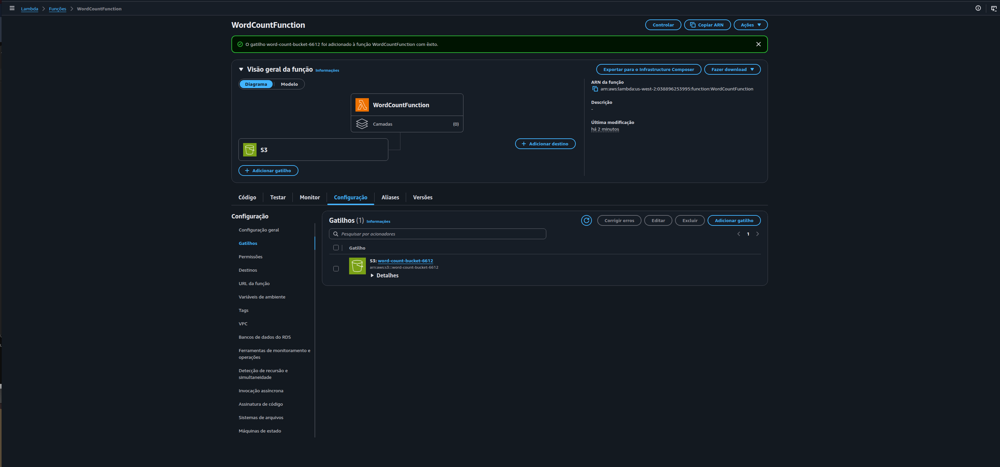
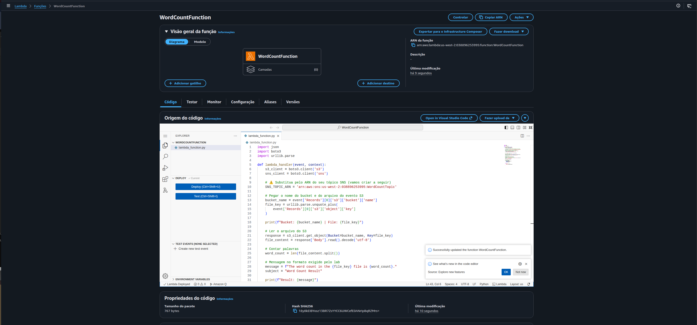
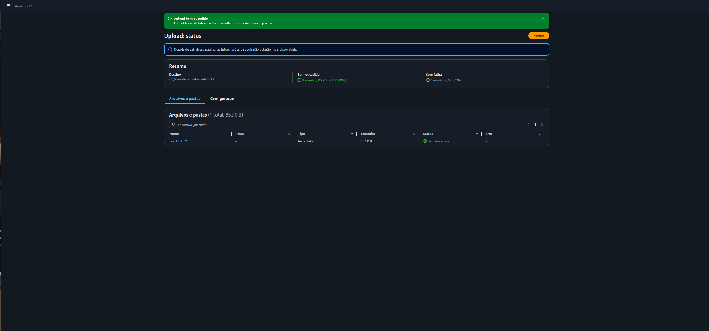
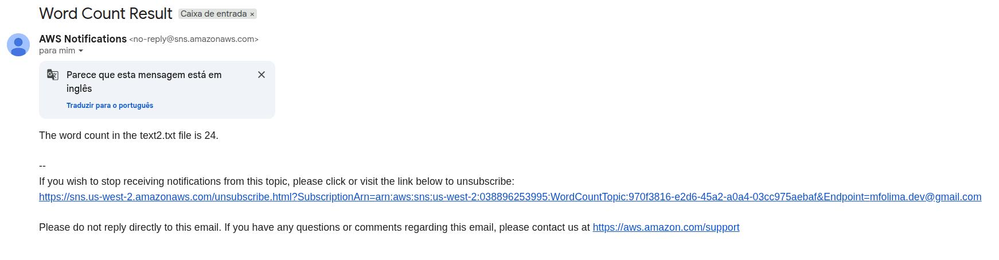

# ☁️ AWS Lambda — Word Count Challenge

## 📋 Sobre o Lab

Este laboratório faz parte do **Programa Re/Start AWS** através da **Escola da Nuvem**, focado em práticas de computação serverless com AWS Lambda, Amazon S3 e Amazon SNS.

## 🎯 Objetivos

Ao concluir este laboratório, pratiquei:

- ✅ Criar uma função Lambda em Python para contar palavras em arquivos de texto
- ✅ Configurar um tópico SNS e inscrição por e-mail para notificações
- ✅ Criar um bucket S3 como origem dos arquivos de entrada
- ✅ Configurar um trigger S3 → Lambda para invocação automática no upload
- ✅ Desenvolver e fazer deploy do código Python diretamente no console AWS
- ✅ Testar o pipeline completo com upload de arquivos `.txt`
- ✅ Validar o resultado via e-mail recebido pelo SNS


*`WordCountFunction` com trigger S3 `word-count-bucket-6612` configurado — arquitetura serverless completa e operacional*

### Infraestrutura Utilizada

| Componente | Detalhes |
|---|---|
| **Lambda Function** | `WordCountFunction` — Python 3.12 — x86_64 |
| **IAM Role** | `LambdaAccessRole` — SNS + S3 + CloudWatch + Lambda Basic |
| **S3 Bucket** | `word-count-bucket-6612` — us-west-2 — trigger PUT `.txt` |
| **SNS Topic** | `WordCountTopic` — tipo Standard — us-west-2 |
| **SNS Subscription** | E-mail confirmado — protocolo EMAIL |
| **Região** | `us-west-2` (Oregon) |

O diferencial deste lab é a integração de três serviços AWS em um pipeline **completamente serverless e orientado a eventos**: nenhum servidor é provisionado ou gerenciado — o código executa apenas quando um arquivo é enviado ao bucket, e o resultado chega diretamente no e-mail via SNS.

```
Internet / Upload
       │
       ▼
┌─────────────────────┐
│     Amazon S3       │  word-count-bucket-6612
│  word-count-bucket  │  evento: PUT *.txt
└────────┬────────────┘
         │ trigger automático
         ▼
┌─────────────────────┐
│    AWS Lambda       │  WordCountFunction
│  Python 3.12        │  lê o arquivo → split() → len()
│  LambdaAccessRole   │  formata mensagem
└────────┬────────────┘
         │ publish()
         ▼
┌─────────────────────┐
│    Amazon SNS       │  WordCountTopic
│  WordCountTopic     │  Subject: Word Count Result
└────────┬────────────┘
         │ e-mail
         ▼
┌─────────────────────┐
│   Caixa de Entrada  │  "The word count in the
│   (Gmail)           │   text2.txt file is 24."
└─────────────────────┘
```

## 🔧 Tecnologias e Serviços Utilizados

- **AWS Lambda** — Execução serverless do código Python sem provisionamento de servidores
- **Amazon S3** — Armazenamento dos arquivos `.txt` e origem dos eventos de trigger
- **Amazon SNS** — Serviço de notificação que entrega o resultado por e-mail
- **IAM Role** — Controle de permissões para a Lambda acessar S3, SNS e CloudWatch
- **Amazon CloudWatch** — Registro automático dos logs de execução da função
- **Python 3.12 + boto3** — Runtime e SDK AWS para interação com os serviços

## 📝 Etapas Realizadas

### Tarefa 1: Criar o Tópico SNS

O tópico SNS foi criado como ponto de destino das notificações geradas pela Lambda. Em seguida, uma assinatura por e-mail foi criada e confirmada — etapa obrigatória para que as mensagens sejam entregues.

**Configurações aplicadas:**
- **Nome:** `WordCountTopic`
- **Tipo:** Padrão (Standard)
- **Região:** `us-west-2`
- **Protocolo da assinatura:** EMAIL
- **Endpoint:** e-mail confirmado ✅

---

### Tarefa 2: Criar o Bucket S3

O bucket S3 foi criado na mesma região da função Lambda para evitar latência e custos de transferência entre regiões. Ele funciona como a fonte de eventos do pipeline — qualquer arquivo `.txt` enviado a ele aciona automaticamente a Lambda.

**Configurações aplicadas:**
- **Nome:** `word-count-bucket-6612`
- **Região:** `us-west-2`
- **Configurações de bloqueio:** padrão (privado)

---

### Tarefa 3: Criar a Função Lambda

A função Lambda foi criada com Python 3.12 e associada à role `LambdaAccessRole`, que já existia no ambiente do lab e fornece as permissões necessárias para acessar S3, SNS e CloudWatch sem precisar criar uma nova role IAM.


*`WordCountFunction` com código Python deployado — status "Lambda Deployed" confirmado na barra inferior do editor*

**Configurações aplicadas:**
- **Nome:** `WordCountFunction`
- **Runtime:** Python 3.12
- **Arquitetura:** x86_64
- **Role de execução:** `LambdaAccessRole` (role existente)
  - `AWSLambdaBasicExecutionRole` — escrita de logs no CloudWatch
  - `AmazonSNSFullAccess` — publicação no tópico SNS
  - `AmazonS3FullAccess` — leitura dos arquivos do bucket
  - `CloudWatchFullAccess` — monitoramento e métricas

**Código da função:**

```python
import json
import boto3
import urllib.parse

def lambda_handler(event, context):
    s3_client = boto3.client('s3')
    sns_client = boto3.client('sns')

    SNS_TOPIC_ARN = 'arn:aws:sns:us-west-2:038896253995:WordCountTopic'

    # Obter bucket e arquivo do evento S3
    bucket_name = event['Records'][0]['s3']['bucket']['name']
    file_key = urllib.parse.unquote_plus(
        event['Records'][0]['s3']['object']['key']
    )

    print(f"Bucket: {bucket_name} | File: {file_key}")

    # Ler o arquivo do S3
    response = s3_client.get_object(Bucket=bucket_name, Key=file_key)
    file_content = response['Body'].read().decode('utf-8')

    # Contar palavras
    word_count = len(file_content.split())

    # Formatar mensagem no padrão exigido pelo lab
    message = f"The word count in the {file_key} file is {word_count}."
    subject = "Word Count Result"

    print(f"Result: {message}")

    # Publicar no SNS
    sns_client.publish(
        TopicArn=SNS_TOPIC_ARN,
        Message=message,
        Subject=subject
    )

    return {
        'statusCode': 200,
        'body': json.dumps(message)
    }
```

---

### Tarefa 4: Configurar o Trigger S3 → Lambda

O trigger foi configurado diretamente na Lambda para escutar eventos de criação de objetos (`PUT`) no bucket S3, filtrado pelo sufixo `.txt`. A partir desta configuração, qualquer arquivo de texto enviado ao bucket invoca automaticamente a função.


*Trigger S3 `word-count-bucket-6612` adicionado com sucesso à `WordCountFunction` — visível no diagrama e na aba Configuração → Gatilhos*

**Configurações aplicadas:**
- **Origem:** Amazon S3
- **Bucket:** `word-count-bucket-6612`
- **Tipo de evento:** PUT (criação de objeto)
- **Sufixo:** `.txt`

---

### Tarefa 5: Testar com Upload de Arquivo

Com toda a infraestrutura configurada, o teste foi realizado fazendo upload de arquivos `.txt` diretamente pelo console do S3. Cada upload aciona automaticamente a Lambda, que conta as palavras e publica o resultado no SNS.


*`text1.txt` (853 B) enviado ao bucket `word-count-bucket-6612` com status "Bem-sucedida" — pipeline acionado automaticamente*

---

### Resultado Final: E-mail Recebido

Segundos após o upload, o e-mail com o resultado da contagem chegou na caixa de entrada, comprovando o funcionamento completo do pipeline serverless.


*E-mail recebido da AWS Notifications com assunto "Word Count Result" e mensagem no formato exato exigido pelo lab*

```
The word count in the text2.txt file is 24.
```

**Assunto:** `Word Count Result`
**Remetente:** `AWS Notifications <no-reply@sns.amazonaws.com>`

---

## 🔐 Conceitos-Chave Aprendidos

### Serverless vs. Servidor Tradicional

Em vez de provisionar e manter uma instância EC2 rodando continuamente, a Lambda executa o código apenas quando acionada — cobrando somente pelo tempo de execução real:

```
Servidor Tradicional (EC2):          Serverless (Lambda):
  Instância rodando 24/7 ✗             Executa só quando há evento ✅
  Paga mesmo sem uso ✗                 Paga por milissegundo de execução ✅
  Escala manual ✗                      Escala automática ✅
  Gerencia SO e patches ✗              Zero gerenciamento de infraestrutura ✅
```

### Event-Driven Architecture — Pipeline S3 → Lambda → SNS

O lab implementa um padrão clássico de arquitetura orientada a eventos: um evento (upload no S3) aciona um processador (Lambda) que produz um resultado e o entrega via mensageria (SNS). Cada serviço tem uma responsabilidade única e se comunica de forma desacoplada:

| Serviço | Responsabilidade |
|---|---|
| **S3** | Armazenar o arquivo e emitir o evento de upload |
| **Lambda** | Receber o evento, ler o arquivo, contar palavras, publicar resultado |
| **SNS** | Receber a mensagem e entregá-la aos assinantes (e-mail) |

### IAM Role — Permissões da Função

A `LambdaAccessRole` fornece as permissões mínimas necessárias para a função operar:

| Permissão | Para que serve |
|---|---|
| `AWSLambdaBasicExecutionRole` | Escrever logs no CloudWatch Logs |
| `AmazonS3FullAccess` | Ler o arquivo do bucket com `get_object` |
| `AmazonSNSFullAccess` | Publicar mensagem no tópico com `publish` |
| `CloudWatchFullAccess` | Métricas e monitoramento da função |

> **Nota:** Em produção, o correto é criar uma policy customizada com acesso apenas ao bucket e tópico específicos. O `FullAccess` foi usado aqui porque o lab não permite criação de novas IAM roles.

### SNS — Publish/Subscribe para Notificações

O SNS implementa o padrão pub/sub: a Lambda **publica** uma mensagem no tópico, e todos os **assinantes** (neste caso, um e-mail) recebem a notificação automaticamente. A assinatura precisa ser confirmada pelo destinatário antes de começar a receber mensagens — etapa obrigatória e de segurança do SNS.

### Route dos Dados no Evento S3

Quando um arquivo é enviado ao S3, o serviço emite um evento JSON com metadados do objeto. A Lambda extrai bucket e nome do arquivo desse payload:

```python
bucket_name = event['Records'][0]['s3']['bucket']['name']
file_key    = event['Records'][0]['s3']['object']['key']
```

O `urllib.parse.unquote_plus` decodifica caracteres especiais no nome do arquivo (espaços, acentos) que o S3 codifica na URL antes de incluir no evento.

## 💡 Principais Aprendizados

1. **Confirmar a assinatura SNS antes de testar** — Sem confirmar o e-mail pelo link enviado pela AWS, nenhuma notificação é entregue. A Lambda executa com sucesso, mas o e-mail nunca chega.

2. **Mesma região para todos os recursos** — Lambda, S3 e SNS precisam estar na mesma região AWS para evitar latência, custos de transferência e problemas de permissão cross-region.

3. **O trigger filtra por sufixo** — Configurar `.txt` como sufixo garante que a Lambda só seja invocada para arquivos de texto, evitando execuções desnecessárias caso outros tipos de arquivo sejam enviados ao bucket.

4. **`file_content.split()` conta por whitespace** — O método `split()` sem argumento divide por qualquer whitespace (espaços, tabs, quebras de linha), o que é o comportamento correto para contagem de palavras em texto corrido.

5. **CloudWatch Logs para debugging** — Quando algo não funciona, o primeiro passo é verificar os logs em CloudWatch → Log Groups → `/aws/lambda/WordCountFunction`. Os `print()` no código aparecem nos logs e facilitam o diagnóstico.

6. **`urllib.parse.unquote_plus` é obrigatório** — Sem essa decodificação, arquivos com espaços no nome (ex: `meu arquivo.txt`) chegam como `meu+arquivo.txt` no evento S3, gerando erro ao tentar ler o objeto.

## 🚀 Como Reproduzir este Lab

### Pré-requisitos
- Acesso ao AWS Academy Lab ou conta AWS com permissões Lambda, S3, SNS e IAM
- Navegador web (Chrome, Firefox ou Edge)
- Arquivos `.txt` de teste

### Resumo do Passo a Passo

1. **SNS** → Criar tópico Standard `WordCountTopic` → criar assinatura EMAIL → **confirmar e-mail**
2. **S3** → Criar bucket na mesma região do SNS
3. **Lambda** → Criar função Python 3.12 → usar role `LambdaAccessRole` → inserir código → Deploy
4. **Trigger** → Adicionar gatilho S3 na Lambda → selecionar bucket → evento PUT → sufixo `.txt`
5. **Testar** → Upload de arquivo `.txt` no bucket → aguardar e-mail na caixa de entrada
6. **Validar** → Conferir resultado: `The word count in the <arquivo> file is <n>.`

## 📊 Resultados

| Métrica | Valor |
|---|---|
| Função Lambda criada | `WordCountFunction` |
| Runtime | Python 3.12 |
| Bucket S3 | `word-count-bucket-6612` |
| Tópico SNS | `WordCountTopic` |
| Trigger configurado | S3 PUT `.txt` → Lambda |
| E-mail recebido | ✅ `Word Count Result` |
| Formato da mensagem | ✅ `The word count in the text2.txt file is 24.` |
| Pipeline serverless funcional | ✅ |

## 📚 Recursos Adicionais

- [O que é AWS Lambda?](https://docs.aws.amazon.com/lambda/latest/dg/welcome.html)
- [Usar um trigger do S3 para invocar uma função Lambda](https://docs.aws.amazon.com/lambda/latest/dg/with-s3-example.html)
- [Amazon SNS — Guia do desenvolvedor](https://docs.aws.amazon.com/sns/latest/dg/welcome.html)
- [AWS managed policies](https://docs.aws.amazon.com/IAM/latest/UserGuide/access_policies_managed-vs-inline.html)
- [boto3 — SDK AWS para Python](https://boto3.amazonaws.com/v1/documentation/api/latest/index.html)
- [AWS Academy](https://aws.amazon.com/training/awsacademy/)

## 🏆 Certificações Relacionadas

Este laboratório contribui para a preparação das seguintes certificações:

- **AWS Certified Cloud Practitioner**
- **AWS Certified Developer - Associate**
- **AWS Certified Solutions Architect - Associate**

## 👨‍💻 Autor

**Matheus Lima**

Estudante — Escola da Nuvem | Programa Re/Start AWS

---

## 📄 Licença

Este projeto é parte do Programa Re/Start AWS e está disponível para fins de estudo e portfólio.

---

<div align="center">

[](https://aws.amazon.com/training/awsacademy/)
[](https://aws.amazon.com/lambda/)
[](https://aws.amazon.com/s3/)
[](https://aws.amazon.com/sns/)
[](https://www.python.org/)

</div>
