# Lab AWS — Amazon EC2 Instances (Challenge)

## 📋 Sobre o Lab

Este laboratório faz parte do **Programa Re/Start AWS** através da **Escola da Nuvem**, focado em práticas de provisionamento de infraestrutura completa do zero com Amazon EC2, VPC e Web Server.

## 🎯 Objetivos

Ao concluir este laboratório, pratiquei:

- ✅ Criar e configurar uma VPC do zero com subnet pública
- ✅ Configurar Internet Gateway e Route Table para acesso à internet
- ✅ Criar Security Group com regras SSH e HTTP
- ✅ Lançar uma instância EC2 com Amazon Linux e User Data Script
- ✅ Instalar e inicializar o Apache (httpd) automaticamente via User Data
- ✅ Conectar à instância via EC2 Instance Connect
- ✅ Fazer deploy de uma página HTML estática no web server
- ✅ Validar o funcionamento via browser e System Log


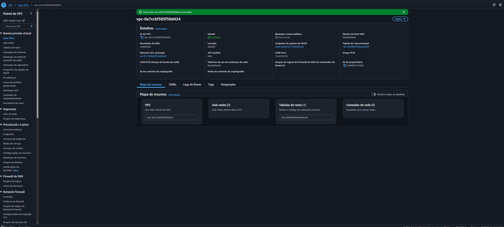
*VPC `vpc-0a7ccbf385f58d424` criada com CIDR `10.0.0.0/16` — ponto de partida de toda a infraestrutura*

### Infraestrutura Utilizada

| Componente | Detalhes |
|---|---|
| VPC | `vpc-0a7ccbf385f58d424` — CIDR `10.0.0.0/16` |
| Subnet | `minha_sub` — CIDR `10.0.1.0/24` — auto-assign IPv4 habilitado |
| Internet Gateway | `meu-igw` — attached à VPC |
| Route Table | `minha-rtb` — rota `0.0.0.0/0 → meu-igw` |
| Security Group | `meu-sg` — porta 22 (SSH) + porta 80 (HTTP) |
| EC2 Instance | `minha-ec2` — Amazon Linux 2023 — t3.micro — gp2 8 GiB |
| Acesso | EC2 Instance Connect (sem par de chaves) |
| Web Server | Apache httpd — instalado via User Data Script |

O diferencial deste lab em relação aos anteriores é a construção **completa da rede do zero**: em vez de usar uma VPC padrão já existente, toda a infraestrutura de rede foi criada e configurada manualmente antes de lançar a instância.

```
Internet
    │
    └── Internet Gateway (meu-igw)
            │
        Route Table (minha-rtb)
        0.0.0.0/0 → meu-igw
            │
    ┌───────VPC (10.0.0.0/16)────────────────────────┐
    │                                                 │
    │   ┌─── Subnet Pública (10.0.1.0/24) ─────────┐ │
    │   │                                           │ │
    │   │   ┌── Security Group (meu-sg) ─────────┐ │ │
    │   │   │  Inbound: 22/SSH + 80/HTTP          │ │ │
    │   │   │                                     │ │ │
    │   │   │   EC2 minha-ec2 (t3.micro)          │ │ │
    │   │   │   Amazon Linux 2023                 │ │ │
    │   │   │   IP Público: 44.255.119.243        │ │ │
    │   │   │   Apache httpd → /var/www/html/     │ │ │
    │   │   └─────────────────────────────────────┘ │ │
    │   └───────────────────────────────────────────┘ │
    └─────────────────────────────────────────────────┘
            │
    http://44.255.119.243/projects.html ✅
```

## 🔧 Tecnologias e Serviços Utilizados

- **Amazon VPC** — Rede virtual isolada com CIDR customizado
- **Amazon EC2** — Instância de computação em nuvem com Amazon Linux 2023
- **Internet Gateway** — Ponto de saída da VPC para a internet pública
- **Route Table** — Roteamento de tráfego da subnet para o IGW
- **Security Groups** — Firewall virtual controlando acesso SSH e HTTP
- **EC2 Instance Connect** — Acesso seguro à instância sem par de chaves
- **User Data Script** — Instalação e inicialização automática do Apache no boot
- **Apache httpd** — Web server para servir o arquivo HTML estático

## 📝 Etapas Realizadas

### Tarefa 1: Criar a VPC

A VPC foi criada pelo AWS Management Console com CIDR `10.0.0.0/16`, formando o container de rede isolado para toda a infraestrutura do lab.


*VPC disponível com CIDR `10.0.0.0/16` e estado Available — base de toda a infraestrutura*

**Configurações aplicadas:**
- **CIDR IPv4:** `10.0.0.0/16`
- **Resolução de DNS:** Habilitada
- **Estado:** Available

---

### Tarefa 2: Criar a Subnet Pública

A subnet foi criada dentro da VPC com o bloco CIDR `10.0.1.0/24`, e em seguida configurada para atribuir endereços IPv4 públicos automaticamente às instâncias — requisito essencial para que a EC2 seja acessível pela internet.

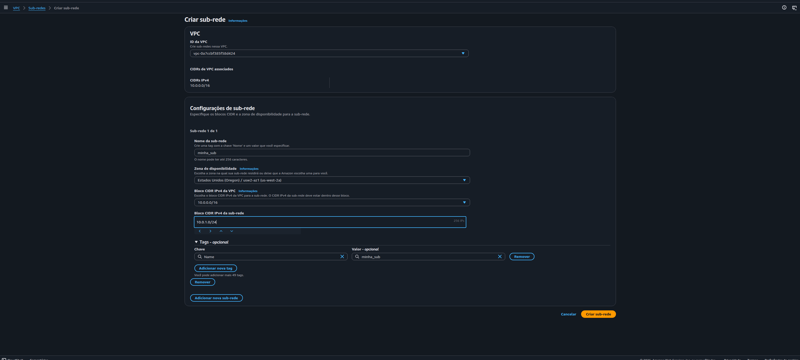
*Configuração da subnet `minha_sub` com CIDR `10.0.1.0/24` dentro da VPC `10.0.0.0/16`*

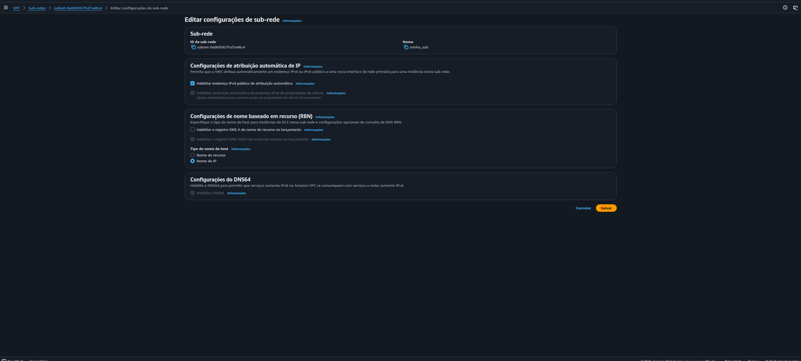
*Configuração de atribuição automática de IP público habilitada — sem isso, instâncias na subnet não recebem IP público*

**Configurações aplicadas:**
- **Nome:** `minha_sub`
- **VPC:** `vpc-0a7ccbf385f58d424`
- **CIDR IPv4:** `10.0.1.0/24` (256 endereços)
- **Zona de disponibilidade:** us-west-2a
- **Auto-assign IPv4 público:** Habilitado

---

### Tarefa 3: Criar e Associar o Internet Gateway

O Internet Gateway foi criado e associado à VPC, funcionando como ponto de saída para o tráfego com destino à internet pública. Sem o IGW, a instância EC2 ficaria isolada sem acesso externo.

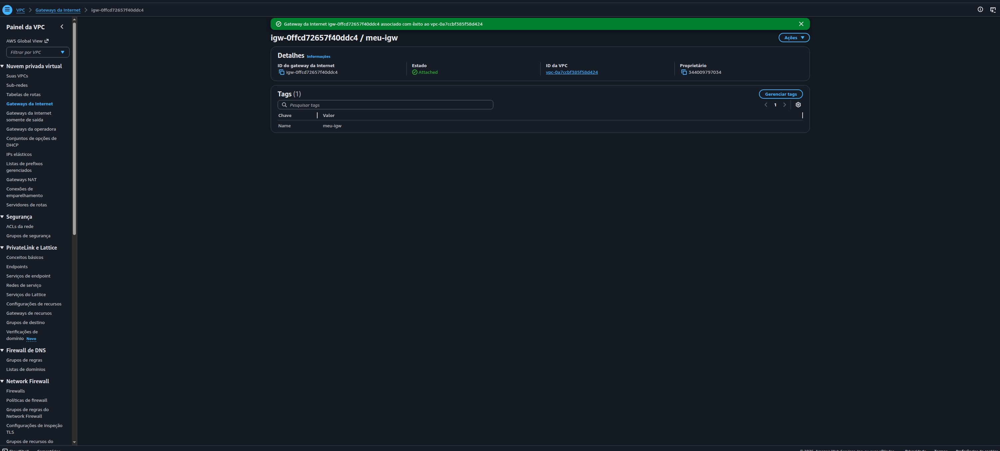
*Internet Gateway `meu-igw` com estado Attached à VPC `vpc-0a7ccbf385f58d424`*

**Configurações aplicadas:**
- **Nome:** `meu-igw`
- **Estado:** Attached
- **VPC:** `vpc-0a7ccbf385f58d424`

---

### Tarefa 4: Configurar a Route Table

Uma nova Route Table foi criada na VPC e configurada com a rota padrão `0.0.0.0/0 → meu-igw`, direcionando todo o tráfego externo para o Internet Gateway. A subnet `minha_sub` foi então associada explicitamente a essa tabela.

> **Por que criar uma nova Route Table?** A VPC nova não vem com uma Route Table configurada para internet — ela precisa ser criada e associada à subnet manualmente, diferente da VPC padrão da AWS que já vem pré-configurada.

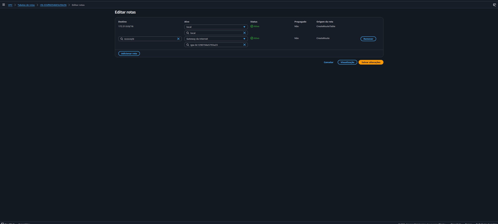
*Rota `0.0.0.0/0 → igw-0c1290194e5793a23` configurada na `minha-rtb`*

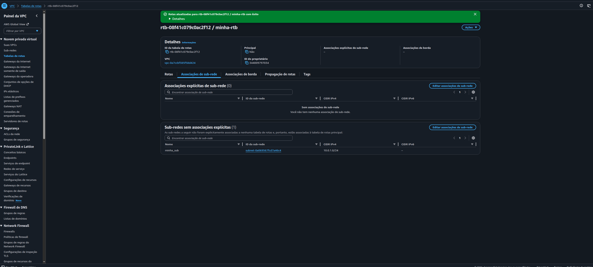
*Route Table `minha-rtb` com 2 rotas ativas e subnet `minha_sub` associada explicitamente*

**Configurações aplicadas:**
- **Nome:** `minha-rtb`
- **VPC:** `vpc-0a7ccbf385f58d424`
- **Rota adicionada:** `0.0.0.0/0 → meu-igw`
- **Subnet associada:** `minha_sub` (10.0.1.0/24)

---

### Tarefa 5: Criar o Security Group

O Security Group `meu-sg` foi criado dentro da VPC com duas regras de entrada: SSH (porta 22) para acesso via EC2 Instance Connect, e HTTP (porta 80) para acesso ao web server pelo browser.

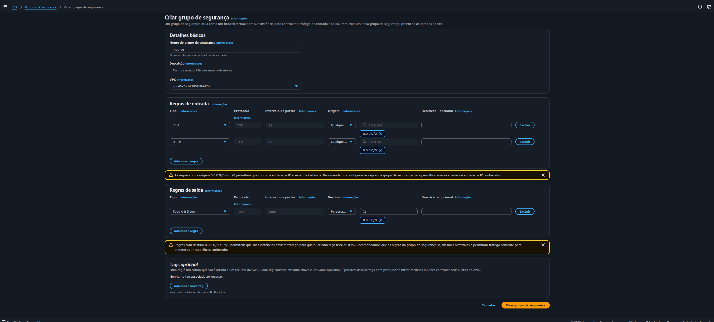
*Tela de criação do `meu-sg` com regras SSH (22) e HTTP (80) configuradas na VPC correta*

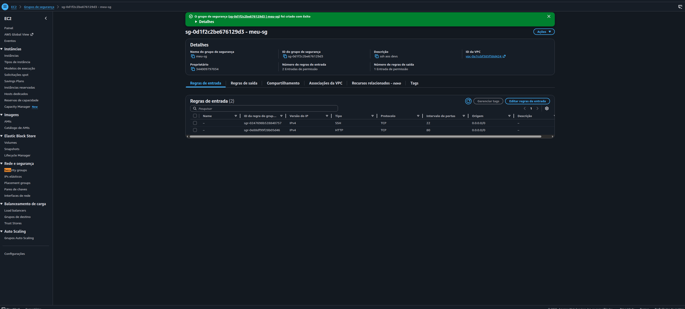
*`meu-sg` criado com 2 Inbound rules: SSH TCP 22 e HTTP TCP 80, ambas com source `0.0.0.0/0`*

**Configurações aplicadas:**
- **Nome:** `meu-sg`
- **VPC:** `vpc-0a7ccbf385f58d424`
- **Inbound rules:**
  - SSH → TCP → porta 22 → `0.0.0.0/0`
  - HTTP → TCP → porta 80 → `0.0.0.0/0`

---

### Tarefa 6: Lançar a Instância EC2 com User Data

A instância EC2 foi lançada com Amazon Linux 2023, tipo t3.micro, na VPC e subnet criadas, sem par de chaves (usando EC2 Instance Connect), e com o script de User Data que instala e inicializa o Apache automaticamente no primeiro boot.

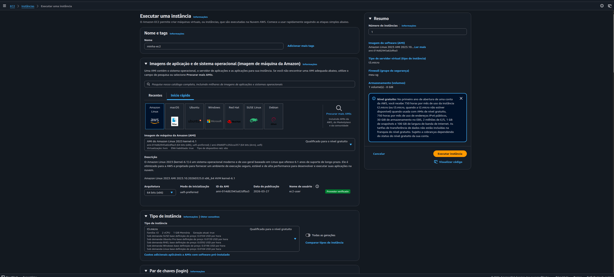
*Amazon Linux 2023 AMI (Free Tier) com tipo t3.micro selecionados*

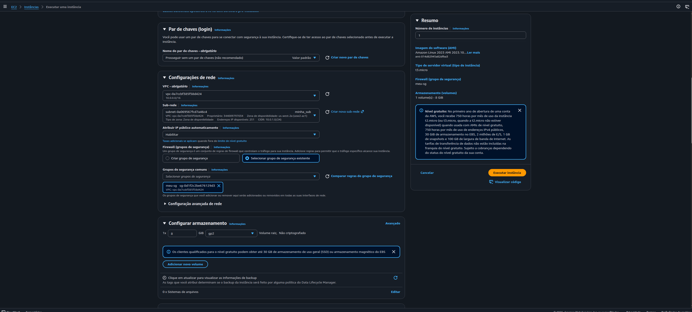
*VPC, subnet `minha_sub`, IP público habilitado, `meu-sg` selecionado e volume gp2 de 8 GiB*

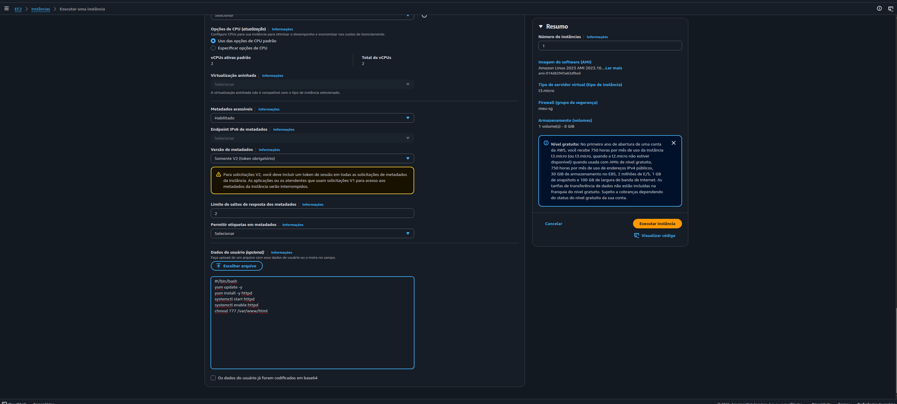
*Script de User Data com instalação do httpd, start e enable do serviço, e chmod no document root*

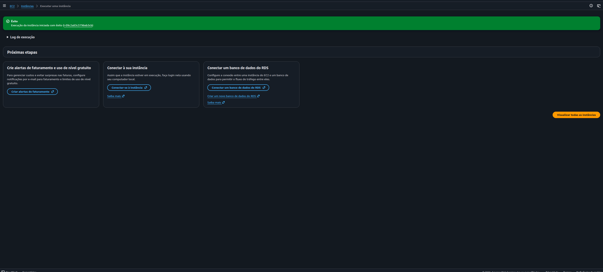
*Confirmação de lançamento da instância `i-09c2a83c3796eb3cb`*

**Configurações aplicadas:**
- **Nome:** `minha-ec2`
- **AMI:** Amazon Linux 2023 AMI 2023.10 (Free Tier)
- **Tipo:** t3.micro
- **Par de chaves:** Prosseguir sem par de chaves
- **VPC:** `vpc-0a7ccbf385f58d424`
- **Subnet:** `minha_sub`
- **Auto-assign public IP:** Habilitado
- **Security Group:** `meu-sg`
- **Volume:** 8 GiB gp2

**User Data Script utilizado:**
```bash
#!/bin/bash
yum update -y
yum install -y httpd
systemctl start httpd
systemctl enable httpd
chmod 777 /var/www/html
```

---

### Tarefa 7: Conectar e Fazer Deploy do projects.html

Após a instância atingir o estado Running com 3/3 verificações aprovadas, a conexão foi feita via EC2 Instance Connect diretamente pelo Console AWS. O arquivo `projects.html` foi criado no document root do Apache com o conteúdo exigido pelo lab.

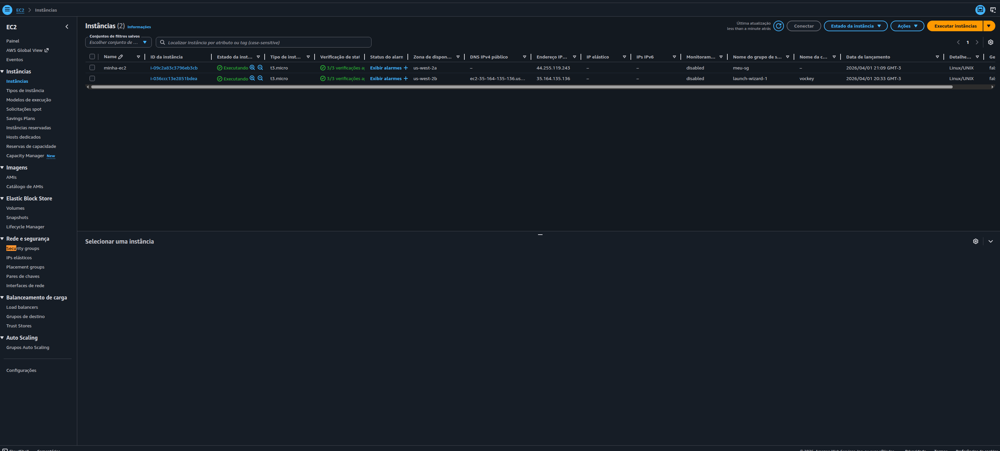
*`minha-ec2` em estado Running com 3/3 verificações e IP público `44.255.119.243`*

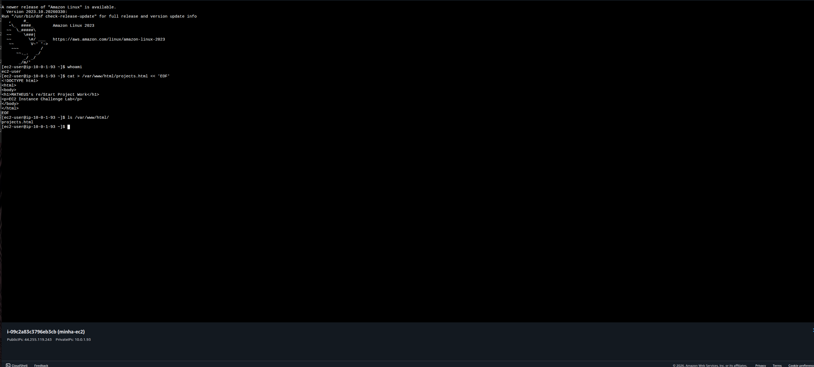
*Conexão via EC2 Instance Connect como `ec2-user`, criação do `projects.html` e confirmação com `ls /var/www/html/`*

**Comando executado:**
```bash
cat > /var/www/html/projects.html << 'EOF'
<!DOCTYPE html>
<html>
<body>
<h1>MATHEUS's re/Start Project Work</h1>
<p>EC2 Instance Challenge Lab</p>
</body>
</html>
EOF
```

---

### Resultado Final: Página Web Acessível e System Log

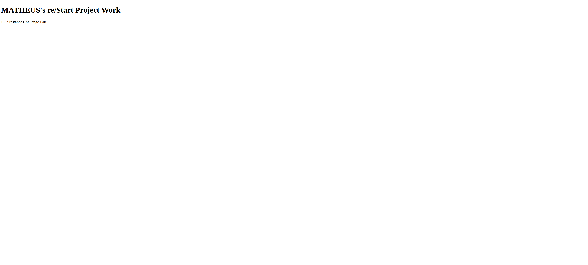
*`http://44.255.119.243/projects.html` acessível no browser — "MATHEUS's re/Start Project Work" exibido com sucesso*

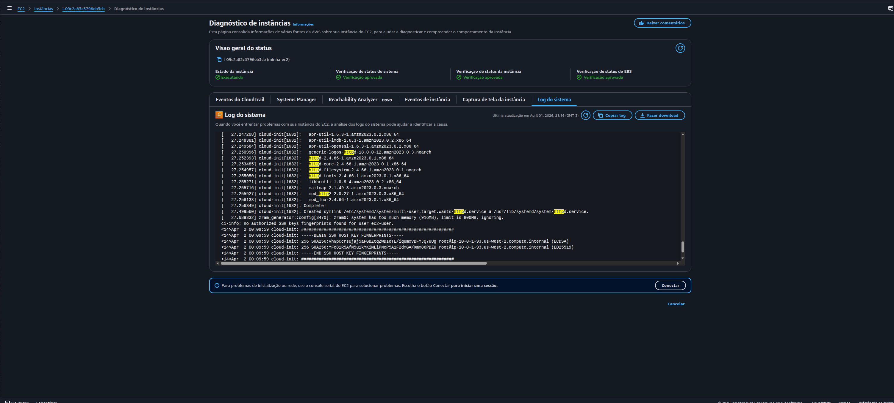
*System Log da instância mostrando a instalação do httpd via User Data: pacotes `httpd`, `httpd-core`, `httpd-filesystem`, `httpd-tools`, `mod_http2`, `mod_lua` instalados e symlink do serviço criado*

---

## 🔐 Conceitos-Chave Aprendidos

### VPC do Zero vs. VPC Padrão

A VPC padrão da AWS já vem com subnet, IGW e Route Table configurados. Criar uma VPC do zero exige configurar cada componente manualmente na ordem correta: VPC → Subnet → IGW → Route Table → Security Group → EC2. Qualquer etapa faltando resulta em instância sem acesso à internet ou sem IP público.

```
VPC Padrão (já configurada):          VPC do Zero (este lab):
  VPC ✅                                VPC → criar
  Subnet ✅                             Subnet → criar + habilitar auto-assign
  IGW ✅                                IGW → criar + attach à VPC
  Route Table ✅                        Route Table → criar + add rota 0.0.0.0/0 + associar subnet
  Pronto ✅                             Security Group → criar com regras corretas
                                        EC2 → lançar na VPC correta
```

### User Data Script — Automação no Boot

O User Data é executado como root na primeira inicialização da instância, permitindo provisionar o servidor sem intervenção manual. No lab, ele instalou e ativou o Apache e definiu permissão de escrita no document root antes do primeiro acesso:

```bash
#!/bin/bash
yum update -y          # Atualiza pacotes
yum install -y httpd   # Instala o Apache
systemctl start httpd  # Inicia o serviço imediatamente
systemctl enable httpd # Configura para iniciar no boot
chmod 777 /var/www/html # Permite escrita no document root
```

> **Nota:** `chmod 777` é usado aqui exclusivamente para fins de laboratório. Em produção, o correto é ajustar o owner do diretório para o usuário da aplicação, não abrir permissões para todos.

### Route Table — O Caminho do Tráfego

A Route Table define para onde vai cada pacote de rede. A rota `local` (automática) roteia tráfego interno da VPC. A rota `0.0.0.0/0 → IGW` é o que habilita a saída para a internet — sem ela, a instância não responde a requests externos mesmo com IP público atribuído:

| Destino | Alvo | Função |
|---|---|---|
| `10.0.0.0/16` | `local` | Comunicação interna entre recursos da VPC |
| `0.0.0.0/0` | `meu-igw` | Todo tráfego externo sai pelo Internet Gateway |

### Security Groups — Stateful Firewall

Security Groups são stateful: ao permitir uma requisição de entrada, a resposta correspondente retorna automaticamente sem necessidade de regra de saída explícita. A porta 22 é necessária para EC2 Instance Connect, e a porta 80 para o acesso HTTP ao web server:

| Porta | Protocolo | Uso |
|---|---|---|
| 22 | TCP (SSH) | Acesso via EC2 Instance Connect |
| 80 | TCP (HTTP) | Acesso ao Apache pelo browser |

### EC2 Instance Connect — Acesso Sem Chave

O EC2 Instance Connect injeta uma chave SSH temporária (válida por 60 segundos) diretamente na instância via API, eliminando a necessidade de gerenciar arquivos `.pem`. Requisitos: instância com Amazon Linux, Security Group com porta 22 aberta, e IP público atribuído.

## 💡 Principais Aprendizados

1. **A ordem das etapas importa** — Criar a instância antes de configurar IGW e Route Table resulta em instância sem conectividade. A sequência correta é: VPC → Subnet → IGW → Route Table → Security Group → EC2.

2. **Route Table precisa de dois vínculos** — Adicionar a rota `0.0.0.0/0 → IGW` não é suficiente: a subnet também precisa ser associada explicitamente à Route Table correta.

3. **VPC nova ≠ VPC padrão** — A VPC padrão da AWS já tem IGW e Route Table configurados. Uma VPC nova começa completamente vazia — cada componente precisa ser criado e conectado manualmente.

4. **User Data roda como root** — O script de User Data tem permissões de superusuário, por isso não precisa de `sudo`. Útil para instalações de pacotes e configurações de sistema no boot.

5. **System Log como ferramenta de diagnóstico** — O log do sistema da instância (via console EC2) permite verificar se o User Data executou corretamente sem precisar conectar na instância — recurso essencial para troubleshooting de bootstrapping.

6. **`enable` garante persistência** — `systemctl start httpd` inicia o serviço agora. `systemctl enable httpd` garante que ele reinicie automaticamente após um reboot da instância. Ambos são necessários para produção.

## 🚀 Como Reproduzir este Lab

### Pré-requisitos
- Acesso ao AWS Academy Lab ou conta AWS com permissões EC2 e VPC
- Navegador web (Chrome, Firefox ou Edge)

### Resumo do Passo a Passo

1. **VPC** → Criar com CIDR `10.0.0.0/16`
2. **Subnet** → Criar com CIDR `10.0.1.0/24` → habilitar auto-assign IPv4
3. **IGW** → Criar → Attach à VPC
4. **Route Table** → Criar na VPC → adicionar rota `0.0.0.0/0 → IGW` → associar subnet
5. **Security Group** → Criar na VPC → inbound SSH 22 + HTTP 80
6. **EC2** → Amazon Linux 2023 → t3.micro → sem key pair → selecionar VPC/subnet/SG → User Data com httpd → gp2
7. **Deploy** → EC2 Instance Connect → criar `/var/www/html/projects.html`
8. **Validar** → `http://<IP-PUBLICO>/projects.html` no browser

## 📊 Resultados

| Métrica | Valor |
|---|---|
| Instâncias EC2 criadas | 1 (`minha-ec2`) |
| Método de acesso | EC2 Instance Connect (sem key pair) |
| Web server provisionado via | User Data Script |
| IP público atribuído | `44.255.119.243` |
| Componentes de rede criados | VPC + Subnet + IGW + Route Table + Security Group |
| Web server acessível | ✅ `http://44.255.119.243/projects.html` |
| httpd confirmado no System Log | ✅ |

## 📚 Recursos Adicionais

- [Documentação Amazon VPC](https://docs.aws.amazon.com/vpc/)
- [Documentação Amazon EC2](https://docs.aws.amazon.com/ec2/)
- [EC2 Instance Connect](https://docs.aws.amazon.com/AWSEC2/latest/UserGuide/Connect-using-EC2-Instance-Connect.html)
- [User Data e Shell Scripts](https://docs.aws.amazon.com/AWSEC2/latest/UserGuide/user-data.html)
- [Internet Gateways — VPC](https://docs.aws.amazon.com/vpc/latest/userguide/VPC_Internet_Gateway.html)
- [Route Tables — VPC](https://docs.aws.amazon.com/vpc/latest/userguide/VPC_Route_Tables.html)
- [AWS Academy](https://aws.amazon.com/training/awsacademy/)

## 🏆 Certificações Relacionadas

Este laboratório contribui para a preparação das seguintes certificações:

- **AWS Certified Cloud Practitioner**
- **AWS Certified Solutions Architect - Associate**
- **AWS Certified SysOps Administrator - Associate**

## 👨‍💻 Autor

**Matheus Lima**

Estudante — Escola da Nuvem | Programa Re/Start AWS

---

## 📄 Licença

Este projeto é parte do Programa Re/Start AWS e está disponível para fins de estudo e portfólio.

---

<div align="center">

[](https://aws.amazon.com/training/awsacademy/)
[](https://aws.amazon.com/ec2/)
[](https://aws.amazon.com/vpc/)
[](https://aws.amazon.com/amazon-linux-2/)

</div>
