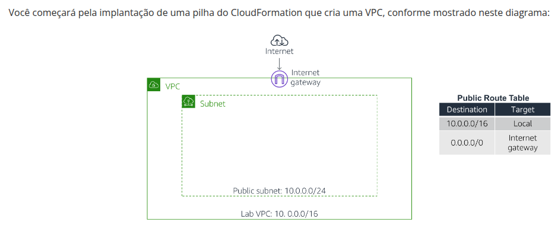
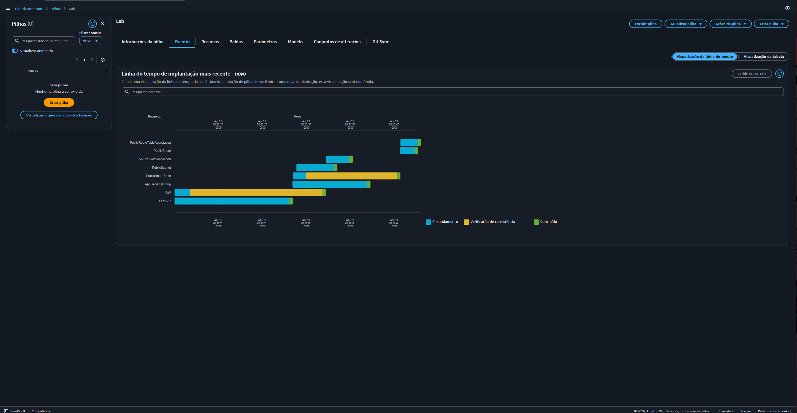
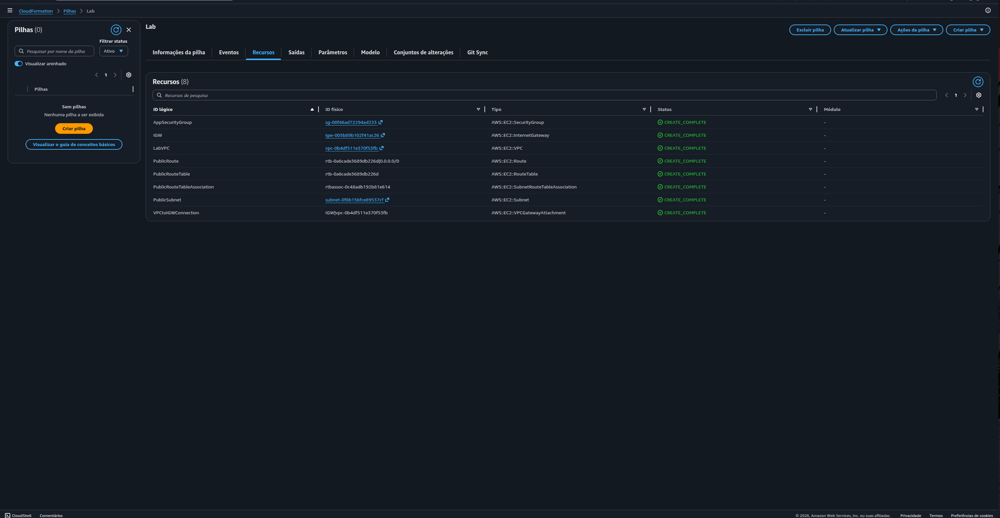
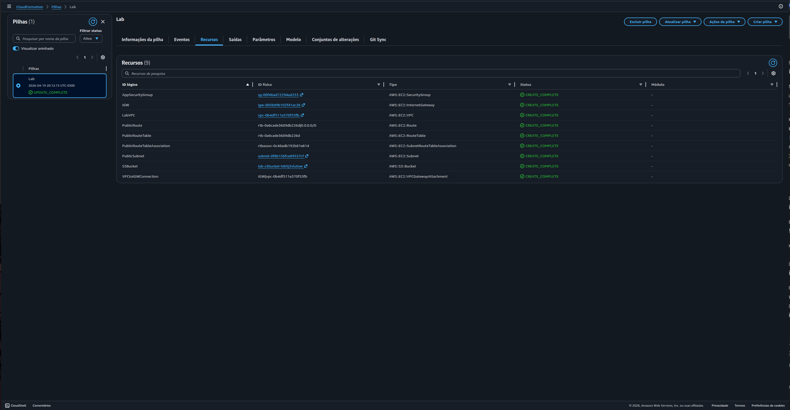
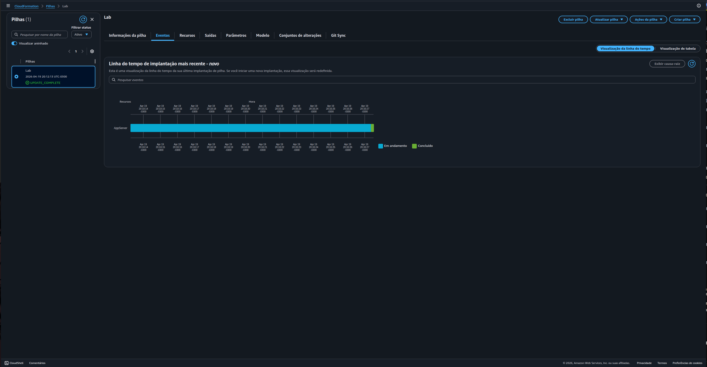
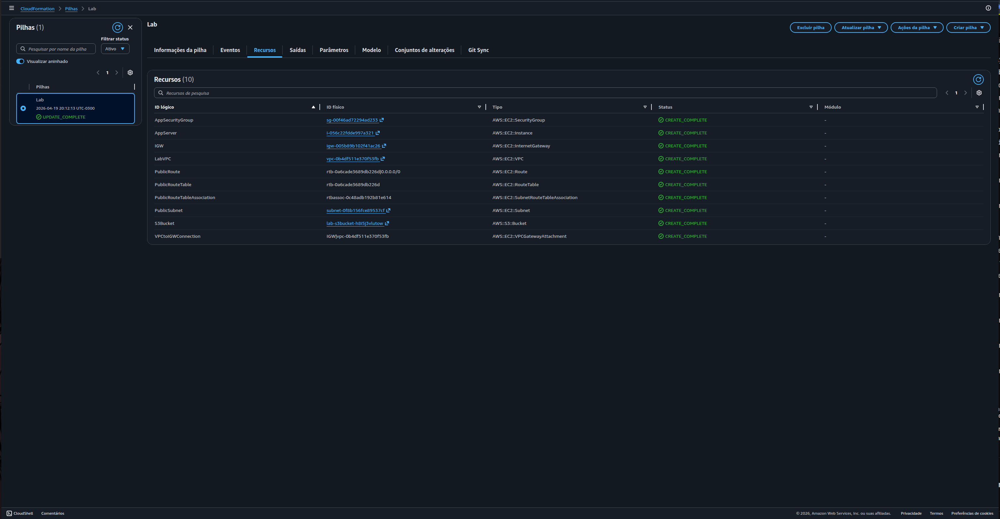
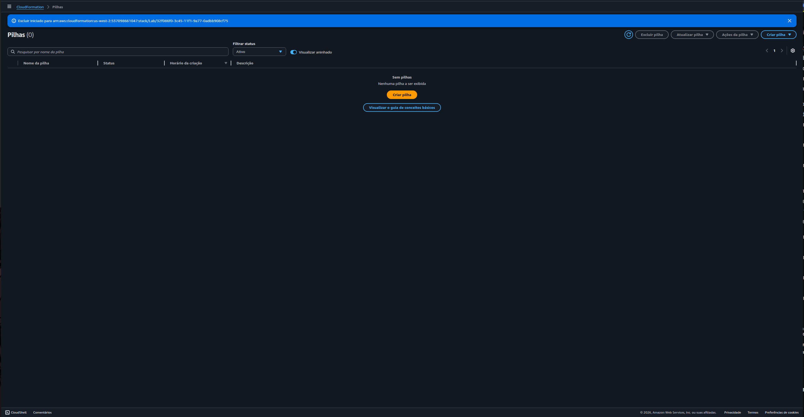

# Lab AWS — Automação de Infraestrutura com AWS CloudFormation

## 📋 Sobre o Lab

Este laboratório faz parte do **Programa Re/Start AWS** através da **Escola da Nuvem**, com foco em Infrastructure as Code (IaC) utilizando o AWS CloudFormation para implantar, atualizar e remover infraestrutura de forma automatizada e reproduzível.

## 🎯 Objetivos

Ao concluir este laboratório, pratiquei:

- ✅ Implantar uma pilha do CloudFormation com VPC, Subnet pública e Internet Gateway definidos em YAML
- ✅ Editar um template CloudFormation para adicionar recursos incrementalmente (S3 e EC2)
- ✅ Atualizar uma pilha existente sem recriar recursos já provisionados
- ✅ Utilizar `!Ref` para referenciar recursos dentro do mesmo template
- ✅ Usar AWS Systems Manager Parameter Store para recuperar a AMI mais recente automaticamente
- ✅ Excluir uma pilha e todos os seus recursos de forma automática

## 🏗️ Arquitetura do Lab


*Infraestrutura final: VPC com subnet pública conectada à internet via Internet Gateway, Security Group, instância EC2 (App Server) e bucket S3 — todos definidos e gerenciados pelo CloudFormation.*

### Infraestrutura Provisionada

| Recurso CloudFormation | Tipo AWS | Detalhes |
|---|---|---|
| LabVPC | AWS::EC2::VPC | CIDR 10.0.0.0/20 — DNS habilitado |
| IGW | AWS::EC2::InternetGateway | Internet Gateway da Lab VPC |
| VPCtoIGWConnection | AWS::EC2::VPCGatewayAttachment | Attach do IGW à VPC |
| PublicSubnet | AWS::EC2::Subnet | CIDR 10.0.0.0/24 — MapPublicIpOnLaunch: true |
| PublicRouteTable | AWS::EC2::RouteTable | Tabela de rotas pública |
| PublicRoute | AWS::EC2::Route | 0.0.0.0/0 → IGW |
| PublicRouteTableAssociation | AWS::EC2::SubnetRouteTableAssociation | Associação subnet ↔ route table |
| AppSecurityGroup | AWS::EC2::SecurityGroup | TCP 80 aberto (0.0.0.0/0) |
| S3Bucket | AWS::S3::Bucket | Bucket com nome gerado automaticamente |
| AppServer | AWS::EC2::Instance | t3.micro — Amazon Linux 2 — subnet pública |

### Progressão da Pilha

```
Task 1 — Deploy inicial (8 recursos)
    VPC + IGW + Subnet + RouteTable + Route
    + RouteTableAssociation + SecurityGroup
    + VPCGatewayAttachment
         │
         ▼
Task 2 — Update: +1 recurso (9 total)
    + S3Bucket (AWS::S3::Bucket)
         │
         ▼
Task 3 — Update: +1 recurso (10 total)
    + AppServer (AWS::EC2::Instance t3.micro)
         │
         ▼
Task 4 — Delete Stack
    Todos os 10 recursos removidos automaticamente
```

### Estrutura do Template YAML (Task 3 — Final)

```yaml
AWSTemplateFormatVersion: 2010-09-09

Parameters:
  LabVpcCidr:         # 10.0.0.0/20
  PublicSubnetCidr:   # 10.0.0.0/24
  AmazonLinuxAMIID:   # SSM Parameter Store → AMI mais recente Amazon Linux 2

Resources:
  S3Bucket:           # AWS::S3::Bucket
  LabVPC:             # AWS::EC2::VPC
  IGW:                # AWS::EC2::InternetGateway
  VPCtoIGWConnection: # AWS::EC2::VPCGatewayAttachment
  PublicRouteTable:   # AWS::EC2::RouteTable
  PublicRoute:        # AWS::EC2::Route (0.0.0.0/0 → IGW)
  PublicSubnet:       # AWS::EC2::Subnet
  PublicRouteTableAssociation: # AWS::EC2::SubnetRouteTableAssociation
  AppSecurityGroup:   # AWS::EC2::SecurityGroup (TCP 80)
  AppServer:          # AWS::EC2::Instance (t3.micro)

Outputs:
  LabVPCDefaultSecurityGroup: # !Sub ${LabVPC.DefaultSecurityGroup}
```

## 🔧 Tecnologias e Serviços Utilizados

- **AWS CloudFormation** — Provisionamento de infraestrutura via IaC (Infrastructure as Code)
- **Amazon VPC** — Rede privada virtual com subnet pública e Internet Gateway
- **Amazon EC2** — Instância App Server (t3.micro / Amazon Linux 2)
- **Amazon S3** — Bucket provisionado via CloudFormation
- **AWS Systems Manager Parameter Store** — Recuperação dinâmica do ID da AMI mais recente
- **YAML** — Linguagem de configuração dos templates CloudFormation

## 📝 Etapas Realizadas

### Tarefa 1: Deploy Inicial — VPC com Subnet Pública

O arquivo `task1.yaml` foi carregado no console do CloudFormation para criar a pilha **Lab** com 8 recursos de rede. O CloudFormation calculou automaticamente a ordem correta de criação (ex: VPC antes da Subnet, IGW antes da Route).


*Aba Eventos com a visualização de linha do tempo mostrando a ordem de criação dos 8 recursos: LabVPC → IGW → AppSecurityGroup → PublicRouteTable → PublicSubnet → VPCtoIGWConnection → PublicRoute → PublicRouteTableAssociation*


*Aba Recursos com os 8 componentes de rede com status `CREATE_COMPLETE`: AppSecurityGroup, IGW, LabVPC, PublicRoute, PublicRouteTable, PublicRouteTableAssociation, PublicSubnet e VPCtoIGWConnection*

---

### Tarefa 2: Adicionar Amazon S3 à Pilha

O template foi editado para incluir um bucket S3 com apenas duas linhas YAML na seção `Resources:`:

```yaml
  S3Bucket:
    Type: AWS::S3::Bucket
```

Nenhuma propriedade adicional foi necessária. O CloudFormation gerou automaticamente um nome único para o bucket. A pilha foi atualizada sem recriar os recursos existentes.


*Linha do tempo mostrando apenas o `S3Bucket` sendo provisionado durante o UPDATE — os demais recursos permaneceram intactos*


*Aba Recursos com 9 itens: `S3Bucket` (`AWS::S3::Bucket`) adicionado com `CREATE_COMPLETE`, status da pilha `UPDATE_COMPLETE`*

---

### Tarefa 3: Adicionar Instância EC2 à Pilha

Dois blocos foram adicionados ao template:

**Novo parâmetro — AMI dinâmica via SSM Parameter Store:**
```yaml
  AmazonLinuxAMIID:
    Type: AWS::SSM::Parameter::Value<AWS::EC2::Image::Id>
    Default: /aws/service/ami-amazon-linux-latest/amzn2-ami-hvm-x86_64-gp2
```

**Novo recurso — instância EC2:**
```yaml
  AppServer:
    Type: AWS::EC2::Instance
    Properties:
      ImageId: !Ref AmazonLinuxAMIID
      InstanceType: t3.micro
      SecurityGroupIds:
        - !Ref AppSecurityGroup
      SubnetId: !Ref PublicSubnet
      Tags:
        - Key: Name
          Value: App Server
```

> **Destaque:** o uso de `!Ref AmazonLinuxAMIID` com SSM Parameter Store garante que o template sempre use a AMI mais recente do Amazon Linux 2, sem necessidade de atualizar o ID manualmente em cada região.


*Linha do tempo mostrando o `AppServer` sendo criado via UPDATE — provisioning levou aproximadamente 20 minutos para a instância EC2 ficar disponível*


*Aba Recursos com 10 itens: `AppServer` (`AWS::EC2::Instance`) adicionado com `CREATE_COMPLETE`, status `UPDATE_COMPLETE`*

---

### Tarefa 4: Excluir a Pilha

Com um único clique em **Excluir pilha**, o CloudFormation removeu automaticamente todos os 10 recursos provisionados ao longo do lab — sem necessidade de exclusão manual de cada componente.


*Console CloudFormation mostrando "Sem pilhas" após a exclusão, com o banner de confirmação: "Excluir iniciado para arn:aws:cloudformation..." — todos os recursos foram removidos automaticamente*

---

## 🔐 Conceitos-Chave Aprendidos

### Infrastructure as Code (IaC) com CloudFormation

O CloudFormation permite definir infraestrutura em arquivos de texto (YAML ou JSON) versionáveis, repetíveis e auditáveis. Uma mesma pilha pode ser implantada em qualquer região com comportamento idêntico.

```
Abordagem manual           Abordagem IaC (CloudFormation)
──────────────────         ──────────────────────────────
Clicar em cada recurso     Definir em YAML → Deploy automático
Ordem manual de criação    CloudFormation calcula dependências
Exclusão recurso a recurso Delete Stack → tudo removido
Difícil de reproduzir      Idempotente e versionável no Git
```

### Referências entre Recursos com `!Ref`

O `!Ref` permite que um recurso faça referência ao ID de outro recurso definido na mesma pilha, sem hardcode:

```yaml
  AppServer:
    Properties:
      SubnetId: !Ref PublicSubnet       # ID da subnet criada na mesma pilha
      SecurityGroupIds:
        - !Ref AppSecurityGroup         # ID do SG criado na mesma pilha
```

### AMI Dinâmica via SSM Parameter Store

Em vez de fixar um AMI ID (que varia por região e fica desatualizado), o tipo `AWS::SSM::Parameter::Value<AWS::EC2::Image::Id>` consulta o Parameter Store da AWS em tempo de deploy:

```yaml
  AmazonLinuxAMIID:
    Type: AWS::SSM::Parameter::Value<AWS::EC2::Image::Id>
    Default: /aws/service/ami-amazon-linux-latest/amzn2-ami-hvm-x86_64-gp2
```

Isso torna o template portável entre regiões e sempre atualizado sem edição manual.

### Atualização Incremental de Pilhas

O CloudFormation identifica **apenas o diff** entre o template atual e o novo template enviado. Recursos sem alteração não são recriados — apenas os novos recursos são adicionados, minimizando impacto e tempo de deploy.

### Exclusão Automática de Recursos

Ao deletar uma pilha, o CloudFormation remove todos os recursos associados na ordem inversa das dependências — evitando erros de exclusão (ex: tentar remover uma VPC antes de remover a subnet).

## 💡 Principais Aprendizados

1. **Indentação YAML é crítica** — CloudFormation rejeita templates com espaçamento incorreto. Cada nível usa exatamente 2 espaços; misturar tabs e espaços causa erros silenciosos difíceis de depurar.

2. **`!Ref` resolve IDs em runtime** — Não é necessário saber o ID de um recurso antecipadamente. O CloudFormation resolve todas as referências durante o deploy, calculando automaticamente a ordem de criação.

3. **SSM Parameter Store elimina hardcode de AMI** — Templates com AMI ID fixo quebram ao mudar de região ou quando a AMI é descontinuada. O uso do Parameter Store torna o template verdadeiramente portável.

4. **Updates preservam recursos existentes** — Adicionar um novo recurso à pilha não recria os existentes. O CloudFormation opera apenas no diff, o que reduz risco e tempo de downtime.

5. **Delete Stack é uma operação completa de limpeza** — Todos os recursos criados pela pilha são removidos automaticamente, eliminando o risco de recursos órfãos gerando custos inesperados.

6. **DependsOn garante ordem de criação** — Em recursos com dependências implícitas não detectadas automaticamente pelo CloudFormation, `DependsOn` força a ordem correta de provisionamento.

## 📊 Resultados

| Métrica | Valor |
|---|---|
| Recursos na Task 1 | 8 (VPC + rede completa) |
| Recursos na Task 2 | 9 (+S3Bucket) |
| Recursos na Task 3 | 10 (+AppServer EC2) |
| Instância EC2 | t3.micro — Amazon Linux 2 — subnet pública |
| AMI | Recuperada dinamicamente via SSM Parameter Store |
| Updates sem recriação | ✅ (recursos existentes preservados) |
| Exclusão automática | ✅ (todos os 10 recursos removidos via Delete Stack) |

---

## 📚 Recursos Adicionais

- [Documentação AWS CloudFormation](https://docs.aws.amazon.com/AWSCloudFormation/latest/UserGuide/Welcome.html)
- [AWS::EC2::Instance Reference](https://docs.aws.amazon.com/AWSCloudFormation/latest/UserGuide/aws-properties-ec2-instance.html)
- [AWS::S3::Bucket Reference](https://docs.aws.amazon.com/AWSCloudFormation/latest/UserGuide/aws-properties-s3-bucket.html)
- [CloudFormation Template Snippets — S3](https://docs.aws.amazon.com/AWSCloudFormation/latest/UserGuide/quickref-s3.html)
- [SSM Parameter Store — AMI IDs](https://aws.amazon.com/blogs/compute/query-for-the-latest-amazon-linux-ami-ids-using-aws-systems-manager-parameter-store/)
- [Intrinsic Function !Ref](https://docs.aws.amazon.com/AWSCloudFormation/latest/UserGuide/intrinsic-function-reference-ref.html)

## 🏆 Certificações Relacionadas

Este laboratório contribui para a preparação das seguintes certificações:

- **AWS Certified Cloud Practitioner**
- **AWS Certified Solutions Architect - Associate**
- **AWS Certified SysOps Administrator - Associate**
- **AWS Certified DevOps Engineer - Professional**

## 👨‍💻 Autor

**Matheus Lima**

Estudante — Escola da Nuvem | Programa Re/Start AWS

---

## 📄 Licença

Este projeto é parte do Programa Re/Start AWS e está disponível para fins de estudo e portfólio.

---

<div align="center">

[](https://aws.amazon.com/training/awsacademy/)
[](https://aws.amazon.com/cloudformation/)
[](https://aws.amazon.com/ec2/)
[](https://aws.amazon.com/s3/)
[](https://aws.amazon.com/vpc/)
[](https://yaml.org/)

</div>
