# Lab AWS — Creating Amazon EC2 Instances

## 📋 Sobre o Lab

Este laboratório faz parte do **Programa Re/Start AWS** através da **Escola da Nuvem**, focado em práticas de provisionamento de infraestrutura de computação em nuvem com Amazon EC2 e AWS CLI.

## 🎯 Objetivos

Ao concluir este laboratório, pratiquei:

- ✅ Lançar uma instância EC2 (Bastion Host) pelo AWS Management Console
- ✅ Conectar à instância via EC2 Instance Connect
- ✅ Lançar uma instância EC2 (Web Server) pela AWS CLI
- ✅ Diagnosticar e corrigir misconfigurações de Security Group (Challenge 1)
- ✅ Diagnosticar e corrigir falha no serviço Apache (Challenge 2)

## 🏗️ Arquitetura do Lab

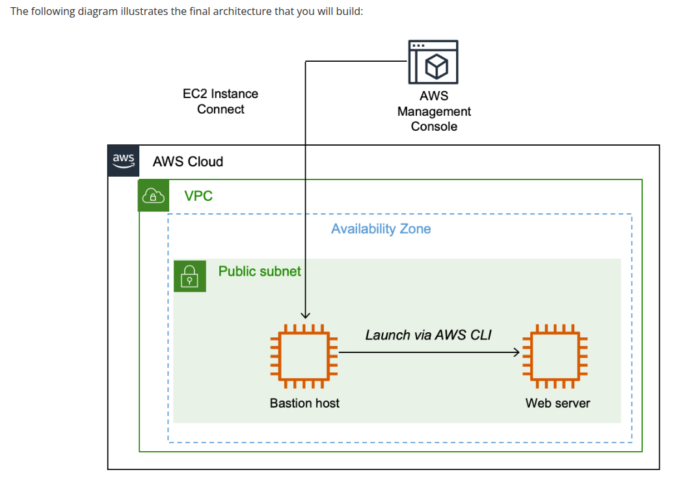
*Fluxo do lab: Bastion Host em subnet pública usada como ponto de acesso para provisionar o Web Server via AWS CLI, ambos dentro da Lab VPC*

### Infraestrutura Utilizada

| Componente | Detalhes |
|---|---|
| Bastion Host | Amazon Linux 2023 — t3.micro — acesso via EC2 Instance Connect |
| Web Server | Amazon Linux 2 — t3.micro — lançado via AWS CLI |
| VPC | Lab VPC — subnet pública (us-west-2a) |
| Security Group (Bastion) | `Bastion security group` — porta 22 (SSH) |
| Security Group (Web) | `WebSecurityGroup` — porta 80 (HTTP) |
| IAM Role | `Bastion-Role` — permite chamadas à API EC2 a partir da instância |

O fluxo do lab parte do Console AWS para criar o Bastion Host. A partir dele, via EC2 Instance Connect, a AWS CLI é usada para provisionar o Web Server automaticamente com um script de user data que instala o Apache.

```
Console AWS
    │
    └── EC2 Launch Wizard ──► Bastion Host (t3.micro)
                                    │
                              EC2 Instance Connect
                                    │
                              AWS CLI (Bastion-Role)
                                    │
                  ┌─────────────────┼─────────────────┐
                  │                 │                  │
            aws ssm          aws ec2              wget UserData.txt
         (get AMI ID)    describe-subnets/         (script Apache)
                         security-groups
                                    │
                              aws ec2 run-instances
                                    │
                              Web Server (t3.micro)
                                    │
                         UserData → Apache instalado
                                    │
                         http://<PublicDNS> ✅
```

## 🔧 Tecnologias e Serviços Utilizados

- **Amazon EC2** — Provisionamento de instâncias de computação na nuvem
- **AWS CLI** — Interface de linha de comando para automação de infraestrutura
- **EC2 Instance Connect** — Acesso seguro à instância sem par de chaves
- **AWS Systems Manager (SSM) Parameter Store** — Recuperação automática do AMI ID mais recente
- **IAM Role** — Permissão para chamadas à API EC2 a partir da instância
- **Security Groups** — Controle de tráfego de entrada e saída das instâncias
- **User Data Script** — Instalação automatizada do Apache na inicialização

## 📝 Etapas Realizadas

### Tarefa 1: Lançar o Bastion Host pelo Console

O Bastion Host foi criado pelo AWS Management Console com as seguintes configurações: AMI Amazon Linux 2023, tipo t3.micro, sem par de chaves (usando EC2 Instance Connect), na subnet pública da Lab VPC, com o Security Group `Bastion security group` (porta 22) e a IAM Role `Bastion-Role`.

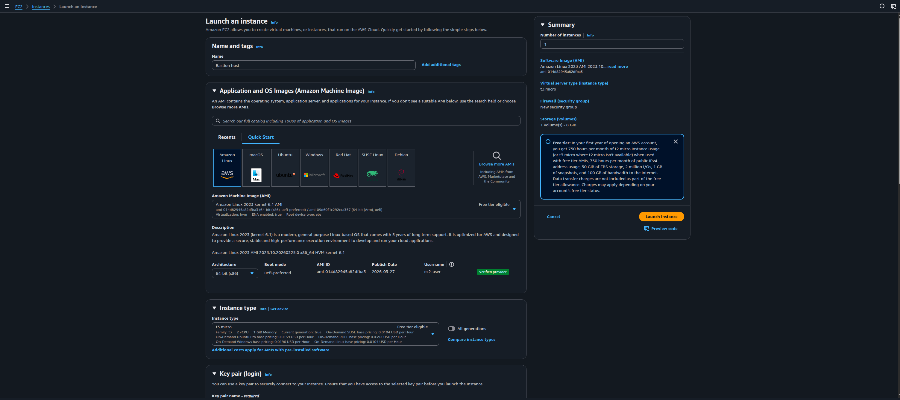
*Tela de lançamento com nome "Bastion host", AMI Amazon Linux 2023 e tipo t3.micro selecionados*

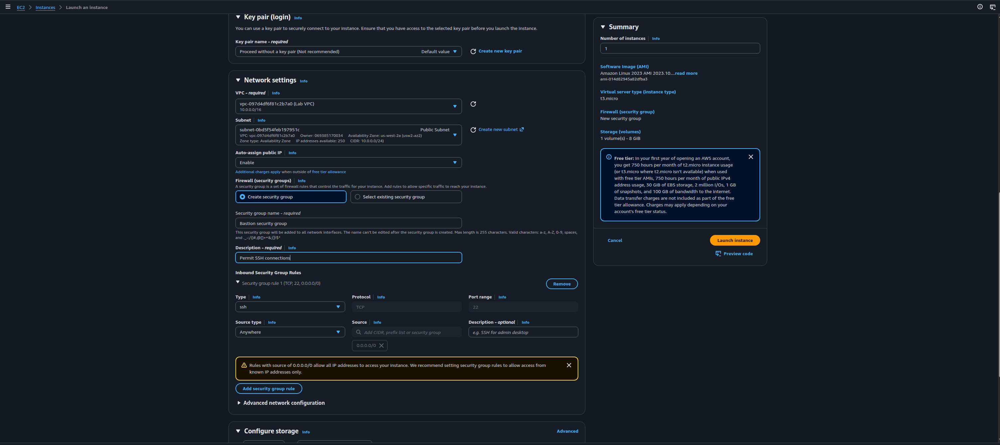
*Configuração de rede: Lab VPC, Public Subnet, IP público habilitado e Security Group "Bastion security group" com regra SSH (porta 22)*

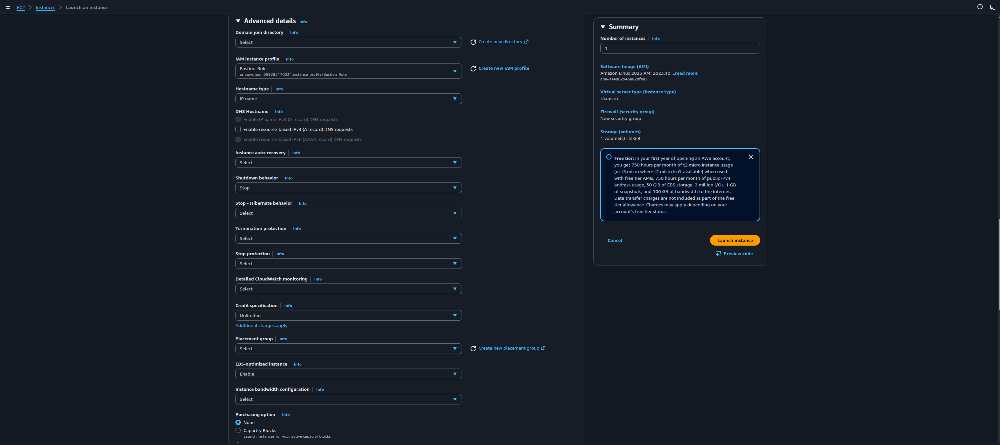
*Seção Advanced Details com a IAM instance profile "Bastion-Role" selecionada — necessária para uso da AWS CLI na instância*

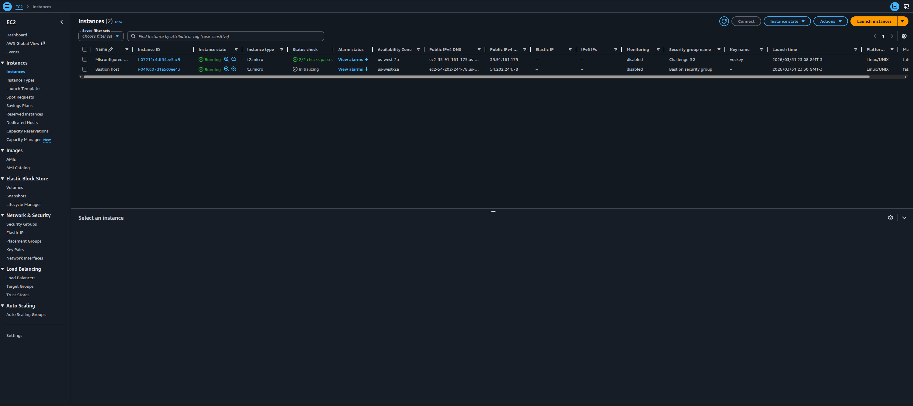
*Console EC2 mostrando as instâncias em execução após a criação do Bastion Host*

**Configurações aplicadas:**
- **Name:** Bastion host
- **AMI:** Amazon Linux 2023 (Free Tier eligible)
- **Instance type:** t3.micro
- **Key pair:** Proceed without a key pair
- **VPC:** Lab VPC
- **Subnet:** Public Subnet
- **Auto-assign public IP:** Enable
- **Security group name:** Bastion security group
- **Description:** Permit SSH connections
- **IAM instance profile:** Bastion-Role

---

### Tarefa 2: Conectar ao Bastion Host via EC2 Instance Connect

O acesso foi feito diretamente pelo Console AWS, sem necessidade de par de chaves SSH, usando o EC2 Instance Connect.

---

### Tarefa 3: Lançar o Web Server pela AWS CLI

Com acesso ao Bastion Host, todos os parâmetros necessários foram recuperados via CLI antes de lançar a instância.

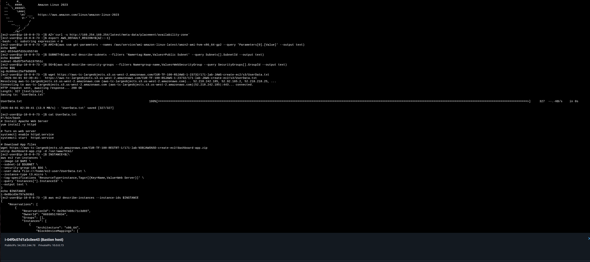
*Sequência de comandos: recuperação do AMI ID via SSM, Subnet ID, Security Group ID, download do UserData.txt e execução do `aws ec2 run-instances`*

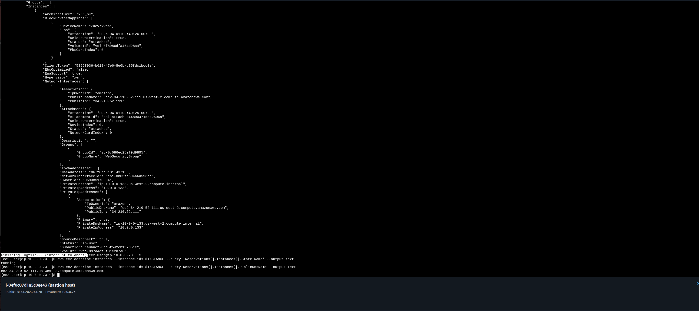
*Saída do `aws ec2 describe-instances` em JSON e confirmação do estado `running` com a query filtrada. Public DNS do Web Server recuperado ao final*

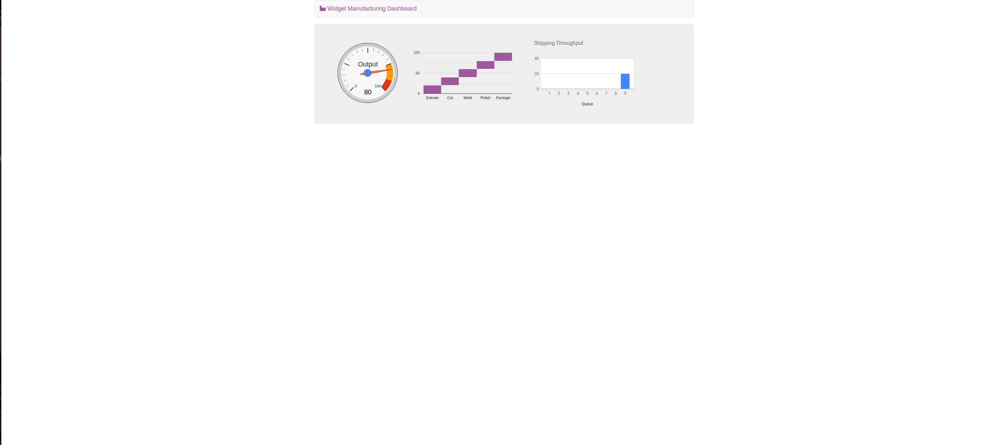
*Widget Manufacturing Dashboard acessível via Public DNS, confirmando que o Apache e a aplicação foram instalados com sucesso pelo User Data*

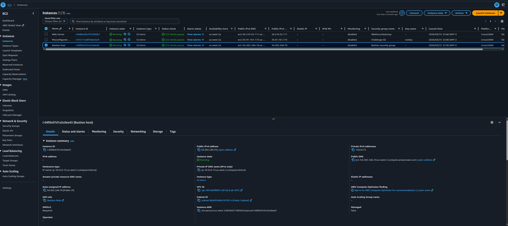
*Console EC2 exibindo as três instâncias rodando: Web Server, Misconfigured Web Server e Bastion Host*

**Comandos executados:**

**Step 1 — Recuperar AMI ID:**
```bash
AZ=`curl -s http://169.254.169.254/latest/meta-data/placement/availability-zone`
export AWS_DEFAULT_REGION=${AZ::-1}

AMI=$(aws ssm get-parameters \
  --names /aws/service/ami-amazon-linux-latest/amzn2-ami-hvm-x86_64-gp2 \
  --query 'Parameters[0].[Value]' \
  --output text)
echo $AMI
```

**Step 2 — Recuperar Subnet ID:**
```bash
SUBNET=$(aws ec2 describe-subnets \
  --filters 'Name=tag:Name,Values=Public Subnet' \
  --query Subnets[].SubnetId \
  --output text)
echo $SUBNET
```

**Step 3 — Recuperar Security Group ID:**
```bash
SG=$(aws ec2 describe-security-groups \
  --filters Name=group-name,Values=WebSecurityGroup \
  --query SecurityGroups[].GroupId \
  --output text)
echo $SG
```

**Step 4 — Download do User Data Script:**
```bash
wget https://aws-tc-largeobjects.s3.us-west-2.amazonaws.com/CUR-TF-100-RSJAWS-1-23732/171-lab-JAWS-create-ec2/s3/UserData.txt
cat UserData.txt
```

**Step 5 — Lançar a instância:**
```bash
INSTANCE=$(aws ec2 run-instances \
  --image-id $AMI \
  --subnet-id $SUBNET \
  --security-group-ids $SG \
  --user-data file:///home/ec2-user/UserData.txt \
  --instance-type t3.micro \
  --tag-specifications 'ResourceType=instance,Tags=[{Key=Name,Value=Web Server}]' \
  --query 'Instances[*].InstanceId' \
  --output text)
echo $INSTANCE
```

**Step 6 — Aguardar estado `running`:**
```bash
aws ec2 describe-instances \
  --instance-ids $INSTANCE \
  --query 'Reservations[].Instances[].State.Name' \
  --output text
```

**Step 7 — Obter o Public DNS para teste:**
```bash
aws ec2 describe-instances \
  --instance-ids $INSTANCE \
  --query Reservations[].Instances[].PublicDnsName \
  --output text
```

---

### Challenge 1: Corrigir Acesso SSH à Misconfigured Web Server

A tentativa de conexão via EC2 Instance Connect na instância `Misconfigured Web Server` falhou. A investigação do Security Group `Challenge-SG` revelou que havia apenas uma regra de entrada (porta 80/HTTP) — a porta 22 (SSH) estava ausente.

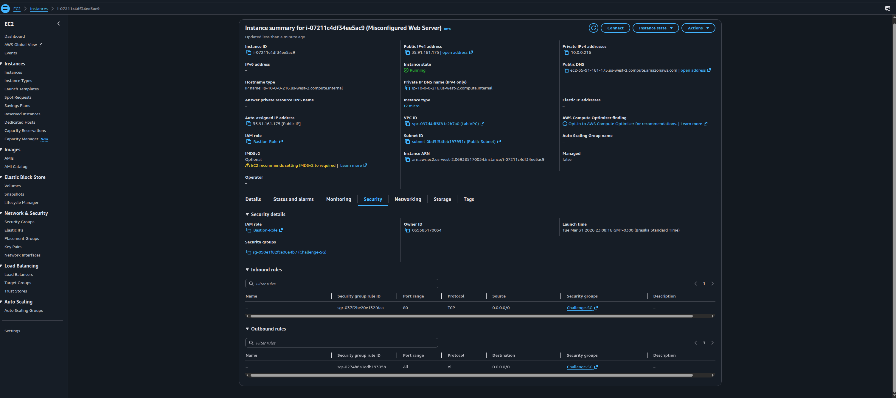
*Aba Security da instância Misconfigured Web Server — Inbound rules com apenas a porta 80, sem regra SSH*

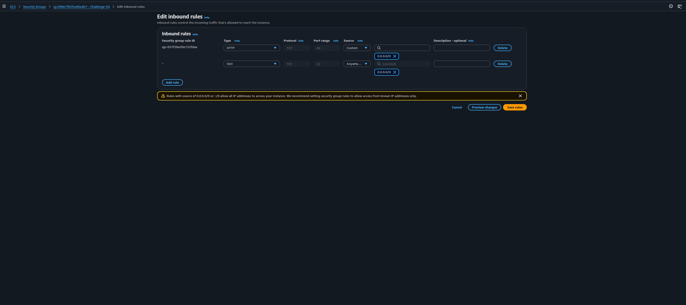
*Tela Edit inbound rules com a nova regra SSH (porta 22, source 0.0.0.0/0) adicionada ao Challenge-SG*

**Problema:** Security Group `Challenge-SG` sem inbound rule para porta 22 (SSH).

**Solução:** Adição de regra SSH no Security Group:
- **Type:** SSH
- **Port range:** 22
- **Protocol:** TCP
- **Source:** 0.0.0.0/0

---

### Challenge 2: Corrigir o Web Server da Misconfigured Web Server

Após conectar via EC2 Instance Connect (corrigido no Challenge 1), o acesso ao Public DNS da instância no browser retornava erro. O diagnóstico mostrou que o Apache (`httpd`) estava instalado mas inativo.

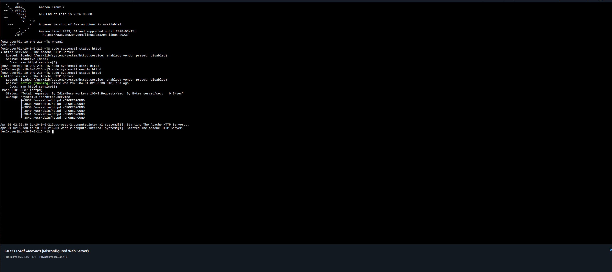
*Sequência: `systemctl status httpd` retornando `inactive (dead)` → `systemctl start httpd` → `systemctl enable httpd` → status confirmando `active (running)`*

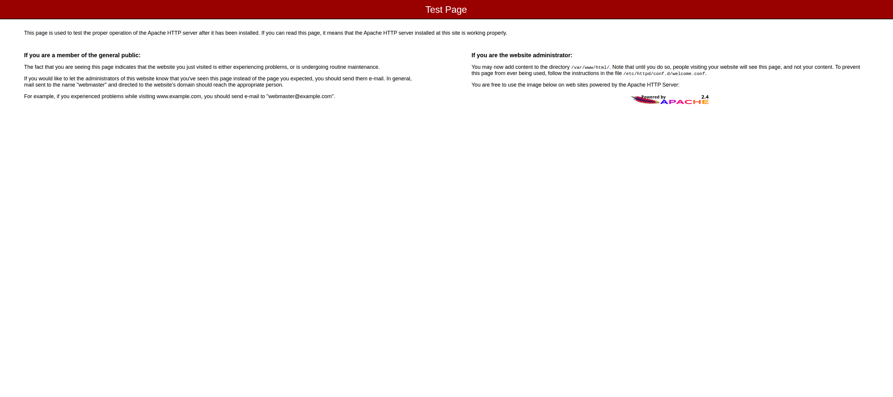
*Apache HTTP Server Test Page acessível via Public DNS após inicialização do serviço — confirmando que o web server estava instalado mas parado*

**Problema:** Apache (`httpd`) instalado mas com serviço parado (`inactive/dead`).

**Solução:**
```bash
sudo systemctl start httpd
sudo systemctl enable httpd
sudo systemctl status httpd
# Active: active (running) ✅
```

> **Obs.:** O `enable` garante que o Apache inicie automaticamente se a instância for reiniciada, prevenindo reincidência do problema.

---

## 🔐 Conceitos-Chave Aprendidos

### EC2 Instance Connect vs. Par de Chaves SSH

O EC2 Instance Connect permite conexão segura à instância diretamente pelo Console AWS, sem necessidade de gerenciar um arquivo `.pem`. Internamente, ele injeta uma chave pública temporária na instância por 60 segundos. Para funcionar, a instância precisa de inbound rule na porta 22 no seu Security Group.

### IAM Role na Instância EC2

A `Bastion-Role` associada ao Bastion Host permite que a AWS CLI faça chamadas aos serviços AWS usando as permissões da role, sem necessidade de executar `aws configure` com credenciais estáticas. As credenciais são obtidas dinamicamente pelo IMDS (Instance Metadata Service).

```
Sem IAM Role:
  AWS CLI → AccessDenied ❌

Com Bastion-Role associada:
  AWS CLI → usa credenciais temporárias da role → chamadas autorizadas ✅
```

### SSM Parameter Store para AMI Dinâmico

Em vez de hardcodar um AMI ID (que muda a cada patch da AWS), o lab usa o SSM Parameter Store para recuperar sempre o AMI mais recente do Amazon Linux 2:

```bash
aws ssm get-parameters \
  --names /aws/service/ami-amazon-linux-latest/amzn2-ami-hvm-x86_64-gp2 \
  --query 'Parameters[0].[Value]' \
  --output text
```

Isso garante que instâncias lançadas por scripts sempre usem imagens atualizadas e com os últimos patches de segurança aplicados.

### User Data Script

O User Data é um script executado automaticamente na primeira inicialização da instância. No lab, ele instala o Apache e faz o deploy da aplicação web sem nenhuma intervenção manual:

```bash
#!/bin/bash
# Install Apache Web Server
yum install -y httpd
# Turn on web server
systemctl enable httpd.service
systemctl start httpd.service
# Download App files
wget https://...dashboard-app.zip -d /var/www/html/
unzip dashboard-app.zip -d /var/www/html/
```

### Security Groups — Firewall da Instância

Security Groups são stateful: uma regra de entrada permitida retorna automaticamente o tráfego de resposta, sem necessidade de regra de saída correspondente. A ausência de uma regra de entrada bloqueia totalmente o acesso, independente das regras de saída.

| Regra | Porta | Uso |
|---|---|---|
| SSH | 22 | Acesso via EC2 Instance Connect |
| HTTP | 80 | Acesso ao web server no browser |

### systemctl — Gerenciamento de Serviços no Linux

| Comando | Efeito |
|---|---|
| `systemctl start httpd` | Inicia o serviço agora |
| `systemctl enable httpd` | Configura para iniciar no boot |
| `systemctl status httpd` | Exibe o estado atual do serviço |
| `systemctl stop httpd` | Para o serviço |

### Console vs. CLI — Quando Usar Cada Um

| Método | Quando usar |
|---|---|
| **Console** | Lançamentos pontuais, exploração visual, configurações únicas |
| **AWS CLI** | Automação, scripts repetíveis, integração com pipelines |
| **CloudFormation** | Lançamento de recursos relacionados como uma stack |

## 💡 Principais Aprendizados

1. **Security Group é o primeiro ponto de falha** — Antes de investigar o sistema operacional, sempre verificar as inbound rules do Security Group associado à instância.

2. **Instalado ≠ Rodando** — Um serviço pode estar instalado e configurado mas inativo. Sempre verificar com `systemctl status` após o deploy.

3. **`enable` ≠ `start`** — O `systemctl enable` configura o boot automático mas não inicia o serviço na hora. O `start` inicia imediatamente. Ambos são necessários em conjunto.

4. **Variáveis de ambiente se perdem na desconexão** — Se a sessão EC2 Instance Connect for encerrada, `$AMI`, `$SUBNET`, `$SG` e `$INSTANCE` são perdidos e precisam ser recuperados novamente.

5. **Silêncio = sucesso na AWS CLI** — Comandos como `aws iam attach-user-policy` não retornam saída em caso de sucesso. A ausência de mensagem de erro é a confirmação.

6. **`--query` e `--output text` são essenciais para scripting** — Sem eles, a saída JSON completa precisaria ser parseada manualmente. Com eles, o valor exato é capturado diretamente na variável.

## 🚀 Como Reproduzir este Lab

### Pré-requisitos
- Acesso ao AWS Academy Lab
- Navegador web (Chrome, Firefox ou Edge)
- Conhecimento básico de terminal Linux e AWS CLI

### Resumo do Passo a Passo

1. **Console → EC2** — Lançar Bastion Host (Amazon Linux 2023, t3.micro, sem key pair, Public Subnet, IAM Role: Bastion-Role)
2. **EC2 Instance Connect** — Conectar ao Bastion Host pelo Console
3. **Recuperar parâmetros via CLI** — AMI ID (SSM), Subnet ID, Security Group ID
4. **Download User Data** — `wget` do script de instalação do Apache
5. **Lançar Web Server** — `aws ec2 run-instances` com todos os parâmetros
6. **Monitorar estado** — `aws ec2 describe-instances` até retornar `running`
7. **Testar** — Abrir o Public DNS no browser e verificar o dashboard

## 📊 Resultados

| Métrica | Valor |
|---|---|
| Instâncias EC2 criadas | 2 (Bastion Host + Web Server) |
| Método de acesso | EC2 Instance Connect (sem key pair) |
| Web Server provisionado via | AWS CLI + User Data Script |
| Challenge 1 — Problema | Porta 22 ausente no Security Group |
| Challenge 1 — Solução | Adição de inbound rule SSH no Challenge-SG |
| Challenge 2 — Problema | Apache instalado mas inativo (dead) |
| Challenge 2 — Solução | `systemctl start httpd` + `systemctl enable httpd` |
| Web Server acessível | ✅ |

## 📚 Recursos Adicionais

- [Documentação Amazon EC2](https://docs.aws.amazon.com/ec2/)
- [EC2 Instance Connect](https://docs.aws.amazon.com/AWSEC2/latest/UserGuide/Connect-using-EC2-Instance-Connect.html)
- [AWS CLI — Referência EC2](https://awscli.amazonaws.com/v2/documentation/api/latest/reference/ec2/index.html)
- [User Data e Shell Scripts](https://docs.aws.amazon.com/AWSEC2/latest/UserGuide/user-data.html)
- [SSM Parameter Store — AMIs públicos](https://docs.aws.amazon.com/systems-manager/latest/userguide/parameter-store-public-parameters-ami.html)
- [AWS Academy](https://aws.amazon.com/training/awsacademy/)

## 🏆 Certificações Relacionadas

Este laboratório contribui para a preparação das seguintes certificações:

- **AWS Certified Cloud Practitioner**
- **AWS Certified Solutions Architect - Associate**
- **AWS Certified SysOps Administrator - Associate**

## 👨‍💻 Autor

**Matheus Lima**

Estudante — Escola da Nuvem | Programa Re/Start AWS

---

## 📄 Licença

Este projeto é parte do Programa Re/Start AWS e está disponível para fins de estudo e portfólio.

---

<div align="center">

[](https://aws.amazon.com/training/awsacademy/)
[](https://aws.amazon.com/ec2/)
[](https://aws.amazon.com/cli/)
[](https://aws.amazon.com/iam/)

</div>
