# Lab AWS - Criando um Servidor de Banco de Dados com Amazon RDS

## 📋 Sobre o Lab

Este laboratório faz parte do **Programa Re/Start AWS** através da **Escola da Nuvem**, focado em práticas de banco de dados gerenciado na nuvem com Amazon RDS.

## 🎯 Objetivos

Ao concluir este laboratório, pratiquei:

- ✅ Criar um grupo de segurança para a instância RDS
- ✅ Configurar um grupo de sub-redes de banco de dados Multi-AZ
- ✅ Executar uma instância de banco de dados MySQL com alta disponibilidade
- ✅ Conectar um aplicativo web à instância RDS
- ✅ Interagir com o banco de dados por meio de uma aplicação real

## 🏗️ Arquitetura do Lab

### Infraestrutura Inicial
A infraestrutura parte de uma VPC com sub-redes públicas e privadas em duas Zonas de Disponibilidade, com um servidor web (Web Server 1) já em execução na sub-rede pública.

### Infraestrutura Final

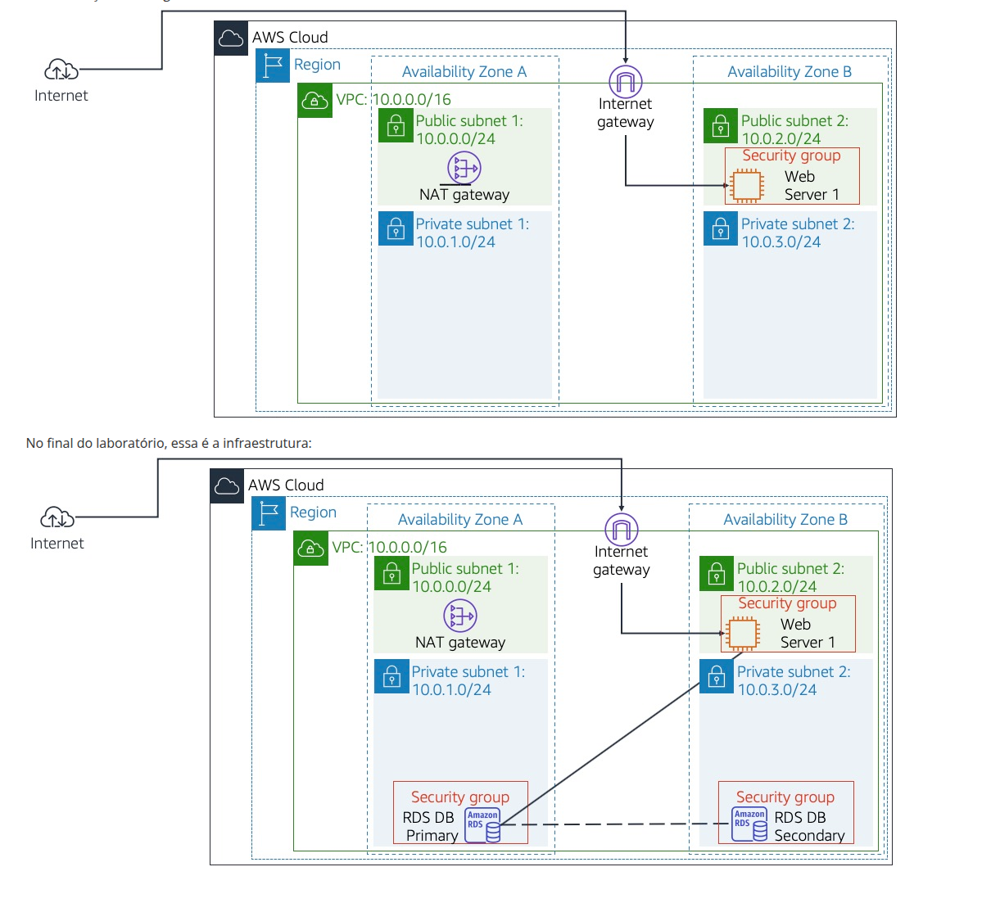

Ao final do laboratório, a infraestrutura conta com:

| Componente | Detalhes |
|---|---|
| VPC | 10.0.0.0/16 |
| Sub-rede pública 1 (AZ A) | 10.0.0.0/24 — NAT Gateway |
| Sub-rede pública 2 (AZ B) | 10.0.2.0/24 — Web Server 1 |
| Sub-rede privada 1 (AZ A) | 10.0.1.0/24 — RDS DB Primary |
| Sub-rede privada 2 (AZ B) | 10.0.3.0/24 — RDS DB Secondary |

A instância RDS primária fica na AZ A e replica sincronicamente para a secundária na AZ B, garantindo alta disponibilidade.

## 🔧 Tecnologias e Serviços Utilizados

- **Amazon RDS** — Banco de dados relacional gerenciado
- **MySQL** — Motor de banco de dados utilizado
- **Amazon VPC** — Rede privada virtual com sub-redes Multi-AZ
- **Security Groups** — Controle de acesso entre o web server e o banco de dados
- **AWS Management Console** — Interface de gerenciamento

## 📝 Etapas Realizadas

### Tarefa 1: Criar o Grupo de Segurança para o RDS

Criei o **DB Security Group** na VPC do laboratório, com uma regra de entrada liberando a porta **3306 (MySQL/Aurora)** exclusivamente para o **Web Security Group** — aplicando o princípio do menor privilégio para que apenas o servidor web possa acessar o banco.

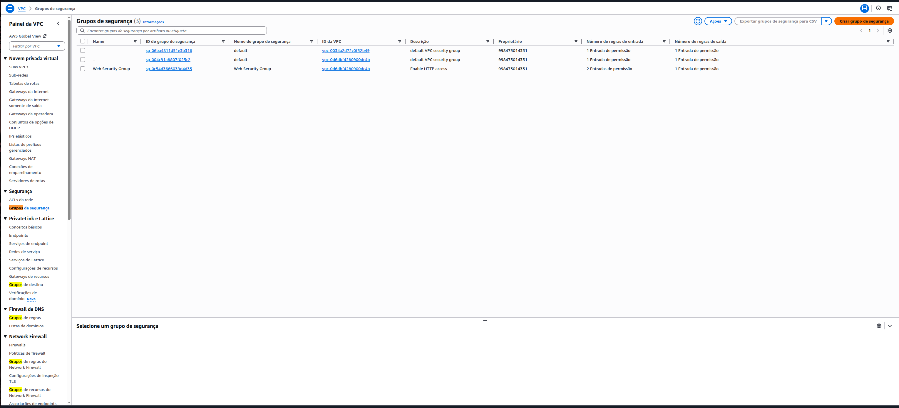
*Listagem dos grupos de segurança existentes na VPC do Lab*

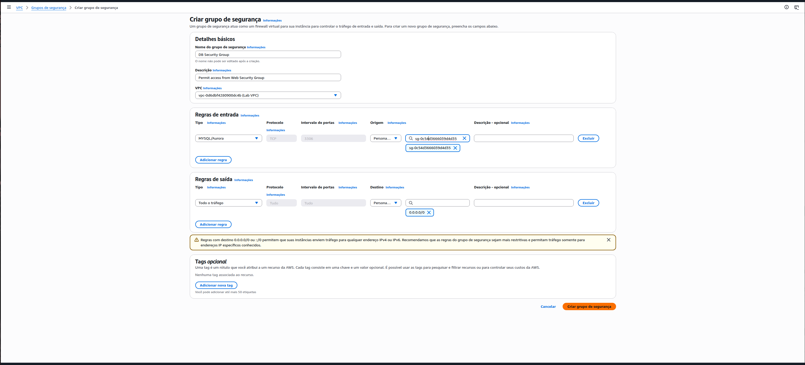
*Configuração do DB Security Group com regra de entrada MySQL na porta 3306*

**Configurações aplicadas:**
- Nome: `DB Security Group`
- Descrição: `Permit access from Web Security Group`
- Regra de entrada: MySQL/Aurora (3306) — Origem: Web Security Group

---

### Tarefa 2: Criar o Grupo de Sub-redes de Banco de Dados

Configurei o **DB Subnet Group** associando as sub-redes privadas em duas Zonas de Disponibilidade distintas, requisito obrigatório para implantações Multi-AZ no Amazon RDS.

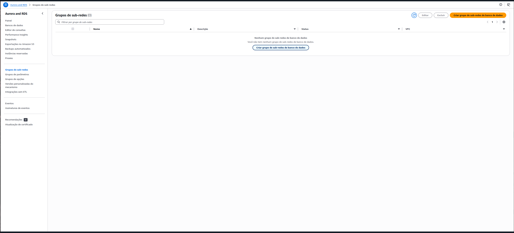
*Painel de Grupos de Sub-redes do RDS antes da criação*

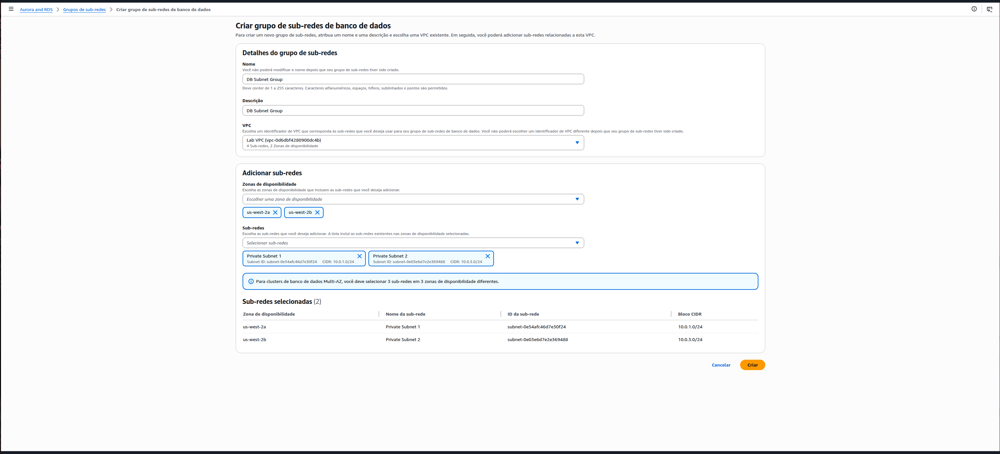
*Criação do DB Subnet Group com Private Subnet 1 (us-west-2a) e Private Subnet 2 (us-west-2b)*

**Sub-redes selecionadas:**

| Zona de Disponibilidade | Sub-rede | Bloco CIDR |
|---|---|---|
| us-west-2a | Private Subnet 1 | 10.0.1.0/24 |
| us-west-2b | Private Subnet 2 | 10.0.3.0/24 |

---

### Tarefa 3: Criar a Instância de Banco de Dados Amazon RDS

Provisionei uma instância MySQL Multi-AZ com as configurações abaixo, que garantem resiliência automática com failover para a instância em espera em caso de falha da AZ primária.

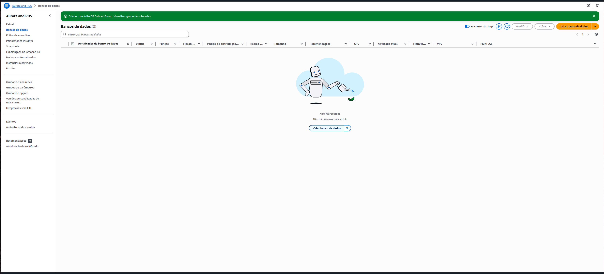
*Banner de confirmação do DB Subnet Group e tela de Bancos de Dados aguardando criação*

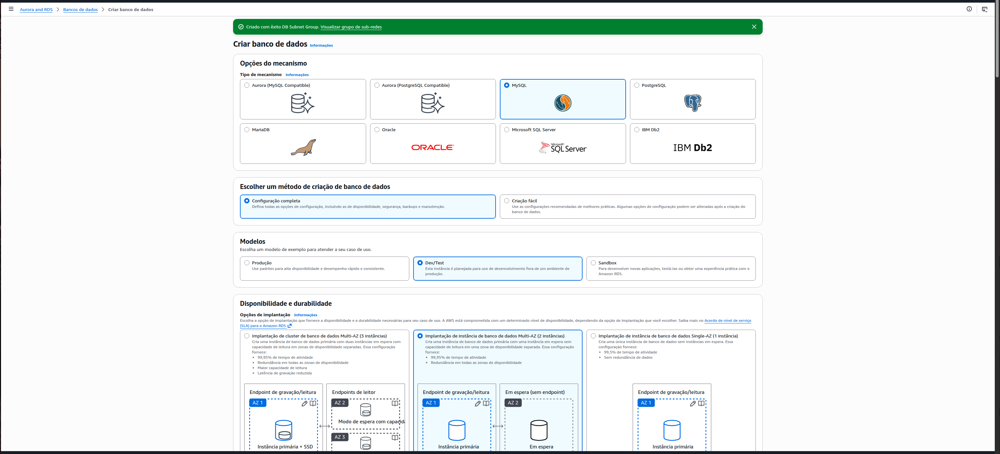
*Seleção do mecanismo MySQL com modelo Dev/Test e implantação Multi-AZ (2 instâncias)*

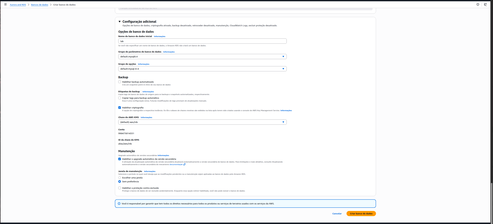
*Nome do banco de dados inicial definido como "lab" e backup automatizado desabilitado para o laboratório*

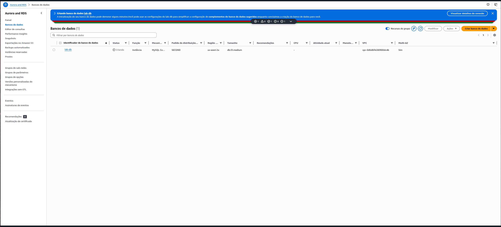
*Instância lab-db em status "Criando" — implantação Multi-AZ em andamento*

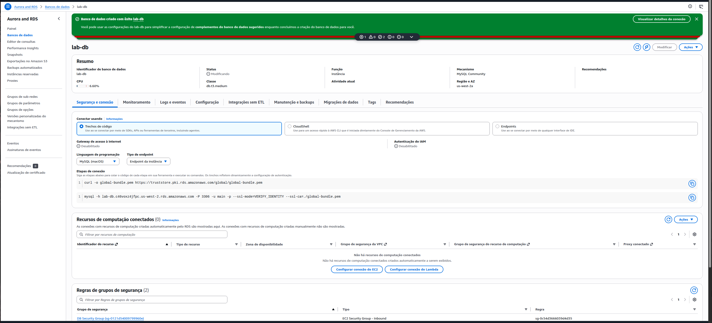
*Instância lab-db criada com sucesso — status "Modificando", endpoint já disponível para conexão*

**Configurações da instância:**

| Parâmetro | Valor |
|---|---|
| Identificador | lab-db |
| Mecanismo | MySQL Community |
| Versão | Mais recente disponível |
| Modelo | Dev/Test |
| Disponibilidade | Multi-AZ (2 instâncias) |
| Classe | db.t3.medium |
| Armazenamento | General Purpose SSD |
| Usuário principal | main |
| Banco inicial | lab |
| VPC | Lab VPC |
| Grupo de segurança | DB Security Group |

> **Obs.:** O backup automatizado foi desabilitado apenas para agilizar o laboratório. Em ambientes de produção, esta configuração deve estar sempre ativa.

---

### Tarefa 4: Conectar o Aplicativo Web ao Banco de Dados

Com a instância disponível, acessei o aplicativo web rodando no Web Server via IP público e configurei a conexão com o RDS usando o endpoint gerado.

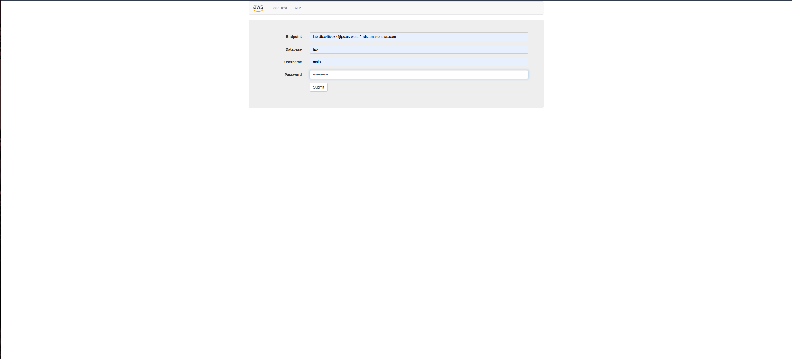
*Aplicativo web com endpoint, banco de dados, usuário e senha configurados*

**Configurações de conexão:**
- **Endpoint:** `lab-db.c46voxz4jfpc.us-west-2.rds.amazonaws.com`
- **Database:** `lab`
- **Username:** `main`
- **Password:** `lab-password`

Após enviar o formulário, o aplicativo conectou-se com sucesso ao banco de dados e exibiu um **Address Book (Catálogo de Endereços)** funcional, com operações de adicionar, editar e remover contatos — todos persistidos no RDS e replicados automaticamente para a instância secundária na outra AZ.

## 🔐 Conceitos-Chave Aprendidos

### Multi-AZ no Amazon RDS

O Amazon RDS com implantação Multi-AZ cria automaticamente uma instância primária e uma instância em espera (*standby*) em Zonas de Disponibilidade distintas. A replicação é **síncrona** — cada write na primária é confirmado somente após ser persistido na standby — garantindo durabilidade dos dados mesmo em caso de falha de infraestrutura.

```
AZ A (us-west-2a)          AZ B (us-west-2b)
┌─────────────────┐         ┌─────────────────┐
│  RDS Primary    │ ──────► │  RDS Standby    │
│  (gravação/     │  sync   │  (sem endpoint  │
│   leitura)      │  replic │   público)      │
└─────────────────┘         └─────────────────┘
```

### Grupos de Segurança como Firewall de Camada de Rede

Em vez de liberar o banco de dados para um IP ou CIDR, a regra aponta para o **ID do Web Security Group** como origem. Isso significa que qualquer instância EC2 associada ao Web Security Group pode acessar o banco — e nenhuma outra. Essa abordagem é mais segura e escalável do que controlar por endereços IP fixos.

### Estrutura de Sub-redes Pública/Privada

| Camada | Sub-rede | Acesso externo |
|---|---|---|
| Aplicação (Web Server) | Pública | Sim (via Internet Gateway) |
| Banco de Dados (RDS) | Privada | Não — só via security group interno |

Manter o banco de dados em sub-redes **privadas** é uma prática essencial de segurança: ele nunca é exposto diretamente à internet.

## 💡 Principais Aprendizados

1. **Isolamento de rede é fundamental** — O banco de dados em sub-rede privada, acessível apenas pelo web server via security group, reduz drasticamente a superfície de ataque.

2. **Multi-AZ é diferente de Read Replica** — Multi-AZ serve para *alta disponibilidade e failover automático*; Read Replicas servem para *escalar leituras*. São propósitos distintos.

3. **Grupos de sub-redes são pré-requisito** — O RDS exige um DB Subnet Group com sub-redes em pelo menos 2 AZs antes de criar qualquer instância Multi-AZ.

4. **O endpoint não muda no failover** — Em caso de falha, o RDS promove a standby automaticamente e o DNS do endpoint aponta para a nova primária sem alteração de configuração no aplicativo.

5. **Backups automatizados são essenciais em produção** — Desabilitados apenas para agilizar o lab; em produção, garantem recuperação point-in-time (PITR).

## 🚀 Como Reproduzir este Lab

### Pré-requisitos
- Acesso ao AWS Academy Lab
- Navegador web (Chrome, Firefox ou Edge)
- Conhecimento básico de VPC e EC2

### Resumo do Passo a Passo

1. **VPC → Grupos de Segurança** — Criar `DB Security Group` com regra de entrada MySQL (3306) do Web Security Group
2. **RDS → Grupos de Sub-redes** — Criar `DB Subnet Group` com Private Subnet 1 (10.0.1.0/24) e Private Subnet 2 (10.0.3.0/24)
3. **RDS → Criar banco de dados** — MySQL, Dev/Test, Multi-AZ, db.t3.medium, usuário `main`, banco `lab`, Lab VPC, DB Security Group
4. **Aguardar o status ficar "Disponível"** e copiar o endpoint
5. **Acessar o Web Server** pelo IP público e configurar a conexão RDS com endpoint + credenciais
6. **Testar o Address Book** — adicionar, editar e remover contatos para validar a persistência

## 📊 Resultados

| Métrica | Valor |
|---|---|
| Grupos de segurança criados | 1 |
| Grupos de sub-redes criados | 1 |
| Instâncias RDS provisionadas | 1 (Multi-AZ = 2 instâncias físicas) |
| Zonas de Disponibilidade utilizadas | 2 |
| Aplicativo conectado com sucesso | ✅ |
| Operações de CRUD testadas | ✅ |

## 📚 Recursos Adicionais

- [Documentação Oficial Amazon RDS](https://docs.aws.amazon.com/rds/latest/userguide/)
- [Multi-AZ no RDS](https://docs.aws.amazon.com/AmazonRDS/latest/UserGuide/Concepts.MultiAZ.html)
- [Grupos de Segurança para RDS](https://docs.aws.amazon.com/AmazonRDS/latest/UserGuide/Overview.RDSSecurityGroups.html)
- [AWS Academy](https://aws.amazon.com/training/awsacademy/)

## 🏆 Certificações Relacionadas

Este laboratório contribui para a preparação das seguintes certificações:

- **AWS Certified Cloud Practitioner**
- **AWS Certified Solutions Architect - Associate**
- **AWS Certified Database - Specialty**

## 👨‍💻 Autor

**Matheus Lima**

Estudante — Escola da Nuvem | Programa Re/Start AWS

---

## 📄 Licença

Este projeto é parte do Programa Re/Start AWS e está disponível para fins de estudo e portfólio.

---

<div align="center">

[](https://aws.amazon.com/training/awsacademy/)
[](https://aws.amazon.com/rds/)
[](https://www.mysql.com/)

</div>
