# Lab AWS - Criando um Website no Amazon S3

## 📋 Sobre o Lab

Este laboratório faz parte do **Programa Re/Start AWS** através da **Escola da Nuvem**, focado em práticas de hospedagem de conteúdo estático e gerenciamento de identidades na nuvem com Amazon S3 e IAM.

## 🎯 Objetivos

Ao concluir este laboratório, pratiquei:

- ✅ Configurar a AWS CLI em uma instância Amazon EC2
- ✅ Criar um bucket Amazon S3 via AWS CLI
- ✅ Criar um usuário IAM com acesso completo ao Amazon S3
- ✅ Ajustar permissões do bucket para acesso público
- ✅ Fazer upload de um website estático para o S3 via AWS CLI
- ✅ Criar um script bash para automatizar atualizações do website

## 🏗️ Arquitetura do Lab

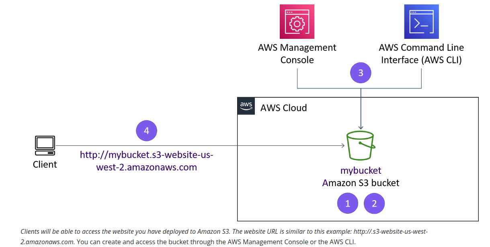
*Fluxo do lab: Console e CLI gerenciam o bucket S3, que serve o website estático diretamente ao cliente via endpoint público*

### Infraestrutura Utilizada

| Componente | Detalhes |
|---|---|
| Instância EC2 | Amazon Linux — acesso via SSM Session Manager |
| Bucket S3 | `ishaher256` — região `us-west-2` |
| Usuário IAM | `awsS3user` — política `AmazonS3FullAccess` |
| Hospedagem | S3 Static Website Hosting |
| Endpoint | `http://ishaher256.s3-website-us-west-2.amazonaws.com` |

O fluxo do lab parte de uma instância EC2 já em execução. Por meio da AWS CLI, foram criados o bucket S3 e o usuário IAM, o conteúdo do website foi enviado ao bucket e o acesso público foi habilitado para servir o site estático diretamente pelo S3.

```
EC2 (ec2-user)
    │
    ├── aws configure (credenciais do lab)
    │
    ├── aws s3api create-bucket ──► Bucket S3 (ishaher256)
    │                                    │
    ├── aws iam create-user ──────► awsS3user
    │   aws iam attach-user-policy       │
    │                                    │
    └── aws s3 cp (arquivos) ───────────► Static Website Hosting
                                         └── index.html / css / images
```

## 🔧 Tecnologias e Serviços Utilizados

- **Amazon S3** — Armazenamento de objetos e hospedagem de website estático
- **AWS IAM** — Criação de usuário e gerenciamento de políticas de acesso
- **AWS CLI** — Interface de linha de comando para interagir com os serviços AWS
- **Amazon EC2** — Instância Linux usada como ambiente de trabalho
- **AWS Systems Manager (SSM)** — Acesso à instância sem SSH direto
- **Bash Script** — Automação do processo de deploy

## 📝 Etapas Realizadas

### Tarefa 1 e 2: Conectar à EC2 e Configurar a AWS CLI

O acesso à instância foi feito via **SSM Session Manager**, sem necessidade de par de chaves SSH. Após conectar, mudei para o usuário `ec2-user` e configurei as credenciais da AWS CLI com as chaves do lab.

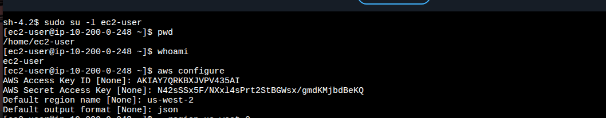
*Troca para ec2-user e configuração da AWS CLI com AccessKey, SecretKey e região us-west-2*

**Comandos executados:**
```bash
sudo su -l ec2-user
aws configure
# AWS Access Key ID: <AccessKey do painel>
# AWS Secret Access Key: <SecretKey do painel>
# Default region name: us-west-2
# Default output format: json
```

---

### Tarefa 3: Criar o Bucket S3 via AWS CLI

Criei o bucket com um nome único (`ishaher256`) na região `us-west-2`. O parâmetro `--create-bucket-configuration LocationConstraint` é obrigatório para buckets fora de `us-east-1`.

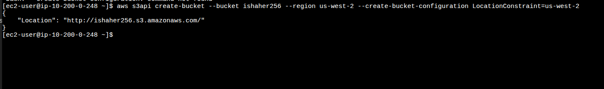
*Comando `aws s3api create-bucket` com retorno JSON confirmando a criação do bucket `ishaher256`*

**Comando executado:**
```bash
aws s3api create-bucket \
  --bucket ishaher256 \
  --region us-west-2 \
  --create-bucket-configuration LocationConstraint=us-west-2
```

**Retorno esperado:**
```json
{
    "Location": "http://ishaher256.s3.amazonaws.com/"
}
```

---

### Tarefa 4: Criar Usuário IAM com Acesso Completo ao S3

Criei o usuário `awsS3user`, defini sua senha de console e, após identificar a política correta via `aws iam list-policies`, anexei a política `AmazonS3FullAccess` ao usuário.

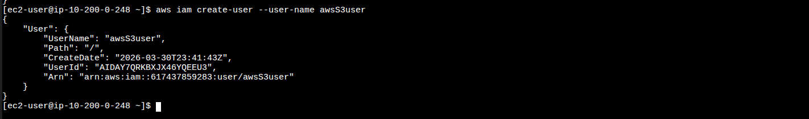
*Comando `aws iam create-user` com retorno JSON mostrando ARN e ID do novo usuário `awsS3user`*

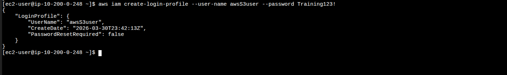
*Comando `aws iam create-login-profile` definindo senha de acesso ao Console para o `awsS3user`*

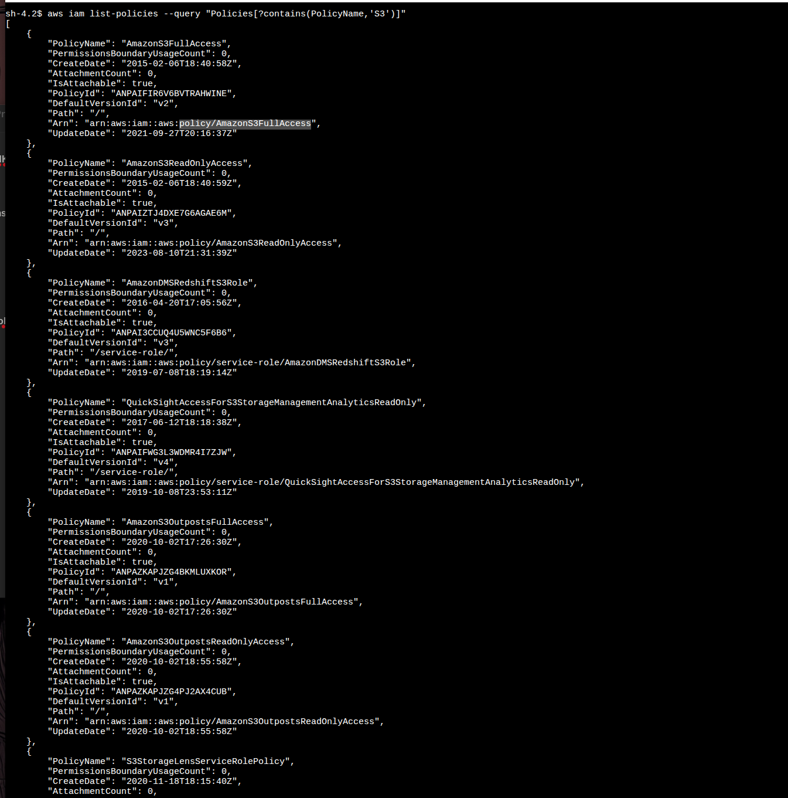
*Resultado do `aws iam list-policies` filtrando por políticas com "S3" no nome — destaque para `AmazonS3FullAccess`*

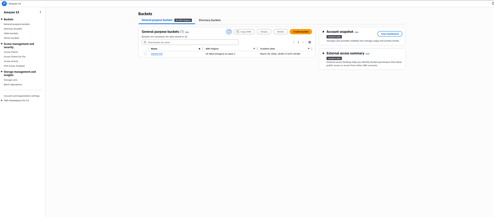
*Execução do `aws iam attach-user-policy` com a política `AmazonS3FullAccess` — saída vazia indica sucesso*

**Comandos executados:**
```bash
aws iam create-user --user-name awsS3user

aws iam create-login-profile \
  --user-name awsS3user \
  --password Training123!

aws iam list-policies --query "Policies[?contains(PolicyName,'S3')]"

aws iam attach-user-policy \
  --policy-arn arn:aws:iam::aws:policy/AmazonS3FullAccess \
  --user-name awsS3user
```

> **Obs.:** Ao tentar executar o `attach-user-policy` como a role da instância EC2 (`LinuxInstanceRole`), o comando retornou `AccessDenied`. A solução foi reconfigurar o `aws configure` com as credenciais do usuário `awsstudent` fornecidas pelo painel do lab, que possuem permissões IAM adequadas.

---

### Tarefa 5: Ajustar Permissões do Bucket S3

Para que o website seja acessível publicamente, desabilitei o bloqueio de acesso público do bucket e habilitei as ACLs.

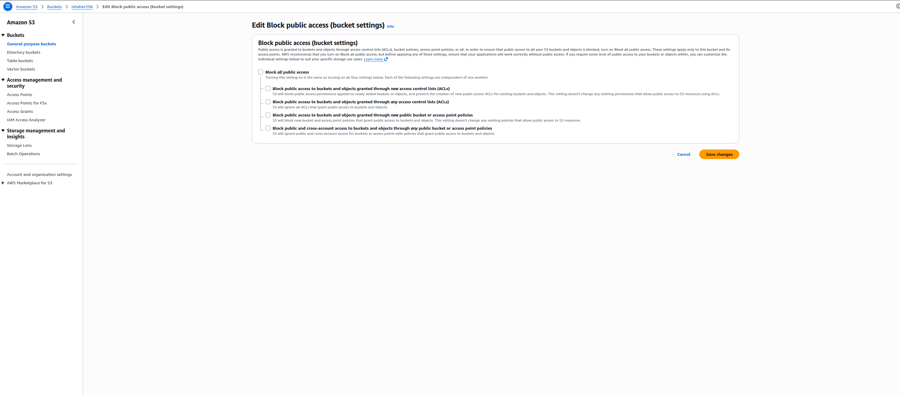
*Bucket `ishaher256` listado no console do Amazon S3 na região us-west-2*

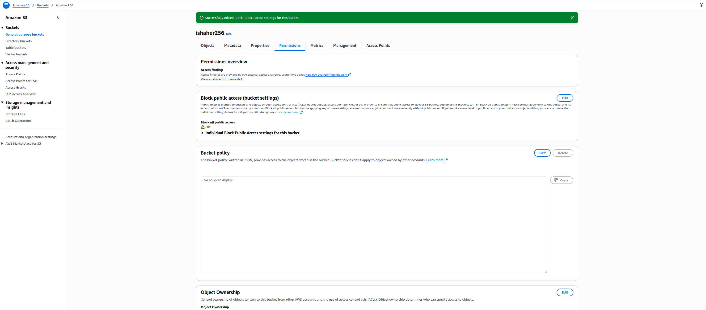
*Tela de edição de "Block public access" com todas as opções desmarcadas*

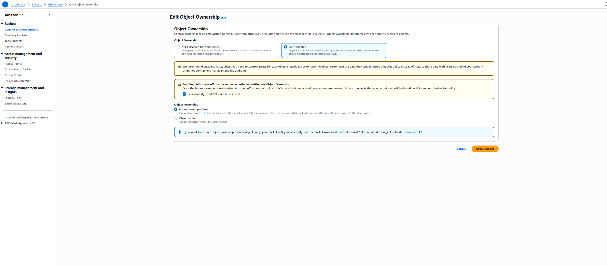
*Confirmação de que "Block all public access" está desligado (Off) na aba Permissions*

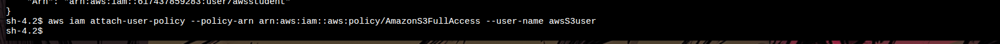
*Configuração de Object Ownership com "ACLs enabled" selecionado e confirmação do aviso*

---

### Tarefa 6: Extrair os Arquivos do Website

Voltei ao terminal como `ec2-user` e extraí o arquivo compactado com os arquivos do website estático.

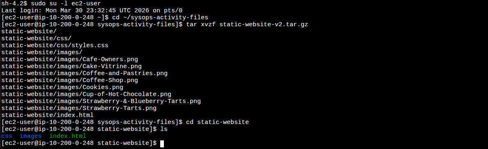
*Extração do `static-website-v2.tar.gz` listando os arquivos: `index.html`, diretório `css` e diretório `images`*

**Comandos executados:**
```bash
sudo su -l ec2-user
cd ~/sysops-activity-files
tar xvzf static-website-v2.tar.gz
cd static-website
ls
```

---

### Tarefa 7: Upload dos Arquivos para o S3 e Verificação do Website

Configurei o bucket como website estático, fiz o upload de todos os arquivos com ACL `public-read` e verifiquei o endpoint gerado.

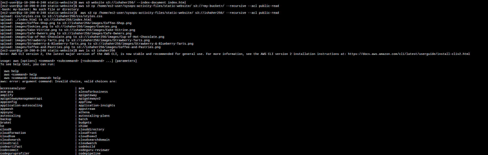
*Saída do `aws s3 cp` confirmando o upload de `index.html`, `styles.css` e todas as imagens para o bucket*

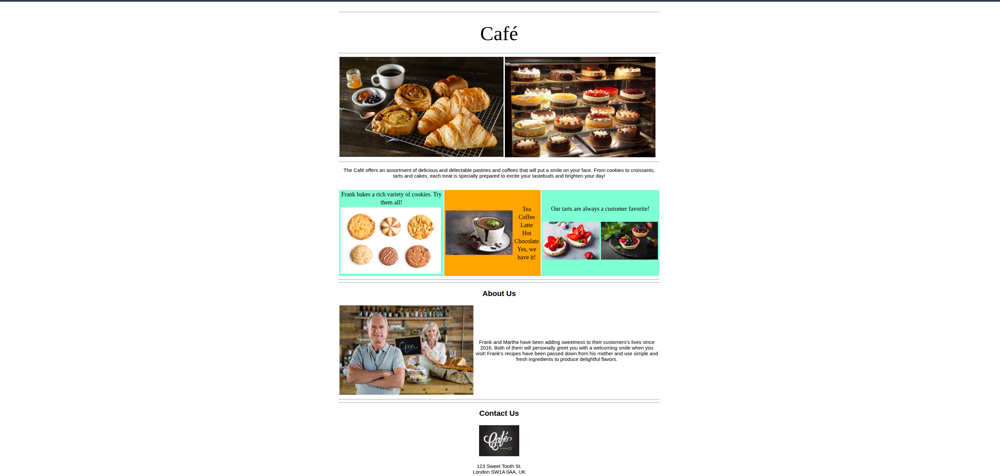
*Aba Properties do bucket mostrando "Static website hosting: Enabled" com o endpoint público do site*

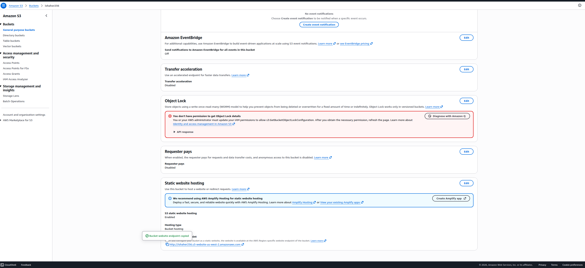
*Website do Café & Bakery acessível publicamente via endpoint do S3 — cores originais (aquamarine/orange)*

**Comandos executados:**
```bash
aws s3 website s3://ishaher256/ --index-document index.html

aws s3 cp /home/ec2-user/sysops-activity-files/static-website/ \
  s3://ishaher256/ \
  --recursive \
  --acl public-read

aws s3 ls s3://ishaher256
```

---

### Tarefa 8: Criar Script de Atualização Automática

Criei o arquivo `update-website.sh` com o comando de upload, alterei as cores do `index.html` e rodei o script para validar o deploy automatizado.

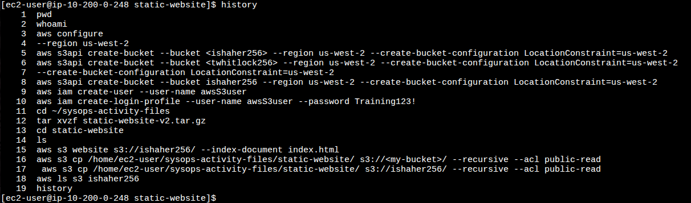
*Saída do `history` com todos os comandos executados no lab — linha 17 usada no script*

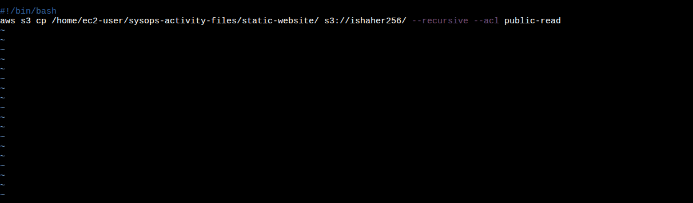
*Conteúdo do `update-website.sh` aberto no VI com `#!/bin/bash` e o comando `aws s3 cp`*

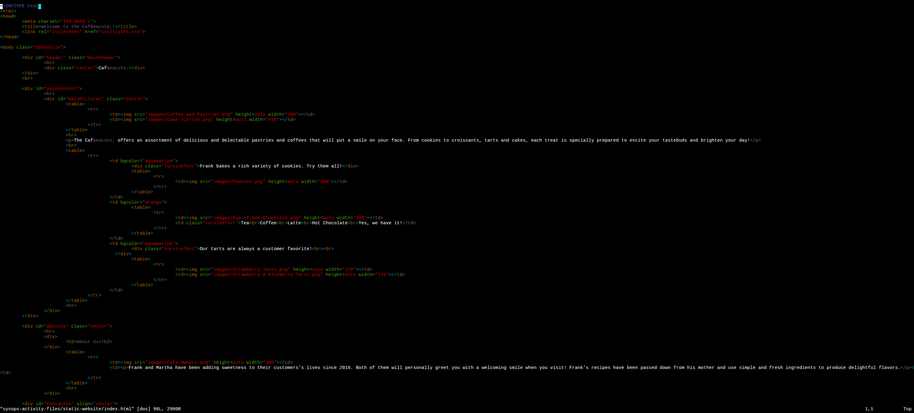
*Arquivo `index.html` aberto no VI para alterar as cores bgcolor de aquamarine/orange para gainsboro/cornsilk*

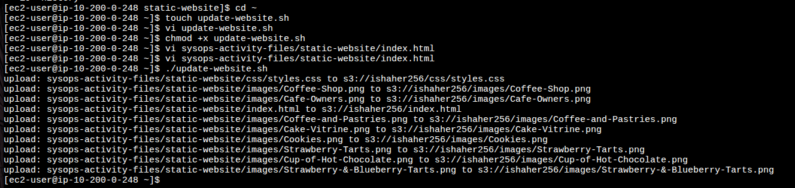
*Saída do `./update-website.sh` confirmando o upload de todos os arquivos atualizados para o S3*

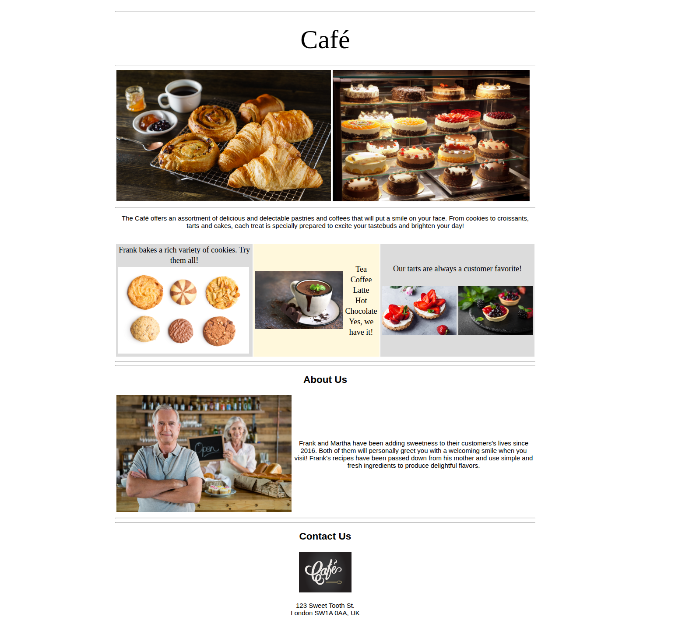
*Website do Café & Bakery com as cores atualizadas (gainsboro/cornsilk) após execução do script*

**Comandos executados:**
```bash
cd ~
touch update-website.sh
vi update-website.sh
# conteúdo:
# #!/bin/bash
# aws s3 cp /home/ec2-user/sysops-activity-files/static-website/ s3://ishaher256/ --recursive --acl public-read

chmod +x update-website.sh

vi sysops-activity-files/static-website/index.html
# Alterações:
# bgcolor="aquamarine" → bgcolor="gainsboro" (2 ocorrências)
# bgcolor="orange"     → bgcolor="cornsilk"

./update-website.sh
```

## 🔐 Conceitos-Chave Aprendidos

### S3 Static Website Hosting

O Amazon S3 permite hospedar websites estáticos diretamente em um bucket, sem necessidade de servidor web. O comando `aws s3 website` habilita essa funcionalidade e define o documento de índice. O endpoint gerado segue o padrão:

```
http://<bucket-name>.s3-website-<region>.amazonaws.com
```

### ACLs vs. Bucket Policy

Para que os arquivos sejam acessíveis publicamente, é necessário tanto desabilitar o **Block Public Access** quanto habilitar as **ACLs**. O parâmetro `--acl public-read` no comando de upload define a permissão de leitura pública para cada objeto individualmente.

| Mecanismo | Escopo | Usado neste lab |
|---|---|---|
| Block Public Access | Bloqueio geral do bucket | Desabilitado ✅ |
| ACL (Object) | Permissão por objeto | `public-read` no upload ✅ |
| Bucket Policy | Permissão via JSON policy | Não utilizado |

### IAM — Princípio do Menor Privilégio com Políticas Gerenciadas

Em vez de criar permissões manualmente, o lab utiliza uma **AWS Managed Policy** (`AmazonS3FullAccess`), identificada via `aws iam list-policies`. Isso garante que o usuário tenha exatamente as permissões necessárias para o serviço, sem excesso.

### Credenciais vs. Instance Role

A instância EC2 possui uma **IAM Role** (`LinuxInstanceRole`) associada, que é usada por padrão quando não há credenciais configuradas. Essa role não tinha permissão para operações IAM. Ao executar `aws configure` com as credenciais do usuário `awsstudent`, as operações IAM passaram a funcionar corretamente.

```
Sem aws configure:
  EC2 usa → LinuxInstanceRole → sem permissão para iam:AttachUserPolicy ❌

Com aws configure (awsstudent):
  EC2 usa → awsstudent credentials → permissão IAM concedida ✅
```

### Script Bash para Deploy Automatizado

A criação do `update-website.sh` introduz o conceito de **infraestrutura como script**: qualquer alteração local nos arquivos do site pode ser publicada com um único comando `./update-website.sh`, garantindo consistência e repetibilidade no processo de deploy.

## 💡 Principais Aprendizados

1. **`aws configure` sobrescreve a Instance Role** — Quando há credenciais salvas via `aws configure`, a CLI as prioriza em relação à role da instância EC2. Isso é importante para entender o comportamento de autenticação em diferentes cenários.

2. **Usuário errado gera caminhos errados** — Comandos como `cd ~/sysops-activity-files` dependem do `$HOME` do usuário atual. Rodar como `ssm-user` em vez de `ec2-user` aponta para diretórios inexistentes. Sempre confirmar com `whoami` e `pwd`.

3. **Block Public Access tem precedência sobre ACLs** — Mesmo com `--acl public-read` no upload, os objetos não são acessíveis se o Block Public Access estiver ativo. As duas configurações precisam estar alinhadas.

4. **Silêncio = sucesso na AWS CLI** — Comandos como `attach-user-policy` e `chmod` não retornam saída em caso de sucesso. A ausência de mensagem de erro é a confirmação.

5. **`aws s3 cp --recursive` vs. `aws s3 sync`** — O `cp --recursive` envia todos os arquivos sempre. O `sync` compara o estado local com o S3 e envia apenas os arquivos modificados, sendo mais eficiente para atualizações incrementais.

## 🚀 Como Reproduzir este Lab

### Pré-requisitos
- Acesso ao AWS Academy Lab
- Navegador web (Chrome, Firefox ou Edge)
- Conhecimento básico de terminal Linux e AWS CLI

### Resumo do Passo a Passo

1. **SSM → EC2** — Acessar a instância via InstanceSessionUrl e trocar para `ec2-user`
2. **`aws configure`** — Configurar credenciais (AccessKey, SecretKey, região `us-west-2`, formato `json`)
3. **Criar bucket** — `aws s3api create-bucket` com nome único e `LocationConstraint=us-west-2`
4. **Criar usuário IAM** — `aws iam create-user`, `create-login-profile`, `attach-user-policy` com `AmazonS3FullAccess`
5. **Ajustar permissões** — Desabilitar Block Public Access e habilitar ACLs no Console S3
6. **Extrair arquivos** — `tar xvzf static-website-v2.tar.gz` em `~/sysops-activity-files`
7. **Habilitar website** — `aws s3 website s3://<bucket>/ --index-document index.html`
8. **Upload** — `aws s3 cp ... --recursive --acl public-read`
9. **Criar script** — `update-website.sh` com o comando de upload, `chmod +x`
10. **Testar** — Editar `index.html`, rodar `./update-website.sh` e verificar as mudanças no site

## 📊 Resultados

| Métrica | Valor |
|---|---|
| Bucket S3 criado | 1 (`ishaher256`, us-west-2) |
| Usuário IAM criado | 1 (`awsS3user`) |
| Política IAM anexada | `AmazonS3FullAccess` |
| Arquivos enviados ao S3 | 11 (index.html + css + imagens) |
| Website publicado com sucesso | ✅ |
| Script de deploy criado | ✅ (`update-website.sh`) |
| Atualização via script validada | ✅ |

## 📚 Recursos Adicionais

- [Documentação Amazon S3](https://docs.aws.amazon.com/s3/)
- [Hospedagem de Website Estático no S3](https://docs.aws.amazon.com/AmazonS3/latest/userguide/WebsiteHosting.html)
- [AWS CLI — Referência S3](https://awscli.amazonaws.com/v2/documentation/api/latest/reference/s3/index.html)
- [AWS CLI — Referência IAM](https://awscli.amazonaws.com/v2/documentation/api/latest/reference/iam/index.html)
- [AWS Academy](https://aws.amazon.com/training/awsacademy/)

## 🏆 Certificações Relacionadas

Este laboratório contribui para a preparação das seguintes certificações:

- **AWS Certified Cloud Practitioner**
- **AWS Certified Solutions Architect - Associate**
- **AWS Certified SysOps Administrator - Associate**

## 👨‍💻 Autor

**Matheus Lima**

Estudante — Escola da Nuvem | Programa Re/Start AWS

---

## 📄 Licença

Este projeto é parte do Programa Re/Start AWS e está disponível para fins de estudo e portfólio.

---

<div align="center">

[](https://aws.amazon.com/training/awsacademy/)
[](https://aws.amazon.com/s3/)
[](https://aws.amazon.com/iam/)
[](https://aws.amazon.com/cli/)

</div>
