# Lab AWS - Criação de VPC e Servidor Web

## 📋 Sobre o Lab

Este laboratório faz parte do programa **AWS re/Start** através da **Escola da Nuvem**, focado na construção de uma infraestrutura de rede completa na AWS usando VPC (Virtual Private Cloud) e lançamento de um servidor web em EC2.

## 🎯 Objetivos

Ao concluir este laboratório, pratiquei:

- ✅ Criar uma VPC (Virtual Private Cloud) personalizada
- ✅ Configurar sub-redes públicas e privadas em múltiplas Availability Zones
- ✅ Configurar tabelas de rota e gateways (Internet Gateway e NAT Gateway)
- ✅ Criar e configurar Security Groups como firewall virtual
- ✅ Lançar uma instância EC2 com servidor web Apache
- ✅ Implementar arquitetura de alta disponibilidade

## 🏗️ Arquitetura Implementada

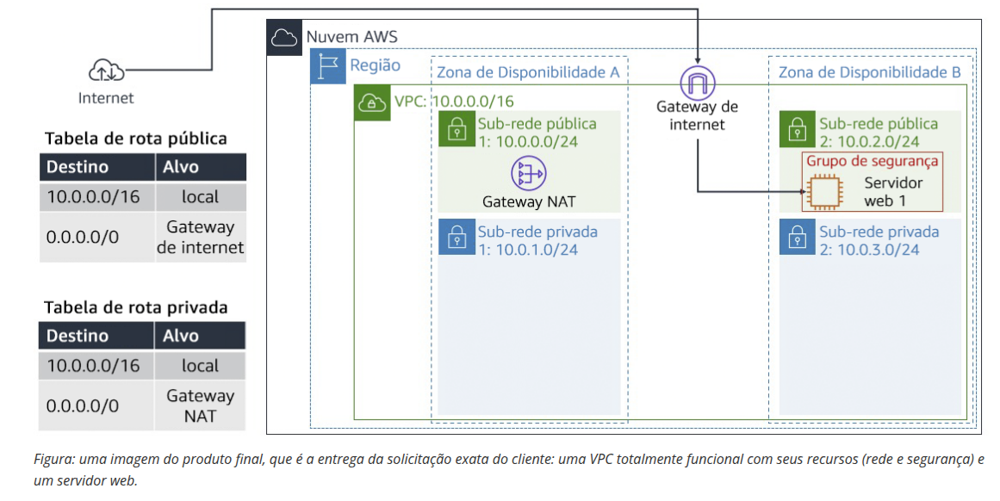

### Componentes da Arquitetura:

- **VPC:** 10.0.0.0/16
- **Sub-redes Públicas:** 
  - Public Subnet 1: 10.0.0.0/24 (us-west-2a)
  - Public Subnet 2: 10.0.2.0/24 (us-west-2b)
- **Sub-redes Privadas:**
  - Private Subnet 1: 10.0.1.0/24 (us-west-2a)
  - Private Subnet 2: 10.0.3.0/24 (us-west-2b)
- **Internet Gateway:** Para comunicação com a internet
- **NAT Gateway:** Para conectividade de instâncias privadas
- **Security Group:** Regras de firewall para HTTP (porta 80)
- **Instância EC2:** Servidor web rodando Apache

## 🔧 Tecnologias e Serviços Utilizados

- **Amazon VPC** - Rede virtual isolada
- **Amazon EC2** - Instância t3.micro com Amazon Linux 2
- **Security Groups** - Firewall em nível de instância
- **Internet Gateway** - Conexão com internet pública
- **NAT Gateway** - Acesso à internet para recursos privados
- **Route Tables** - Roteamento de tráfego de rede

## 📝 Etapas Realizadas

### Tarefa 1: Criação da VPC

Utilizei o assistente de VPC para criar toda a infraestrutura de rede de forma automatizada:

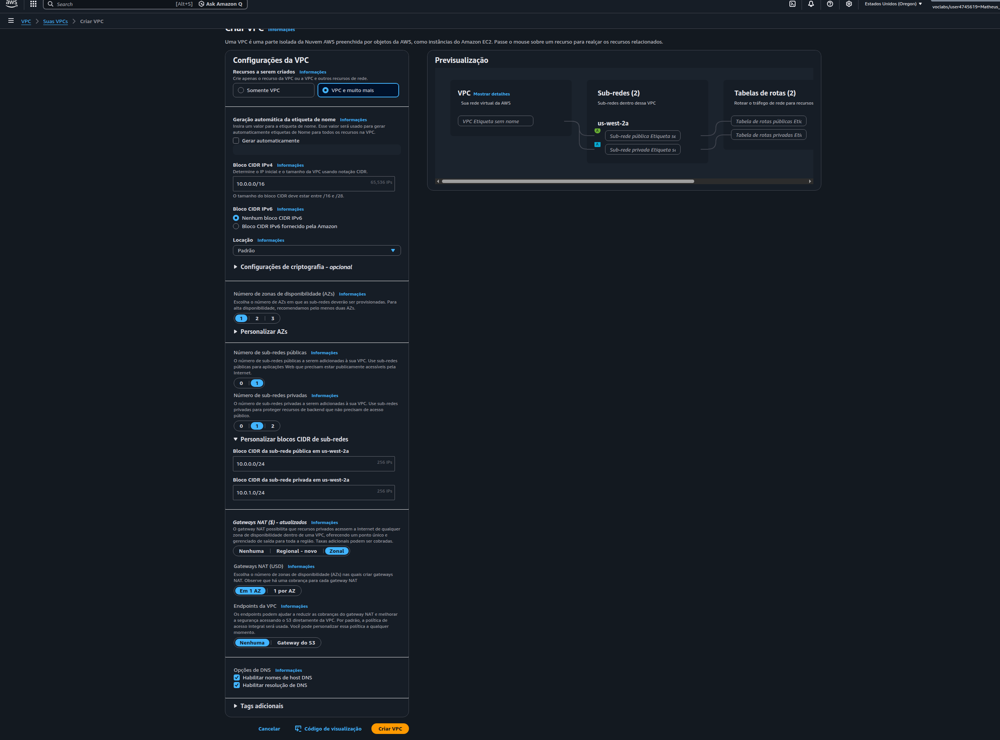

**Configurações aplicadas:**
- **Recursos criados:** VPC e muito mais (wizard completo)
- **CIDR IPv4:** 10.0.0.0/16
- **Tenancy:** Default (uso compartilhado de hardware)
- **Número de AZs:** 1 (posteriormente expandido para 2)
- **Sub-redes públicas:** 1
- **Sub-redes privadas:** 1
- **NAT Gateway:** Em 1 AZ
- **VPC Endpoints:** Nenhum

**Recursos nomeados:**
- VPC: `Lab VPC`
- Sub-rede pública: `Public Subnet 1`
- Sub-rede privada: `Private Subnet 1`
- Tabela de rota pública: `Public Route Table`
- Tabela de rota privada: `Private Route Table`

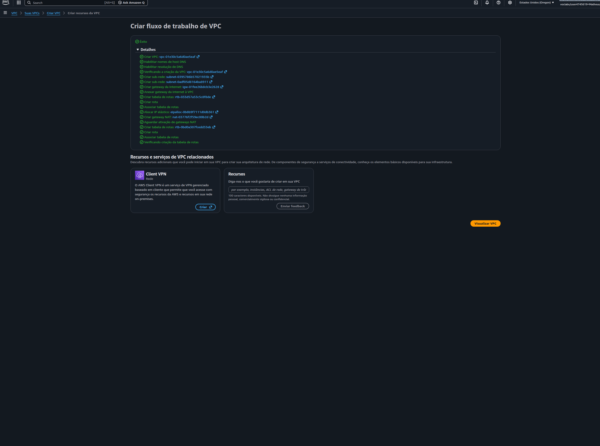
*Visualização do fluxo de trabalho mostrando todos os recursos criados automaticamente*

### Tarefa 2: Criação de Sub-redes Adicionais

Para garantir **alta disponibilidade**, criei sub-redes adicionais em uma segunda Availability Zone:

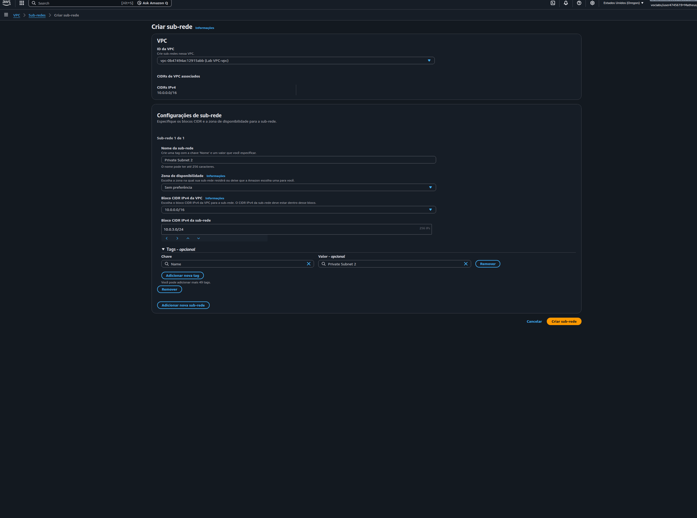

**Public Subnet 2:**
- **CIDR:** 10.0.2.0/24
- **AZ:** us-west-2b (sem preferência específica)
- **Endereços:** 10.0.2.x

**Private Subnet 2:**
- **CIDR:** 10.0.3.0/24
- **AZ:** us-west-2b (sem preferência específica)
- **Endereços:** 10.0.3.x

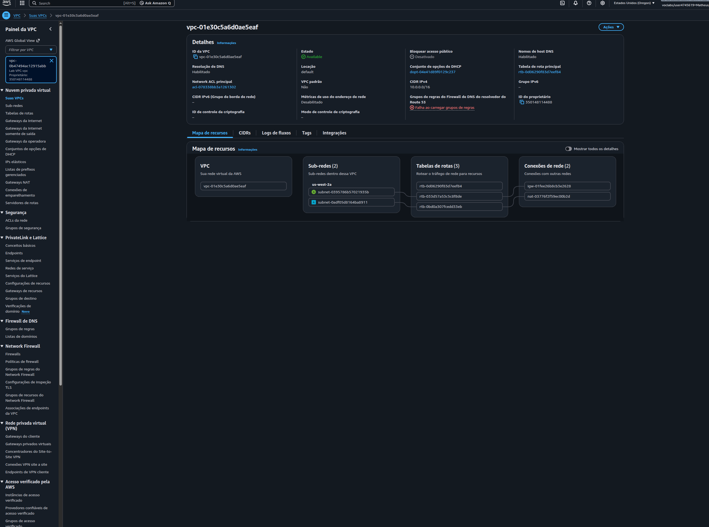
*Visualização gráfica dos recursos da VPC e suas conexões*

### Tarefa 3: Configuração de Tabelas de Rota

Associei as novas sub-redes às tabelas de rota apropriadas:

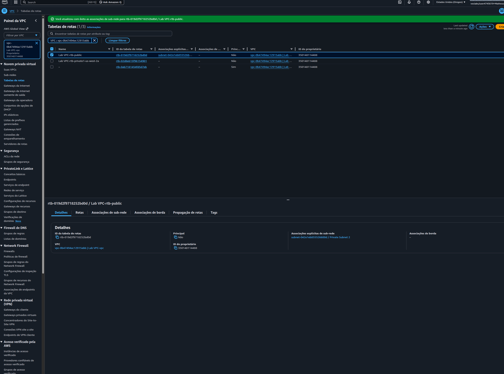

**Tabela de Rota Pública:**
- Associada: Public Subnet 1 e Public Subnet 2
- Rota para internet: 0.0.0.0/0 → Internet Gateway

**Tabela de Rota Privada:**
- Associada: Private Subnet 1 e Private Subnet 2
- Rota para internet: 0.0.0.0/0 → NAT Gateway
- Tráfego local: 10.0.0.0/16 → local

**Resultado:** VPC com sub-redes públicas e privadas configuradas em **duas Zonas de Disponibilidade**, garantindo alta disponibilidade.

### Tarefa 4: Criação do Security Group

Configurei um Security Group para atuar como firewall virtual da instância EC2:

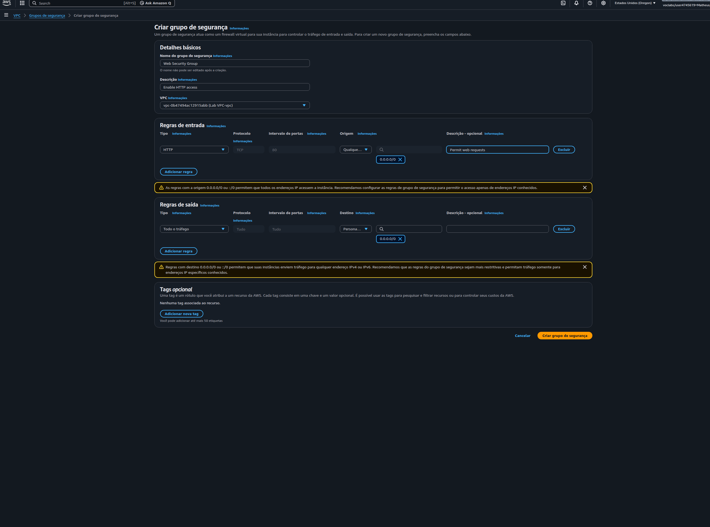

**Configurações do Security Group:**
- **Nome:** Web Security Group
- **Descrição:** Enable HTTP access
- **VPC:** Lab VPC

**Regras de Entrada (Inbound):**
- **Tipo:** HTTP (porta 80)
- **Protocolo:** TCP
- **Origem:** 0.0.0.0/0 (Anywhere-IPv4)
- **Descrição:** Permit web requests

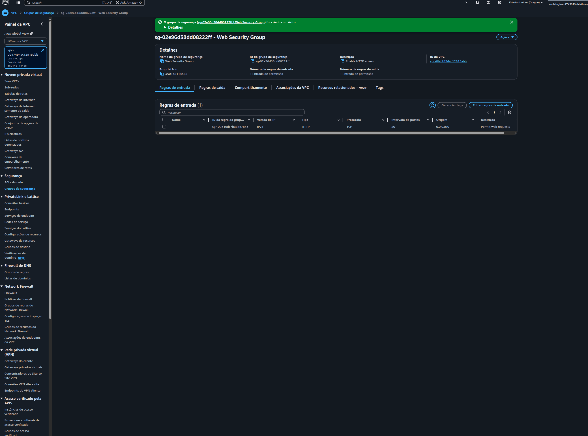
*Security Group configurado permitindo tráfego HTTP de qualquer origem*

### Tarefa 5: Lançamento da Instância EC2

Lancei uma instância EC2 configurada como servidor web Apache:

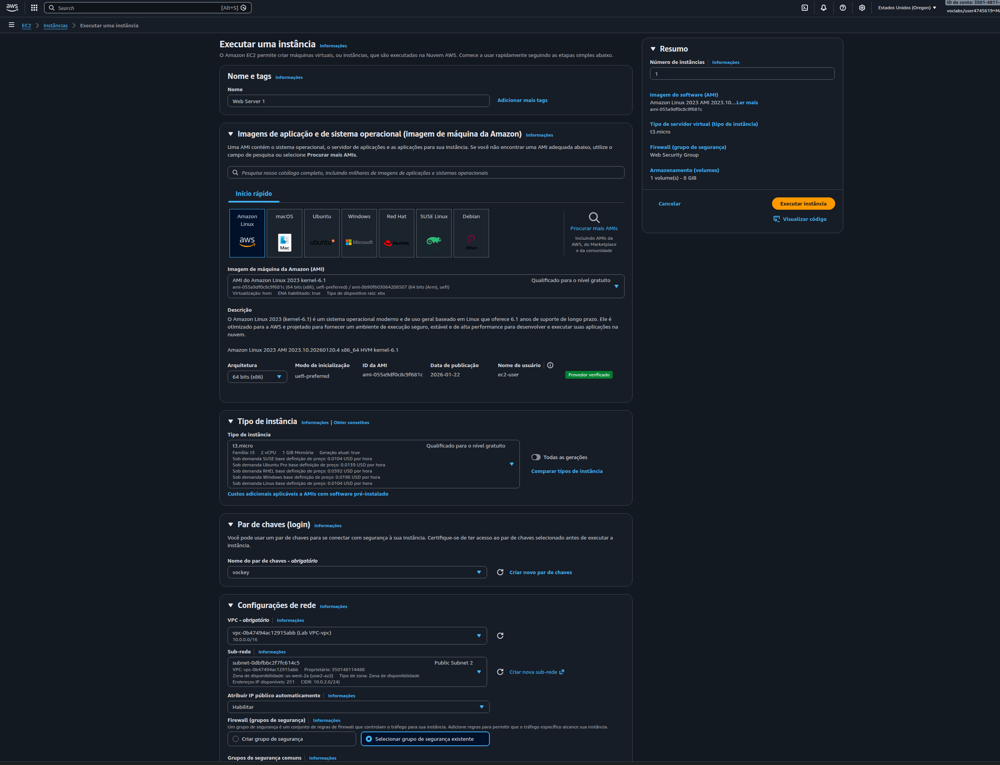

**Especificações da Instância:**
- **Nome:** Web Server 1
- **AMI:** Amazon Linux 2 AMI (HVM)
- **Tipo:** t3.micro
- **Par de chaves:** vockey
- **VPC:** Lab VPC
- **Sub-rede:** Public Subnet 1
- **IP público:** Habilitado automaticamente
- **Security Group:** Web Security Group

**Script de User Data (configuração automática):**
```bash
#!/bin/bash
# Install Apache Web Server and PHP
yum install -y httpd mysql php

# Download Lab files
wget https://aws-tc-largeobjects.s3.us-west-2.amazonaws.com/CUR-TF-100-RESTRT-1/267-lab-NF-build-vpc-web-server/s3/lab-app.zip
unzip lab-app.zip -d /var/www/html/

# Turn on web server
chkconfig httpd on
service httpd start
```

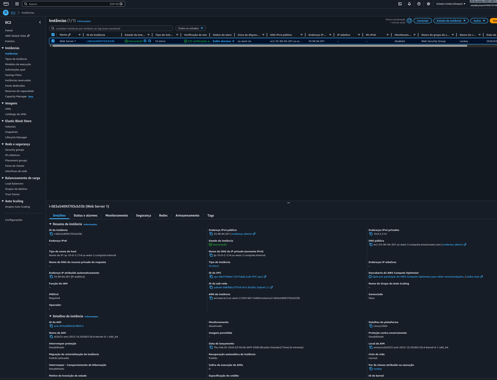
*Instância EC2 rodando com 2/2 verificações de status aprovadas*

### Resultado Final: Servidor Web Funcionando! 🎉

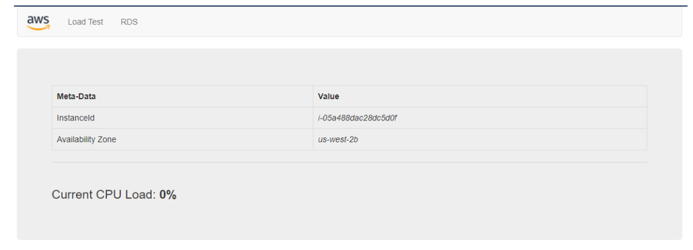
*Página web acessível publicamente confirmando o sucesso da implementação*

**Detalhes da Instância:**
- **Instance ID:** i-053a488dac28dc5d0f
- **Availability Zone:** us-west-2b
- **IP Público:** Acessível via DNS público
- **CPU Load:** 0% (servidor em estado idle)

## 🔐 Conceitos de Segurança Implementados

### Security Groups (Firewall Stateful)

```
Inbound Rules:
┌──────────┬──────────┬────────────┬─────────────────────┐
│ Protocol │ Port     │ Source     │ Description         │
├──────────┼──────────┼────────────┼─────────────────────┤
│ TCP      │ 80 (HTTP)│ 0.0.0.0/0  │ Permit web requests │
└──────────┴──────────┴────────────┴─────────────────────┘

Outbound Rules: All traffic allowed (default)
```

### Segregação de Rede

| Tipo de Sub-rede | CIDR | Uso | Acesso Internet |
|------------------|------|-----|-----------------|
| **Pública** | 10.0.0.0/24, 10.0.2.0/24 | Recursos expostos (Web Server) | Via Internet Gateway |
| **Privada** | 10.0.1.0/24, 10.0.3.0/24 | Recursos internos (DB, Apps) | Via NAT Gateway |

## 🌐 Tabelas de Roteamento

### Tabela de Rota Pública
```
Destino         Alvo
10.0.0.0/16     local
0.0.0.0/0       Internet Gateway
```

### Tabela de Rota Privada
```
Destino         Alvo
10.0.0.0/16     local
0.0.0.0/0       NAT Gateway
```

## 💡 Principais Aprendizados

1. **Planejamento de CIDR**
   - Importância de definir blocos CIDR adequados para escalabilidade
   - Subdivisão lógica de redes para diferentes propósitos

2. **Alta Disponibilidade**
   - Distribuição de recursos em múltiplas Availability Zones
   - Redundância de sub-redes públicas e privadas

3. **Segurança em Camadas**
   - Security Groups como primeira camada de defesa
   - Separação entre sub-redes públicas e privadas
   - Princípio do menor privilégio aplicado às regras de firewall

4. **Automação com User Data**
   - Provisionamento automático de servidores web
   - Redução de erros manuais e tempo de configuração

5. **Conectividade**
   - Internet Gateway para acesso público
   - NAT Gateway para permitir que recursos privados acessem a internet
   - Tabelas de rota direcionando tráfego corretamente

## 📊 Recursos Provisionados

| Recurso | Quantidade | Detalhes |
|---------|------------|----------|
| VPC | 1 | CIDR: 10.0.0.0/16 |
| Sub-redes Públicas | 2 | us-west-2a e us-west-2b |
| Sub-redes Privadas | 2 | us-west-2a e us-west-2b |
| Internet Gateway | 1 | Anexado à VPC |
| NAT Gateway | 1 | Na sub-rede pública |
| Tabelas de Rota | 2 | Pública e Privada |
| Security Groups | 1 | Web Security Group |
| Instâncias EC2 | 1 | t3.micro (Amazon Linux 2) |
| Elastic IP | 1 | Para NAT Gateway |

## 🚀 Como Reproduzir este Lab

### Pré-requisitos
- Conta AWS ativa (AWS Academy ou pessoal)
- Conhecimento básico de redes (CIDR, sub-redes)
- Familiaridade com o console AWS

### Passo a Passo Resumido

1. **Criar a VPC**
   ```
   Console → VPC → Criar VPC → VPC e muito mais
   Configure CIDR, AZs, sub-redes
   Habilite NAT Gateway
   ```

2. **Adicionar Sub-redes Extras**
   ```
   VPC → Sub-redes → Criar sub-rede
   Configure Public Subnet 2 (10.0.2.0/24)
   Configure Private Subnet 2 (10.0.3.0/24)
   ```

3. **Configurar Roteamento**
   ```
   VPC → Tabelas de rota
   Associe Public Subnet 2 → Public Route Table
   Associe Private Subnet 2 → Private Route Table
   ```

4. **Criar Security Group**
   ```
   VPC → Security Groups → Criar
   Adicione regra inbound HTTP (80) de 0.0.0.0/0
   ```

5. **Lançar Instância EC2**
   ```
   EC2 → Executar instância
   Selecione Amazon Linux 2
   Configure VPC, sub-rede pública, Security Group
   Adicione User Data script
   Aguarde 2/2 status checks
   ```

6. **Testar Acesso**
   ```
   Copie o DNS público da instância
   Acesse no navegador
   Confirme página de sucesso
   ```

## 🎯 Casos de Uso Real

Esta arquitetura é ideal para:

- **Aplicações Web de Três Camadas:** Frontend público, backend privado, banco de dados privado
- **Ambientes de Desenvolvimento/Teste:** Isolamento de recursos por ambiente
- **Microsserviços:** Segregação de serviços em sub-redes diferentes
- **Aplicações Híbridas:** Integração com datacenter on-premises via VPN

## 📚 Recursos Adicionais

- [Documentação AWS VPC](https://docs.aws.amazon.com/vpc/)
- [Best Practices VPC](https://docs.aws.amazon.com/vpc/latest/userguide/vpc-security-best-practices.html)
- [VPC Sizing and Subnetting](https://aws.amazon.com/blogs/networking-and-content-delivery/practical-vpc-design/)
- [Security Groups vs NACLs](https://docs.aws.amazon.com/vpc/latest/userguide/VPC_Security.html)
- [NAT Gateway vs NAT Instance](https://docs.aws.amazon.com/vpc/latest/userguide/vpc-nat-comparison.html)

## 🏆 Certificações Relacionadas

Este laboratório contribui para a preparação de:

- **AWS Certified Solutions Architect - Associate**
- **AWS Certified SysOps Administrator - Associate**
- **AWS Certified Advanced Networking - Specialty**

## 🔍 Troubleshooting Comum

| Problema | Causa Provável | Solução |
|----------|----------------|---------|
| Instância não acessível | Security Group bloqueando | Verificar regra HTTP na porta 80 |
| Timeout ao acessar web | IP público não atribuído | Habilitar "Auto-assign public IP" |
| User Data não executou | Script com erro | Verificar logs em /var/log/cloud-init-output.log |
| Sub-rede privada sem internet | Rota para NAT ausente | Adicionar 0.0.0.0/0 → NAT Gateway na route table |

## 👨‍💻 Autor

**Matheus Lima**  
Estudante - Escola da Nuvem  

---

## 📄 Licença

Este projeto é parte do programa educacional AWS re/Start e está disponível para fins de estudo e portfólio.

---

<div align="center">


[](https://aws.amazon.com/training/restart/)
[](https://aws.amazon.com/vpc/)
[](https://aws.amazon.com/ec2/)


</div>
