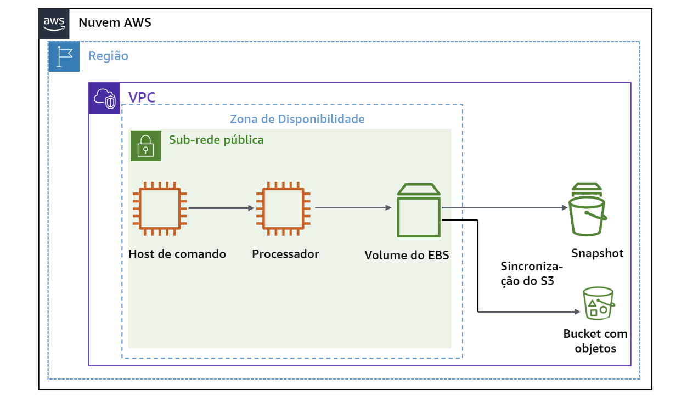
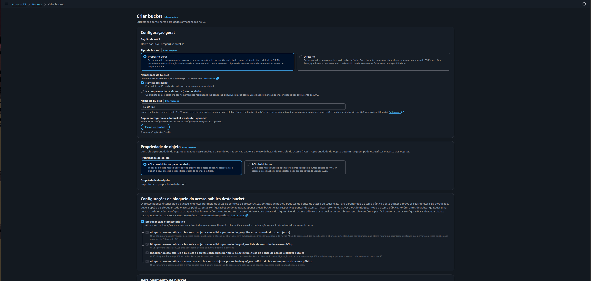
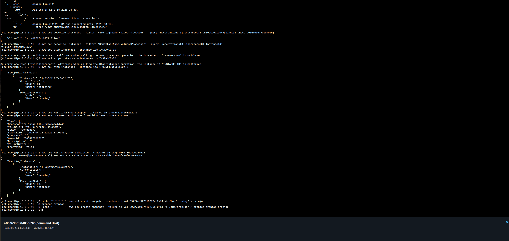
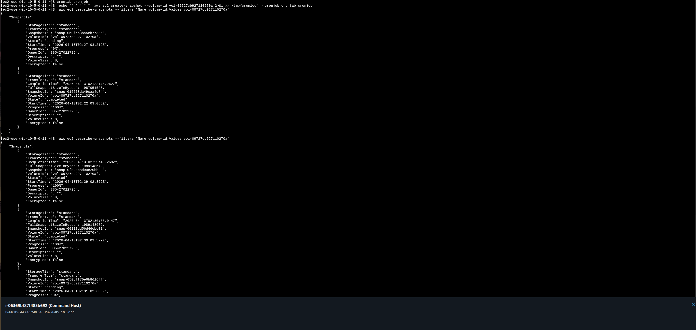
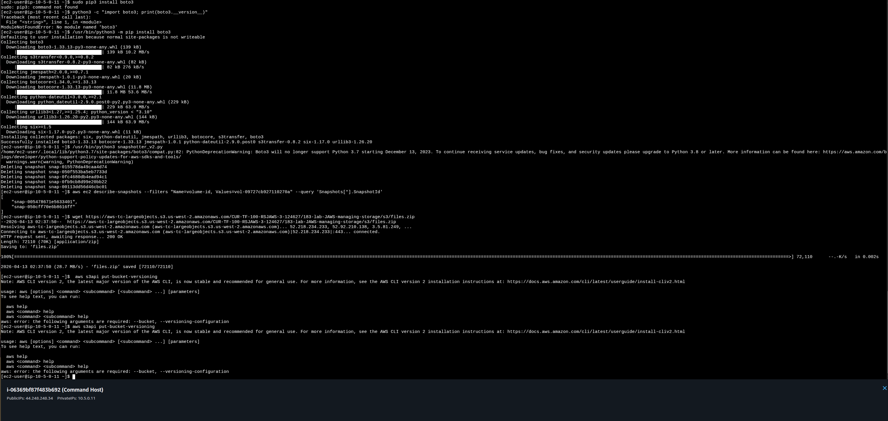
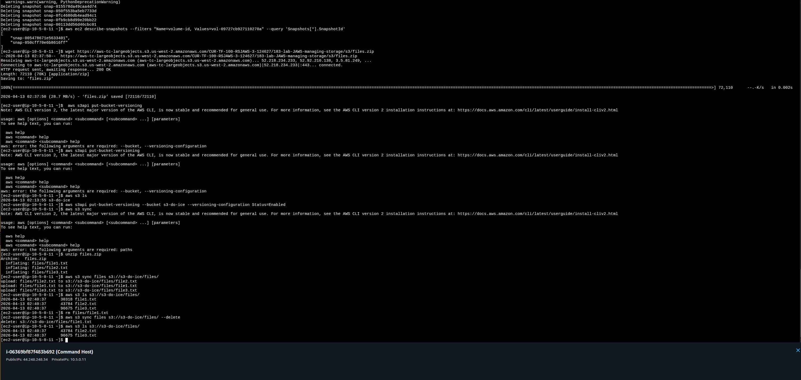
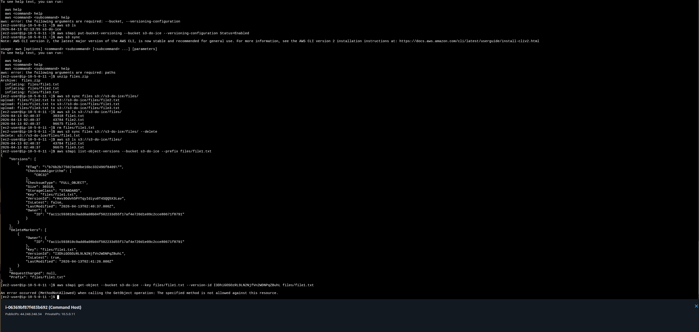
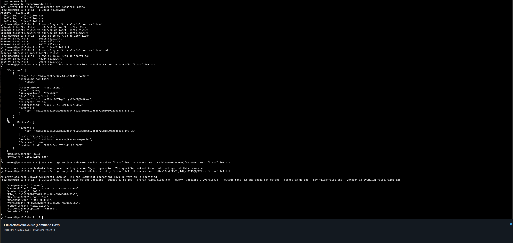
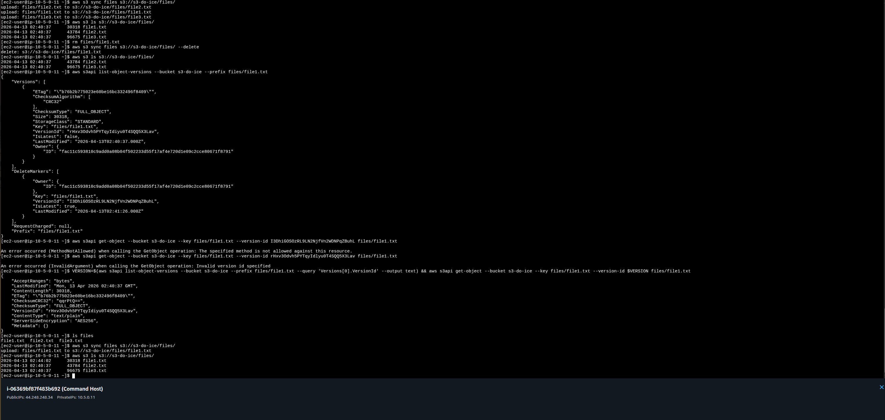

# Lab AWS — Managing Storage (EBS Snapshots + S3 Sync + Versioning)

## 📋 Sobre o Lab

Este laboratório faz parte do **Programa Re/Start AWS** através da **Escola da Nuvem**, focado em práticas de gerenciamento de armazenamento em nuvem com Amazon EBS, Amazon S3 e AWS CLI.

## 🎯 Objetivos

Ao concluir este laboratório, pratiquei:

- ✅ Criar e gerenciar snapshots de volumes Amazon EBS via AWS CLI
- ✅ Automatizar a criação de snapshots com cron jobs no Linux
- ✅ Executar um script Python (boto3) para retenção dos 2 snapshots mais recentes
- ✅ Habilitar versionamento em bucket Amazon S3
- ✅ Sincronizar arquivos de um volume EBS para um bucket S3 com `aws s3 sync`
- ✅ Recuperar arquivo excluído do S3 usando versionamento

## 🏗️ Arquitetura do Lab


*Fluxo do lab: Command Host administra a instância Processor e seu volume EBS. Os snapshots do EBS são armazenados no serviço de snapshots AWS. Os arquivos do volume EBS são sincronizados com um bucket S3.*

### Infraestrutura Utilizada

| Componente | Detalhes |
|---|---|
| Command Host | Amazon Linux 2 — ponto de administração via EC2 Instance Connect |
| Processor | Amazon Linux 2 — instância com volume EBS gerenciado |
| Volume EBS | `vol-09727cb927110270a` — 8 GiB — us-west-2 |
| Snapshot inicial | `snap-015578da49caa4d74` — criado manualmente via CLI |
| S3 Bucket | `s3-do-ice` — us-west-2 — versionamento habilitado |
| IAM Role | `S3BucketAccess` — permite à instância Processor interagir com S3 |

O fluxo parte do Command Host, que acessa a API AWS via CLI para gerenciar snapshots do volume EBS anexado ao Processor. Na etapa de sincronização, a instância se conecta ao bucket S3 via `aws s3 sync`.

```
Console AWS
    │
    └── EC2 Instance Connect ──► Command Host (Amazon Linux 2)
                                        │
                                   AWS CLI (IAM Role)
                                        │
                      ┌─────────────────┼──────────────────┐
                      │                 │                   │
              describe-instances   create-snapshot      crontab
              (get VolumeId,       (EBS snapshot)       (1/min)
               InstanceId)               │                   │
                                   wait snapshot       snapshotter_v2.py
                                   completed           (retém 2 últimos)
                                         │
                                  EBS Volume ──► S3 Bucket
                                  (files/)       s3-do-ice
                                                     │
                                              versioning enabled
                                              (recuperação de arquivos)
```

## 🔧 Tecnologias e Serviços Utilizados

- **Amazon EBS** — Armazenamento em bloco persistente para instâncias EC2
- **Amazon S3** — Armazenamento de objetos com versionamento habilitado
- **AWS CLI** — Interface de linha de comando para automação de infraestrutura
- **EC2 Instance Connect** — Acesso seguro à instância sem par de chaves
- **IAM Role** — Permissão para chamadas à API AWS a partir da instância
- **cron (Linux)** — Agendamento de tarefas recorrentes no sistema operacional
- **boto3** — SDK Python da AWS para automação de recursos EC2

## 📝 Etapas Realizadas

### Tarefa 1: Criar o Bucket S3 e Configurar IAM Role

O bucket S3 `s3-do-ice` foi criado pelo Console de Gerenciamento da AWS com as configurações padrão — região us-west-2, ACLs desabilitadas e bloqueio de acesso público ativo.


*Console S3 — tela "Criar bucket" com o nome `s3-do-ice` configurado, região us-west-2 e ACLs desabilitadas (recomendado)*

Em seguida, o perfil IAM `S3BucketAccess` foi anexado à instância **Processor** via `Ações > Segurança > Modificar função do IAM` no Console EC2, concedendo permissão para interagir com o S3.

---

### Tarefa 2: Gerar o Snapshot Inicial

Na janela do EC2 Instance Connect do **Command Host**, os seguintes comandos foram executados em sequência.

**Recuperar o Volume ID do EBS anexado ao Processor:**
```bash
aws ec2 describe-instances \
  --filter 'Name=tag:Name,Values=Processor' \
  --query 'Reservations[0].Instances[0].BlockDeviceMappings[0].Ebs.{VolumeId:VolumeId}'
```
> Retornou: `"VolumeId": "vol-09727cb927110270a"`

**Recuperar o Instance ID do Processor:**
```bash
aws ec2 describe-instances \
  --filters 'Name=tag:Name,Values=Processor' \
  --query 'Reservations[0].Instances[0].InstanceId'
```
> Retornou: `"i-035f429f6c8a52c75"`

**Parar a instância Processor:**
```bash
aws ec2 stop-instances --instance-ids i-035f429f6c8a52c75
```

**Aguardar até a instância estar parada:**
```bash
aws ec2 wait instance-stopped --instance-id i-035f429f6c8a52c75
```

**Criar o snapshot do volume:**
```bash
aws ec2 create-snapshot --volume-id vol-09727cb927110270a
```
> Retornou: `"SnapshotId": "snap-015578da49caa4d74"`, `"State": "pending"`

**Aguardar a conclusão do snapshot:**
```bash
aws ec2 wait snapshot-completed --snapshot-id snap-015578da49caa4d74
```

**Reiniciar a instância Processor:**
```bash
aws ec2 start-instances --instance-ids i-035f429f6c8a52c75
```


*Sequência de comandos: stop-instances → wait instance-stopped → create-snapshot retornando SnapshotId `snap-015578da49caa4d74` com estado `pending` → wait snapshot-completed → start-instances confirmando estado `pending` (iniciando)*

---

### Tarefa 3: Automatizar Criação de Snapshots com Cron

Para gerar múltiplos snapshots rapidamente e testar a política de retenção, um cron job foi configurado para criar um snapshot a cada minuto.

**Criar o cron job:**
```bash
echo "* * * * *  aws ec2 create-snapshot --volume-id vol-09727cb927110270a 2>&1 >> /tmp/cronlog" > cronjob
crontab cronjob
```

**Verificar os snapshots sendo criados:**
```bash
aws ec2 describe-snapshots \
  --filters "Name=volume-id,Values=vol-09727cb927110270a"
```


*Terminal mostrando o cron job configurado e a saída do `describe-snapshots` com múltiplos snapshots em estados `pending` e `completed` sendo gerados automaticamente a cada minuto*

**Interromper o cron job após acumular snapshots suficientes:**
```bash
crontab -r
```

---

### Tarefa 4: Reter Apenas os 2 Snapshots Mais Recentes

Com o cron parado, o script `snapshotter_v2.py` foi examinado e executado para fazer a limpeza.

**Examinar o script:**
```bash
more /home/ec2-user/snapshotter_v2.py
```

O script usa boto3 para: listar todos os volumes EC2, criar um novo snapshot de cada um, listar todos os snapshots do volume, ordená-los por data e deletar todos exceto os 2 mais recentes (`MAX_SNAPSHOTS = 2`).

**Listar snapshots antes da limpeza:**
```bash
aws ec2 describe-snapshots \
  --filters "Name=volume-id, Values=vol-09727cb927110270a" \
  --query 'Snapshots[*].SnapshotId'
```
> Retornou 6 snapshot IDs: `snap-0fb9cb8d99e20bb22`, `snap-00113dd56d46cbc01`, `snap-050cff70e6b8616ff`, `snap-050f553ba5eb7733d`, `snap-0fc4680db4ead94c1`, `snap-015578da49caa4d74`

**Instalar boto3 no Python correto (necessário nesta instância):**

> **Problema encontrado:** `python3 snapshotter_v2.py` falhou com `ModuleNotFoundError: No module named 'boto3'`. O pip3 padrão instalou boto3 em `/usr/local/lib/python3.8`, mas o shebang do script (`#!/usr/bin/env python`) apontava para Python 3.7.
>
> **Solução:** instalar boto3 diretamente no Python 3.7 usado pelo script:
```bash
/usr/bin/python3 -m pip install boto3
```

**Executar o script:**
```bash
/usr/bin/python3 snapshotter_v2.py
```


*Saída do script mostrando a instalação do boto3 via `/usr/bin/python3 -m pip install boto3` e a execução bem-sucedida com a lista de snapshots deletados: `snap-015578da49caa4d74`, `snap-050f553ba5eb7733d`, `snap-0fc4680db4ead94c1`, `snap-0fb9cb8d99e20bb22`, `snap-00113dd56d46cbc01`*

**Confirmar que restaram apenas 2 snapshots:**
```bash
aws ec2 describe-snapshots \
  --filters "Name=volume-id, Values=vol-09727cb927110270a" \
  --query 'Snapshots[*].SnapshotId'
```
> Retornou apenas: `"snap-00654786710e5633401"`, `"snap-050cff70e6b8616ff"`

---

### Tarefa 5 (Desafio): Sincronizar Arquivos com Amazon S3

#### 5.1 — Baixar e descompactar os arquivos de exemplo

```bash
wget https://aws-tc-largeobjects.s3.us-west-2.amazonaws.com/CUR-TF-100-RSJAWS-3-124627/183-lab-JAWS-managing-storage/s3/files.zip
unzip files.zip
```
> Descompactou: `files/file1.txt`, `files/file2.txt`, `files/file3.txt`

#### 5.2 — Habilitar versionamento no bucket

```bash
aws s3api put-bucket-versioning \
  --bucket s3-do-ice \
  --versioning-configuration Status=Enabled
```

#### 5.3 — Sincronizar arquivos locais com o S3

```bash
aws s3 sync files s3://s3-do-ice/files/
```


*Saída do `aws s3 sync` confirmando upload dos 3 arquivos: `file1.txt`, `file2.txt` e `file3.txt` para `s3://s3-do-ice/files/`. Em seguida, `aws s3 ls` confirma os 3 arquivos presentes no bucket.*

#### 5.4 — Deletar arquivo local e sincronizar com `--delete`

```bash
rm files/file1.txt
aws s3 sync files s3://s3-do-ice/files/ --delete
```


*`aws s3 sync --delete` removendo `s3://s3-do-ice/files/file1.txt` do bucket. `aws s3 ls` confirma que restaram apenas `file2.txt` e `file3.txt`.*

#### 5.5 — Recuperar file1.txt usando versionamento

**Listar versões disponíveis do arquivo deletado:**
```bash
aws s3api list-object-versions \
  --bucket s3-do-ice \
  --prefix files/file1.txt
```

A saída retornou dois blocos:
- **Versions** — versão real do arquivo com `"VersionId": "rHxv3Odvh5PYTqyIdlyu0T4SQQ5X3Lav"`, `"IsLatest": false`
- **DeleteMarkers** — marcador de deleção com `"VersionId": "I3DhiG0SOzRL9LN2NjfVn2WDNPqZBuHL"`, `"IsLatest": true`

> **Armadilha:** usar o VersionId do DeleteMarker retorna `MethodNotAllowed`. O VersionId correto para restauração é sempre o do bloco **Versions**.

**Baixar a versão anterior usando o VersionId do bloco Versions:**
```bash
VERSION=$(aws s3api list-object-versions \
  --bucket s3-do-ice \
  --prefix files/file1.txt \
  --query 'Versions[0].VersionId' \
  --output text) && \
aws s3api get-object \
  --bucket s3-do-ice \
  --key files/file1.txt \
  --version-id $VERSION \
  files/file1.txt
```


*Saída do `list-object-versions` mostrando o bloco Versions (`rHxv3Odvh5PYTqyIdlyu0T4SQQ5X3Lav`) e DeleteMarkers (`I3DhiG0SOzRL9LN2NjfVn2WDNPqZBuHL`). Em seguida, o comando combinado com `$VERSION` executa o `get-object` com sucesso, retornando `"ContentType": "text/plain"` e `"VersionId": "rHxv3Odvh5PYTqyIdlyu0T4SQQ5X3Lav"`.*

**Verificar restauração local:**
```bash
ls files
```
> Retornou: `file1.txt  file2.txt  file3.txt` ✅

**Re-sincronizar com o S3:**
```bash
aws s3 sync files s3://s3-do-ice/files/
```


*`ls files` confirmando os 3 arquivos presentes localmente. `aws s3 sync` fazendo upload do `file1.txt` restaurado. `aws s3 ls` confirmando os 3 arquivos de volta no bucket S3.*

---

## 🔐 Conceitos-Chave Aprendidos

### EBS Snapshots — Backup Incremental

Snapshots do EBS são backups point-in-time armazenados no Amazon S3 de forma incremental: apenas os blocos modificados desde o último snapshot são copiados. Isso reduz custo e tempo de backup.

```
Snapshot 1 (full): todos os blocos do volume
Snapshot 2 (incremental): apenas blocos alterados desde o Snap 1
Snapshot 3 (incremental): apenas blocos alterados desde o Snap 2
```

A AWS recomenda parar a instância antes de criar snapshots para garantir consistência dos dados, especialmente em bancos de dados.

### Cron — Agendamento de Tarefas no Linux

O cron usa a notação de 5 campos para definir quando executar uma tarefa:

```
* * * * *  comando
│ │ │ │ │
│ │ │ │ └── dia da semana (0-7)
│ │ │ └──── mês (1-12)
│ │ └────── dia do mês (1-31)
│ └──────── hora (0-23)
└────────── minuto (0-59)
```

`* * * * *` significa "a cada minuto". `crontab -r` remove todos os jobs do usuário.

### boto3 — SDK Python da AWS

O boto3 é o SDK oficial Python para interagir com os serviços AWS. O `snapshotter_v2.py` usa o padrão resource (alto nível):

```python
import boto3
ec2 = boto3.resource('ec2')             # cliente EC2 de alto nível
volumes = ec2.volumes.all()             # lista todos os volumes da conta
for v in volumes:
    v.create_snapshot()                 # cria snapshot de cada volume
    snapshots = list(v.snapshots.all()) # lista snapshots do volume
    if len(snapshots) > MAX_SNAPSHOTS:
        # ordena por data, deleta os mais antigos
        snap_sorted = sorted([(s.id, s.start_time, s) for s in snapshots], key=lambda k: k[1])
        for s in snap_sorted[:-MAX_SNAPSHOTS]:
            s[2].delete()
```

### S3 Versioning — Proteção Contra Deleção Acidental

Com versionamento habilitado, nenhum arquivo é realmente deletado quando você executa `aws s3 sync --delete` ou `aws s3 rm`. O S3 cria um **DeleteMarker** que marca o arquivo como "deletado" para operações normais, mas preserva todas as versões anteriores:

| Operação | Efeito com Versioning |
|---|---|
| Upload (mesmo nome) | Nova versão criada |
| `aws s3 rm` / `sync --delete` | DeleteMarker criado, versão preservada |
| `get-object --version-id` | Recupera versão específica |

**Para restaurar um arquivo deletado:**
1. `list-object-versions` → identificar VersionId no bloco **Versions** (não DeleteMarkers)
2. `get-object --version-id` → baixar a versão anterior localmente
3. `s3 sync` → re-enviar ao bucket

### aws s3 sync vs aws s3 cp

| Comando | Comportamento |
|---|---|
| `aws s3 sync <origem> <destino>` | Copia apenas arquivos novos ou modificados (eficiente) |
| `aws s3 sync ... --delete` | Remove do destino arquivos ausentes na origem |
| `aws s3 cp` | Copia sempre, sem verificação de diferença |

---

## 💡 Principais Aprendizados

1. **Parar a instância antes do snapshot garante consistência** — Especialmente para bancos de dados, onde transações em andamento podem deixar arquivos em estado inconsistente.

2. **boto3 e python3 podem ter conflito de versão** — Quando o shebang do script aponta para `/usr/bin/python3` (3.7) e o pip3 padrão instala em Python 3.8, o módulo não é encontrado. A solução é instalar com `/usr/bin/python3 -m pip install boto3`.

3. **DeleteMarker ≠ versão recuperável** — O `VersionId` do bloco `DeleteMarkers` retorna `MethodNotAllowed` no `get-object`. Sempre usar o VersionId do bloco `Versions` para restauração.

4. **`--delete` no sync é destrutivo mas reversível com versioning** — O flag remove do S3 tudo que não existe localmente. Com versionamento ativo, a deleção é reversível; sem ele, é permanente.

5. **Variáveis de shell ($VERSION) evitam erros de digitação em IDs longos** — Usar `$(comando --output text)` e armazenar em variável antes de passá-la é mais seguro e reproduzível do que copiar/colar IDs manualmente.

6. **Cron jobs precisam ser removidos explicitamente** — `crontab -r` remove todos os jobs. Esquecer de remover pode gerar custos inesperados por criação contínua de snapshots.

---

## 📊 Resultados

| Métrica | Valor |
|---|---|
| Volume EBS gerenciado | `vol-09727cb927110270a` (8 GiB) |
| Snapshot inicial criado | `snap-015578da49caa4d74` |
| Snapshots gerados pelo cron | 6 snapshots acumulados |
| Snapshots após execução do script | 2 (política de retenção aplicada) |
| Bucket S3 | `s3-do-ice` — us-west-2 |
| Arquivos sincronizados | 3 (`file1.txt`, `file2.txt`, `file3.txt`) |
| Arquivo recuperado via versioning | `file1.txt` (VersionId: `rHxv3Odvh5PYTqyIdlyu0T4SQQ5X3Lav`) |
| Versionamento S3 | ✅ Habilitado |
| Restauração bem-sucedida | ✅ |

---

## 📚 Recursos Adicionais

- [Documentação Amazon EBS Snapshots](https://docs.aws.amazon.com/AWSEC2/latest/UserGuide/EBSSnapshots.html)
- [AWS CLI — aws ec2 create-snapshot](https://awscli.amazonaws.com/v2/documentation/api/latest/reference/ec2/create-snapshot.html)
- [AWS CLI — aws s3 sync](https://awscli.amazonaws.com/v2/documentation/api/latest/reference/s3/sync.html)
- [AWS CLI — aws s3api put-bucket-versioning](https://awscli.amazonaws.com/v2/documentation/api/latest/reference/s3api/put-bucket-versioning.html)
- [AWS CLI — aws s3api list-object-versions](https://awscli.amazonaws.com/v2/documentation/api/latest/reference/s3api/list-object-versions.html)
- [AWS CLI — aws s3api get-object](https://awscli.amazonaws.com/v2/documentation/api/latest/reference/s3api/get-object.html)
- [boto3 — EC2 Resource](https://boto3.amazonaws.com/v1/documentation/api/latest/reference/services/ec2.html)
- [AWS Academy](https://aws.amazon.com/training/awsacademy/)

## 🏆 Certificações Relacionadas

Este laboratório contribui para a preparação das seguintes certificações:

- **AWS Certified Cloud Practitioner**
- **AWS Certified Solutions Architect - Associate**
- **AWS Certified SysOps Administrator - Associate**

## 👨‍💻 Autor

**Matheus Lima**

Estudante — Escola da Nuvem | Programa Re/Start AWS

---

## 📄 Licença

Este projeto é parte do Programa Re/Start AWS e está disponível para fins de estudo e portfólio.

---

<div align="center">

[](https://aws.amazon.com/training/awsacademy/)
[](https://aws.amazon.com/ebs/)
[](https://aws.amazon.com/s3/)
[](https://aws.amazon.com/cli/)
[](https://boto3.amazonaws.com/v1/documentation/api/latest/index.html)

</div>
