# Lab AWS - Infraestrutura de Monitoramento com CloudWatch e AWS Config

## 📋 Sobre o Lab

Este laboratório, parte do programa **AWS re/Start** através da **Escola da Nuvem**, foca em um dos pilares mais críticos da nuvem: **monitoramento e observabilidade**. Aprendi a configurar uma stack completa para coletar métricas, logs e eventos, além de auditar a conformidade da infraestrutura.

## 🎯 Objetivos

Ao concluir este laboratório, pratiquei:

- ✅ Instalar e configurar o **CloudWatch Agent** via AWS Systems Manager
- ✅ Coletar **logs de aplicação** (Apache) e **métricas do sistema** (CPU, Memória, Disco)
- ✅ Criar **filtros de métrica** para detectar erros específicos (HTTP 404) em logs
- ✅ Configurar **alarmes do CloudWatch** e notificações por e-mail (SNS)
- ✅ Criar **regras no EventBridge** para reagir a mudanças de estado de instâncias EC2
- ✅ Auditar a **conformidade da infraestrutura** usando o AWS Config (tags e volumes órfãos)

## 🏗️ Arquitetura da Solução de Monitoramento

### Tarefa 1: Coleta de Logs e Métricas
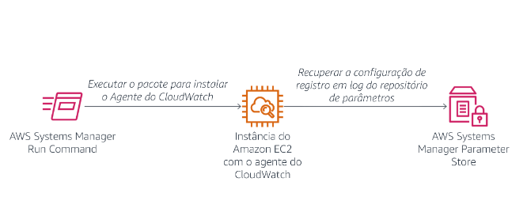
*Fluxo: Systems Manager instala o Agente → EC2 → Parameter Store (configuração) → CloudWatch Logs e Métricas*

### Tarefa 2: Alerta Baseado em Logs
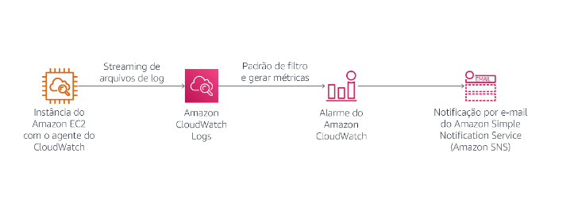
*Fluxo: EC2 (Apache Logs) → CloudWatch Logs → Filtro de Métrica (HTTP 404) → Alarme → Notificação por E-mail (SNS)*

## 🔧 Tecnologias e Serviços Utilizados

- **AWS Systems Manager (Run Command)** - Automação da instalação do agente
- **Amazon CloudWatch (Agent, Logs, Metrics, Alarms)** - Coleta, armazenamento e alertas
- **Amazon SNS** - Notificações por e-mail
- **Amazon EventBridge** - Reação a eventos da infraestrutura
- **AWS Config** - Auditoria e conformidade de recursos

## 🖥️ Infraestrutura

| Recurso | Tipo | Detalhes |
|---|---|---|
| Web Server | EC2 t3.micro | Apache HTTP Server, us-west-2a |
| CloudWatch Agent | SSM Package | AmazonCloudWatchAgent |
| Parameter Store | SSM Parameter | `Monitor-Web-Server` (configuração JSON) |
| Log Group | CloudWatch Logs | `HttpAccessLog` |
| SNS Topic | Notificação | `Default_CloudWatch_Alarms_Topic` |

## 📝 Etapas Realizadas

### Tarefa 1: Instalar e Configurar o CloudWatch Agent

Usei o **AWS Systems Manager Run Command** para instalar o agente e, em seguida, configurá-lo via **Parameter Store**.

**1. Envio do comando via SSM Run Command:**

O comando `AWS-ConfigureAWSPackage` foi enviado para a instância do Web Server para instalar o `AmazonCloudWatchAgent`.

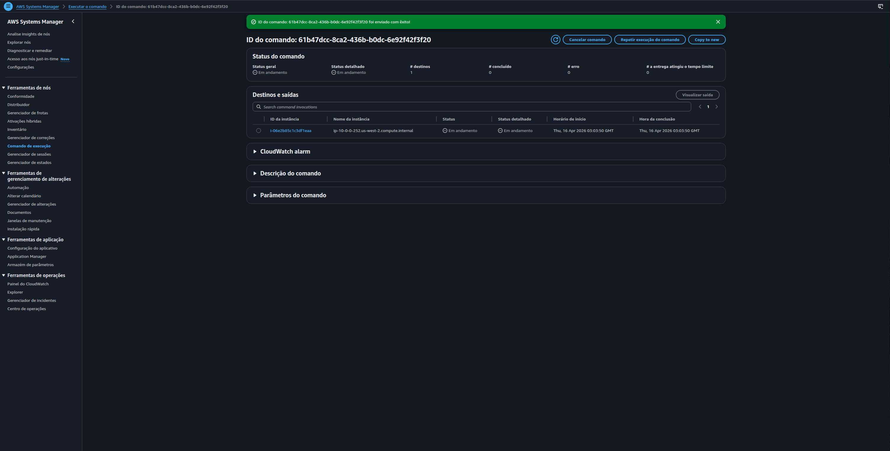
*Comando enviado com êxito — status "Em andamento" confirmando que o agente SSM recebeu a instrução*

**2. Saída da instalação — sucesso confirmado:**

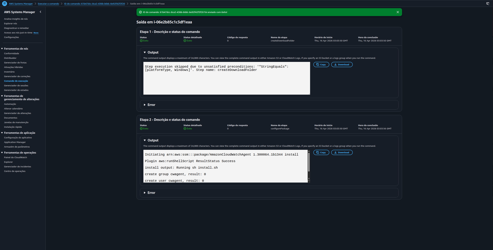
*Etapas 1 e 2 com status "Êxito": package `AmazonCloudWatchAgent 1.300064.1b1344` instalado, grupo e usuário `cwagent` criados*

**3. Configuração do Agente (Parameter Store):**

Criei um parâmetro chamado `Monitor-Web-Server` com a configuração JSON que define:
- **Logs a coletar:** `/var/log/httpd/access_log` e `error_log`
- **Métricas do sistema:** `cpu_usage_idle`, `mem_used_percent`, `used_percent` (disco), etc.

**4. Iniciar o Agente com a Configuração:**

O documento `AmazonCloudWatch-ManageAgent` foi utilizado para aplicar a configuração do Parameter Store ao agente recém-instalado.

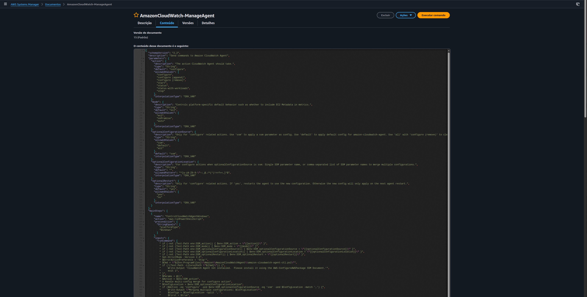
*Conteúdo JSON do documento SSM — define parâmetros como `action`, `mode`, `optionalConfigurationSource` e `optionalConfigurationLocation`*

**5. Verificar o Apache no Web Server:**

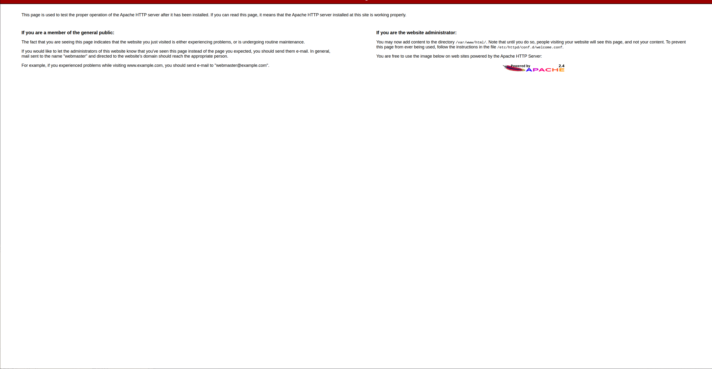
*Página de teste do Apache HTTP Server 2.4 confirmando que o serviço está ativo e gerando logs*

### Tarefa 2: Monitorar Logs e Criar Alertas (HTTP 404)

Com o agente enviando os logs do Apache para o **CloudWatch Logs**, criei um monitoramento para erros HTTP 404.

**1. Verificar os Logs no CloudWatch:**

Os logs do Apache chegaram no grupo de logs `HttpAccessLog`.

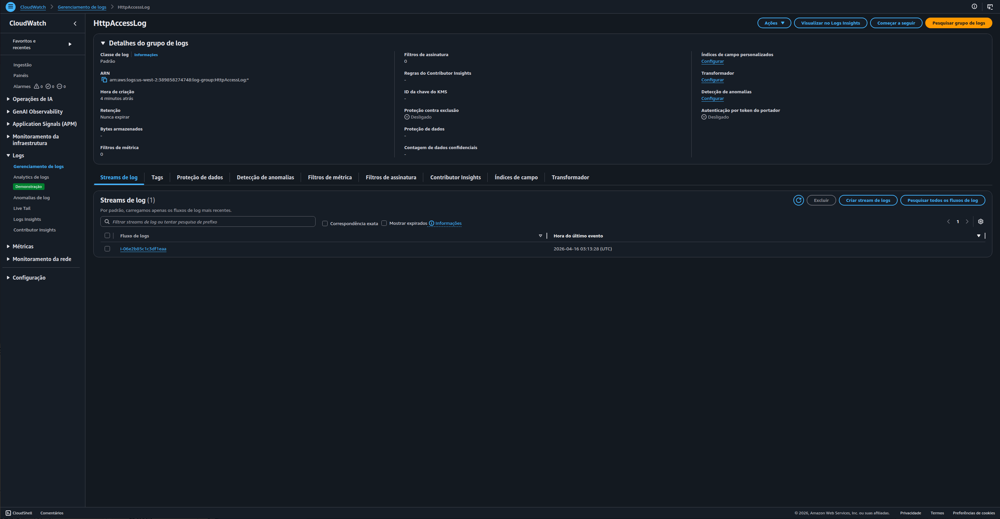
*Log group criado automaticamente pelo agente, com o stream de log da instância `i-06e2b85c1c3df1eaa`*

**2. Visualizar os Eventos de Log:**

Dentro do stream, é possível ver as requisições GET e os erros 404.

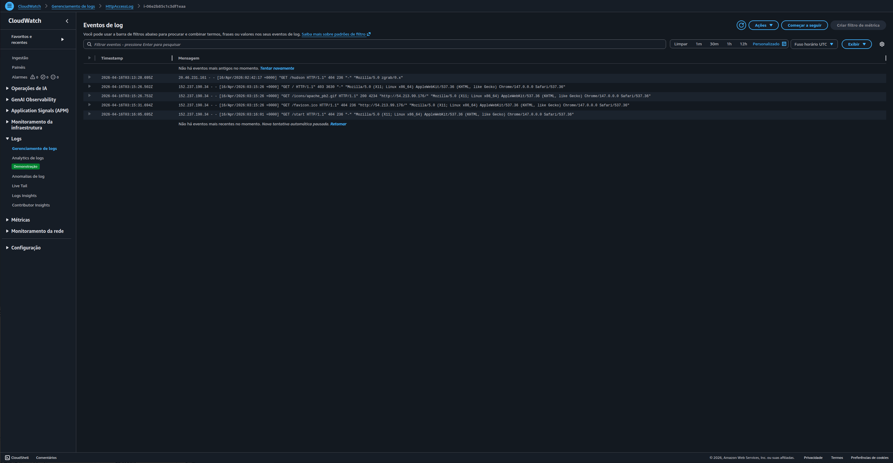
*Logs brutos do Apache, incluindo requisições para `/hudson`, `/favicon.ico` e `/start` que resultaram em erro 404*

**3. Criar um Filtro de Métrica:**

Criei um filtro com o padrão `[ip, id, user, timestamp, request, status_code=404, size]` para contar apenas os eventos com código 404.

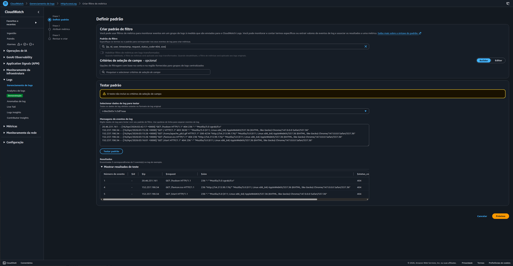
*Padrão de filtro testado com dados reais: 3 correspondências de status 404 encontradas nos 5 eventos de log de exemplo*

**4. Configurar o Alarme e Notificação:**

Com base no filtro, criei um alarme que dispara se houver **5 ou mais erros 404 em 1 minuto**. A ação é enviar uma notificação para um tópico do **SNS** (e-mail).

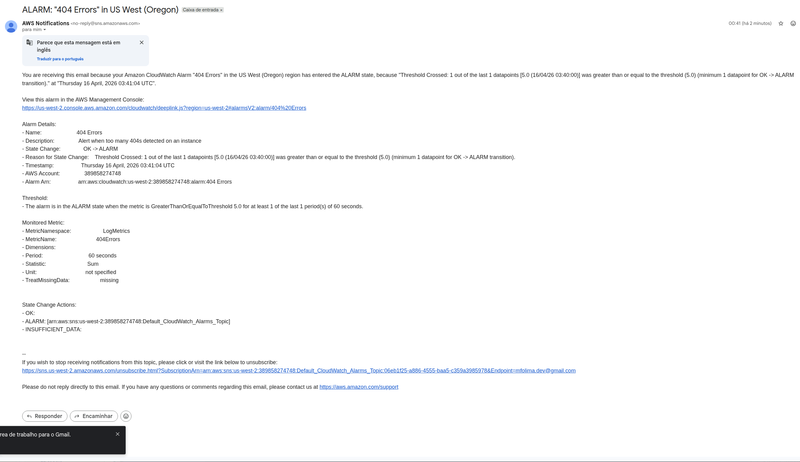
*Notificação recebida por e-mail confirmando que o alarme "404 Errors" entrou em estado `ALARM` — threshold de 5 erros em 60 segundos atingido*

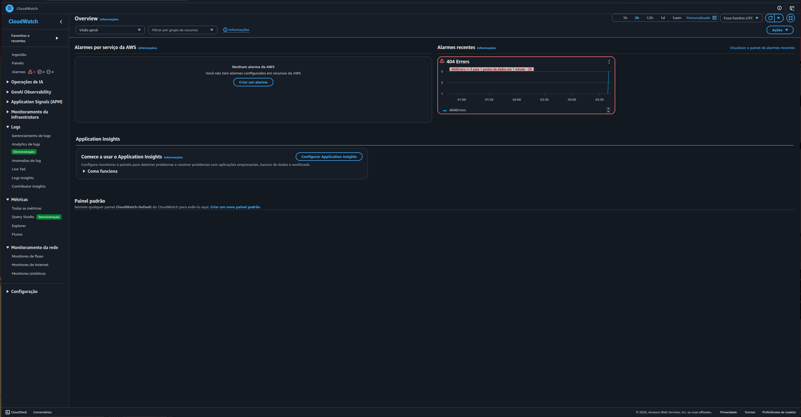
*Overview do CloudWatch mostrando o alarme "404 Errors" em estado vermelho (ALARM)*

### Tarefa 3: Monitorar Métricas Customizadas (CWAgent)

Além dos logs, o agente coleta métricas de dentro da instância, como uso de memória e espaço em disco.

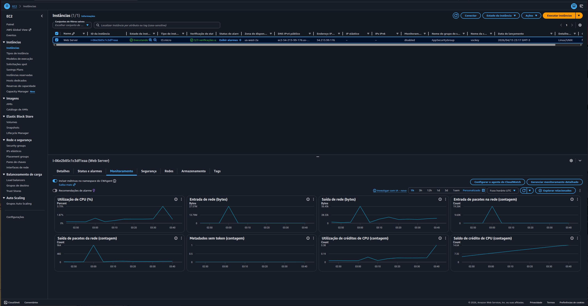
*CloudWatch Metrics → namespace CWAgent: métricas de disco (`disk_used_percent`, `disk_inodes_free`) coletadas para múltiplos mountpoints da instância*

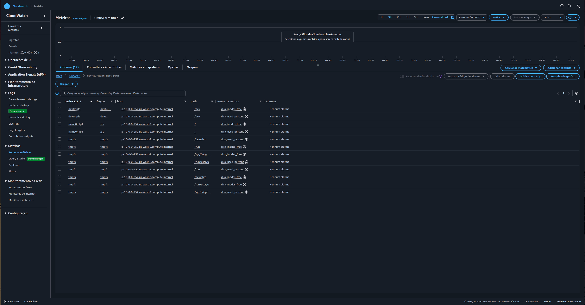
*Aba Monitoramento da instância EC2: CPU, rede e pacotes, incluindo métricas do namespace CWAgent ativadas*

### Tarefa 4: Criar Notificações em Tempo Real com EventBridge

Configurei o **Amazon EventBridge** para monitorar mudanças de estado das instâncias EC2 e enviar uma notificação quando uma instância for `stopped` ou `terminated`.

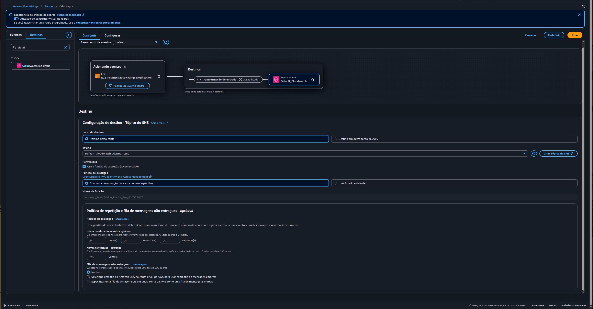
*Regra configurada: evento `EC2 Instance State-change Notification` → destino SNS `Default_CloudWatch_Alarms_Topic`*

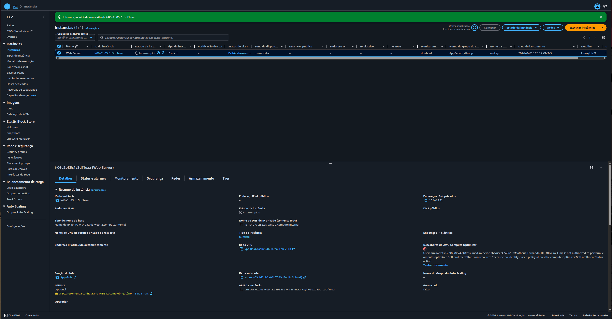
*Instância "Web Server" com estado "Interrompido" — evento disparado para o EventBridge e notificação enviada via SNS*

### Tarefa 5: Auditar Conformidade com AWS Config

Ativei o **AWS Config** e criei regras gerenciadas para verificar a conformidade da infraestrutura.

**Estado inicial — nenhuma regra configurada:**

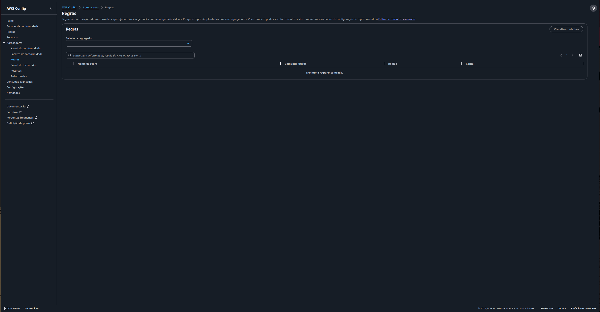
*Visão do agregador do AWS Config antes da criação das regras — lista de regras vazia*

**Após adicionar as regras:**

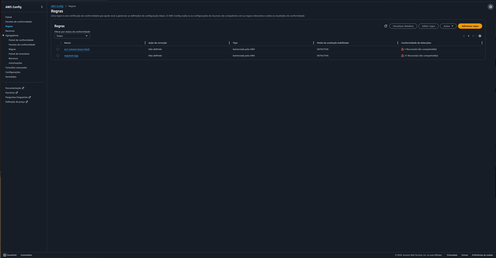
*Duas regras criadas: `ec2-volume-inuse-check` (1 recurso não compatível) e `required-tags` (21 recursos não compatíveis)*

**1. Regra `required-tags`:**

Esta regra verifica se os recursos possuem tags obrigatórias. O resultado mostrou 21 recursos não compatíveis — VPC, subnets, security groups e outros recursos sem a tag exigida.

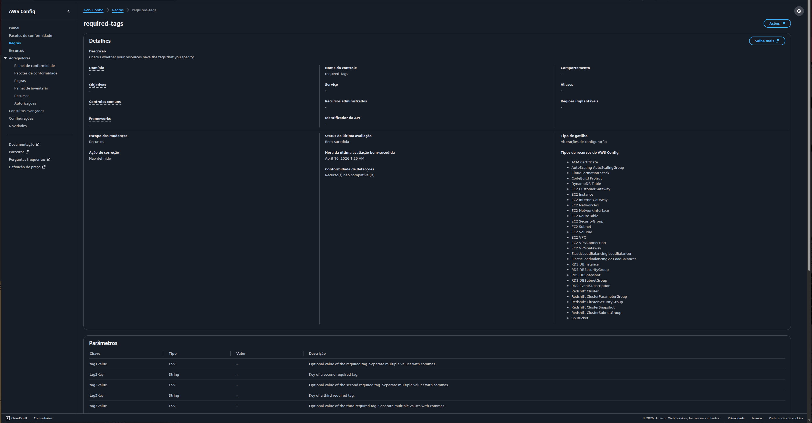
*Detalhes da regra: escopo inclui mais de 30 tipos de recursos AWS (EC2, RDS, S3, ELB, etc.)*

**2. Regra `ec2-volume-inuse-check`:**

Esta regra verifica se volumes EBS estão anexados a alguma instância. Um volume órfão (`vol-082a70d5cff961c91`) foi identificado como não compatível.

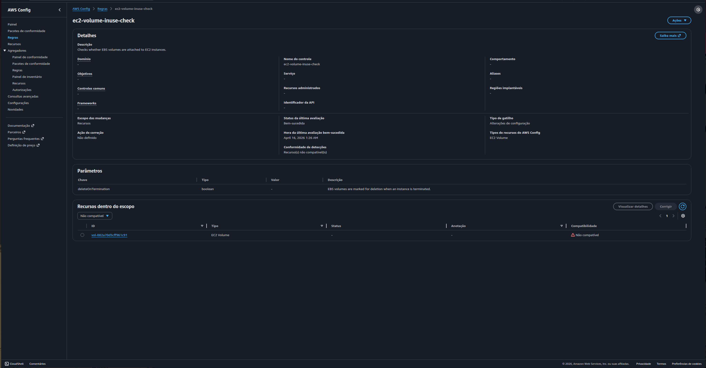
*Volume EBS `vol-082a70d5cff961c91` identificado como "Não compatível" — não está anexado a nenhuma instância EC2*

## 💡 Principais Aprendizados

1. **Centralização de Logs e Métricas:** O CloudWatch Logs elimina a necessidade de acessar cada servidor individualmente para debugar. Tudo fica em um local centralizado.
2. **Alertas Proativos:** Filtros de métrica em logs permitem criar alarmes para problemas de aplicação (ex: muitos 404s, erros de banco de dados) sem mudar uma linha de código.
3. **Monitoramento Holístico:** Métricas padrão da AWS (CPU, rede) + Métricas customizadas do agente (memória, disco) + Logs + Eventos (EventBridge) fornecem uma visão completa da saúde da aplicação.
4. **Automação de Ações:** O EventBridge permite reagir automaticamente a eventos de infraestrutura (parada de instância, mudanças de estado, etc.).
5. **Governança e Compliance:** O AWS Config é essencial para garantir que a infraestrutura siga os padrões da empresa (tags obrigatórias) e as boas práticas (sem volumes EBS órfãos gerando custo desnecessário).

## 🚀 Como Reproduzir este Lab

### Pré-requisitos
- Uma instância EC2 com o Apache rodando
- Permissões para criar regras no IAM (o lab fornece um ambiente preparado)

### Passo a Passo Resumido

1. **Instalar o Agente:** Systems Manager → Run Command → `AWS-ConfigureAWSPackage` (Ação: Install, Nome: AmazonCloudWatchAgent).
2. **Criar Configuração:** Systems Manager → Parameter Store → Criar parâmetro com o JSON do lab.
3. **Iniciar Agente:** Run Command → `AmazonCloudWatch-ManageAgent` (Ação: configure, Modo: ec2, Config Source: ssm, Config Location: `Monitor-Web-Server`).
4. **Criar Filtro de Métrica:** CloudWatch → Logs → Log Group `HttpAccessLog` → Ações → Criar filtro de métrica.
   - Padrão: `[ip, id, user, timestamp, request, status_code=404, size]`
5. **Criar Alarme:** No filtro criado → "Create Alarm" → Condição: `>= 5`, Ação: Criar/Usar tópico SNS.
6. **Criar Regra EventBridge:** EventBridge → Regras → Criar regra.
   - Event Source: EC2 → `EC2 Instance State-change Notification`
   - States: `stopped`, `terminated`
   - Target: SNS Topic (o mesmo usado antes)
7. **Ativar AWS Config:** (Se não estiver ativo) → Serviço Config → Configurar.
8. **Adicionar Regras:** AWS Config → Regras → Adicionar regra → Buscar por `required-tags` e `ec2-volume-inuse-check`.

## 📚 Recursos Adicionais

- [Documentação do Amazon CloudWatch Agent](https://docs.aws.amazon.com/AmazonCloudWatch/latest/monitoring/Install-CloudWatch-Agent.html)
- [Criar alarmes do CloudWatch baseados em filtros de métrica de logs](https://docs.aws.amazon.com/AmazonCloudWatch/latest/logs/MonitoringLogData.html)
- [Tutoriais do Amazon EventBridge](https://docs.aws.amazon.com/eventbridge/latest/userguide/eb-get-started.html)
- [Regras Gerenciadas do AWS Config](https://docs.aws.amazon.com/config/latest/developerguide/managed-rules-by-aws-config.html)

## 👨‍💻 Autor

**Matheus Lima**  
Estudante - Escola da Nuvem

---

## 📄 Licença

Este projeto é parte do programa educacional AWS re/Start e está disponível para fins de estudo e portfólio.

