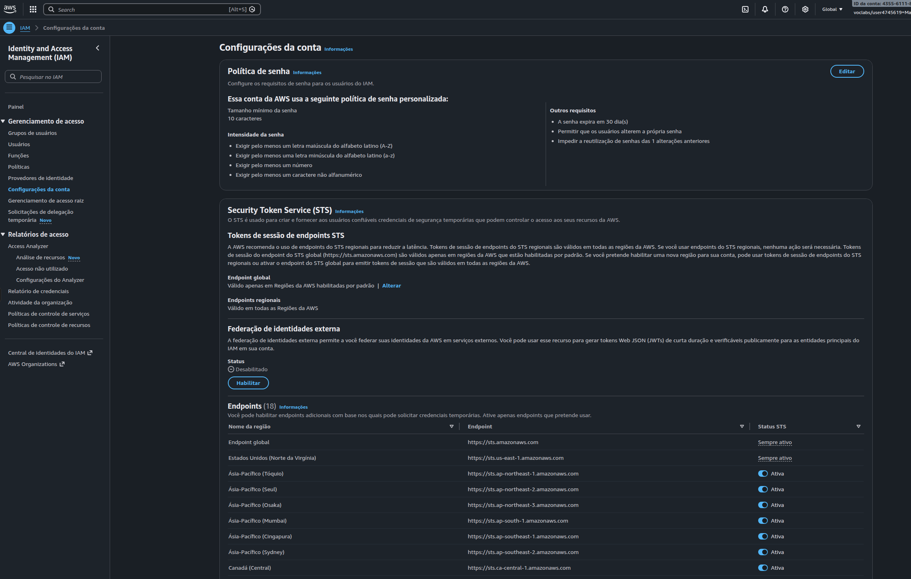
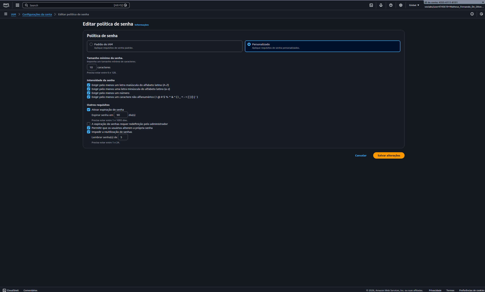
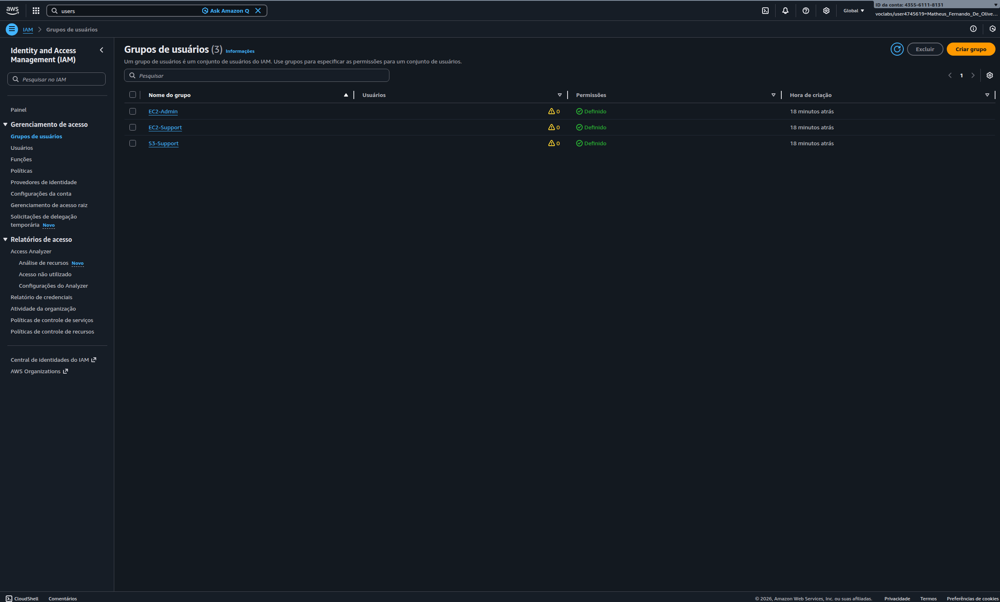
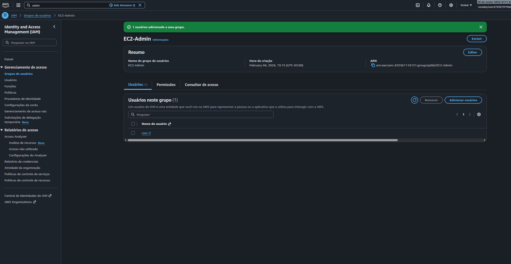
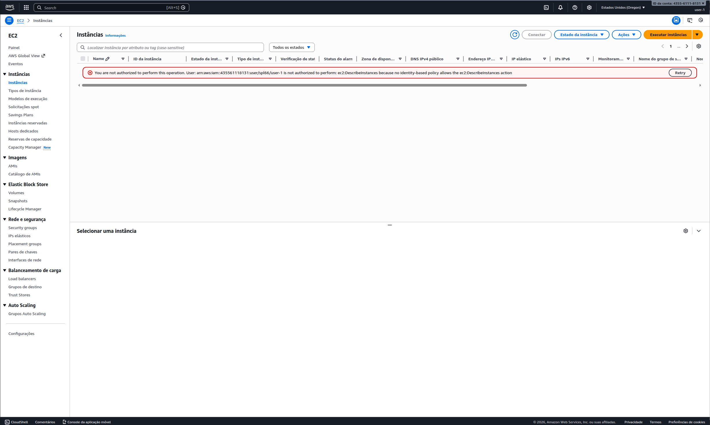
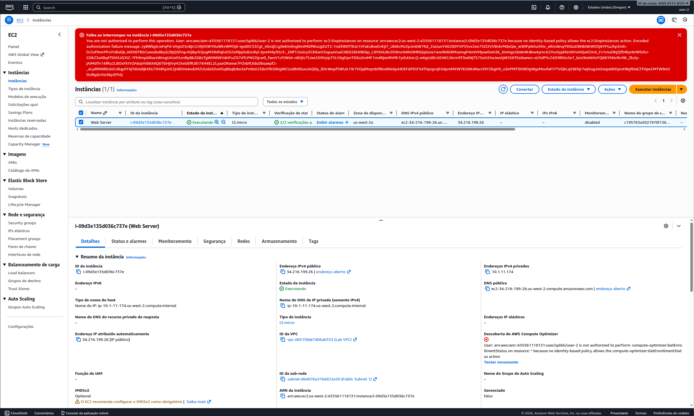
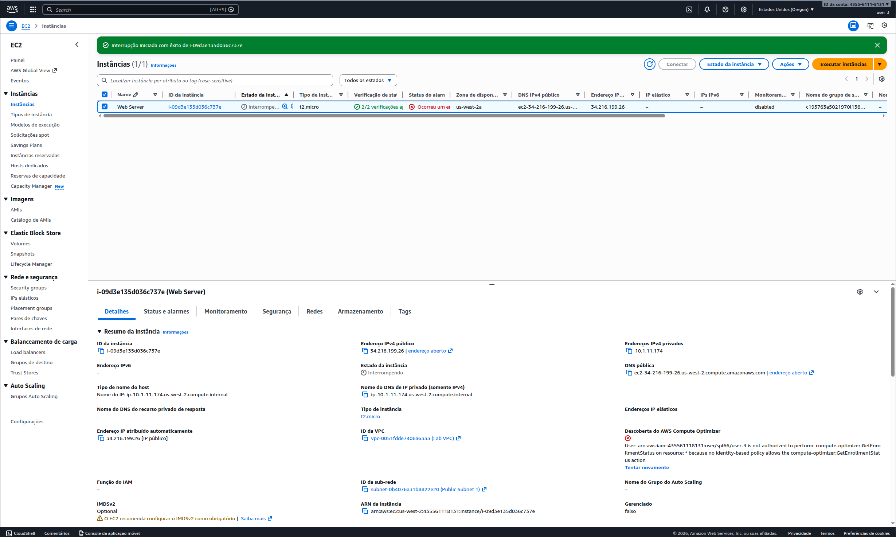

# Lab AWS - Introdução ao IAM (Identity and Access Management)

## 📋 Sobre o Lab

Este laboratório faz parte do programa **AWS Academy** através da **Escola da Nuvem**, focado em práticas de gerenciamento de identidades e acessos na AWS.

**Duração:** ~60 minutos  
**Nível:** Fundamental  
**Serviço Principal:** AWS IAM

## 🎯 Objetivos

Ao concluir este laboratório, pratiquei:

- ✅ Criar e aplicar políticas de senha personalizadas no IAM
- ✅ Explorar usuários e grupos pré-criados
- ✅ Inspecionar políticas do IAM (gerenciadas e inline)
- ✅ Adicionar usuários a grupos com permissões específicas
- ✅ Testar diferentes níveis de acesso aos serviços AWS (EC2 e S3)
- ✅ Validar o princípio do menor privilégio

## 🏗️ Arquitetura do Lab



O laboratório simula um cenário empresarial com três perfis de usuários:

| Usuário | Grupo | Permissões |
|---------|-------|------------|
| user-1 | S3-Support | Acesso somente leitura ao Amazon S3 |
| user-2 | EC2-Support | Acesso somente leitura ao Amazon EC2 |
| user-3 | EC2-Admin | Visualizar, iniciar e interromper instâncias EC2 |

## 🔧 Tecnologias e Serviços Utilizados

- **AWS IAM** - Gerenciamento de identidades e acessos
- **Amazon EC2** - Serviço de computação em nuvem
- **Amazon S3** - Serviço de armazenamento de objetos
- **AWS Management Console** - Interface de gerenciamento

## 📝 Etapas Realizadas

### Tarefa 1: Configuração de Política de Senhas

Implementei uma política de senhas robusta com os seguintes requisitos:

- ✅ Comprimento mínimo: **10 caracteres**
- ✅ Exigência de letras maiúsculas (A-Z)
- ✅ Exigência de letras minúsculas (a-z)
- ✅ Exigência de números
- ✅ Exigência de caracteres especiais (!@#$%^&*)
- ✅ Expiração em **90 dias**
- ✅ Prevenção de reuso das últimas **5 senhas**
- ✅ Permitir que usuários alterem a própria senha
- ✅ Impedir reutilização de senhas


*Configuração personalizada da política de senhas no IAM*

### Tarefa 2: Exploração de Usuários e Grupos

Analisei a estrutura de três grupos pré-configurados e suas respectivas políticas de permissão:


*Visão geral dos três grupos de usuários: EC2-Admin, EC2-Support e S3-Support*

#### 📁 EC2-Support
- **Política gerenciada:** `AmazonEC2ReadOnlyAccess`
- **Permissões:** Listar e visualizar recursos EC2, ELB, CloudWatch e Auto Scaling
- **Tipo:** Read-only (somente leitura)

#### 📁 S3-Support
- **Política gerenciada:** `AmazonS3ReadOnlyAccess`
- **Permissões:** Listar e visualizar buckets e objetos S3
- **Tipo:** Read-only (somente leitura)

#### 📁 EC2-Admin
- **Política inline customizada:** `EC2-Admin-Policy`
- **Permissões:** Visualizar (Describe), iniciar (Start) e parar (Stop) instâncias EC2
- **Tipo:** Administrativa com ações específicas

### Tarefa 3: Atribuição de Usuários aos Grupos

Adicionei cada usuário ao seu respectivo grupo conforme o cenário de negócio estabelecido:


*Confirmação da adição do user-3 ao grupo EC2-Admin*

Cada grupo agora possui **1 usuário** atribuído, conforme planejado na arquitetura do laboratório.

### Tarefa 4: Testes de Permissões

Realizei testes práticos com cada usuário para validar as permissões configuradas.

#### 🧪 Teste com user-1 (S3-Support)

**Cenário:** Usuário de suporte ao Amazon S3


*user-1 tentando acessar instâncias EC2 - Acesso negado (esperado)*

**Resultados:**
- ✅ **Sucesso:** Conseguiu visualizar buckets S3 e seu conteúdo
- ❌ **Bloqueado:** Erro de autorização ao tentar listar instâncias EC2
- 📋 **Mensagem:** "You are not authorized to perform this operation"

**Conclusão:** As permissões estão funcionando corretamente - acesso apenas ao S3.

---

#### 🧪 Teste com user-2 (EC2-Support)

**Cenário:** Usuário de suporte ao Amazon EC2


*user-2 tentando parar uma instância EC2 - Operação bloqueada (esperado)*

**Resultados:**
- ✅ **Sucesso:** Conseguiu visualizar instâncias EC2 e seus detalhes
- ❌ **Bloqueado:** Erro ao tentar parar (Stop) uma instância EC2
- ❌ **Bloqueado:** Acesso negado ao Amazon S3
- 📋 **Mensagem:** "Failed to stop the instance - You are not authorized to perform this operation"

**Conclusão:** Política read-only funcionando perfeitamente - visualiza mas não modifica.

---

#### 🧪 Teste com user-3 (EC2-Admin)

**Cenário:** Administrador do Amazon EC2


*user-3 interrompendo uma instância EC2 com sucesso*

**Resultados:**
- ✅ **Sucesso:** Conseguiu visualizar instâncias EC2
- ✅ **Sucesso:** Conseguiu parar (Stop) a instância com sucesso
- 📋 **Status:** Instância entrou em estado "Stopping" conforme esperado
- 🎯 **Banner verde:** "Interrupção iniciada com êxito"

**Conclusão:** Permissões administrativas funcionando corretamente - controle total sobre instâncias.

## 🔐 Conceitos-Chave Aprendidos

### Estrutura de uma Política IAM

```json
{
  "Version": "2012-10-17",
  "Statement": [
    {
      "Effect": "Allow",
      "Action": [
        "ec2:Describe*",
        "ec2:StartInstances",
        "ec2:StopInstances"
      ],
      "Resource": "*"
    }
  ]
}
```

**Elementos principais:**
- **Effect:** Define se a permissão é `Allow` (permitir) ou `Deny` (negar)
- **Action:** Especifica as ações da API que podem ser executadas
- **Resource:** Define o escopo dos recursos cobertos pela política

### Diferenças entre Tipos de Políticas

| Tipo | Característica | Uso Recomendado |
|------|----------------|-----------------|
| **Políticas Gerenciadas** | Pré-definidas pela AWS, reutilizáveis | Permissões comuns e padrões |
| **Políticas Inline** | Customizadas para casos específicos | Permissões únicas e pontuais |

### Princípio do Menor Privilégio (Least Privilege)

> Cada usuário recebeu **apenas** as permissões necessárias para executar suas funções, minimizando riscos de segurança e acesso não autorizado a recursos críticos.

## 💡 Principais Aprendizados

1. **Segurança em Camadas**
   - Políticas de senha robustas são a primeira linha de defesa
   - Múltiplos requisitos (caracteres, expiração, histórico) aumentam significativamente a segurança

2. **Gerenciamento por Grupos**
   - Mais eficiente que atribuir permissões individuais
   - Facilita manutenção e auditoria de acessos
   - Escala melhor em ambientes corporativos

3. **Testes são Essenciais**
   - Validar permissões antes de ambiente produção previne incidentes
   - Documentar resultados dos testes cria evidências de conformidade

4. **Políticas Granulares**
   - Permitem controle fino sobre recursos e ações
   - Balance entre segurança e produtividade do usuário

5. **Separação de Responsabilidades**
   - Diferentes níveis de acesso para diferentes funções
   - Reduz riscos de modificações acidentais ou maliciosas

## 🚀 Como Reproduzir este Lab

### Pré-requisitos
- Acesso ao AWS Academy Lab
- Navegador web (Chrome, Firefox ou Edge recomendados)
- Conhecimento básico de conceitos AWS

### Passo a Passo

1. **Iniciar o Ambiente**
   - Acesse o AWS Academy Lab
   - Aguarde o círculo verde ao lado de "AWS" (lab pronto)

2. **Configurar Política de Senhas**
   - Navegue até IAM > Account Settings
   - Configure os requisitos de senha personalizados
   - Salve as alterações

3. **Explorar Grupos e Políticas**
   - Acesse IAM > User Groups
   - Explore as políticas anexadas a cada grupo
   - Expanda as políticas para visualizar o JSON

4. **Adicionar Usuários aos Grupos**
   - Selecione cada grupo
   - Use "Add Users" para atribuir usuários
   - Verifique se cada grupo tem 1 usuário

5. **Realizar Testes de Permissão**
   - Copie o URL de sign-in do IAM Dashboard
   - Abra uma janela privada/anônima do navegador
   - Faça login com cada usuário e teste suas permissões

### Dicas para Testes

- Use **janela privada** para evitar conflitos de sessão
- Teste tanto **ações permitidas** quanto **bloqueadas**
- Documente os resultados com **screenshots**
- Sempre faça **logout** antes de trocar de usuário

## 📊 Resultados e Métricas

| Métrica | Valor |
|---------|-------|
| Grupos criados | 3 |
| Usuários configurados | 3 |
| Políticas aplicadas | 3 |
| Testes realizados | 6+ |
| Taxa de sucesso | 100% |

## 📚 Recursos Adicionais

- [Documentação Oficial AWS IAM](https://docs.aws.amazon.com/IAM/latest/UserGuide/)
- [IAM Best Practices](https://docs.aws.amazon.com/IAM/latest/UserGuide/best-practices.html)
- [AWS Academy](https://aws.amazon.com/training/awsacademy/)
- [Política de Senhas IAM](https://docs.aws.amazon.com/IAM/latest/UserGuide/id_credentials_passwords_account-policy.html)
- [Políticas Gerenciadas vs Inline](https://docs.aws.amazon.com/IAM/latest/UserGuide/access_policies_managed-vs-inline.html)

## 🏆 Certificações Relacionadas

Este laboratório contribui para a preparação das seguintes certificações:

- **AWS Certified Cloud Practitioner**
- **AWS Certified Solutions Architect - Associate**
- **AWS Certified Security - Specialty**

## 👨‍💻 Autor

**[Seu Nome]**  
Estudante AWS Academy - Escola da Nuvem  
📧 [seu-email@exemplo.com]  
💼 [LinkedIn](seu-linkedin) | 🐙 [GitHub](seu-github)

---

## 📄 Licença

Este projeto é parte do programa educacional AWS Academy e está disponível para fins de estudo e portfólio.

---

<div align="center">

**⭐ Se este repositório foi útil para seus estudos, considere dar uma estrela!**

[](https://aws.amazon.com/training/awsacademy/)
[](https://aws.amazon.com/iam/)

**Última atualização:** Fevereiro 2024

</div>
