# Lab AWS — Migração para o Amazon RDS

## 📋 Sobre o Lab

Este laboratório faz parte do **Programa Re/Start AWS** através da **Escola da Nuvem**, focado em migração de banco de dados local para uma instância gerenciada do Amazon Relational Database Service (Amazon RDS).

O cenário parte de uma aplicação web de cafeteria com banco de dados MariaDB local rodando dentro de uma instância EC2 LAMP. O objetivo é migrar esse banco para uma instância RDS totalmente gerenciada, sem perda de dados, e reconfigurar a aplicação para usar o novo endpoint.

## 🎯 Objetivos

Ao concluir este laboratório, pratiquei:

- ✅ Criar uma instância do MariaDB do Amazon RDS usando a AWS CLI
- ✅ Configurar Security Group, sub-redes privadas e DB Subnet Group via CLI
- ✅ Migrar dados de um banco MariaDB local (EC2) para o Amazon RDS com `mysqldump`
- ✅ Redirecionar a aplicação para o novo banco via AWS Systems Manager Parameter Store
- ✅ Monitorar a instância RDS com métricas do Amazon CloudWatch

## 🏗️ Arquitetura do Lab

### Arquitetura Inicial

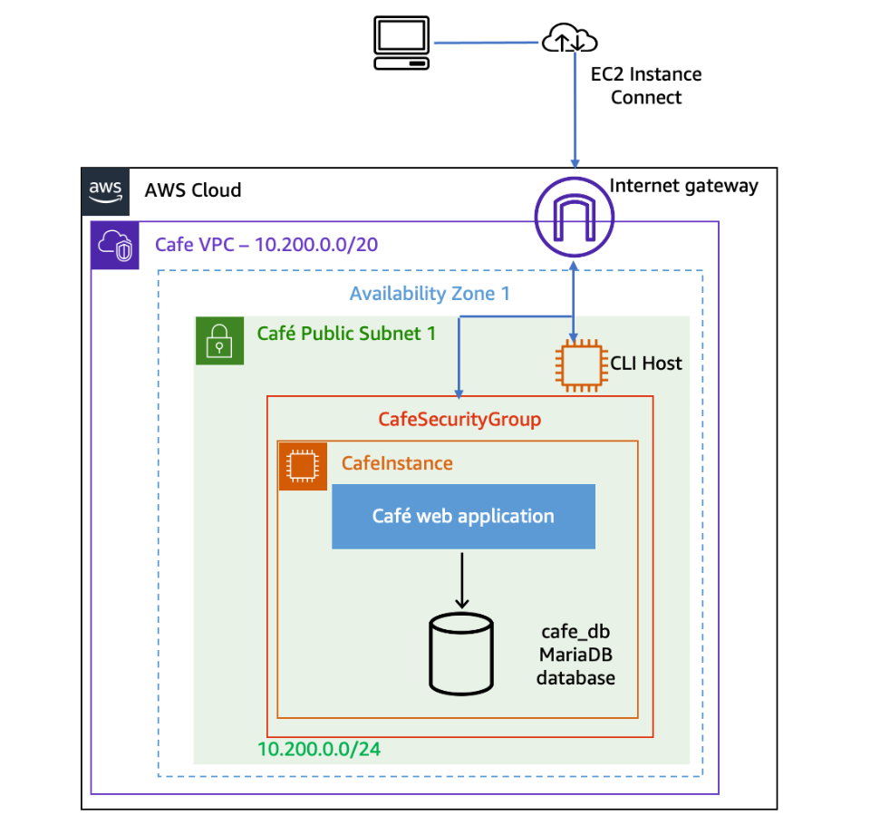
*Banco de dados cafe_db rodando localmente dentro da CafeInstance (EC2 LAMP), na subnet pública da Cafe VPC*

### Arquitetura Final

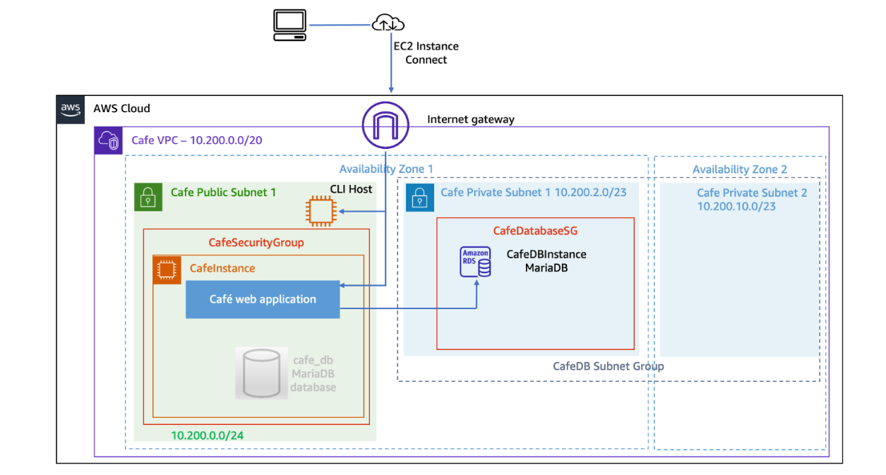
*Após a migração: banco de dados movido para a CafeDBInstance (Amazon RDS MariaDB) em sub-rede privada, com a aplicação na CafeInstance apontando para o novo endpoint via SSM Parameter Store*

### Infraestrutura Utilizada

| Componente | Detalhes |
|---|---|
| CafeInstance | Amazon Linux 2 — t3.small — aplicação web + banco local (antes da migração) |
| CLI Host | EC2 — usado para executar comandos AWS CLI |
| CafeDBInstance | Amazon RDS MariaDB 10.6.25 — db.t3.micro — 20 GB |
| VPC | Cafe VPC — 10.200.0.0/20 |
| Cafe Public Subnet 1 | 10.200.0.0/24 — us-west-2a |
| Cafe Private Subnet 1 | 10.200.2.0/23 — us-west-2a (sub-rede principal do RDS) |
| Cafe Private Subnet 2 | 10.200.10.0/23 — us-west-2b (sub-rede extra do DB Subnet Group) |
| CafeDatabaseSG | Security Group do RDS — porta 3306 liberada apenas para CafeSecurityGroup |
| CafeDB Subnet Group | Grupo de sub-redes do banco de dados (obrigatório para RDS) |
| SSM Parameter Store | Armazena o endpoint do banco (`/cafe/dbUrl`) — permite trocar o BD sem alterar código |

## 📝 Etapas Realizadas

### Tarefa 1: Gerar Dados no Banco Local

O site da cafeteria foi acessado para criar pedidos no banco de dados local antes da migração. Isso garantiu dados reais para validar a integridade da migração ao final.

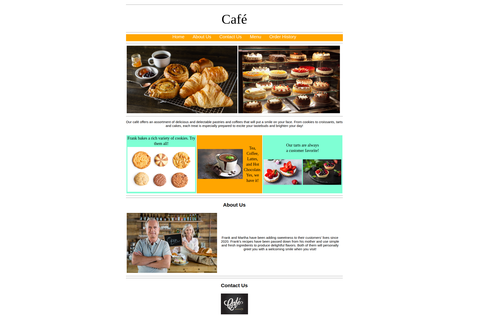
*Site da cafeteria acessado via CafeInstanceURL — pedidos realizados e registrados no banco local cafe_db antes da migração*

---

### Tarefa 2: Criar a Instância Amazon RDS via AWS CLI

Todos os recursos foram criados a partir da instância CLI Host, conectada via EC2 Instance Connect.

#### 2.1 — Configurar AWS CLI e criar o Security Group

```bash
aws configure
# AccessKey, SecretKey, us-west-2, json

aws ec2 create-security-group \
  --group-name CafeDatabaseSG \
  --description "Security group for Cafe database" \
  --vpc-id <CafeVpcID>

aws ec2 authorize-security-group-ingress \
  --group-id <CafeDatabaseSG ID> \
  --protocol tcp --port 3306 \
  --source-group <CafeSecurityGroup ID>
```

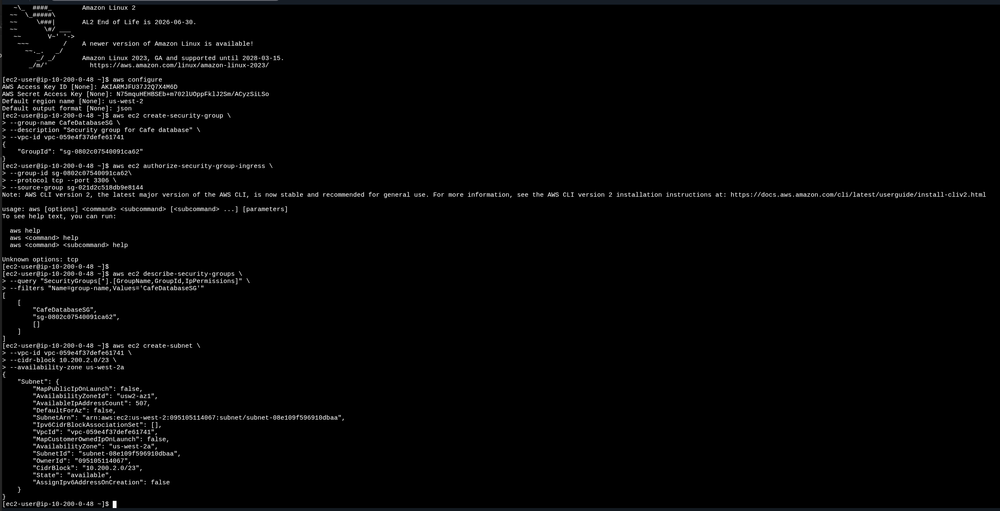
*`aws configure` com credenciais do lab, criação do `CafeDatabaseSG` retornando o GroupId `sg-0802c07540091ca62`, e confirmação via `describe-security-groups`*

#### 2.2 — Criar Sub-redes Privadas

> **Aprendizado prático:** o EC2 Instance Connect interpreta erroneamente as barras invertidas `\` em comandos multi-linha, fazendo com que argumentos sejam perdidos. A solução foi executar os comandos em linha única.

```bash
# Sub-rede Privada 1 — us-west-2a (mesma AZ da CafeInstance)
aws ec2 create-subnet --vpc-id vpc-059e4f37defe61741 --cidr-block 10.200.2.0/23 --availability-zone us-west-2a

# Sub-rede Privada 2 — us-west-2b (AZ diferente, obrigatória para o DB Subnet Group)
aws ec2 create-subnet --vpc-id vpc-059e4f37defe61741 --cidr-block 10.200.10.0/23 --availability-zone us-west-2b
```

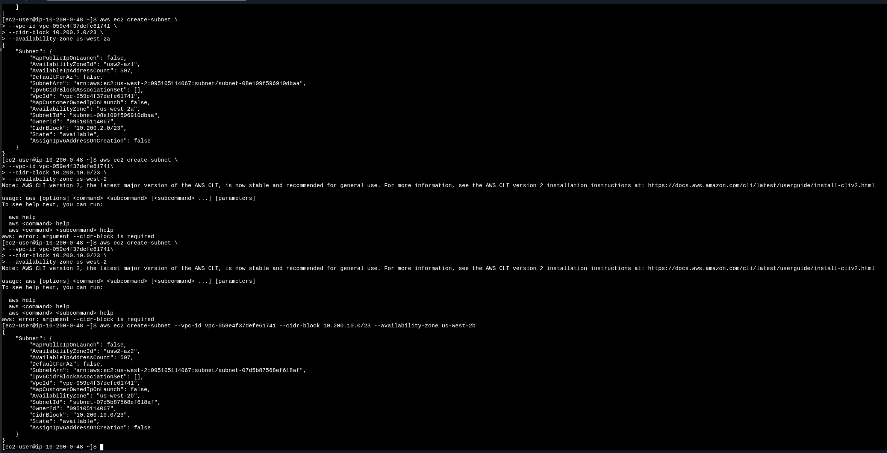
*Sub-rede privada 1 (`subnet-08e109f596910dbaa`, us-west-2a) e sub-rede privada 2 (`subnet-07d5b87568ef618af`, us-west-2b) criadas com sucesso*

#### 2.3 — Criar o DB Subnet Group

```bash
aws rds create-db-subnet-group \
  --db-subnet-group-name "CafeDB Subnet Group" \
  --db-subnet-group-description "DB subnet group for Cafe" \
  --subnet-ids subnet-08e109f596910dbaa subnet-07d5b87568ef618af \
  --tags "Key=Name,Value=CafeDatabaseSubnetGroup"
```

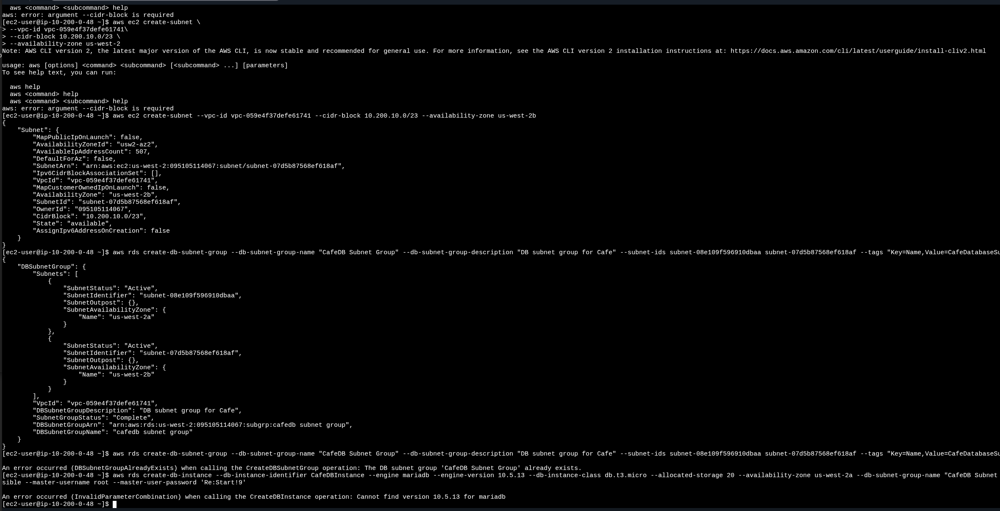
*DB Subnet Group criado com status `Complete`, agrupando as duas sub-redes privadas nas AZs us-west-2a e us-west-2b. Erro de versão `10.5.13` visível ao tentar criar a instância RDS — versão não mais disponível no ambiente*

#### 2.4 — Identificar Versão Disponível e Criar a Instância RDS

> **Troubleshooting:** a versão `10.5.13` especificada no roteiro do lab não estava disponível no ambiente. Consultei as versões disponíveis com `describe-db-engine-versions` e usei `10.6.25`.

```bash
# Verificar versões disponíveis
aws rds describe-db-engine-versions --engine mariadb --query "DBEngineVersions[*].EngineVersion"
```

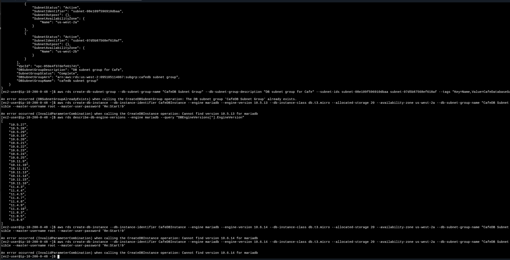
*Saída do `describe-db-engine-versions` listando versões disponíveis — a `10.5.13` do roteiro não estava presente; versão `10.6.25` selecionada como alternativa*

```bash
# Criar a instância RDS
aws rds create-db-instance \
  --db-instance-identifier CafeDBInstance \
  --engine mariadb \
  --engine-version 10.6.25 \
  --db-instance-class db.t3.micro \
  --allocated-storage 20 \
  --availability-zone us-west-2a \
  --db-subnet-group-name "CafeDB Subnet Group" \
  --vpc-security-group-ids sg-0802c07540091ca62 \
  --no-publicly-accessible \
  --master-username root \
  --master-user-password 'Re:Start!9'
```

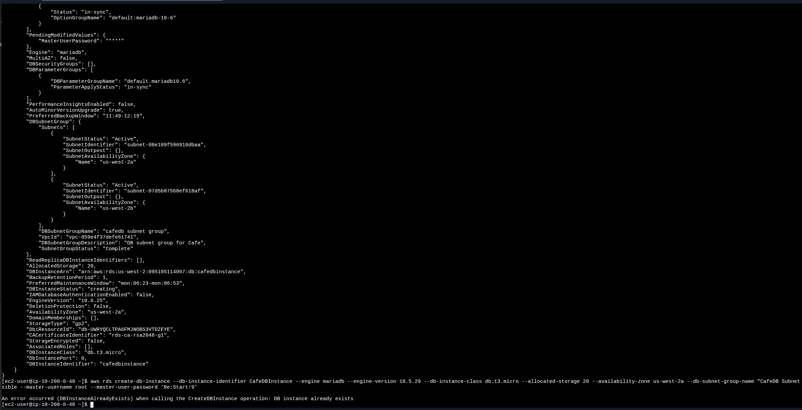
*Saída do `create-db-instance` confirmando criação da `CafeDBInstance` com MariaDB 10.6.25, db.t3.micro, 20 GB, em us-west-2a, com status `creating`*

```bash
# Monitorar status até "available"
aws rds describe-db-instances \
  --db-instance-identifier CafeDBInstance \
  --query "DBInstances[*].[Endpoint.Address,AvailabilityZone,PreferredBackupWindow,BackupRetentionPeriod,DBInstanceStatus]"
```

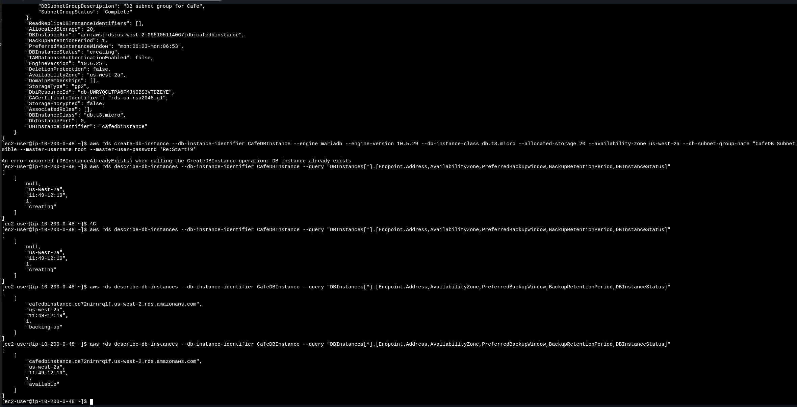
*Progressão de status: `creating` → `backing-up` → `available`. Endpoint registrado: `cafedbinstance.ce72nirnrq1f.us-west-2.rds.amazonaws.com`*

---

### Tarefa 3: Migrar os Dados para o Amazon RDS

A migração foi executada a partir da **CafeInstance** (não do CLI Host), que tem acesso ao banco local e ao RDS via Security Group.

```bash
# Exportar banco local para arquivo SQL
mysqldump --user=root --password='Re:Start!9' \
  --databases cafe_db --add-drop-database > cafedb-backup.sql

# Restaurar no Amazon RDS
mysql --user=root --password='Re:Start!9' \
  --host=cafedbinstance.ce72nirnrq1f.us-west-2.rds.amazonaws.com \
  < cafedb-backup.sql

# Validar dados migrados
mysql --user=root --password='Re:Start!9' \
  --host=cafedbinstance.ce72nirnrq1f.us-west-2.rds.amazonaws.com \
  cafe_db
```
```sql
select * from product;
exit
```

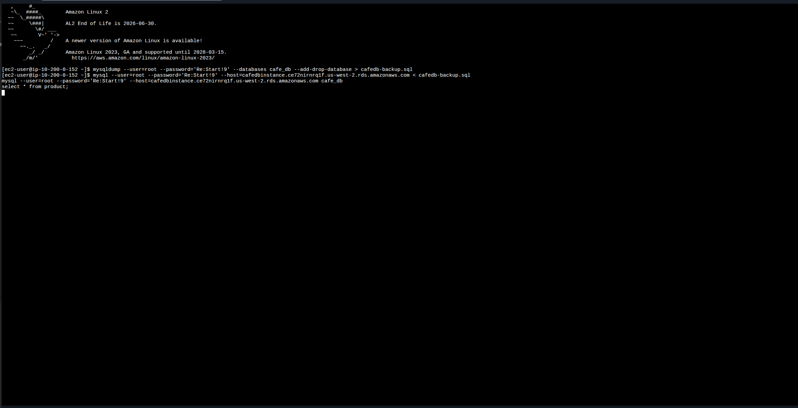
*Sequência completa: `mysqldump` gerando o backup local, restore via `mysql` no endpoint RDS, e abertura de sessão interativa para validação com `select * from product`*

---

### Tarefa 4: Redirecionar a Aplicação para o Amazon RDS

A aplicação usa o AWS Systems Manager Parameter Store para carregar as configurações de banco de dados. Para migrar sem alterar código, bastou atualizar o parâmetro `/cafe/dbUrl` com o endpoint da instância RDS.

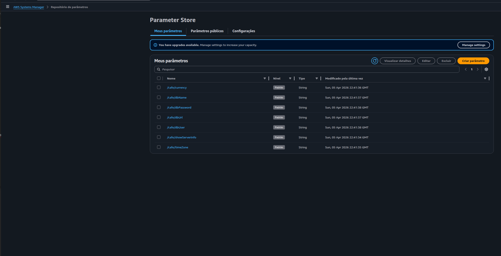
*Parameter Store exibindo os parâmetros da aplicação: `/cafe/dbUrl`, `/cafe/dbName`, `/cafe/dbUser`, `/cafe/dbPassword`. O valor de `/cafe/dbUrl` foi atualizado para o endpoint da CafeDBInstance*

Após a atualização, o site foi acessado e o Histórico de Pedidos foi verificado — os pedidos feitos antes da migração estavam presentes, confirmando integridade total dos dados.

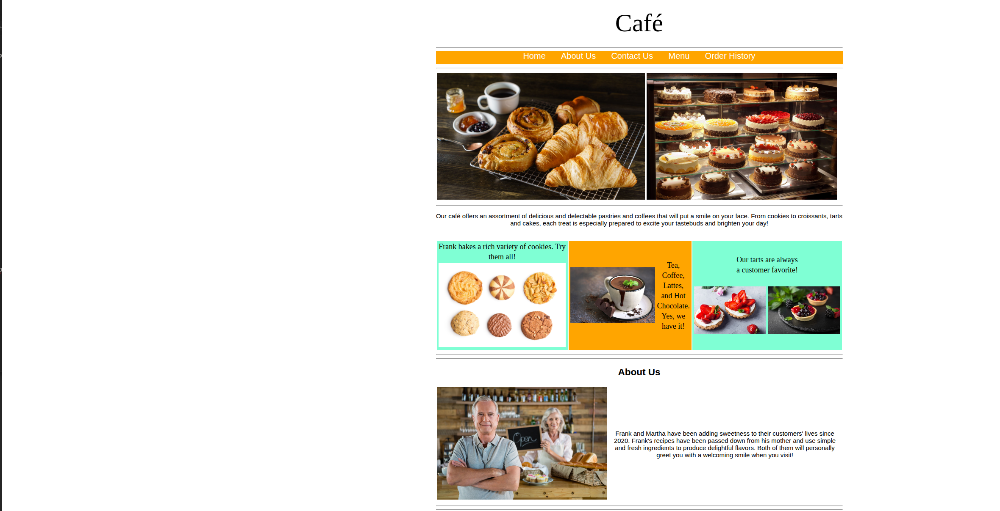
*Site da cafeteria acessível e funcionando normalmente após o redirecionamento para o Amazon RDS — pedidos históricos preservados*

---

### Tarefa 5: Monitorar o Amazon RDS com CloudWatch

O Amazon RDS envia métricas automaticamente para o CloudWatch a cada minuto. A aba Monitoramento do console RDS exibe gráficos em tempo real das principais métricas.

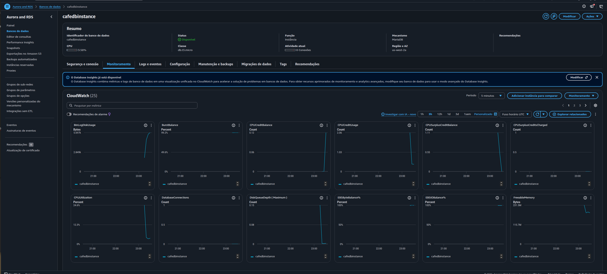
*Dashboard de monitoramento da `cafedbinstance` no console RDS: `CPUUtilization` (pico durante o provisionamento), `DatabaseConnections` (1 conexão registrada durante o teste interativo), `FreeableMemory`, `BurstBalance`, entre outras*

**Métricas monitoradas:**

| Métrica | O que indica |
|---|---|
| CPUUtilization | % de uso de CPU da instância |
| DatabaseConnections | Número de conexões ativas |
| FreeStorageSpace | Espaço de armazenamento disponível |
| FreeableMemory | RAM disponível na instância |
| WriteIOPS / ReadIOPS | Operações de I/O por segundo |

---

## 🔐 Conceitos-Chave Aprendidos

### Amazon RDS — Banco de Dados Gerenciado

O Amazon RDS elimina tarefas operacionais como instalação, aplicação de patches, backup e recuperação. A AWS gerencia a infraestrutura; o usuário gerencia apenas os dados e as configurações de acesso.

```
Banco local (EC2):
  Você gerencia: SO, MariaDB, backups, patches, HA ❌ trabalhoso

Amazon RDS:
  AWS gerencia: infraestrutura, backups automáticos, patches de engine
  Você gerencia: dados, security groups, parâmetros ✅
```

### DB Subnet Group — Por que duas sub-redes?

O RDS exige um DB Subnet Group com sub-redes em pelo menos duas Zonas de Disponibilidade diferentes, mesmo que a instância rode em apenas uma AZ. Isso é um pré-requisito da AWS para garantir que a instância possa ser movida em caso de falha de AZ (Multi-AZ ou recuperação).

### SSM Parameter Store — Separação de Configuração e Código

Em vez de hardcodar o endpoint do banco na aplicação, o lab usa o Parameter Store para externalizar essa configuração. Isso permite trocar o banco de dados (de local para RDS, por exemplo) sem alterar o código da aplicação — basta atualizar um parâmetro.

```
Sem Parameter Store:
  Trocar banco → alterar código → redeploy da aplicação ❌

Com Parameter Store:
  Trocar banco → atualizar /cafe/dbUrl → aplicação já usa o novo banco ✅
```

### mysqldump — Backup Lógico de Banco de Dados

O `mysqldump` gera um arquivo SQL com instruções `CREATE DATABASE`, `CREATE TABLE` e `INSERT` que reproduzem fielmente o banco original. É o método mais simples para migrações de menor escala ou em cenários onde downtime é aceitável.

```bash
# Exportar
mysqldump --databases cafe_db --add-drop-database > backup.sql

# Importar em outro host
mysql --host=<novo-endpoint> < backup.sql
```

### Troubleshooting Documentado

| Problema | Causa | Solução |
|---|---|---|
| `argument --cidr-block is required` | Barras `\` corrompidas pelo EC2 Instance Connect ao colar | Executar comando em linha única |
| `Cannot find version 10.5.13` | Versão descontinuada no ambiente do lab | Consultar versões disponíveis com `describe-db-engine-versions` e usar `10.6.25` |
| `DBSubnetGroupAlreadyExists` | Tentativa de criar recurso já existente | Ignorar — recurso já foi criado com sucesso anteriormente |
| `DBInstanceAlreadyExists` | Segunda tentativa de criar a mesma instância | Ignorar — instância já estava em provisionamento |

## 🚀 Como Reproduzir este Lab

### Pré-requisitos
- Acesso ao AWS Academy Lab
- Navegador web com EC2 Instance Connect disponível
- Valores do lab: `AccessKey`, `SecretKey`, `CafeVpcID`, `CafeInstanceAZ`, `CafeSecurityGroupID`, `CafeInstanceURL`

### Resumo do Passo a Passo

1. **Gerar dados** — Acessar o site da cafeteria e fazer pedidos
2. **CLI Host → aws configure** — Configurar credenciais
3. **Criar CafeDatabaseSG** — Security Group com inbound 3306 do CafeSecurityGroup
4. **Criar sub-redes privadas** — `10.200.2.0/23` (us-west-2a) e `10.200.10.0/23` (us-west-2b)
5. **Criar DB Subnet Group** — Agrupar as duas sub-redes
6. **Criar instância RDS** — MariaDB, db.t3.micro, 20 GB, `--no-publicly-accessible`
7. **Aguardar `available`** — Monitorar com `describe-db-instances`
8. **CafeInstance → mysqldump** — Exportar banco local
9. **Restaurar no RDS** — `mysql --host=<endpoint> < backup.sql`
10. **Validar** — `select * from product` no RDS
11. **SSM Parameter Store** — Atualizar `/cafe/dbUrl` com o endpoint RDS
12. **Testar site** — Verificar pedidos históricos e fazer novos pedidos
13. **CloudWatch** — Monitorar métricas no console RDS

## 📊 Resultados

| Métrica | Valor |
|---|---|
| Engine migrada | MariaDB local (EC2) → Amazon RDS MariaDB 10.6.25 |
| Classe da instância | db.t3.micro |
| Armazenamento | 20 GB (gp2) |
| Disponibilidade | us-west-2a |
| Método de migração | `mysqldump` + restore via `mysql` |
| Integridade dos dados | ✅ Pedidos históricos preservados |
| Reconfiguração da aplicação | ✅ Via SSM Parameter Store (sem alteração de código) |
| Monitoramento | ✅ CloudWatch com DatabaseConnections validado em tempo real |

## 📚 Recursos Adicionais

- [Documentação Amazon RDS](https://docs.aws.amazon.com/rds/)
- [AWS CLI — Referência RDS](https://awscli.amazonaws.com/v2/documentation/api/latest/reference/rds/index.html)
- [Monitoramento de métricas no Amazon RDS](https://docs.aws.amazon.com/AmazonRDS/latest/UserGuide/MonitoringOverview.html)
- [AWS Systems Manager Parameter Store](https://docs.aws.amazon.com/systems-manager/latest/userguide/systems-manager-parameter-store.html)
- [mysqldump — Documentação](https://dev.mysql.com/doc/refman/8.0/en/mysqldump.html)
- [AWS Academy](https://aws.amazon.com/training/awsacademy/)

## 👨‍💻 Autor

**Matheus Lima**

Estudante — Escola da Nuvem | Programa Re/Start AWS

---

## 📄 Licença

Este projeto é parte do Programa Re/Start AWS e está disponível para fins de estudo e portfólio.

---

<div align="center">

[](https://aws.amazon.com/training/awsacademy/)
[](https://aws.amazon.com/rds/)
[](https://mariadb.org/)
[](https://aws.amazon.com/cli/)
[](https://aws.amazon.com/systems-manager/)

</div>
