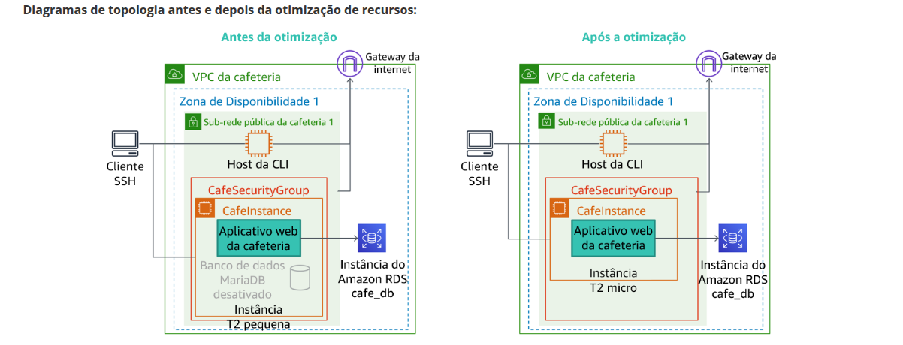
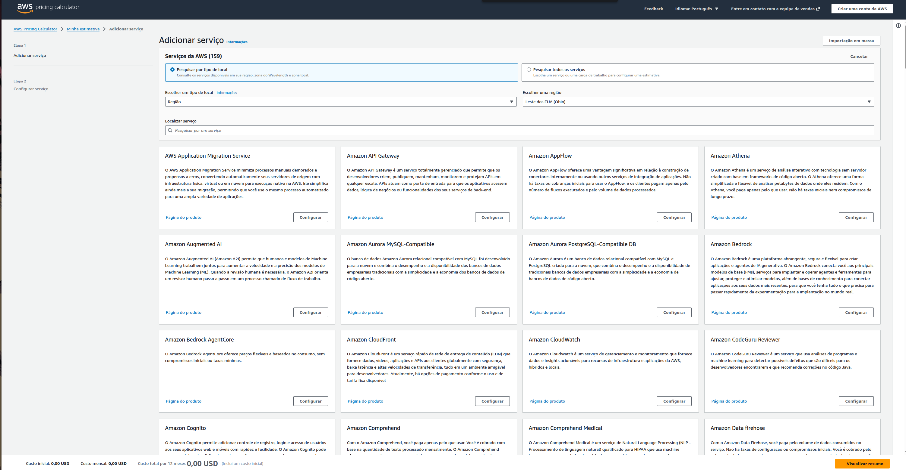
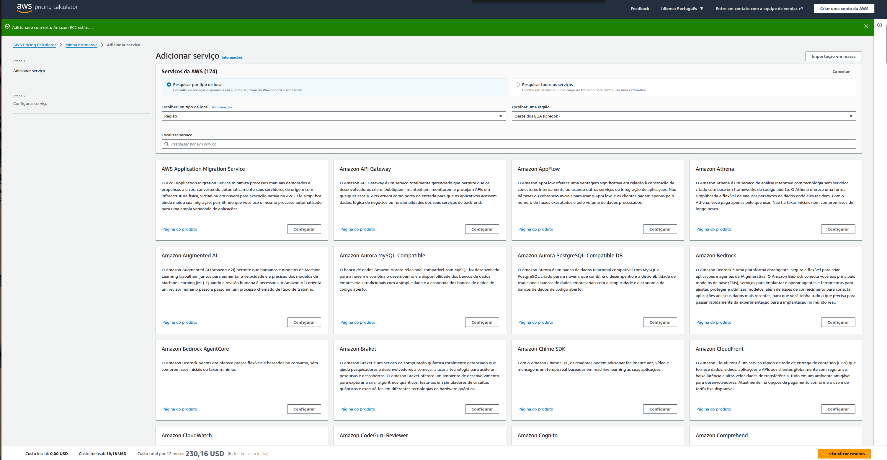
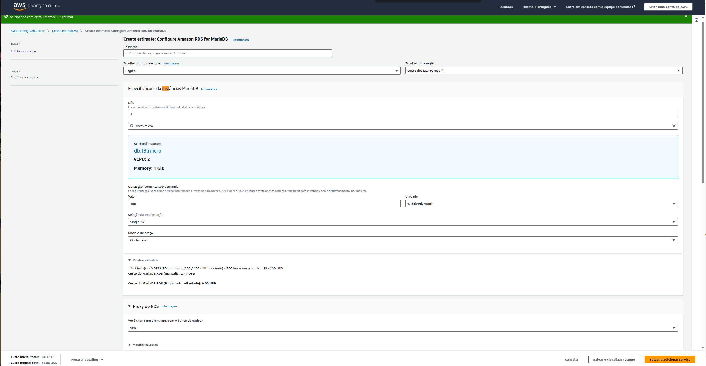
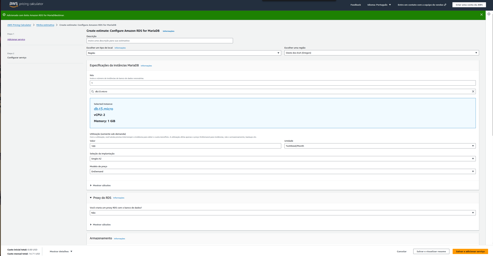
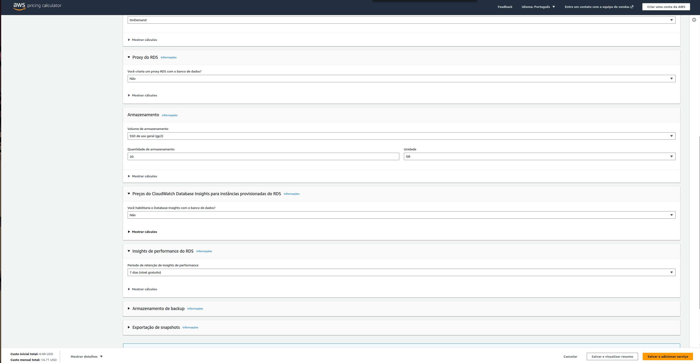
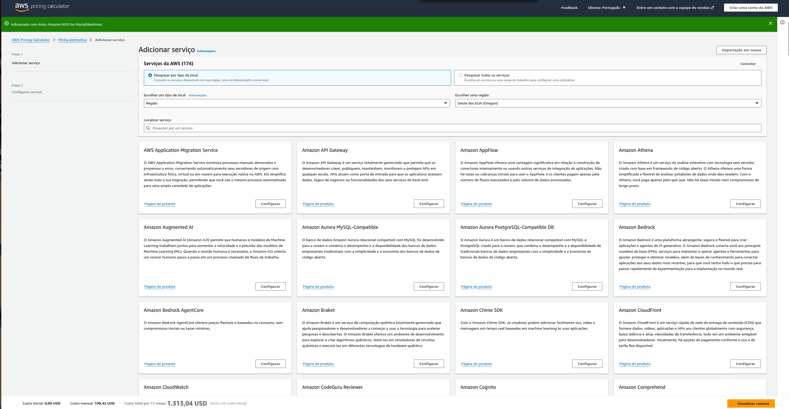
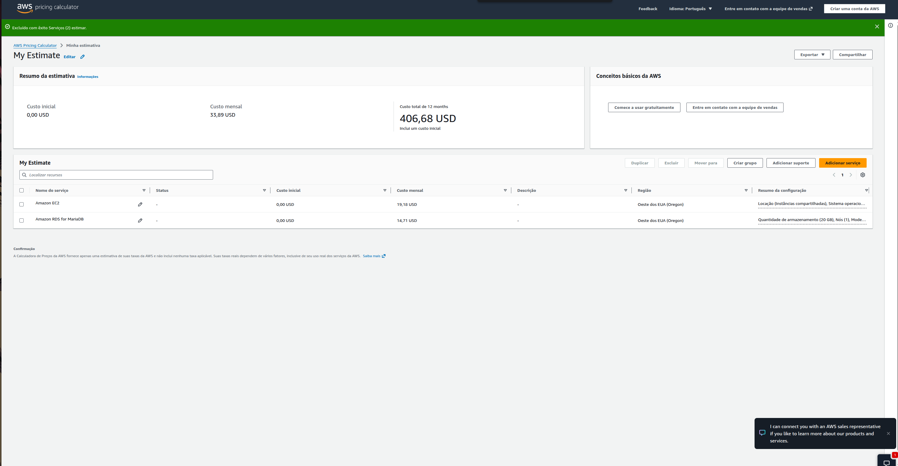
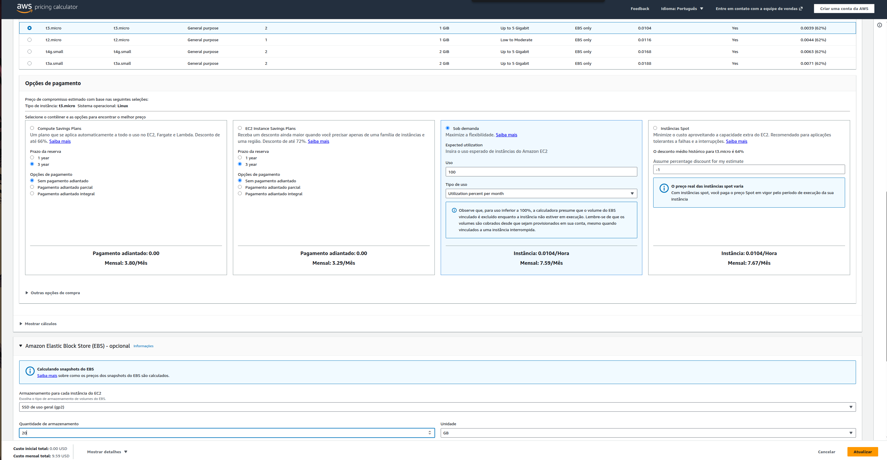

# Lab AWS — Optimize Resource Utilization (EC2 + AWS Pricing Calculator)

## 📋 About This Lab

This lab is part of the **AWS re/Start** program through **Escola da Nuvem**, focused on optimizing an existing AWS infrastructure to reduce costs. After migrating a local MariaDB database to Amazon RDS in a previous lab, this activity demonstrates how to right-size an EC2 instance and estimate cost savings using the AWS Pricing Calculator.

## 🎯 Objectives

After completing this lab, I was able to:

- ✅ Uninstall a decommissioned local database from an EC2 instance using the AWS CLI
- ✅ Stop, resize, and restart an EC2 instance via the AWS CLI (`modify-instance-attribute`)
- ✅ Validate that a web application continues to function after instance resize
- ✅ Use the AWS Pricing Calculator to estimate costs before and after optimization
- ✅ Calculate projected monthly and annual cost savings

## 🏗️ Architecture

### Before vs. After Optimization



| Component | Before Optimization | After Optimization |
|---|---|---|
| EC2 Instance Type | t3.small | **t3.micro** |
| EBS Storage | 40 GB (incl. unused local DB) | **20 GB** |
| Local MariaDB | Installed (decommissioned) | **Removed** |
| Amazon RDS | db.t3.micro — MariaDB | db.t3.micro — MariaDB (unchanged) |
| Region | us-west-2 (Oregon) | us-west-2 (Oregon) |

## 🔧 Services Used

- **Amazon EC2** — Compute instance hosting the Café web application
- **Amazon RDS for MariaDB** — Managed database (migrated in previous lab)
- **Amazon EBS** — Block storage attached to EC2
- **AWS CLI** — Used to stop, resize, and start the instance
- **AWS Pricing Calculator** — Cost estimation tool

## 📝 Lab Tasks

### Task 1: Optimize the EC2 Instance

#### Task 1.1 — Connect via SSH and Configure AWS CLI

Connected to **CafeInstance** via SSH and configured the AWS CLI with the lab credentials:

```bash
aws configure
# AWS Access Key ID: <from lab credentials>
# AWS Secret Access Key: <from lab credentials>
# Default region name: us-west-2
# Default output format: json
```

Also connected to the **CLI Host** instance, which was used for all subsequent EC2 management commands.

#### Task 1.2 — Uninstall the Local MariaDB Database

On the CafeInstance SSH session:

```bash
sudo systemctl stop mariadb
sudo yum -y remove mariadb-server
# Output: Complete!
```

#### Task 1.3 — Resize the EC2 Instance (t3.small → t3.micro)

From the CLI Host session:

**1. Get the Instance ID:**
```bash
aws ec2 describe-instances \
  --filters "Name=tag:Name,Values=CafeInstance" \
  --query "Reservations[*].Instances[*].InstanceId"
# Result: i-0c2193d4812028bff
```

**2. Stop the instance:**
```bash
aws ec2 stop-instances --instance-ids i-0c2193d4812028bff
```

**3. Resize to t3.micro:**
```bash
aws ec2 modify-instance-attribute \
  --instance-id i-0c2193d4812028bff \
  --instance-type "{\"Value\": \"t3.micro\"}"
```

**4. Start the instance:**
```bash
aws ec2 start-instances --instance-ids i-0c2193d4812028bff
```

**5. Verify the new state:**
```bash
aws ec2 describe-instances \
  --instance-ids i-0c2193d4812028bff \
  --query "Reservations[*].Instances[*].[InstanceType,PublicDnsName,PublicIpAddress,State.Name]"
```

```json
[
  [
    [
      "t3.micro",
      "ec2-34-216-37-131.us-west-2.compute.amazonaws.com",
      "34.216.37.131",
      "running"
    ]
  ]
]
```

#### Task 1.4 — Validate the Web Application

After the resize, accessed the Café web application to confirm it remained fully functional:


URL accessed: `http://ec2-34-216-37-131.us-west-2.compute.amazonaws.com/cafe`

---

### Task 2: Estimate Costs with AWS Pricing Calculator

#### Task 2.1 — Cost Before Optimization

Opened [calculator.aws](https://calculator.aws) and configured two services for the **us-west-2 (Oregon)** region.

**AWS Pricing Calculator — home screen:**



**EC2 configuration (before):**



| Parameter | Value |
|---|---|
| Instance type | t3.small |
| OS | Linux |
| Workload | Constant usage (100%) |
| Pricing model | On-Demand |
| EBS type | gp2 |
| EBS size | 40 GB |
| Snapshots | None |



**RDS configuration:**



| Parameter | Value |
|---|---|
| Instance type | db.t3.micro |
| Engine | MariaDB |
| Deployment | Single-AZ |
| Utilization | 100% / month |
| Pricing model | On-Demand |
| RDS Proxy | No |
| Storage type | gp2 |
| Storage size | 20 GB |
| Database Insights | No |



**Estimate before optimization:**



| Service | Monthly Cost |
|---|---|
| Amazon EC2 (t3.small, 40 GB) | $19.18 |
| Amazon RDS for MariaDB (db.t3.micro, 20 GB) | $14.71 |
| **Total** | **$33.89 / month** |

🔗 [Public estimate link — Before optimization](https://calculator.aws/#/estimate?id=0ccb130c7810234b9facb90b9745708577ab9d63)

---

#### Task 2.2 — Cost After Optimization

Edited the EC2 service entry, changing only:
- Instance type: `t3.small` → **`t3.micro`**
- EBS size: `40 GB` → **`20 GB`**



**Estimate after optimization:**



| Service | Monthly Cost |
|---|---|
| Amazon EC2 (t3.micro, 20 GB) | $9.59 |
| Amazon RDS for MariaDB (db.t3.micro, 20 GB) | $14.71 |
| **Total** | **$24.30 / month** |

---

#### Task 2.3 — Projected Cost Savings

```
Before optimization:
    Amazon EC2 (t3.small, 40 GB EBS)     $19.18 / month
    Amazon RDS (db.t3.micro, 20 GB)      $14.71 / month
                                         ──────────────
    Total                                $33.89 / month

After optimization:
    Amazon EC2 (t3.micro, 20 GB EBS)      $9.59 / month
    Amazon RDS (db.t3.micro, 20 GB)      $14.71 / month
                                         ──────────────
    Total                                $24.30 / month

Monthly savings                           $9.59 / month
Annual savings                          ~$115.08 / year
```

## 💡 Key Concepts and Learnings

**1. Right-Sizing EC2 Instances**
When a workload changes (e.g., removing a local database process), the instance type can be reduced. `modify-instance-attribute` requires the instance to be stopped — it cannot be changed while running.

**2. Storage Optimization**
Removing unused software (MariaDB) freed 20 GB of EBS storage. EBS is billed by provisioned capacity, so reducing it directly lowers costs even if the instance type stays the same.

**3. AWS Pricing Calculator**
The calculator estimates monthly costs based on service configuration — it does not reflect actual usage, volume discounts, or support plans. It is most useful for comparing architecture options before deployment.

**4. On-Demand vs. Reserved Pricing**
The same t3.micro instance costs $7.59/month On-Demand vs. $3.80/month with a 3-year Compute Savings Plan (shown in the calculator). For predictable, long-running workloads, Reserved or Savings Plan pricing significantly reduces costs.

**5. CLI-Driven Operations**
All instance management (stop, resize, start, verify) was performed via AWS CLI from a separate CLI Host instance — demonstrating that infrastructure changes can be scripted and audited without using the console.

## 📊 Infrastructure Summary

| Resource | Configuration | Notes |
|---|---|---|
| EC2 Instance | t3.micro, Amazon Linux 2 | Downsized from t3.small |
| EBS Volume | gp2, 20 GB | Reduced from 40 GB |
| RDS Instance | db.t3.micro, MariaDB, Single-AZ | Unchanged from previous lab |
| RDS Storage | gp2, 20 GB | Unchanged |
| Region | us-west-2 (Oregon) | — |
| VPC | Café VPC | Public subnet |

## 🔗 References

- [AWS EC2 Instance Types](https://aws.amazon.com/ec2/instance-types/)
- [AWS Pricing Calculator](https://calculator.aws)
- [modify-instance-attribute CLI reference](https://docs.aws.amazon.com/cli/latest/reference/ec2/modify-instance-attribute.html)
- [Amazon EBS Pricing](https://aws.amazon.com/ebs/pricing/)
- [Amazon RDS Pricing](https://aws.amazon.com/rds/pricing/)

## 👨‍💻 Author

**Matheus Lima**
Student — Escola da Nuvem / AWS re/Start Program

---

<div align="center">

[](https://aws.amazon.com/training/restart/)
[](https://aws.amazon.com/ec2/)
[](https://aws.amazon.com/rds/)
[](https://aws.amazon.com/ebs/)
[](https://aws.amazon.com/cli/)

</div>
