# Lab AWS — VPC Troubleshooting

## 📋 Sobre o Lab

Este laboratório faz parte do **Programa Re/Start AWS** através da **Escola da Nuvem**, focado em diagnóstico e solução de problemas de configuração de rede em Amazon VPC, além de criação e análise de VPC Flow Logs.

## 🎯 Objetivos

Ao concluir este laboratório, pratiquei:

- ✅ Criar um bucket S3 para armazenar VPC Flow Logs
- ✅ Criar e ativar VPC Flow Logs em uma VPC
- ✅ Diagnosticar e corrigir ausência de rota para Internet Gateway (Route Table)
- ✅ Diagnosticar e corrigir regra de deny em Network ACL bloqueando SSH
- ✅ Baixar, extrair e analisar Flow Logs com grep e comandos Linux

## 🏗️ Arquitetura do Lab

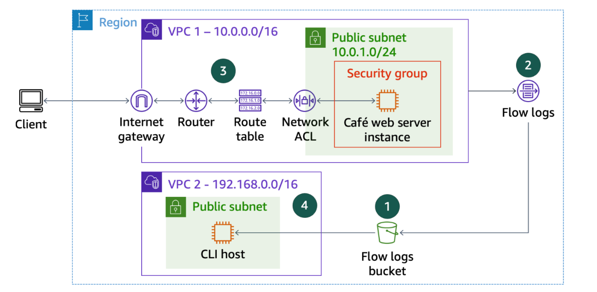
*VPC1 (10.0.0.0/16) com Café Web Server na subnet pública — tráfego passando por IGW → Router → Route Table → Network ACL → Security Group. VPC2 (192.168.0.0/16) com CLI Host usado para troubleshooting via AWS CLI. Flow Logs publicados em bucket S3.*

### Infraestrutura Utilizada

| Componente | Detalhes |
|---|---|
| Café Web Server | Amazon Linux 2 — subnet pública de VPC1 (10.0.1.0/24) |
| CLI Host | Amazon Linux 2 — VPC2 (192.168.0.0/16) — ponto de troubleshooting |
| VPC1 | 10.0.0.0/16 — VPC do Web Server |
| VPC2 | 192.168.0.0/16 — VPC do CLI Host |
| Internet Gateway | igw-04dd2a4d613d3a209 — associado à VPC1 |
| Route Table | rtb-0b1feb9f5ed0a0190 — subnet pública de VPC1 |
| Network ACL | acl-089eca9c22f124e72 — associada à subnet pública |
| Security Group | WebSecurityGroup — portas 22 e 80 |
| S3 Bucket | flowlog662241 — destino dos VPC Flow Logs |
| VPC Flow Log | fl-0b2a8fdac96a58935 — captura ALL traffic em VPC1 |

```
Internet
    │
    ▼
Internet Gateway (igw-04dd2a4d613d3a209)
    │
    ▼
Route Table (rtb-0b1feb9f5ed0a0190)
  ├── 10.0.0.0/16 → local
  └── 0.0.0.0/0  → igw  ← [PROBLEMA 1: rota ausente]
    │
    ▼
Network ACL (acl-089eca9c22f124e72)
  └── Rule 40: DENY TCP port 22  ← [PROBLEMA 2: bloqueio SSH]
    │
    ▼
Security Group (WebSecurityGroup)
  ├── porta 22 → allow
  └── porta 80 → allow
    │
    ▼
Café Web Server EC2
    │
    ▼
VPC Flow Logs → S3 (flowlog662241)
```

## 📝 Etapas Realizadas

### Tarefa 1: Conectar ao CLI Host

Conexão à instância CLI Host via EC2 Instance Connect. Configuração da AWS CLI com `aws configure` usando as credenciais do lab (AccessKey, SecretKey, região `us-west-2`, output `json`).

---

### Tarefa 2: Criar VPC Flow Logs

**Passo 1 — Criar bucket S3:**

```bash
aws s3api create-bucket \
  --bucket flowlog662241 \
  --region us-west-2 \
  --create-bucket-configuration LocationConstraint=us-west-2
```

**Passo 2 — Obter o VPC ID:**

```bash
aws ec2 describe-vpcs \
  --query 'Vpcs[*].[VpcId,Tags[?Key==`Name`].Value,CidrBlock]' \
  --filters "Name=tag:Name,Values='VPC1'"
# Retornou: vpc-02769ff22dcc79f1b
```

**Passo 3 — Criar o Flow Log:**

```bash
aws ec2 create-flow-logs \
  --resource-type VPC \
  --resource-ids vpc-02769ff22dcc79f1b \
  --traffic-type ALL \
  --log-destination-type s3 \
  --log-destination arn:aws:s3:::flowlog662241
```

**Passo 4 — Confirmar ativação:**

```bash
aws ec2 describe-flow-logs
```

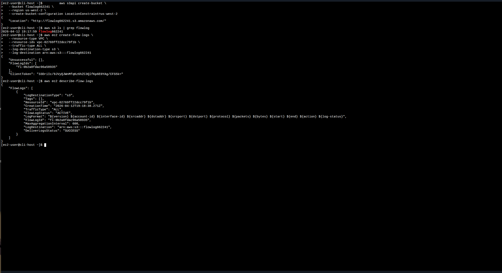
*`describe-flow-logs` confirmando FlowLogStatus: ACTIVE e DeliverLogsStatus: SUCCESS — Flow Log ID: fl-0b2a8fdac96a58935*

---

### Desafio 1: Site inacessível — Route Table sem rota para IGW

Ao tentar acessar o Web Server pelo browser e via SSH, ambos falharam. A investigação começou com `nmap`.

**Diagnóstico com nmap:**

```bash
sudo yum install -y nmap
nmap 34.215.88.101
# Host seems down — try -Pn

nmap -Pn 34.215.88.101
# All 1000 scanned ports are filtered — Host is up
```

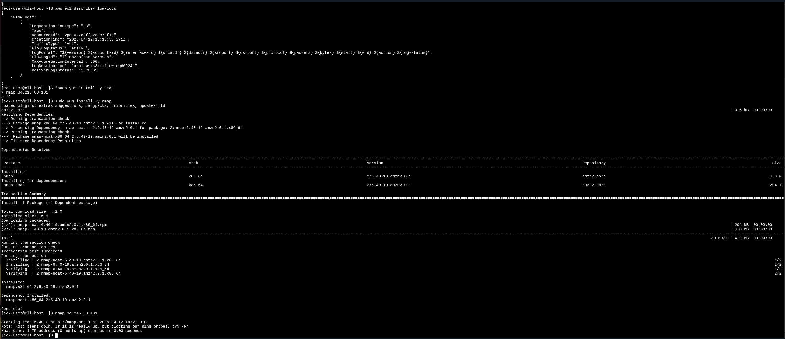
*Instalação do nmap e primeiro scan sem resposta ao ping*

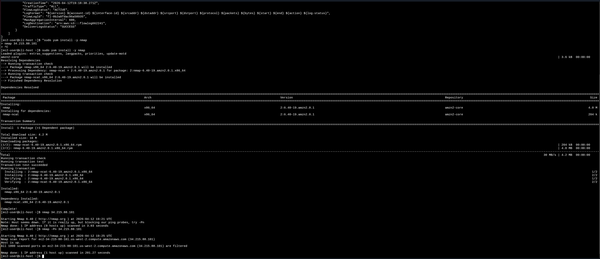
*`nmap -Pn` confirmando que o host está up mas todas as 1000 portas estão filtradas — indício de problema na Route Table*

**Identificação do SubnetId e Route Table:**

```bash
# Obter SubnetId da instância
aws ec2 describe-instances \
  --filter "Name=ip-address,Values='34.215.88.101'" \
  --query 'Reservations[*].Instances[*].[SubnetId]'
# Retornou: subnet-001fc15b5fcd9a655

# Verificar Route Table da subnet
aws ec2 describe-route-tables \
  --filter "Name=association.subnet-id,Values='subnet-001fc15b5fcd9a655'" \
  --query 'RouteTables[*].[RouteTableId,Routes]'
```

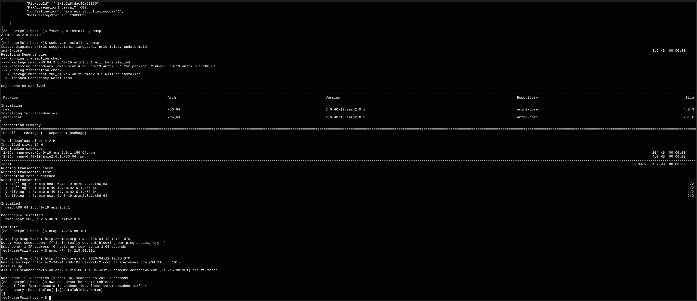
*Route Table `rtb-0b1feb9f5ed0a0190` com apenas rota local (`10.0.0.0/16`). Ausência da rota `0.0.0.0/0 → IGW` impedia todo tráfego externo*

**Correção — Adicionar rota para o Internet Gateway:**

```bash
# Obter IGW ID
aws ec2 describe-internet-gateways \
  --filters "Name=attachment.vpc-id,Values='vpc-02769ff22dcc79f1b'" \
  --query 'InternetGateways[*].[InternetGatewayId]'
# Retornou: igw-04dd2a4d613d3a209

# Criar a rota
aws ec2 create-route \
  --route-table-id rtb-0b1feb9f5ed0a0190 \
  --destination-cidr-block 0.0.0.0/0 \
  --gateway-id igw-04dd2a4d613d3a209
```


*`"Return": true` — rota `0.0.0.0/0 → igw-04dd2a4d613d3a209` criada com sucesso*

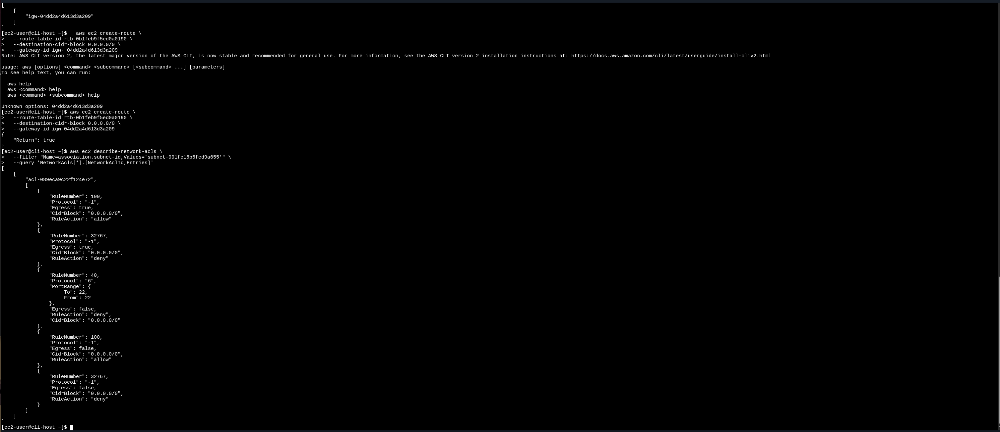
*"Hello From Your Web Server!" — site acessível após criação da rota*

---

### Desafio 2: SSH bloqueado — Network ACL com regra DENY

Mesmo com o site no ar, o EC2 Instance Connect continuava falhando. A investigação apontou para a Network ACL.

**Diagnóstico da Network ACL:**

```bash
aws ec2 describe-network-acls \
  --filter "Name=association.subnet-id,Values='subnet-001fc15b5fcd9a655'" \
  --query 'NetworkAcls[*].[NetworkAclId,Entries]'
```

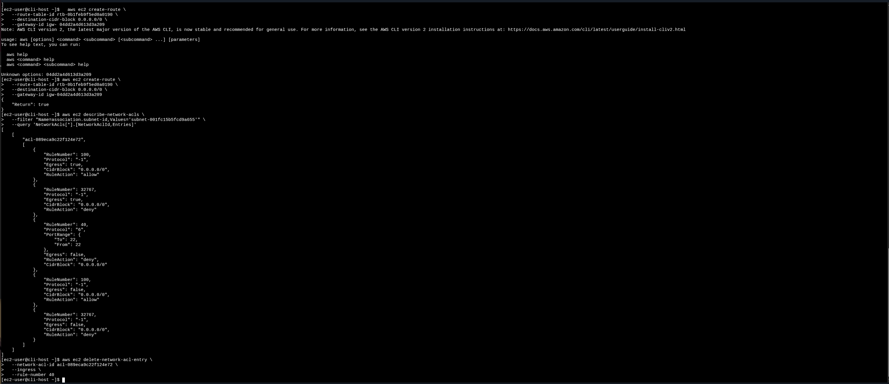
*ACL `acl-089eca9c22f124e72` com regra 40 negando TCP porta 22 (SSH) inbound — processada antes da regra 100 (allow), bloqueando todas as conexões SSH*

Network ACLs processam regras em **ordem numérica crescente** e param na primeira correspondência. A regra 40 (DENY porta 22) é avaliada antes da regra 100 (ALLOW all), então o tráfego SSH é bloqueado independentemente da regra permissiva posterior.

**Correção — Remover regra DENY:**

```bash
aws ec2 delete-network-acl-entry \
  --network-acl-id acl-089eca9c22f124e72 \
  --ingress \
  --rule-number 40
```

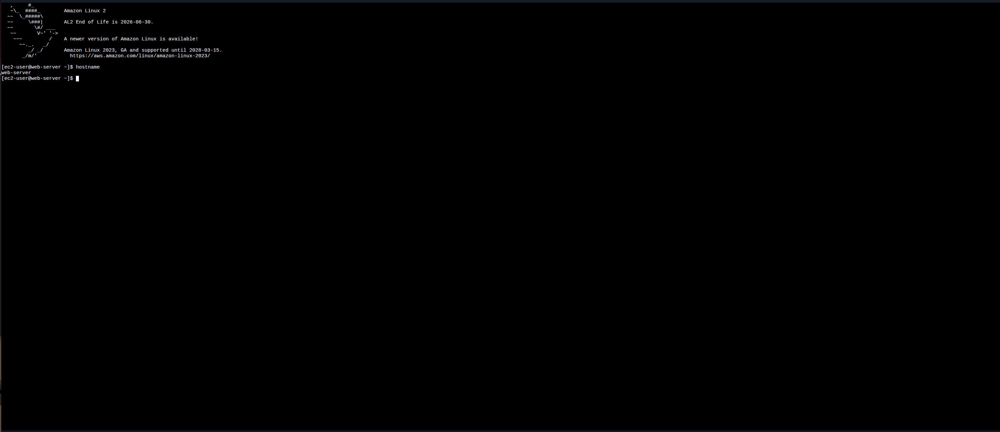
*Comando executado sem erros — regra 40 removida*

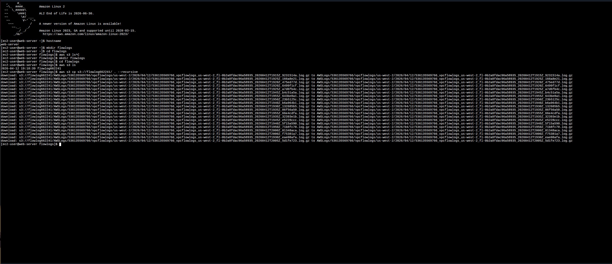
*EC2 Instance Connect conectado com sucesso — `hostname` retornou `web-server`, confirmando a instância correta*

---

### Tarefa 4: Analisar os Flow Logs

Com os dois problemas resolvidos, os Flow Logs capturaram toda a atividade do período de troubleshooting.

**Download e extração:**

```bash
mkdir flowlogs && cd flowlogs
aws s3 cp s3://flowlog662241/ . --recursive
cd AWSLogs/536135569766/vpcflowlogs/us-west-2/2026/04/12/
gunzip *.gz
```

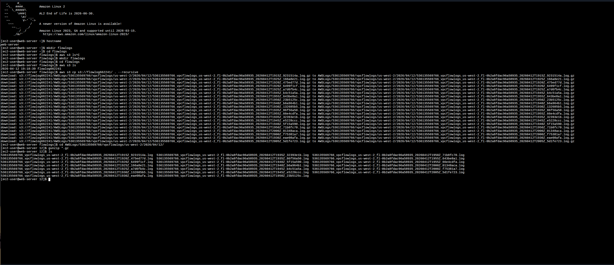
*Download recursivo de todos os arquivos `.log.gz` do bucket `flowlog662241`*

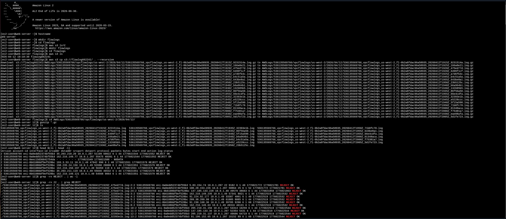
*Arquivos descompactados com `gunzip` — estrutura do log visível com `head`: version, account-id, interface-id, srcaddr, dstaddr, srcport, dstport, protocol, packets, bytes, start, end, action, log-status*

**Análise dos REJECTs:**

```bash
# Total de eventos rejeitados
grep -rn REJECT . | wc -l
# Resultado: 3082

# Filtrar por porta 22
grep -rn 22 . | grep REJECT

# Filtrar por IP de origem específico
grep -rn 22 . | grep REJECT | grep <ip-address>

# Converter Unix timestamp para data legível
date -d @1776021551
# Sun Apr 12 19:19:11 UTC 2026
```

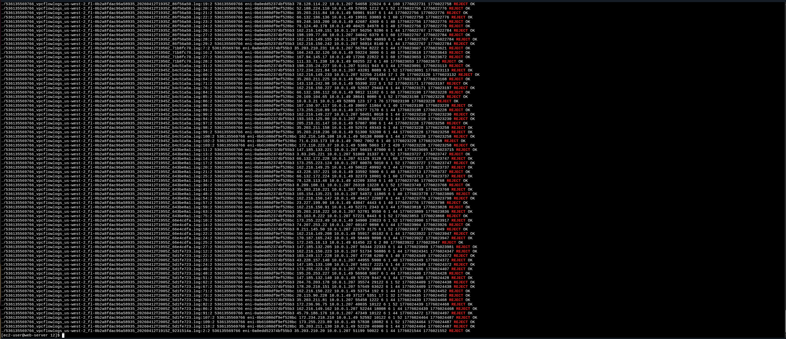
*3082 REJECTs no total — filtro por porta 22 mostrando as tentativas SSH bloqueadas pela Network ACL antes da correção*

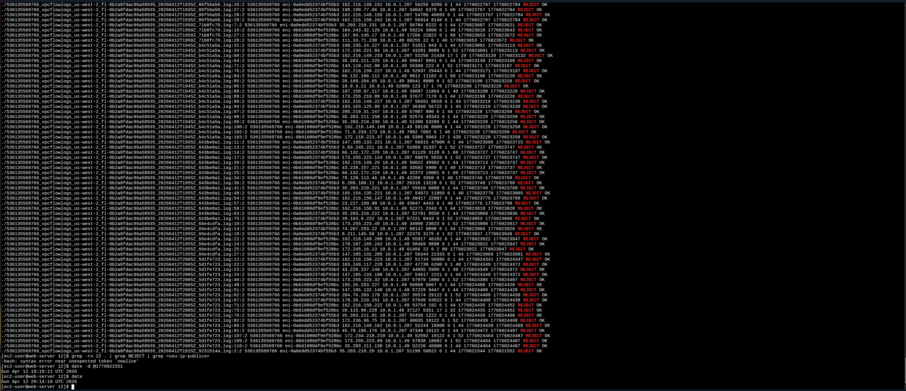
*Timestamp Unix convertido para formato legível — bate com o horário das tentativas SSH bloqueadas durante o lab*

---

## 🔐 Conceitos-Chave Aprendidos

### VPC Flow Logs

Flow Logs capturam metadados de tráfego IP que passa pelas interfaces de rede de uma VPC. Cada registro inclui IP de origem/destino, portas, protocolo, número de pacotes/bytes, timestamps e a ação resultante (ACCEPT ou REJECT). Os logs são publicados no S3 com um intervalo de agregação padrão de 10 minutos.

Formato de um registro:

```
version account-id interface-id srcaddr dstaddr srcport dstport protocol packets bytes start end action log-status
2       536135...  eni-0b61...   1.2.3.4 10.0.1.49 54321  22     6        1      40   17760... 17760... REJECT OK
```

### Route Table — Roteamento de Tráfego

A Route Table determina para onde o tráfego de uma subnet é encaminhado. Uma subnet pública **precisa** de uma rota `0.0.0.0/0 → Internet Gateway` para que instâncias com IP público sejam acessíveis pela internet. Sem essa rota, todo tráfego externo é descartado silenciosamente.

| Destino | Alvo | Propósito |
|---|---|---|
| 10.0.0.0/16 | local | Tráfego interno da VPC |
| 0.0.0.0/0 | igw-xxxxxxxx | Tráfego para/da internet ← **obrigatório em subnet pública** |

### Network ACL vs. Security Group

| Característica | Network ACL | Security Group |
|---|---|---|
| Nível de atuação | Subnet | Instância |
| Stateful? | ❌ Stateless | ✅ Stateful |
| Tipos de regra | Allow e Deny | Apenas Allow |
| Avaliação | Ordem numérica crescente | Todas as regras |
| Default inbound | Allow all | Deny all |

A Network ACL avalia regras em **ordem numérica crescente** e para na primeira correspondência. Uma regra DENY com número menor sobrepõe qualquer regra ALLOW posterior para o mesmo tráfego.

### Fluxo de Troubleshooting de Rede na AWS

```
Instância inacessível?
    │
    ├── nmap -Pn → portas filtradas?
    │       └── describe-route-tables → rota 0.0.0.0/0 ausente?
    │               └── create-route → adicionar rota para IGW
    │
    └── Site ok mas SSH falha?
            └── describe-network-acls → regra DENY porta 22?
                    └── delete-network-acl-entry → remover regra bloqueadora
```

### Comandos grep para Análise de Flow Logs

| Comando | Uso |
|---|---|
| `grep -rn REJECT .` | Encontrar todos os eventos rejeitados |
| `grep -rn REJECT . \| wc -l` | Contar total de rejeições |
| `grep -rn 22 . \| grep REJECT` | Filtrar rejeições na porta 22 |
| `grep -rn 22 . \| grep REJECT \| grep <ip>` | Filtrar por IP específico |
| `date -d @<timestamp>` | Converter Unix timestamp para data legível |

## 💡 Principais Aprendizados

1. **Layer de troubleshooting importa** — O fluxo correto é Route Table → Network ACL → Security Group. Verificar na ordem certa economiza tempo e evita diagnósticos errados.

2. **Network ACL é stateless** — Diferente do Security Group, precisa de regras explícitas tanto para inbound quanto outbound. A ordem numérica das regras é determinante: um DENY de número menor sobrepõe qualquer ALLOW posterior.

3. **nmap -Pn é essencial na AWS** — Instâncias EC2 frequentemente bloqueiam ICMP (ping), fazendo o nmap padrão reportar "host down". O `-Pn` força o scan sem depender de resposta ao ping.

4. **Flow Logs não são em tempo real** — Há um intervalo de agregação antes de os registros aparecerem no S3. O padrão é 10 minutos, mas pode variar conforme configuração.

5. **`grep` é suficiente para análise básica** — Para análises avançadas, o Amazon Athena permite consultas SQL diretamente sobre os Flow Logs armazenados no S3, sem necessidade de download manual.

6. **Silêncio = sucesso na AWS CLI** — `delete-network-acl-entry` não retorna saída em caso de sucesso. A ausência de mensagem de erro é a confirmação da operação.

## 📊 Resultados

| Item | Valor |
|---|---|
| VPC Flow Log criado | fl-0b2a8fdac96a58935 — ACTIVE ✅ |
| Bucket S3 | flowlog662241 |
| Problema 1 | Route Table sem rota `0.0.0.0/0 → IGW` |
| Solução 1 | `aws ec2 create-route` para igw-04dd2a4d613d3a209 |
| Problema 2 | Network ACL rule 40 — DENY TCP porta 22 inbound |
| Solução 2 | `aws ec2 delete-network-acl-entry` rule 40 |
| Web Server acessível | ✅ "Hello From Your Web Server!" |
| SSH via EC2 Instance Connect | ✅ hostname = web-server |
| Total de REJECTs nos Flow Logs | 3.082 registros |
| Timestamp validado | Sun Apr 12 19:19:11 UTC 2026 |

## 📚 Recursos Adicionais

- [VPC Flow Logs — Documentação oficial](https://docs.aws.amazon.com/vpc/latest/userguide/flow-logs.html)
- [Flow Log Records — Referência de campos](https://docs.aws.amazon.com/vpc/latest/userguide/flow-logs-records-examples.html)
- [AWS CLI — create-route](https://awscli.amazonaws.com/v2/documentation/api/latest/reference/ec2/create-route.html)
- [AWS CLI — delete-network-acl-entry](https://awscli.amazonaws.com/v2/documentation/api/latest/reference/ec2/delete-network-acl-entry.html)
- [Querying Flow Logs with Amazon Athena](https://docs.aws.amazon.com/vpc/latest/userguide/flow-logs-athena.html)
- [AWS Academy](https://aws.amazon.com/training/awsacademy/)

## 🏆 Certificações Relacionadas

Este laboratório contribui para a preparação das seguintes certificações:

- **AWS Certified Cloud Practitioner**
- **AWS Certified Solutions Architect - Associate**
- **AWS Certified SysOps Administrator - Associate**

## 👨‍💻 Autor

**Matheus Lima**

Estudante — Escola da Nuvem | Programa Re/Start AWS

---

## 📄 Licença

Este projeto é parte do Programa Re/Start AWS e está disponível para fins de estudo e portfólio.

---

<div align="center">

[](https://aws.amazon.com/training/awsacademy/)
[](https://aws.amazon.com/vpc/)
[](https://aws.amazon.com/s3/)
[](https://aws.amazon.com/cli/)

</div>
