# Lab AWS — Troubleshooting de Infraestrutura com AWS CloudFormation

## 📋 Sobre o Lab

Este laboratório faz parte do **Programa Re/Start AWS** através da **Escola da Nuvem**, com foco em troubleshooting de implantações com AWS CloudFormation usando a AWS CLI, detecção de desvios (drift detection) e resolução de problemas em pilhas com estado inconsistente.

## 🎯 Objetivos

Ao concluir este laboratório, pratiquei:

- ✅ Consultar documentos JSON usando expressões **JMESPath** com o parâmetro `--query` da AWS CLI
- ✅ Diagnosticar falhas de criação de pilha CloudFormation analisando eventos com `describe-stack-events`
- ✅ Usar `--on-failure DO_NOTHING` para preservar recursos e investigar logs de instância EC2
- ✅ Analisar o log `cloud-init-output.log` para identificar a causa raiz de falhas em `UserData`
- ✅ Corrigir um template YAML e recriar a pilha com sucesso
- ✅ Detectar desvios (drift) em recursos modificados manualmente fora do CloudFormation
- ✅ Resolver uma falha de `delete-stack` usando `--retain-resources` para preservar um bucket S3 com objetos

## 🏗️ Arquitetura do Lab

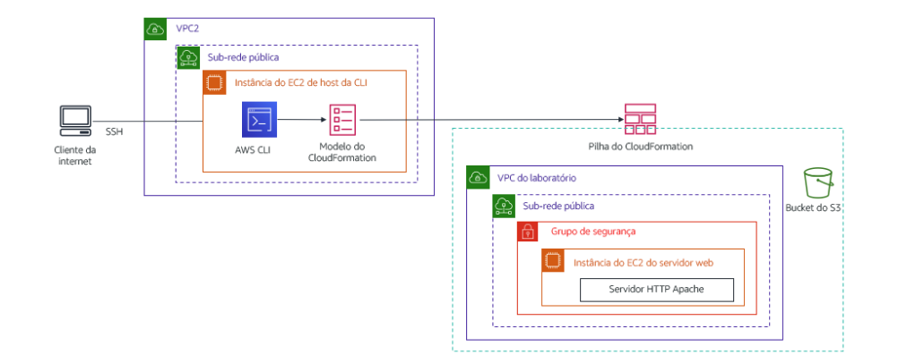
*Infraestrutura implantada via CloudFormation: CLI Host na VPC2 utiliza a AWS CLI para criar uma pilha com VPC customizada, sub-rede pública, Security Group, instância EC2 com Apache e bucket S3.*

### Infraestrutura Provisionada pela Pilha

| Recurso CloudFormation | Tipo AWS | Detalhes |
|---|---|---|
| VPC | AWS::EC2::VPC | CIDR 10.0.0.0/20 — DNS habilitado |
| IGW | AWS::EC2::InternetGateway | Internet Gateway da Lab VPC |
| VPCGatewayAttachment | AWS::EC2::VPCGatewayAttachment | Attach do IGW à VPC |
| PublicSubnet | AWS::EC2::Subnet | CIDR 10.0.0.0/24 — MapPublicIpOnLaunch: true |
| RouteTable | AWS::EC2::RouteTable | Tabela de rotas pública |
| Route | AWS::EC2::Route | 0.0.0.0/0 → IGW |
| SubnetRouteTableAssociation | AWS::EC2::SubnetRouteTableAssociation | Associação subnet ↔ route table |
| WebServerSG | AWS::EC2::SecurityGroup | TCP 22 e TCP 80 abertos (0.0.0.0/0) |
| MyBucket | AWS::S3::Bucket | Bucket com nome gerado automaticamente |
| WebServer | AWS::EC2::Instance | t3.micro — Amazon Linux 2 — Apache httpd |
| WaitCondition | AWS::CloudFormation::WaitCondition | Aguarda conclusão do UserData (timeout: 60s) |
| WaitConditionHandle | AWS::CloudFormation::WaitConditionHandle | Handle para sinal de sucesso do UserData |

### Fluxo de Troubleshooting

```
Tentativa 1 — create-stack (sem --on-failure)
    WaitCondition expirou → Rollback automático
    Todos os recursos deletados → impossível investigar
         │
         ▼
Tentativa 2 — create-stack --on-failure DO_NOTHING
    WaitCondition expirou → pilha parada em CREATE_FAILED
    EC2 preservada → SSH → cloud-init-output.log
    Bug identificado: "yum install -y http" → pacote inexistente
         │
         ▼
Fix aplicado no template1.yaml
    Linha 128: "http" → "httpd"
    delete-stack + create-stack novamente
         │
         ▼
Tentativa 3 — Sucesso!
    Todos os recursos: CREATE_COMPLETE
    Web server respondendo: "Hello from your web server!"
```

## 🔧 Tecnologias e Serviços Utilizados

- **AWS CloudFormation** — Provisionamento e troubleshooting de infraestrutura via IaC
- **Amazon VPC** — Rede privada virtual com subnet pública e Internet Gateway
- **Amazon EC2** — Web Server com Apache httpd instalado via UserData
- **Amazon S3** — Bucket provisionado e retido após delete-stack
- **AWS CLI** — Interface principal para todos os comandos do lab
- **JMESPath** — Linguagem de consulta usada no parâmetro `--query`
- **WaitCondition** — Mecanismo de sinalização para aguardar conclusão do UserData
- **cloud-init** — Sistema de inicialização de instância EC2 (logs analisados)

## 📝 Etapas Realizadas

### Tarefa 1: Prática com JMESPath

Antes de trabalhar com a AWS, praticamos a sintaxe JMESPath no site [jmespath.org](https://jmespath.org/) — a mesma linguagem usada no parâmetro `--query` de todos os comandos da AWS CLI.

| Expressão | O que retorna |
|---|---|
| `desserts` | Array completo de sobremesas |
| `desserts[1]` | Segundo elemento (índice base 0) |
| `desserts[0].name` | Atributo `name` do primeiro elemento |
| `desserts[0].[name,price]` | Múltiplos atributos do primeiro elemento |
| `desserts[].name` | Atributo `name` de todos os elementos |
| `desserts[?name=='Carrot cake']` | Filtro: elemento com nome específico |
| `StackResources[?ResourceType=='AWS::EC2::Instance'].LogicalResourceId` | ID lógico da instância EC2 na pilha |

---

### Tarefa 2.1 — 2.2: Conexão SSH e Configuração da AWS CLI

Conexão SSH ao CLI Host e configuração das credenciais de acesso.

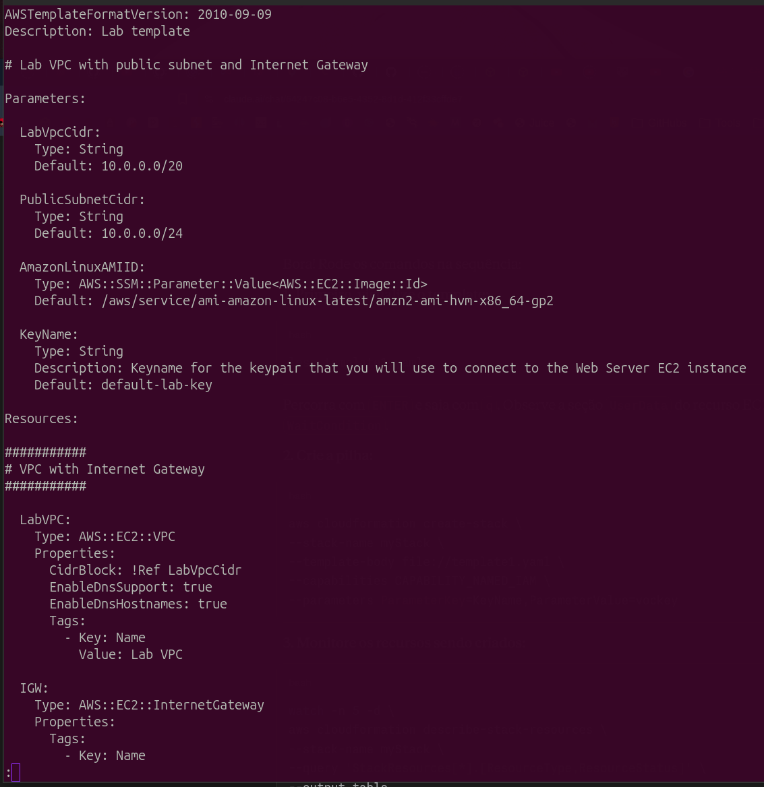
*Conexão SSH estabelecida com o CLI Host. O comando `curl http://169.254.169.254/...` retornou `"region": "us-west-2"` — região usada na configuração da AWS CLI com `aws configure`.*

---

### Tarefa 2.3: Primeira Tentativa — Falha com Rollback

Primeira execução do `create-stack` sem `--on-failure`, que resultou em rollback automático ao falhar.

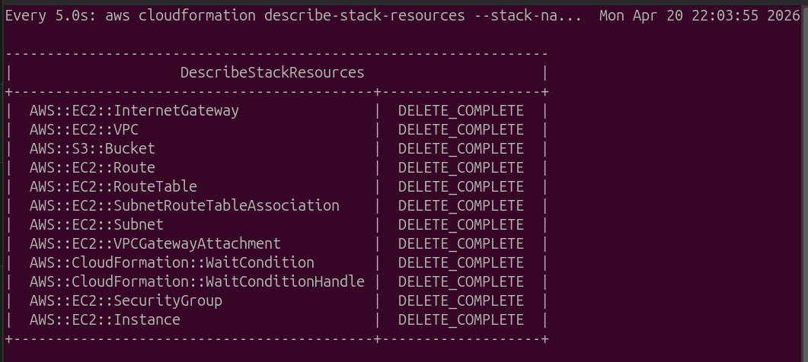
*Todos os recursos com `DELETE_COMPLETE`: o CloudFormation reverteu tudo automaticamente após a falha do WaitCondition. Sem `--on-failure DO_NOTHING`, não há como investigar a instância EC2.*

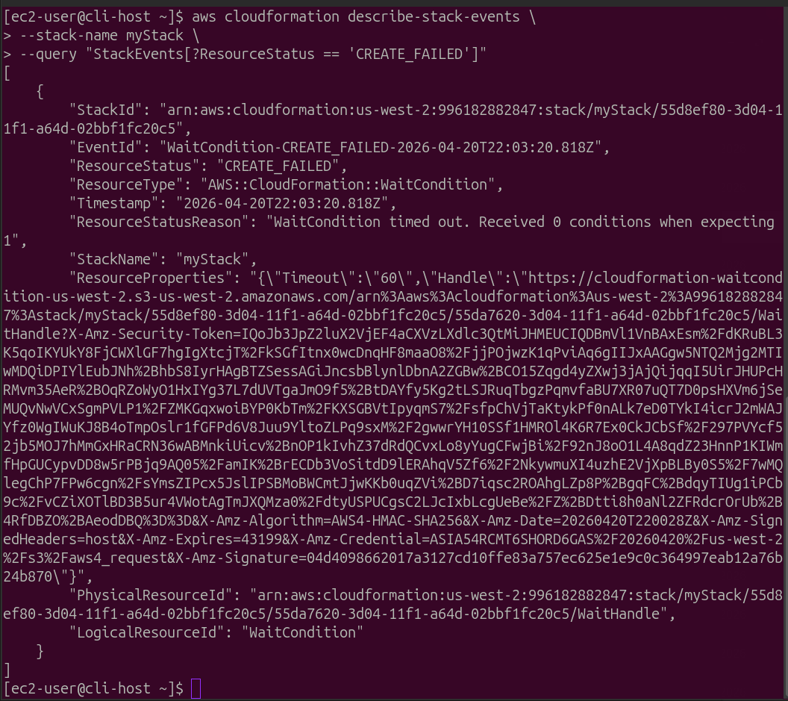
*Saída de `describe-stack-events --query "StackEvents[?ResourceStatus == 'CREATE_FAILED']"` confirmando que o `WaitCondition` expirou: "Received 0 conditions when expecting 1".*

---

### Tarefa 2.4: Segunda Tentativa — `--on-failure DO_NOTHING`

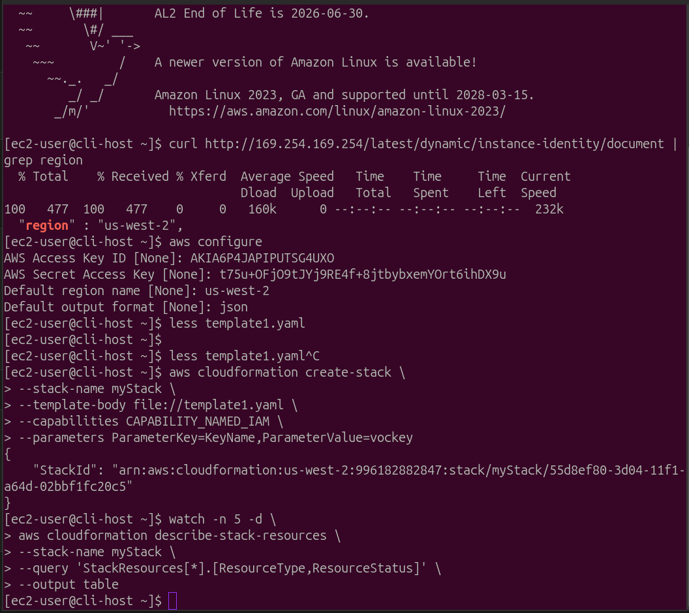
*`aws configure` com as credenciais do lab (região `us-west-2`) e execução do `create-stack` retornando o `StackId` — confirmação de que a criação foi iniciada com sucesso.*

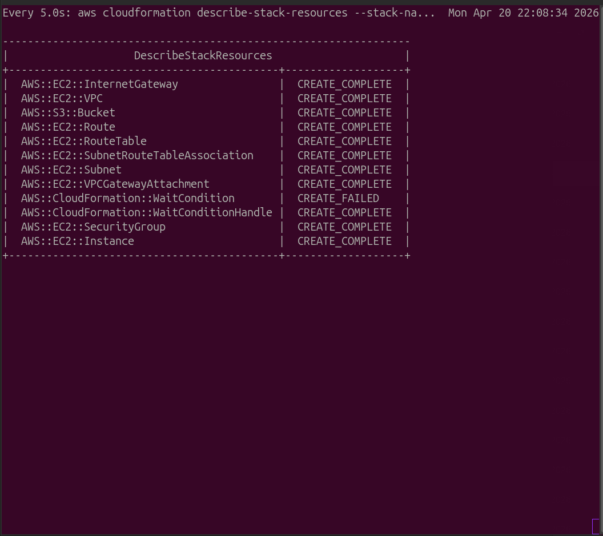
*Com `--on-failure DO_NOTHING`: `WaitCondition` em `CREATE_FAILED` mas `AWS::EC2::Instance` permanece `CREATE_COMPLETE` — instância preservada para investigação.*

---

### Tarefa 2.5: Investigação do Log e Correção do Bug

Acesso à instância Web Server via SSH para analisar o log do cloud-init.

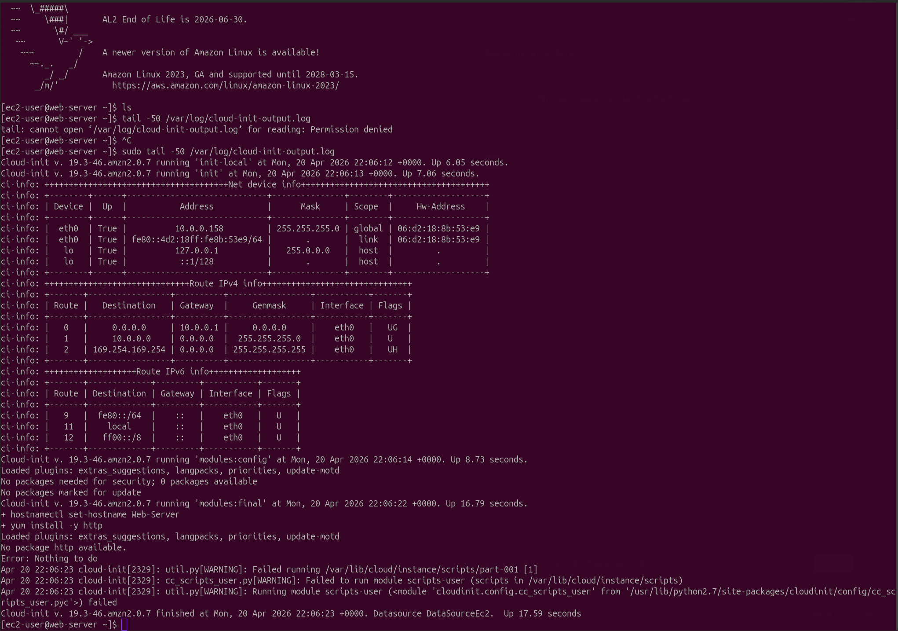
*Log `/var/log/cloud-init-output.log` mostrando a causa raiz: `yum install -y http` → `No package http available` → `Error: Nothing to do`. O parâmetro `-e` no shebang do script fez o UserData abortar imediatamente, impedindo o sinal de sucesso ao WaitCondition.*

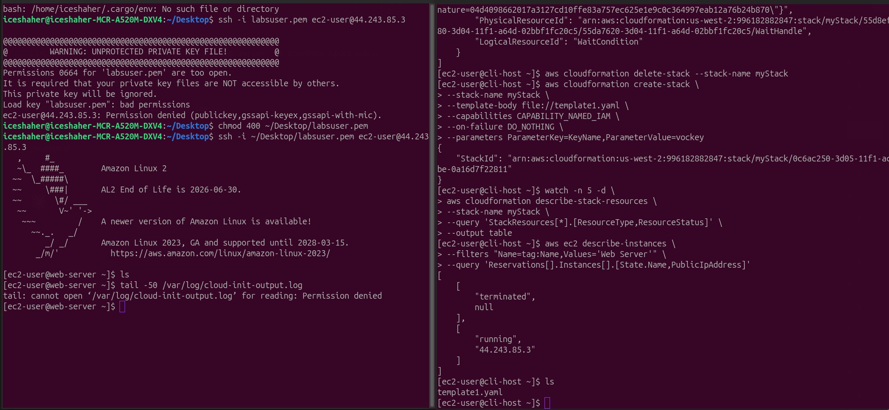
*Conexão SSH ao Web Server (após corrigir permissão do `.pem` com `chmod 400`) e tentativa inicial com `tail` sem `sudo` — negada. Solução: `sudo tail -50 /var/log/cloud-init-output.log`.*

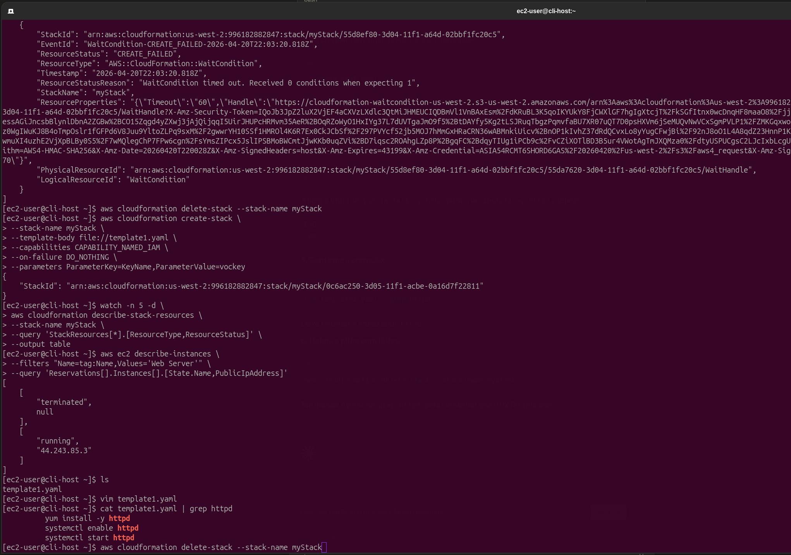
*Template corrigido no `vim`: linha 128 alterada de `yum install -y http` para `yum install -y httpd`. Confirmação com `cat template1.yaml | grep httpd` retornando as 3 linhas corretas: `yum install -y httpd`, `systemctl enable httpd`, `systemctl start httpd`.*

---

### Tarefa 2.6: Terceira Tentativa — Sucesso!

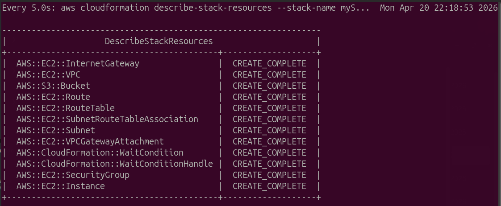
*Após a correção do template: todos os 12 recursos com `CREATE_COMPLETE`, incluindo `AWS::CloudFormation::WaitCondition` — o UserData executou sem erros e enviou o sinal de sucesso dentro do timeout.*

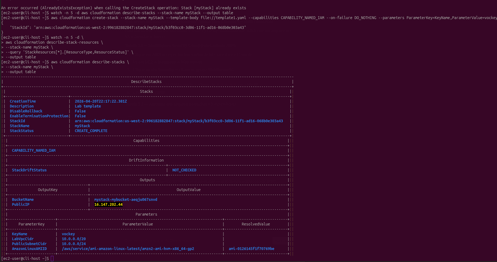
*`describe-stacks` confirmando `StackStatus: CREATE_COMPLETE` com os outputs: `BucketName: mystack-mybucket-aeqju067snvd` e `PublicIP: 16.147.202.44`.*


*Navegador acessando `http://16.147.202.44` e exibindo "Hello from your web server!" — Apache httpd instalado e em execução com sucesso.*

---

### Tarefa 3.1: Modificação Manual do Security Group (Drift Intencional)

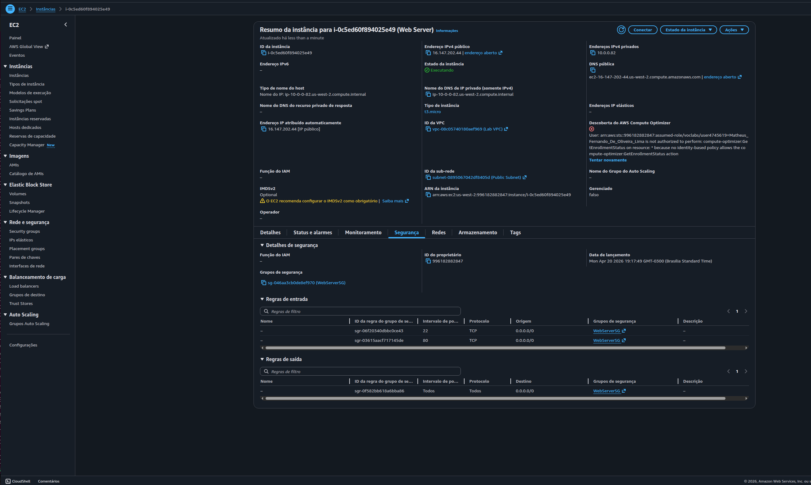
*Instância Web Server no console EC2 (IP `16.147.202.44`, estado `Executando`) com regras de entrada: porta 22 e porta 80 abertas para `0.0.0.0/0` — estado original definido no template.*

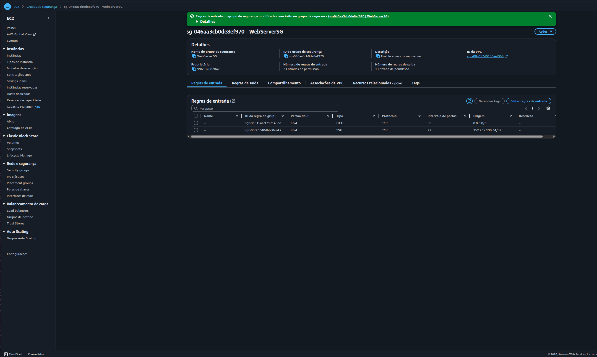
*WebServerSG após edição manual: porta 22 (SSH) restrita ao IP `152.237.190.34/32` (Meu IP) em vez de `0.0.0.0/0`. Modificação feita diretamente no console, fora do CloudFormation — isso cria um drift.*

---

### Tarefa 3.2 e 3.3: Upload para S3 e Drift Detection

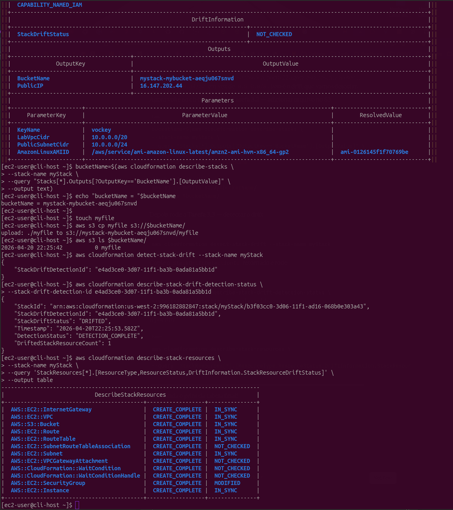
*Resultado completo da Tarefa 3: arquivo `myfile` enviado ao bucket (`aws s3 cp`), drift detectado com `StackDriftStatus: "DRIFTED"` e `DriftedStackResourceCount: 1`. Tabela mostrando `AWS::EC2::SecurityGroup` com status `MODIFIED` — todos os demais `IN_SYNC` ou `NOT_CHECKED`.*

---

### Tarefa 4: Falha no delete-stack — Bucket com Objetos

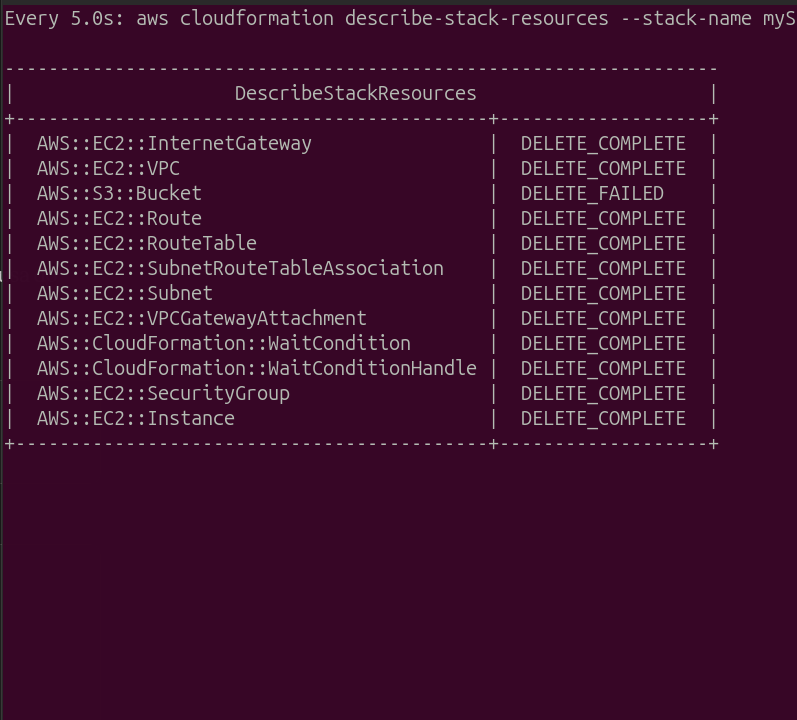
*`delete-stack` falhou: `AWS::S3::Bucket` permanece com `DELETE_FAILED` enquanto todos os outros recursos foram removidos com `DELETE_COMPLETE`. O CloudFormation não deleta buckets que contêm objetos — proteção contra perda acidental de dados.*

---

### Desafio: delete-stack com `--retain-resources`

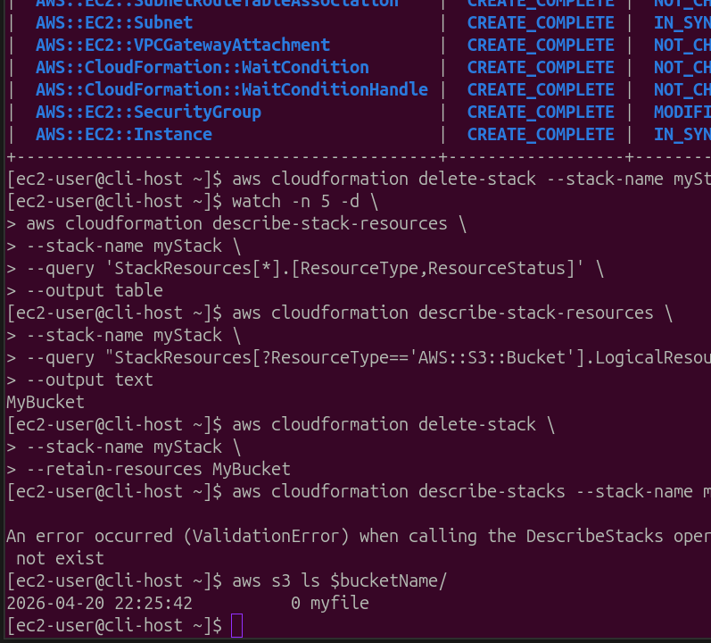
*Solução completa do desafio: `LogicalResourceId` do bucket identificado como `MyBucket` via JMESPath, `delete-stack --retain-resources MyBucket` executado com sucesso. Confirmação: `ValidationError: Stack... does not exist` (pilha removida) + `aws s3 ls $bucketName/` retornando `myfile` (bucket e arquivo preservados).*

---

## 🔐 Conceitos-Chave Aprendidos

### WaitCondition e UserData

O `WaitCondition` aguarda um sinal HTTP de sucesso enviado pelo script `UserData` ao `WaitConditionHandle`. O parâmetro `-e` no shebang (`#!/bin/bash -e`) faz o script abortar imediatamente ao primeiro erro — garantindo que o sinal só seja enviado se toda a instalação ocorrer sem falhas.

```bash
# Script UserData (simplificado)
#!/bin/bash -e          # -e: aborta ao primeiro erro
yum install -y httpd    # se falhar → script para → WaitCondition não recebe sinal → timeout
systemctl enable httpd
systemctl start httpd
# sinal de sucesso enviado ao WaitConditionHandle
```

### Estratégia de Troubleshooting com `--on-failure DO_NOTHING`

```
Sem --on-failure          Com --on-failure DO_NOTHING
─────────────────         ──────────────────────────────
Falha → Rollback          Falha → Pilha parada em CREATE_FAILED
EC2 deletada              EC2 preservada
Log perdido               SSH → /var/log/cloud-init-output.log
Causa raiz: desconhecida  Causa raiz: identificada e corrigida
```

### Drift Detection

O CloudFormation detecta quando recursos gerenciados pela pilha são modificados manualmente fora do IaC. Recursos com status `MODIFIED` indicam divergência entre o estado definido no template e o estado real na AWS.

```
Template define: porta 22 → 0.0.0.0/0
Modificação manual: porta 22 → 152.237.190.34/32
Resultado: SecurityGroup → MODIFIED (drift detectado)
```

> **Importante:** adicionar objetos a um bucket S3 **não** é considerado drift — apenas modificações nas *propriedades* do recurso são detectadas.

### Resolução de delete-stack com `--retain-resources`

Quando um bucket S3 contém objetos, o CloudFormation não consegue deletá-lo por padrão. A solução sem perda de dados é usar `--retain-resources`:

```bash
# 1. Descobrir o LogicalResourceId do bucket
aws cloudformation describe-stack-resources \
  --stack-name myStack \
  --query "StackResources[?ResourceType=='AWS::S3::Bucket'].LogicalResourceId" \
  --output text
# → MyBucket

# 2. Deletar a pilha retendo o bucket
aws cloudformation delete-stack \
  --stack-name myStack \
  --retain-resources MyBucket
```

O bucket (e seu conteúdo) sobrevive à deleção da pilha e passa a ser um recurso independente da AWS.

## 📊 Resultados

| Métrica | Valor |
|---|---|
| Tentativas de create-stack | 3 (1ª rollback, 2ª DO_NOTHING para investigação, 3ª sucesso) |
| Causa raiz identificada | `yum install -y http` → pacote inexistente (correto: `httpd`) |
| Recursos na pilha final | 12 recursos com `CREATE_COMPLETE` |
| Web server | Apache httpd em `http://16.147.202.44` |
| Drift detectado | `AWS::EC2::SecurityGroup` → `MODIFIED` |
| Desafio resolvido | `delete-stack --retain-resources MyBucket` com bucket preservado |

---

## 🗂️ Índice de Screenshots

| Arquivo | Conteúdo |
|---|---|
| `00-arquitetura.png` | Diagrama da arquitetura do lab |
| `01-ssh-region.png` | SSH ao CLI Host + curl retornando região `us-west-2` |
| `02-primeira-tentativa-rollback.png` | Todos os recursos com `DELETE_COMPLETE` após rollback |
| `03-describe-stack-events-create-failed.png` | Evento `CREATE_FAILED` do WaitCondition |
| `04-aws-configure-create-stack.png` | `aws configure` + execução do `create-stack` |
| `05-waitcondition-create-failed-ec2-preservada.png` | WaitCondition `CREATE_FAILED` com EC2 `CREATE_COMPLETE` |
| `06-cloud-init-log-erro-http.png` | Log com `No package http available` |
| `07-ssh-webserver-permissao.png` | SSH ao web-server + erro de permissão sem sudo |
| `08-fix-httpd-grep-confirmacao.png` | Fix aplicado + grep confirmando `httpd` |
| `09-todos-create-complete.png` | Todos os recursos `CREATE_COMPLETE` |
| `10-describe-stacks-create-complete-outputs.png` | `StackStatus: CREATE_COMPLETE` + outputs |
| `11-hello-from-web-server.png` | Página web do servidor Apache |
| `12-web-server-sg-antes.png` | Instância Web Server com SG original no console |
| `13-sg-modificado-meu-ip.png` | WebServerSG com porta 22 restrita ao Meu IP |
| `14-drift-detection-sg-modified.png` | Tabela de drift com SecurityGroup `MODIFIED` |
| `15-delete-failed-s3-bucket.png` | S3 Bucket com `DELETE_FAILED` |
| `16-retain-resources-sucesso.png` | Solução com `--retain-resources` + bucket preservado |

---

## 📚 Recursos Adicionais

- [AWS CloudFormation — Documentação oficial](https://docs.aws.amazon.com/AWSCloudFormation/latest/UserGuide/Welcome.html)
- [WaitCondition e WaitConditionHandle](https://docs.aws.amazon.com/AWSCloudFormation/latest/UserGuide/using-cfn-waitcondition.html)
- [Drift Detection no CloudFormation](https://docs.aws.amazon.com/AWSCloudFormation/latest/UserGuide/using-cfn-stack-drift.html)
- [delete-stack com --retain-resources](https://docs.aws.amazon.com/cli/latest/reference/cloudformation/delete-stack.html)
- [JMESPath — Linguagem de consulta JSON](https://jmespath.org/)
- [cloud-init — Logs de inicialização EC2](https://cloudinit.readthedocs.io/en/latest/reference/logging.html)

## 🏆 Certificações Relacionadas

Este laboratório contribui para a preparação das seguintes certificações:

- **AWS Certified Cloud Practitioner**
- **AWS Certified Solutions Architect - Associate**
- **AWS Certified SysOps Administrator - Associate**
- **AWS Certified DevOps Engineer - Professional**

## 👨‍💻 Autor

**Matheus Lima**

Estudante — Escola da Nuvem | Programa Re/Start AWS

---

## 📄 Licença

Este projeto é parte do Programa Re/Start AWS e está disponível para fins de estudo e portfólio.

---

<div align="center">

[](https://aws.amazon.com/training/awsacademy/)
[](https://aws.amazon.com/cloudformation/)
[](https://aws.amazon.com/ec2/)
[](https://aws.amazon.com/s3/)
[](https://aws.amazon.com/vpc/)
[](https://yaml.org/)
[](https://jmespath.org/)

</div>
