# Lab AWS — Working with AWS CloudTrail

## 📋 Sobre o Lab

Este laboratório faz parte do **Programa Re/Start AWS** através da **Escola da Nuvem**, focado em auditoria de segurança de infraestrutura em nuvem com AWS CloudTrail, análise de logs e resposta a incidentes.

## 🎯 Objetivos

Ao concluir este laboratório, pratiquei:

- ✅ Configurar uma trilha (trail) no AWS CloudTrail para auditar ações na conta
- ✅ Analisar logs do CloudTrail usando o utilitário Linux `grep`
- ✅ Analisar logs do CloudTrail usando comandos AWS CLI
- ✅ Importar dados de log do CloudTrail no Amazon Athena
- ✅ Executar queries SQL no Athena para filtrar entradas de log
- ✅ Identificar o responsável por uma invasão ao servidor web
- ✅ Resolver vulnerabilidades de segurança na conta AWS e na instância EC2

## 🏗️ Arquitetura do Lab

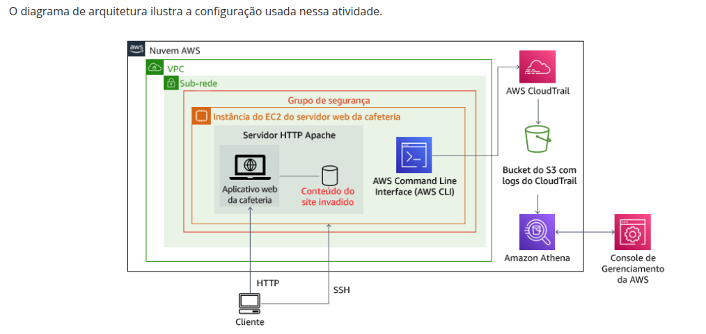
*Fluxo do lab: instância EC2 com servidor Apache hospedando o site do Café, Security Group configurado com regra SSH aberta pelo hacker, CloudTrail capturando eventos para bucket S3, e Amazon Athena consultando os logs via SQL*

### Infraestrutura Utilizada

| Componente | Detalhes |
|---|---|
| Café Web Server | Amazon Linux 2 — t3.micro — servidor Apache com aplicação web |
| HackerInstance | Amazon Linux 2 — t3.micro — instância usada pelo invasor |
| Security Group | `WebSecurityGroup` — porta 80 (HTTP) + porta 22 indevidamente aberta |
| CloudTrail Trail | `monitor` — trilha multi-região com logs em bucket S3 |
| S3 Bucket | `monitoring1266` — armazenamento dos logs do CloudTrail |
| Amazon Athena | Consulta SQL sobre os logs armazenados no S3 |
| IAM User | `chaos` — usuário IAM criado pelo invasor e removido ao final |

O fluxo do lab parte da observação do site normal, passa pela criação do trail, detecção do hack, investigação forense nos logs e finaliza com a remediação completa da conta e do servidor.

```
Console AWS
    │
    └── CloudTrail Trail (monitor)
                │
          S3 Bucket (monitoring1266)
                │
        ┌───────┴────────┐
        │                │
   grep / AWS CLI     Amazon Athena
   (análise direta)   (queries SQL)
        │                │
        └───────┬────────┘
                │
         Hacker identificado: usuário chaos
                │
        ┌───────┴────────────────┐
        │                        │
  Remediação OS             Remediação AWS
  (chaos-user removido,     (regra SSH deletada,
   SSH corrigido,            usuário IAM chaos
   imagem restaurada)        excluído)
```

## 🔧 Tecnologias e Serviços Utilizados

- **AWS CloudTrail** — Auditoria e rastreamento de ações na conta AWS
- **Amazon S3** — Armazenamento dos arquivos de log do CloudTrail
- **Amazon Athena** — Consulta interativa dos logs via SQL padrão
- **Amazon EC2** — Instâncias do servidor web e da HackerInstance
- **AWS CLI** — Filtragem e análise de eventos de segurança via terminal
- **AWS IAM** — Gerenciamento e remoção do usuário invasor
- **Linux grep** — Análise inicial dos arquivos de log JSON
- **SSH / sshd** — Diagnóstico e correção de vulnerabilidade de autenticação

## 📝 Etapas Realizadas

### Tarefa 1: Observar o site e configurar o Security Group

Com a instância `Café Web Server` em execução, o site foi acessado via IP público e confirmado como íntegro. Em seguida, foi adicionada uma regra de entrada SSH (porta 22) restrita ao IP do operador no `WebSecurityGroup`.


*Site do Café exibindo fotos apropriadas de uma cafeteria/padaria — estado normal antes do hack*

**Configurações aplicadas no Security Group:**
- **Tipo:** SSH
- **Porta:** 22
- **Fonte:** My IP (apenas o IP do operador — CIDR /32)

---

### Tarefa 2: Criar a trilha CloudTrail

A trilha `monitor` foi criada para capturar todos os eventos de gerenciamento da conta e armazená-los no bucket S3 `monitoring1266`, com criptografia KMS habilitada.

**Configurações da trilha:**
- **Trail name:** `monitor`
- **S3 bucket:** `monitoring1266`
- **KMS alias:** `IC-KMS`
- **Log file validation:** Habilitado
- **Região:** US West (Oregon)

Após a criação da trilha, o site foi atualizado e uma regra SSH adicional (`0.0.0.0/0`) foi detectada no Security Group — evidência clara da invasão.

---

### Tarefa 3: Analisar os logs com grep e AWS CLI

Com acesso SSH ao `Café Web Server`, os logs do CloudTrail foram baixados do S3 e analisados localmente.

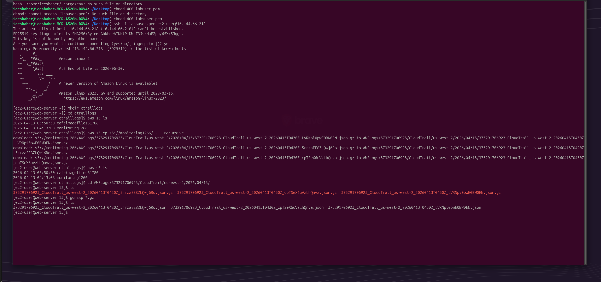
*Sequência: `aws s3 ls` para identificar o bucket, `aws s3 cp --recursive` para baixar os logs, navegação até o subdiretório AWSLogs e `gunzip *.gz` para extrair os arquivos JSON*

**Comandos executados:**

**Step 1 — Criar diretório e baixar logs:**
```bash
mkdir ctraillogs
cd ctraillogs
aws s3 ls
# 2026-04-13 03:50:30 cafelmagefiles61786
# 2026-04-13 04:13:08 monitoring1266

aws s3 cp s3://monitoring1266/ . --recursive
# download: s3://monitoring1266/AWSLogs/.../373291706923_CloudTrail_us-west-2_20260413T0420Z_5rrzaEE8ZLQwj6Ro.json.gz
# download: s3://monitoring1266/AWSLogs/.../373291706923_CloudTrail_us-west-2_20260413T0430Z_cpTSeX6uVzLhQnva.json.gz
# download: s3://monitoring1266/AWSLogs/.../373291706923_CloudTrail_us-west-2_20260413T0430Z_LVRNpi0pwE0BW0EN.json.gz
```

**Step 2 — Navegar e extrair:**
```bash
cd AWSLogs/373291706923/CloudTrail/us-west-2/2026/04/13/
gunzip *.gz
ls
# 373291706923_CloudTrail_us-west-2_20260413T0420Z_5rrzaEE8ZLQwj6Ro.json
# 373291706923_CloudTrail_us-west-2_20260413T0430Z_cpTSeX6uVzLhQnva.json
# 373291706923_CloudTrail_us-west-2_20260413T0430Z_LVRNpi0pwE0BW0EN.json
```

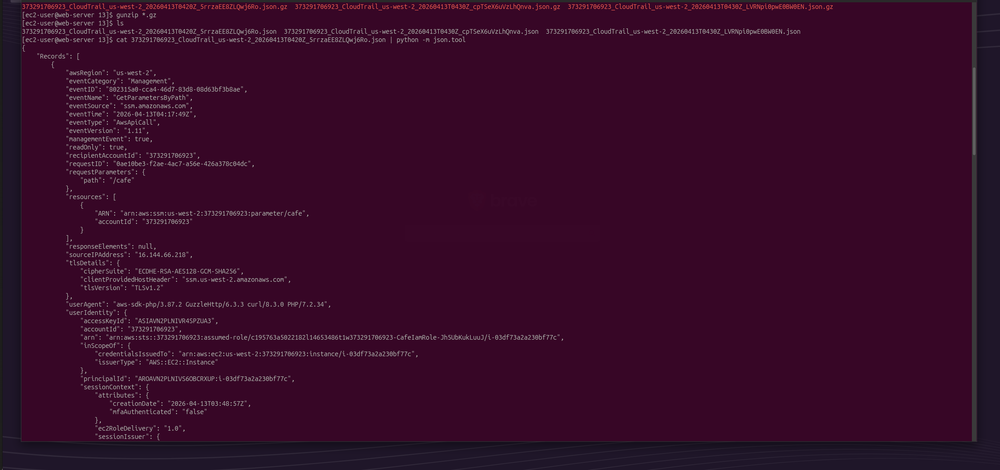
*Saída do `cat <filename>.json | python -m json.tool` mostrando os campos padrão de um registro CloudTrail: awsRegion, eventName, eventSource, eventTime, sourceIPAddress, userIdentity e requestParameters*

**Step 3 — Filtrar por IP de origem e por eventName:**
```bash
ip=16.144.66.218

for i in $(ls); do echo $i && cat $i | python -m json.tool | grep sourceIPAddress ; done
for i in $(ls); do echo $i && cat $i | python -m json.tool | grep eventName ; done
```

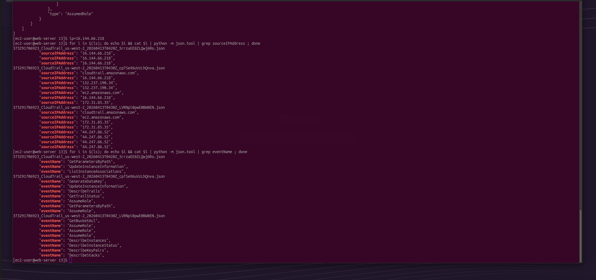
*Saída dos dois comandos for loop: múltiplos eventos com sourceIPAddress `16.144.66.218` (o próprio servidor) e eventNames como GetParametersByPath, UpdateInstanceInformation, AssumeRole, DescribeInstances e DescribeStacks*

**Step 4 — Usar AWS CLI para filtrar eventos por Security Group:**
```bash
aws cloudtrail lookup-events \
  --lookup-attributes AttributeKey=ResourceType,AttributeValue=AWS::EC2::SecurityGroup \
  --output text
```

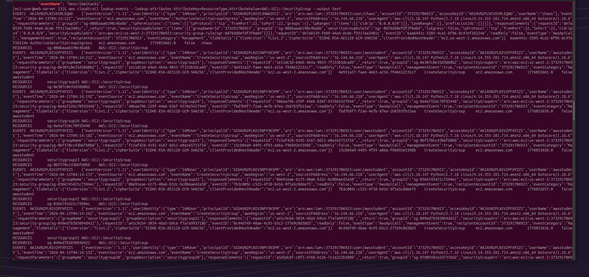
*Primeira linha do resultado: evento `AuthorizeSecurityGroupIngress` às `2026-04-13T04:14:22Z`, usuário `chaos`, sourceIPAddress `16.144.66.218` — confirmando que o usuário chaos abriu a porta 22 para `0.0.0.0/0` via AWS CLI*

**Step 5 — Filtrar pelo Security Group ID do Web Server:**
```bash
region=$(curl http://169.254.169.254/latest/dynamic/instance-identity/document|grep region | cut -d '"' -f4)
# us-west-2

sgId=$(aws ec2 describe-instances \
  --filters "Name=tag:Name,Values='Cafe Web Server'" \
  --query 'Reservations[*].Instances[*].SecurityGroups[*].[GroupId]' \
  --region $region \
  --output text)
echo $sgId
# sg-008baaa6190c4babb

aws cloudtrail lookup-events \
  --lookup-attributes AttributeKey=ResourceType,AttributeValue=AWS::EC2::SecurityGroup \
  --region $region \
  --output text | grep $sgId
```

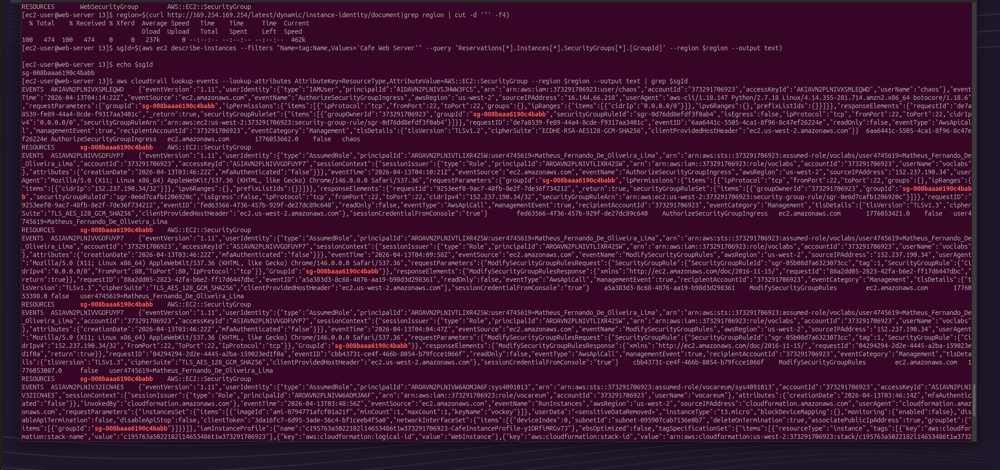
*Resultado filtrado mostrando três eventos no `sg-008baaa6190c4babb`: (1) `AuthorizeSecurityGroupIngress` pelo usuário `chaos` às 04:14:22 — abertura maliciosa da porta 22; (2) e (3) `ModifySecurityGroupRules` pelo usuário `user4745619=Matheus_Fernando_De_Oliveira_Lima` às 04:10:21 e 04:09:58 via console — as modificações legítimas do operador*

---

### Tarefa 4: Analisar os logs com Amazon Athena

#### 4.1 — Criar a tabela Athena a partir do CloudTrail

No console do CloudTrail, em **Event history → Create Athena table**, foi selecionado o bucket `monitoring1266`. A tabela `cloudtrail_logs_monitoring1266` foi criada automaticamente com schema mapeando cada campo JSON do CloudTrail para uma coluna SQL.

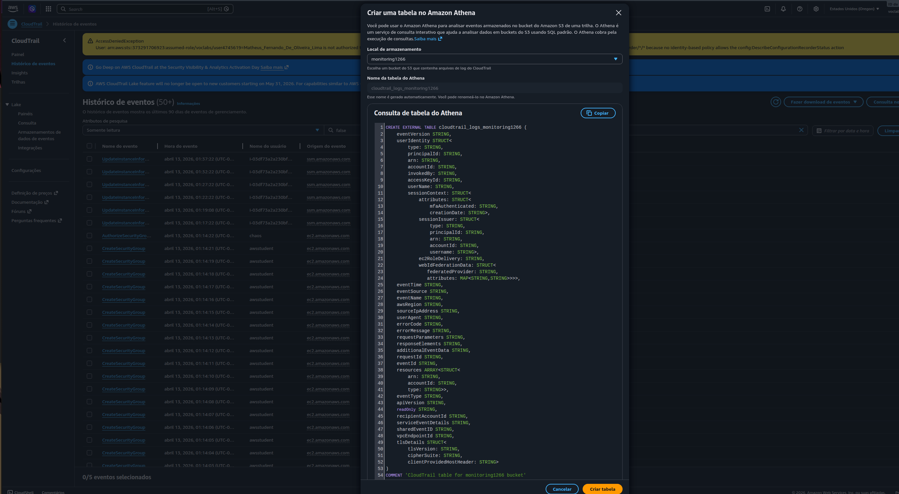
*Modal "Criar uma tabela no Amazon Athena" com o bucket `monitoring1266` selecionado e o nome da tabela `cloudtrail_logs_monitoring1266` gerado automaticamente. O CREATE EXTERNAL TABLE mapeia campos como userIdentity (STRUCT), eventTime, eventSource, eventName, sourceIpAddress e resources (ARRAY) diretamente dos arquivos JSON no S3*

#### 4.2 — Configurar local dos resultados

Em **Athena → Editor de consultas → Configurações de consultas → Gerenciar**, foi definido o bucket de resultados:

```
s3://monitoring1266/results/
```

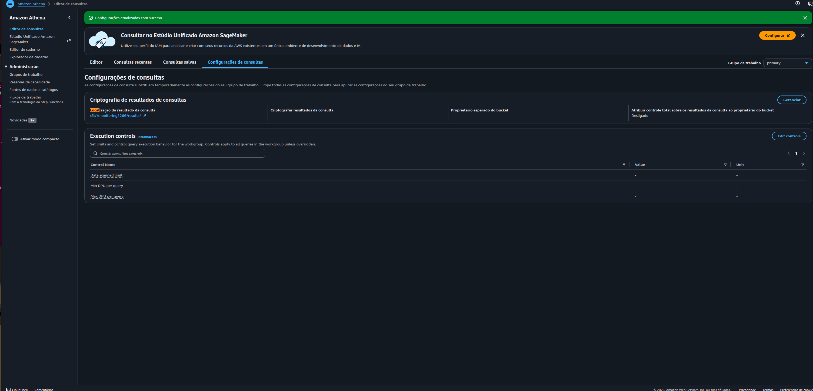
*Página "Configurações de consultas" do Athena confirmando `s3://monitoring1266/results/` como destino dos resultados — necessário antes de executar qualquer query*

#### 4.3 — Executar queries de investigação

**Query 1 — Visão geral dos eventos:**
```sql
SELECT useridentity.userName, eventtime, eventsource, eventname, requestparameters
FROM cloudtrail_logs_monitoring1266
LIMIT 30
```

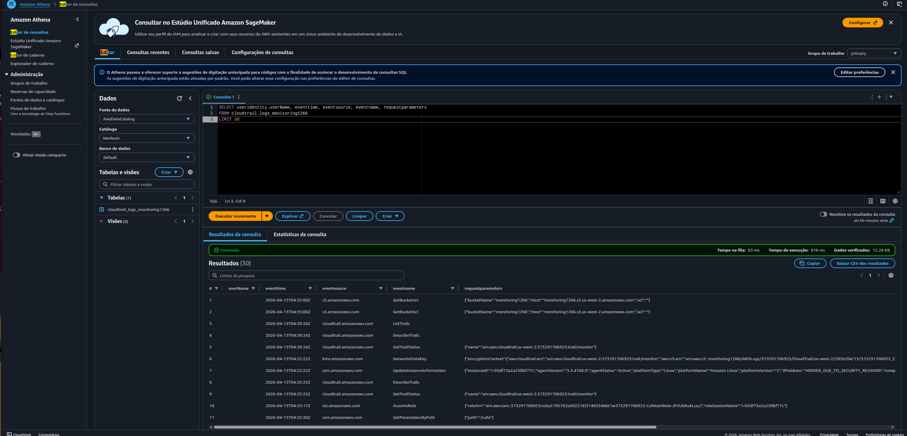
*30 resultados retornados em 616ms — colunas userName, eventtime, eventsource, eventname e requestparameters visíveis. Eventos como GetBucketAcl (s3), ListTrails e GetTrailStatus (cloudtrail), GenerateDataKey (kms) e AssumeRole (sts) confirmam que o trail está capturando atividade normal da conta*

**Query 2 — Usuários ativos nas últimas 24h:**
```sql
SELECT DISTINCT useridentity.userName, eventName, eventSource
FROM cloudtrail_logs_monitoring1266
WHERE from_iso8601_timestamp(eventtime) > date_add('day', -1, now())
ORDER BY eventSource;
```

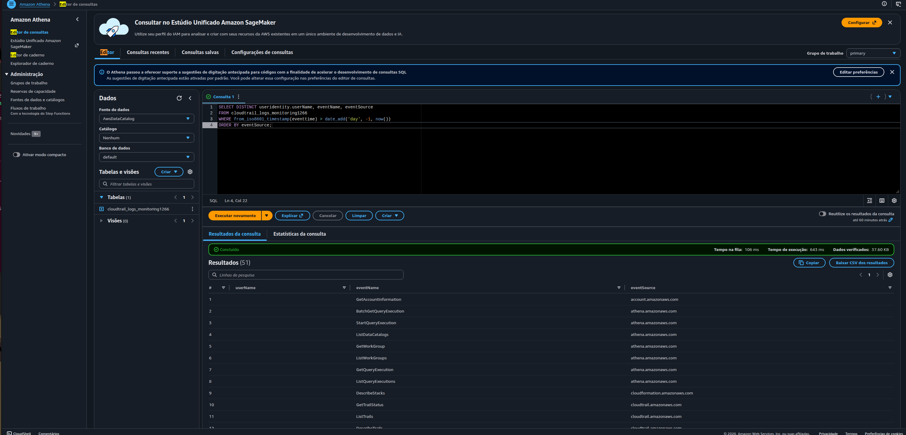
*51 resultados distintos retornados em 643ms — lista completa de usuários ativos e ações tomadas nas últimas 24h, ordenada por serviço AWS. Ações do Athena, CloudFormation, CloudTrail, EC2 e outros serviços visíveis — base para identificar comportamento anômalo*

---

### Tarefa 5: Remediar a invasão e fortalecer a segurança

#### 5.1 — Verificar e remover o usuário chaos-user do OS

```bash
sudo aureport --auth
```

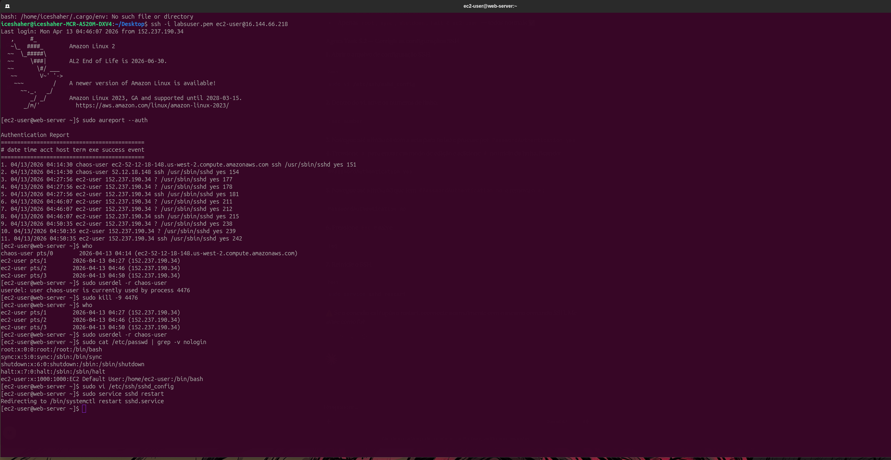
*Authentication Report mostrando: (1) `chaos-user` logado às 04:14:30 vindo de `ec2-52-12-18-148.us-west-2.compute.amazonaws.com` (a HackerInstance); (2) `who` confirmando chaos-user ainda ativo no processo 4476; (3) `sudo userdel -r chaos-user` bloqueado pelo processo ativo; (4) `sudo kill -9 4476` encerrando a sessão; (5) segundo `userdel` bem-sucedido; (6) `cat /etc/passwd | grep -v nologin` confirmando apenas root, sync, shutdown, halt e ec2-user restantes*

**Comandos executados:**
```bash
who
# chaos-user pts/0   2026-04-13 04:14 (ec2-52-12-18-148.us-west-2.compute.amazonaws.com)
# ec2-user   pts/1   2026-04-13 04:27 (152.237.190.34)

sudo userdel -r chaos-user
# userdel: user chaos-user is currently used by process 4476

sudo kill -9 4476

who
# ec2-user pts/1   2026-04-13 04:27 (152.237.190.34)

sudo userdel -r chaos-user
# (sem output = sucesso)

sudo cat /etc/passwd | grep -v nologin
# root:x:0:0:root:/root:/bin/bash
# sync:x:5:0:sync:/sbin:/bin/sync
# shutdown:x:6:0:shutdown:/sbin:/sbin/shutdown
# halt:x:7:0:halt:/sbin:/sbin/halt
# ec2-user:x:1000:1000:EC2 Default User:/home/ec2-user:/bin/bash
```

#### 5.2 — Corrigir a vulnerabilidade no SSH

O arquivo `/etc/ssh/sshd_config` havia sido modificado pelo invasor para habilitar autenticação por senha — permitindo acesso sem par de chaves.

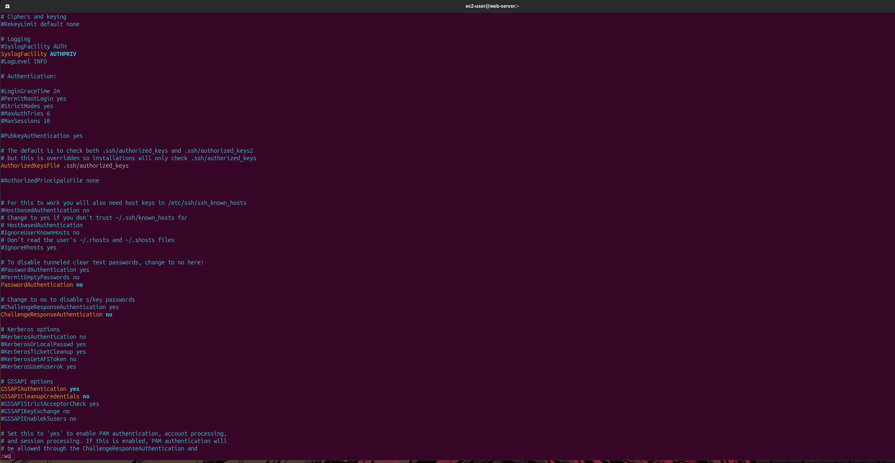
*Arquivo `/etc/ssh/sshd_config` após correção: linha `#PasswordAuthentication yes` comentada e linha `PasswordAuthentication no` ativa — desabilitando autenticação por senha e exigindo par de chaves para conexão SSH*

**Problema:** `PasswordAuthentication yes` habilitado no `sshd_config` — permitia login com usuário/senha sem chave SSH.

**Solução:**
```bash
sudo vi /etc/ssh/sshd_config
# Linha 61: comentar "#PasswordAuthentication yes"
# Linha 63: descomentar "PasswordAuthentication no"

sudo service sshd restart
# Redirecting to /bin/systemctl restart sshd.service
```

Adicionalmente, a regra SSH `0.0.0.0/0` criada pelo invasor no `WebSecurityGroup` foi removida pelo Console EC2.

#### 5.3 — Restaurar o site

O invasor havia substituído a imagem principal do site por um arquivo malicioso, mantendo o original com extensão `.backup`.

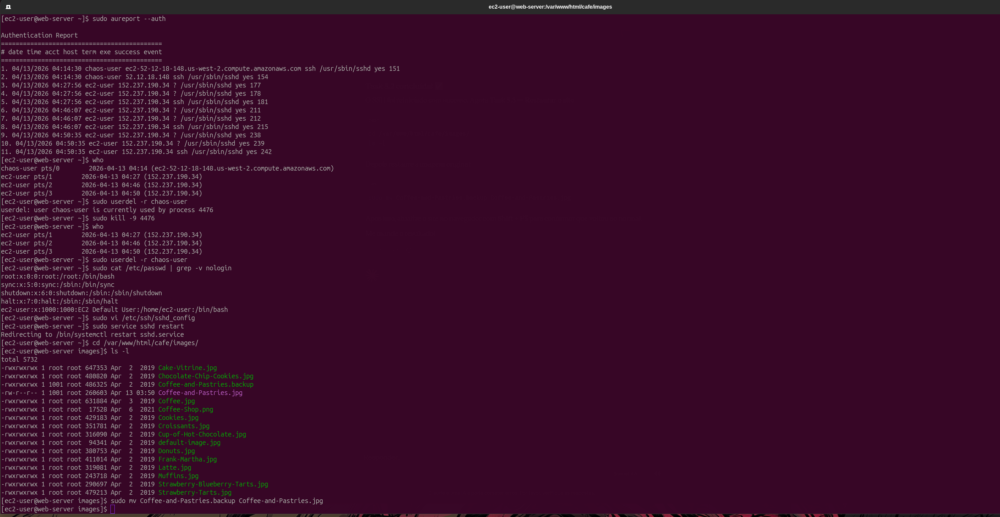
*Listagem de `/var/www/html/cafe/images/` mostrando `Coffee-and-Pastries.backup` (486KB, original) e `Coffee-and-Pastries.jpg` (260KB, arquivo do invasor modificado em Apr 13). Comando `sudo mv Coffee-and-Pastries.backup Coffee-and-Pastries.jpg` restaurando a imagem original*

```bash
cd /var/www/html/cafe/images/
ls -l
# -rwxrwxrwx 1 root root 486325 Apr  2  2019 Coffee-and-Pastries.backup
# -rw-r--r-- 1 1001 1001 260603 Apr 13 03:50 Coffee-and-Pastries.jpg

sudo mv Coffee-and-Pastries.backup Coffee-and-Pastries.jpg
```


*Site do Café exibindo novamente as imagens corretas da cafeteria/padaria após a restauração do arquivo — confirmando que a remediação foi bem-sucedida*

#### 5.4 — Remover o usuário IAM chaos

No Console IAM, o usuário `chaos` foi selecionado e excluído permanentemente, removendo todas as suas credenciais e permissões da conta AWS.

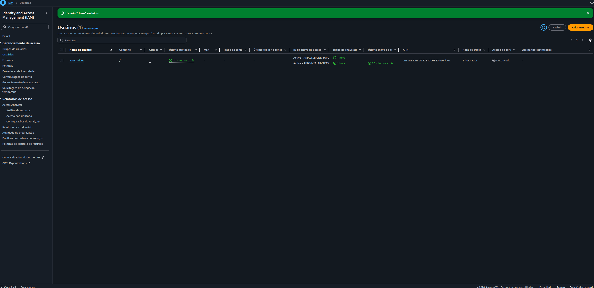
*Console IAM mostrando "Usuário chaos excluído" com sucesso — apenas o usuário `awsstudent` (operador do lab) permanece na conta*

---

## 🔐 Conceitos-Chave Aprendidos

### CloudTrail — Auditoria de Ações AWS

O CloudTrail registra cada chamada de API feita na conta AWS, capturando: quem fez a ação (`userIdentity`), o quê foi feito (`eventName`), quando (`eventTime`), de onde (`sourceIPAddress`) e com qual resultado (`responseElements`). Sem o CloudTrail habilitado, não haveria como determinar quem abriu a porta 22 ou quando isso ocorreu.

```
Sem CloudTrail:
  Ação suspeita detectada → Nenhuma evidência → Impossível identificar o responsável ❌

Com CloudTrail habilitado:
  Ação suspeita detectada → Logs no S3 → grep / CLI / Athena → Hacker identificado ✅
```

### Security Groups — Firewall Stateful

Security Groups são stateful: tráfego de resposta é permitido automaticamente. A ausência de uma regra de entrada bloqueia o acesso independente de qualquer outra configuração. Uma única regra maliciosa (`0.0.0.0/0` na porta 22) foi suficiente para expor o servidor a qualquer atacante na internet.

| Regra | Porta | Quem criou | Risco |
|---|---|---|---|
| HTTP | 80 | Operador | Necessária — acesso ao site |
| SSH (My IP) | 22 | Operador | Segura — restrita ao IP do operador |
| SSH (0.0.0.0/0) | 22 | Usuário `chaos` | **Crítica** — acesso SSH aberto para o mundo |

### PasswordAuthentication no — Defesa em Profundidade

Mesmo com a porta 22 aberta, se `PasswordAuthentication no` estivesse configurado desde o início, o invasor não conseguiria fazer login com `chaos-user` e senha. A autenticação por senha foi a segunda vulnerabilidade explorada — evidência de que defesa em profundidade é essencial: cada camada de segurança independente reduz o impacto de falhas nas demais.

### Athena — SQL sobre Logs no S3

O Athena elimina a necessidade de carregar dados em um banco tradicional: define-se um schema (CREATE EXTERNAL TABLE) sobre arquivos JSON já existentes no S3, e o Athena executa queries SQL diretamente. O custo é por dado varrido — o uso de filtros WHERE reduz tanto o tempo quanto o custo das consultas.

```sql
-- Sem filtro: varre todo o dataset
SELECT * FROM cloudtrail_logs_monitoring1266

-- Com filtro: varre apenas o necessário
SELECT useridentity.userName, eventtime, eventname
FROM cloudtrail_logs_monitoring1266
WHERE eventsource = 'ec2.amazonaws.com'
AND eventname LIKE '%SecurityGroup%'
```

### grep vs. CLI vs. Athena — Escolha da Ferramenta

| Ferramenta | Quando usar | Limitação |
|---|---|---|
| `grep` | Busca rápida em arquivos locais, padrões simples | Difícil para queries complexas |
| `aws cloudtrail lookup-events` | Busca por atributo específico sem baixar logs | Limitado a 8 atributos de filtro |
| **Amazon Athena** | Queries SQL complexas, múltiplos filtros, grandes volumes | Requer criação prévia da tabela |

### aureport — Auditoria de Autenticação Linux

O `aureport --auth` lê o audit log do sistema operacional e gera um relatório de todas as tentativas de autenticação, incluindo: data/hora, usuário, host de origem, método e resultado. É a ferramenta correta para responder "quem fez login neste servidor e quando?" — complementando os logs do CloudTrail que cobrem apenas as ações na API AWS.

## 💡 Principais Aprendizados

1. **Habilite o CloudTrail antes de precisar dele** — Logs só são gerados a partir do momento em que a trilha é criada. Eventos anteriores à criação da trilha não são recuperáveis. No lab, a janela entre a criação do trail e o hack foi de apenas alguns minutos — sem isso, não haveria evidência forense.

2. **Security Group é o primeiro vetor de ataque** — A abertura da porta 22 para `0.0.0.0/0` foi o que permitiu ao invasor conectar via SSH. Sempre auditar regras de entrada, especialmente as que permitem acesso de qualquer origem.

3. **Instalado ≠ Configurado com segurança** — O `PasswordAuthentication yes` estava ativo no servidor, provavelmente desde a criação da instância ou alterado pelo invasor. A configuração padrão raramente é a mais segura.

4. **Múltiplas camadas de evidência** — O CloudTrail mostrou *quem* abriu a porta 22 via API. O `aureport` mostrou *quem* fez login no OS. Ambos foram necessários para uma resposta completa ao incidente.

5. **Athena retorna 0 resultados para eventos anteriores à criação da tabela** — Os eventos do hack ocorreram antes de o trail estar gerando logs no S3. O AWS CLI `lookup-events` consulta os últimos 90 dias de eventos diretamente da API do CloudTrail, independente do S3 — por isso foi a ferramenta que encontrou as evidências.

6. **`kill -9` antes de `userdel`** — Não é possível remover um usuário com sessão ativa. O número do processo retornado pelo `userdel` com erro é exatamente o que deve ser terminado com `kill -9` antes de tentar a remoção novamente.

## 📊 Resultados

| Métrica | Valor |
|---|---|
| Trail CloudTrail criado | `monitor` — US West (Oregon) — multi-região |
| Logs analisados | 3 arquivos JSON (~57 KB cada) |
| Hacker identificado | Usuário IAM `chaos` |
| Evento de invasão | `AuthorizeSecurityGroupIngress` — 2026-04-13T04:14:22Z |
| IP do invasor | `16.144.66.218` (HackerInstance) |
| Método de acesso | Programático (AWS CLI) |
| Vulnerabilidades corrigidas | 2 (regra SSH 0.0.0.0/0 + PasswordAuthentication) |
| Usuários removidos | `chaos-user` (OS) + `chaos` (IAM) |
| Site restaurado | ✅ `Coffee-and-Pastries.jpg` recuperado do backup |

## 📚 Recursos Adicionais

- [Documentação AWS CloudTrail](https://docs.aws.amazon.com/cloudtrail/)
- [CloudTrail Record Contents](https://docs.aws.amazon.com/awscloudtrail/latest/userguide/cloudtrail-event-reference.html)
- [Amazon Athena — Querying CloudTrail Logs](https://docs.aws.amazon.com/athena/latest/ug/cloudtrail-logs.html)
- [AWS CLI — cloudtrail lookup-events](https://awscli.amazonaws.com/v2/documentation/api/latest/reference/cloudtrail/lookup-events.html)
- [Security Group Rules](https://docs.aws.amazon.com/vpc/latest/userguide/security-group-rules.html)
- [AWS CloudTrail Partners](https://aws.amazon.com/cloudtrail/partners/)
- [AWS Academy](https://aws.amazon.com/training/awsacademy/)

## 🏆 Certificações Relacionadas

Este laboratório contribui para a preparação das seguintes certificações:

- **AWS Certified Cloud Practitioner**
- **AWS Certified Solutions Architect - Associate**
- **AWS Certified Security - Specialty**
- **AWS Certified SysOps Administrator - Associate**

## 👨‍💻 Autor

**Matheus Lima**

Estudante — Escola da Nuvem | Programa Re/Start AWS

---

## 📄 Licença

Este projeto é parte do Programa Re/Start AWS e está disponível para fins de estudo e portfólio.

---

<div align="center">

[](https://aws.amazon.com/training/awsacademy/)
[](https://aws.amazon.com/cloudtrail/)
[](https://aws.amazon.com/athena/)
[](https://aws.amazon.com/security/)

</div>
