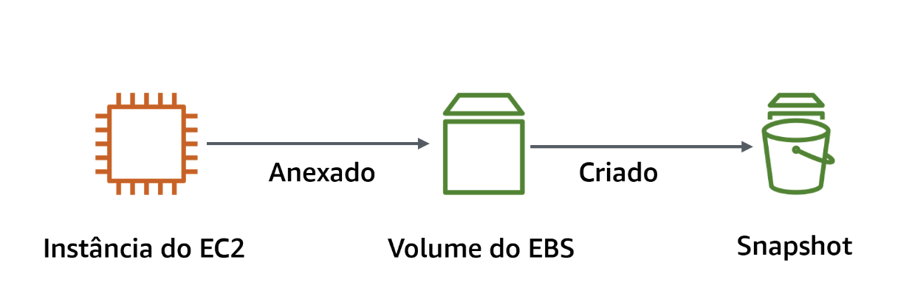
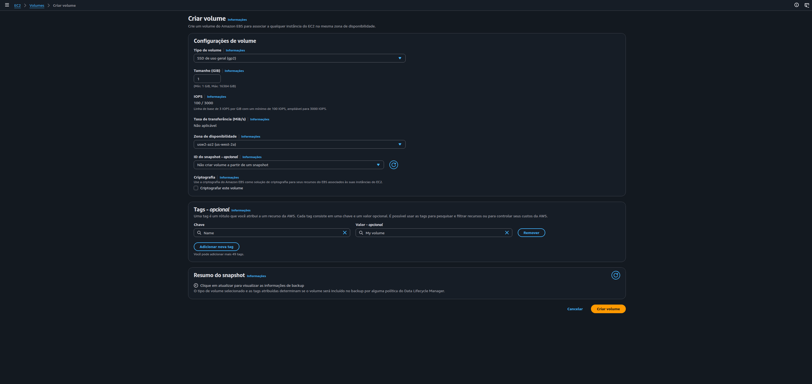
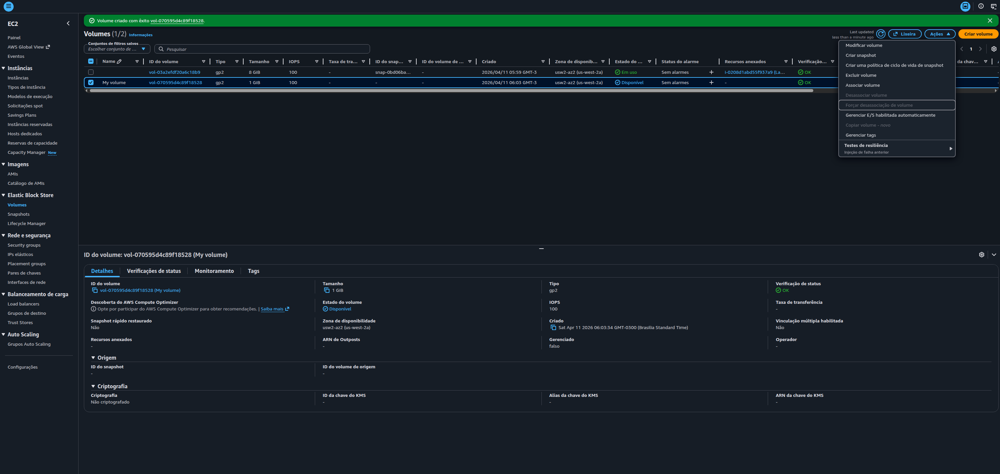
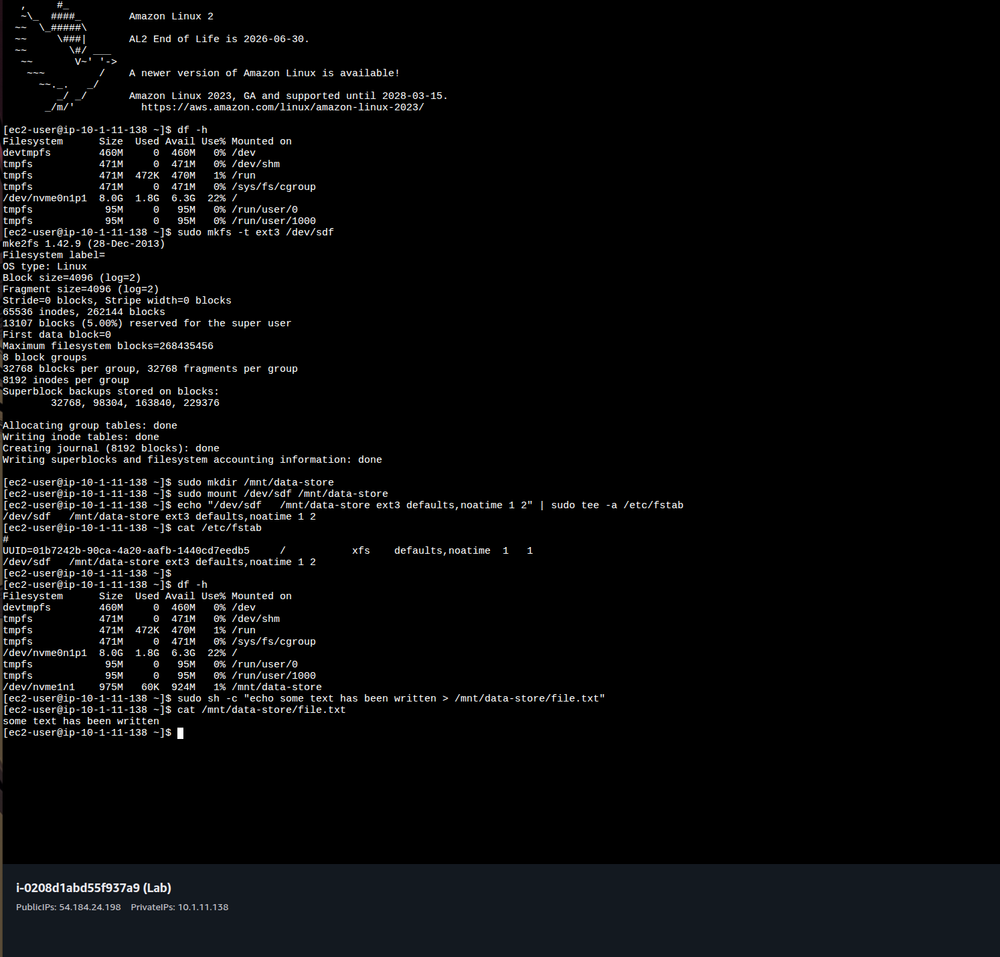
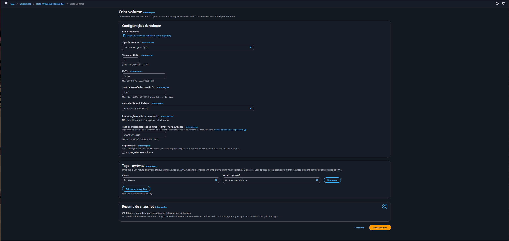
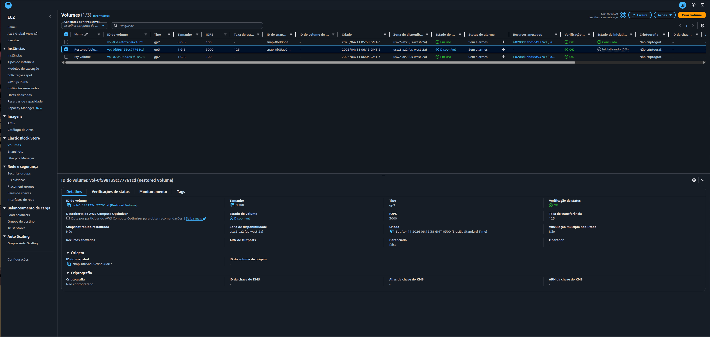
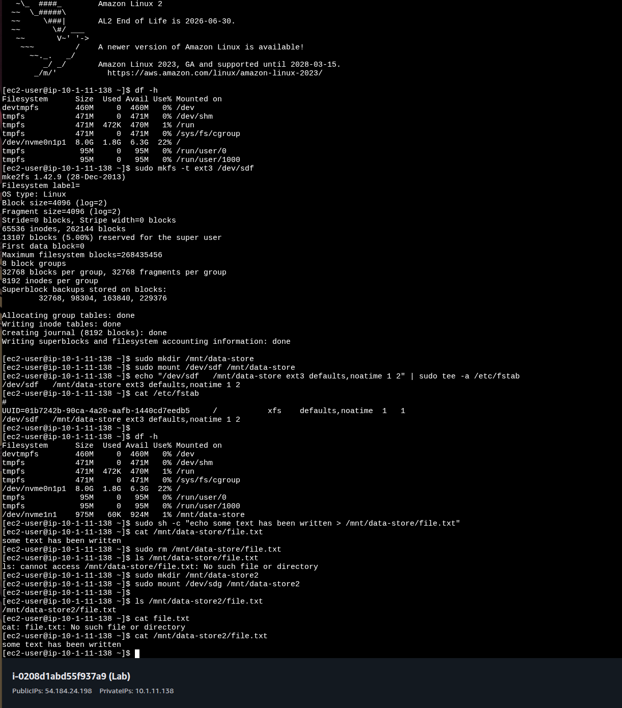

# Lab AWS — Working with Amazon EBS

## 📋 Sobre o Lab

Este laboratório faz parte do **Programa Re/Start AWS** através da **Escola da Nuvem**, focado em práticas de armazenamento em bloco com Amazon EBS integrado ao Amazon EC2.

## 🎯 Objetivos

Ao concluir este laboratório, pratiquei:

- ✅ Criar um volume do EBS
- ✅ Anexar e montar o volume em uma instância EC2
- ✅ Criar um sistema de arquivos ext3 e persistir dados
- ✅ Criar um snapshot do volume EBS
- ✅ Restaurar um volume a partir de um snapshot

## 🏗️ Arquitetura do Lab


*Fluxo do lab: Volume EBS anexado à instância EC2 → Snapshot criado a partir do volume*

### Infraestrutura Utilizada

| Componente | Detalhes |
|---|---|
| Instância EC2 | Amazon Linux 2 — Lab (pré-existente no lab) |
| Volume EBS original | gp2 — 1 GiB — us-west-2a — Tag: My Volume |
| Volume EBS restaurado | gp3 — 1 GiB — us-west-2a — Tag: Restored Volume |
| Snapshot | Criado a partir do My Volume — Tag: My Snapshot |
| Ponto de montagem 1 | `/mnt/data-store` (My Volume) |
| Ponto de montagem 2 | `/mnt/data-store2` (Restored Volume) |

O fluxo parte do Console EC2 para criar e anexar o volume à instância Lab. Via EC2 Instance Connect, o volume é formatado, montado e populado com um arquivo de texto. Um snapshot captura o estado do volume. O arquivo é deletado e depois recuperado ao restaurar o snapshot em um novo volume.

```
Console AWS → Criar volume EBS (gp2, 1 GiB)
                    │
              Anexar à instância Lab (/dev/sdf)
                    │
         EC2 Instance Connect (terminal)
                    │
         sudo mkfs -t ext3 /dev/sdf
         sudo mkdir /mnt/data-store
         sudo mount /dev/sdf /mnt/data-store
         echo "/dev/sdf ..." >> /etc/fstab
                    │
         echo "some text" > /mnt/data-store/file.txt ✅
                    │
         Console → Criar Snapshot (My Snapshot)
                    │
         sudo rm /mnt/data-store/file.txt ❌
                    │
         Console → Criar volume do Snapshot (Restored Volume)
         Anexar à instância Lab (/dev/sdg)
                    │
         sudo mkdir /mnt/data-store2
         sudo mount /dev/sdg /mnt/data-store2
                    │
         cat /mnt/data-store2/file.txt ✅ (dado recuperado)
```

## 🔧 Tecnologias e Serviços Utilizados

- **Amazon EBS** — Armazenamento em bloco persistente para instâncias EC2
- **Amazon EC2** — Instância de computação onde o volume é anexado
- **Amazon S3** — Destino interno dos snapshots EBS (gerenciado pela AWS)
- **EC2 Instance Connect** — Acesso seguro ao terminal da instância
- **ext3** — Sistema de arquivos Linux criado no volume EBS

## 📝 Etapas Realizadas

### Tarefa 1: Criar o Volume EBS

Um novo volume gp2 de 1 GiB foi criado no Console EC2, na mesma Zona de Disponibilidade da instância Lab (us-west-2a), com a tag `Name: My Volume`.


*Formulário de criação do volume: tipo gp2, tamanho 1 GiB, zona us-west-2a e tag "My Volume"*

**Configurações aplicadas:**
- **Tipo de volume:** General Purpose SSD (gp2)
- **Tamanho:** 1 GiB
- **Zona de Disponibilidade:** us-west-2a
- **Tag:** Name = My Volume

---

### Tarefa 2: Anexar o Volume à Instância EC2

Com o volume no estado `Disponível`, ele foi anexado à instância Lab via menu Ações → Associar volume, usando o device name `/dev/sdf`.


*Lista de volumes com "My Volume" no estado Disponível e menu Ações aberto com a opção Associar volume*

**Resultado:** Estado do volume alterado para `Em uso`.

---

### Tarefas 3 e 4: Conectar à Instância e Configurar o Sistema de Arquivos

Via EC2 Instance Connect, o volume foi formatado com ext3, montado em `/mnt/data-store` e configurado no `/etc/fstab` para persistência após reboot. Um arquivo de texto foi gravado no volume para validar a escrita.


*Sequência de comandos: `mkfs`, `mkdir`, `mount`, entrada no `/etc/fstab`, `df -h` confirmando montagem em `/mnt/data-store` e `cat` exibindo o conteúdo gravado no arquivo*

**Comandos executados:**

```bash
# Verificar armazenamento disponível
df -h

# Criar sistema de arquivos ext3 no novo volume
sudo mkfs -t ext3 /dev/sdf

# Criar diretório de montagem
sudo mkdir /mnt/data-store

# Montar o volume e configurar persistência no fstab
sudo mount /dev/sdf /mnt/data-store
echo "/dev/sdf   /mnt/data-store ext3 defaults,noatime 1 2" | sudo tee -a /etc/fstab

# Verificar configuração
cat /etc/fstab
df -h

# Gravar arquivo de teste no volume
sudo sh -c "echo some text has been written > /mnt/data-store/file.txt"
cat /mnt/data-store/file.txt
```

**Saída confirmada:** `/dev/nvme1n1  975M  60K  924M  1% /mnt/data-store`

---

### Tarefa 5: Criar um Snapshot do Volume EBS

Com o arquivo gravado no volume, um snapshot foi criado a partir do `My Volume` via Console EC2, com a tag `Name: My Snapshot`. Após a criação, o arquivo foi deletado do volume original para simular perda de dados.

```bash
# Deletar o arquivo do volume original
sudo rm /mnt/data-store/file.txt

# Confirmar exclusão
ls /mnt/data-store/file.txt
# ls: cannot access /mnt/data-store/file.txt: No such file or directory
```

---

### Tarefa 6: Restaurar o Snapshot em um Novo Volume

#### 6.1 — Criar volume a partir do snapshot

A partir do `My Snapshot`, um novo volume foi criado com a tag `Name: Restored Volume`, na mesma Zona de Disponibilidade (us-west-2a).


*Formulário de criação do Restored Volume vinculado ao snapshot My Snapshot — tipo gp3, 1 GiB, zona us-west-2a e tag "Restored Volume"*

#### 6.2 — Anexar e montar o volume restaurado

O `Restored Volume` foi anexado à instância Lab via device `/dev/sdg`, montado em `/mnt/data-store2` e o arquivo recuperado foi validado.


*Console EC2 exibindo os três volumes: volume original do Lab (8 GiB), Restored Volume (1 GiB, gp3) e My Volume (1 GiB, gp2)*


*Sequência completa: filesystem montado, snapshot criado, arquivo deletado, volume restaurado montado em `/mnt/data-store2` e recuperação confirmada com `cat`*

**Comandos executados:**

```bash
# Criar diretório e montar o volume restaurado
sudo mkdir /mnt/data-store2
sudo mount /dev/sdg /mnt/data-store2

# Verificar recuperação do arquivo
ls /mnt/data-store2/file.txt
# /mnt/data-store2/file.txt ✅

cat /mnt/data-store2/file.txt
# some text has been written ✅
```

---

## 🔐 Conceitos-Chave Aprendidos

### Amazon EBS — Armazenamento em Bloco Persistente

Diferente do armazenamento de instância (ephemeral), volumes EBS persistem independentemente do ciclo de vida da instância EC2. Podem ser desanexados de uma instância e reanexados a outra na mesma Zona de Disponibilidade.

### Zona de Disponibilidade — Restrição de Alcance

Volumes EBS são recursos zonais: só podem ser anexados a instâncias EC2 na **mesma Zona de Disponibilidade**. Para usar o volume em outra AZ, é necessário criar um snapshot e restaurá-lo na AZ de destino.

```
Volume EBS (us-west-2a) → pode anexar a EC2 (us-west-2a) ✅
Volume EBS (us-west-2a) → não pode anexar a EC2 (us-west-2b) ❌
Snapshot               → pode restaurar em qualquer AZ     ✅
```

### Snapshots EBS — Backup Incremental no S3

Snapshots capturam o estado do volume em um ponto no tempo e são armazenados no Amazon S3 com durabilidade de 11 noves. São incrementais: apenas os blocos alterados desde o último snapshot são copiados, economizando armazenamento.

| Característica | Detalhe |
|---|---|
| Armazenamento | Amazon S3 (gerenciado pela AWS) |
| Tipo | Incremental |
| Uso | Backup, clonagem, migração entre AZs/Regiões |
| Restauração | Cria um novo volume independente |

### /etc/fstab — Persistência da Montagem

Sem a entrada no `/etc/fstab`, o volume é desmontado após o reboot da instância. A linha adicionada garante remontagem automática:

```
/dev/sdf   /mnt/data-store ext3 defaults,noatime 1 2
```

| Campo | Valor | Significado |
|---|---|---|
| Dispositivo | `/dev/sdf` | Device name do volume EBS |
| Ponto de montagem | `/mnt/data-store` | Diretório de acesso |
| Sistema de arquivos | `ext3` | Tipo formatado com mkfs |
| Opções | `defaults,noatime` | Padrão + sem registro de tempo de acesso |
| dump | `1` | Backup habilitado |
| fsck | `2` | Verificação de integridade na ordem 2 |

### gp2 vs gp3 — Evolução dos Tipos SSD

O volume restaurado foi criado automaticamente como gp3 (padrão atual do Console), enquanto o volume original foi gp2 (configurado manualmente no lab).

| Característica | gp2 | gp3 |
|---|---|---|
| IOPS base | 100 (3 IOPS/GiB) | 3000 (fixo) |
| Throughput | Até 250 MiB/s | 125 MiB/s base (até 1000) |
| Custo | Referência | ~20% mais barato |
| Recomendado | Legado | ✅ Atual |

## 💡 Principais Aprendizados

1. **Volume EBS ≠ armazenamento da instância** — EBS persiste após stop/terminate (se configurado). O armazenamento de instância (instance store) é efêmero.

2. **Zona de Disponibilidade é determinante** — Volume e instância precisam estar na mesma AZ. Planejar a AZ no momento da criação do volume é essencial.

3. **Snapshot = ponto de restauração confiável** — Mesmo após deletar dados do volume original, o snapshot preserva o estado anterior e permite recuperação total.

4. **`/etc/fstab` é obrigatório para produção** — Sem ele, a montagem não sobrevive ao reboot e a aplicação perde acesso ao volume após reinicialização da instância.

5. **gp3 é o padrão atual** — Ao restaurar um snapshot, o Console sugere gp3 por padrão. gp3 oferece melhor custo-benefício e IOPS base maior que gp2.

6. **Snapshots são incrementais** — O primeiro snapshot copia todos os blocos usados. Os seguintes copiam apenas as diferenças, tornando backups frequentes econômicos.

## 🚀 Como Reproduzir este Lab

### Pré-requisitos
- Acesso ao AWS Academy Lab com instância EC2 Lab pré-configurada
- Navegador web (Chrome, Firefox ou Edge)
- Conhecimento básico de terminal Linux

### Resumo do Passo a Passo

1. **Console → EC2 → Volumes** — Criar volume gp2, 1 GiB, mesma AZ da instância Lab
2. **Ações → Associar volume** — Anexar à instância Lab (`/dev/sdf`)
3. **EC2 Instance Connect** — Conectar à instância Lab
4. **Terminal** — `mkfs`, `mkdir`, `mount`, `fstab`, gravar `file.txt`
5. **Console → Snapshots** — Criar snapshot do My Volume
6. **Terminal** — Deletar `file.txt` do volume original
7. **Console → Snapshot → Criar volume** — Restored Volume na mesma AZ
8. **Ações → Associar volume** — Anexar à instância Lab (`/dev/sdg`)
9. **Terminal** — `mkdir /mnt/data-store2`, `mount /dev/sdg`, `cat file.txt` ✅

## 📊 Resultados

| Métrica | Valor |
|---|---|
| Volumes EBS criados | 2 (My Volume + Restored Volume) |
| Snapshot criado | My Snapshot (a partir do My Volume) |
| Sistema de arquivos | ext3 |
| Dado gravado e recuperado | `some text has been written` ✅ |
| Persistência no fstab | Configurada ✅ |
| Recuperação via snapshot | Confirmada ✅ |

## 📚 Recursos Adicionais

- [Documentação Amazon EBS](https://docs.aws.amazon.com/ebs/)
- [Snapshots EBS](https://docs.aws.amazon.com/AWSEC2/latest/UserGuide/EBSSnapshots.html)
- [Tipos de volume EBS](https://docs.aws.amazon.com/AWSEC2/latest/UserGuide/ebs-volume-types.html)
- [/etc/fstab no Linux](https://man7.org/linux/man-pages/man5/fstab.5.html)
- [AWS Academy](https://aws.amazon.com/training/awsacademy/)

## 🏆 Certificações Relacionadas

Este laboratório contribui para a preparação das seguintes certificações:

- **AWS Certified Cloud Practitioner**
- **AWS Certified Solutions Architect - Associate**
- **AWS Certified SysOps Administrator - Associate**

## 👨‍💻 Autor

**Matheus Lima**  
Estudante — Escola da Nuvem | Programa Re/Start AWS

---

## 📄 Licença

Este projeto é parte do Programa Re/Start AWS e está disponível para fins de estudo e portfólio.

---

<div align="center">

[](https://aws.amazon.com/training/awsacademy/)
[](https://aws.amazon.com/ebs/)
[](https://aws.amazon.com/ec2/)
[](https://aws.amazon.com/s3/)

</div>
