# Lab AWS — Working with Amazon S3

## 📋 Sobre o Lab

Este laboratório faz parte do **Programa Re/Start AWS** através da **Escola da Nuvem**, focado em configuração de compartilhamento seguro de arquivos com Amazon S3, controle de acesso via IAM e monitoramento de eventos com Amazon SNS.

## 🎯 Objetivos

Ao concluir este laboratório, pratiquei:

- ✅ Criar e configurar um bucket S3 usando comandos `s3api` e `s3` da AWS CLI
- ✅ Verificar permissões de escrita de um usuário em um bucket S3
- ✅ Configurar notificações de eventos em um bucket S3

## 🏗️ Arquitetura do Lab

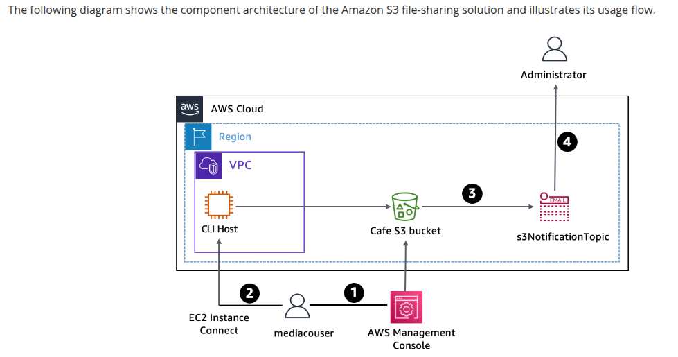
*Fluxo do lab: usuário mediacouser acessa o bucket S3 via Console ou CLI Host, alterações no bucket disparam notificações para o tópico SNS s3NotificationTopic, que envia e-mail ao administrador*

### Infraestrutura Utilizada

| Componente | Detalhes |
|---|---|
| CLI Host | Amazon EC2 — instância usada para executar comandos AWS CLI |
| Café S3 Bucket | `cafe-d0ic3` — bucket de compartilhamento de imagens |
| IAM User | `mediacouser` — usuário externo da empresa de mídia |
| IAM Group | `mediaco` — grupo com política customizada `mediaCoPolicy` |
| Amazon SNS | `s3NotificationTopic` — tópico de notificações por e-mail |

O fluxo parte da criação do bucket e upload das imagens iniciais, passa pela revisão de permissões IAM, configuração de notificações SNS e finaliza com os testes completos de operações como `mediacouser`.

```
AWS Management Console / EC2 Instance Connect (CLI Host)
    │
    └── Café S3 Bucket (cafe-d0ic3)
                │
          s3NotificationTopic (Amazon SNS)
                │
         E-mail do Administrador
                │
        ┌───────┴────────────────┐
        │                        │
  mediacouser                 voclabs/user
  (put / get / delete)        (configuração e auditoria)
```

## 🔧 Tecnologias e Serviços Utilizados

- **Amazon S3** — Armazenamento de objetos e compartilhamento de imagens
- **AWS IAM** — Controle de acesso com grupos, usuários e políticas customizadas
- **Amazon SNS** — Notificações de eventos por e-mail
- **AWS CLI** — Criação e gerenciamento de recursos via terminal
- **EC2 Instance Connect** — Acesso à instância CLI Host

## 📝 Etapas Realizadas

---

### Tarefa 1: Conectar ao CLI Host e configurar AWS CLI

Com acesso ao **EC2 Instance Connect**, o AWS CLI foi configurado com as credenciais do lab via `aws configure`, definindo região `us-west-2` e formato de saída `json`.

---

### Tarefa 2: Criar e inicializar o bucket S3

O bucket `cafe-d0ic3` foi criado na região `us-west-2` e populado com as imagens iniciais do diretório `~/initial-images/` via `aws s3 sync`.

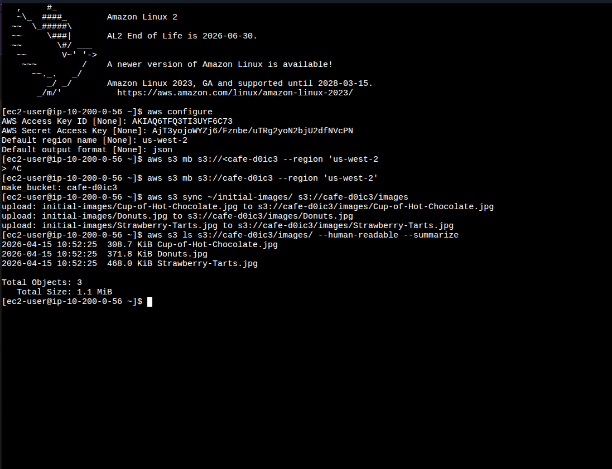
*Terminal mostrando: `aws s3 mb` criando o bucket `cafe-d0ic3`, `aws s3 sync` fazendo upload de Cup-of-Hot-Chocolate.jpg, Donuts.jpg e Strawberry-Tarts.jpg (total: 3 objetos, 1.1 MiB), e `aws s3 ls` confirmando os arquivos no bucket*

**Comandos executados:**
```bash
aws s3 mb s3://cafe-d0ic3 --region 'us-west-2'
# make_bucket: cafe-d0ic3

aws s3 sync ~/initial-images/ s3://cafe-d0ic3/images
# upload: initial-images/Cup-of-Hot-Chocolate.jpg to s3://cafe-d0ic3/images/Cup-of-Hot-Chocolate.jpg
# upload: initial-images/Donuts.jpg to s3://cafe-d0ic3/images/Donuts.jpg
# upload: initial-images/Strawberry-Tarts.jpg to s3://cafe-d0ic3/images/Strawberry-Tarts.jpg

aws s3 ls s3://cafe-d0ic3/images/ --human-readable --summarize
# Total Objects: 3 — Total Size: 1.1 MiB
```

---

### Tarefa 3: Revisar permissões IAM e testar o mediacouser

#### 3.1 — Revisão do grupo mediaco

As políticas do grupo `mediaco` foram revisadas no Console IAM: `IAMUserChangePassword` (gerenciada pela AWS) e `mediaCoPolicy` (inline), que define permissões de listagem, leitura, escrita e exclusão de objetos no prefixo `cafe-*/images/*`.

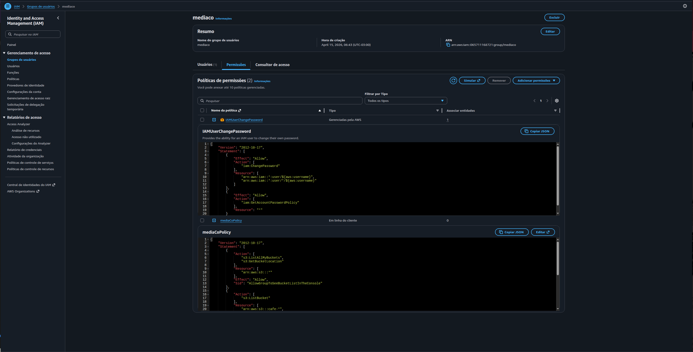
*Console IAM mostrando o grupo `mediaco` com as duas políticas: `IAMUserChangePassword` (gerenciada pela AWS, expandida mostrando permissão `iam:ChangePassword`) e `mediaCoPolicy` (inline, com as actions `s3:ListAllMyBuckets`, `s3:GetBucketLocation` e `s3:ListBucket` visíveis)*

**Statements da `mediaCoPolicy`:**
- `AllowGroupToSeeBucketListInTheConsole` — visualizar lista de buckets
- `AllowRootLevelListingOfTheBucket` — listar objetos no bucket `cafe-*`
- `AllowUserSpecificActionsOnlyInTheSpecificPrefix` — `GetObject`, `PutObject`, `DeleteObject` em `cafe-*/images/*`

#### 3.2 — Revisão e criação de chave de acesso do mediacouser

A chave de acesso do `mediacouser` foi criada via **Security credentials → Create access key** e o arquivo `mediacouser_accessKeys.csv` foi baixado.

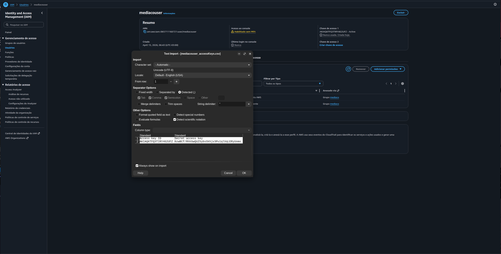
*Console IAM na página do usuário `mediacouser` — modal de importação do CSV exibindo Access Key ID e Secret Access Key recém-gerados. O resumo mostra que o usuário pertence ao grupo `mediaco` e herda as políticas `IAMUserChangePassword` e `mediaCoPolicy`*

#### 3.3 — Testes de permissão como mediacouser

Logado no Console como `mediacouser`, foram testados os casos de uso previstos:

**Teste de visualização (GET):** Donuts.jpg aberta com sucesso.

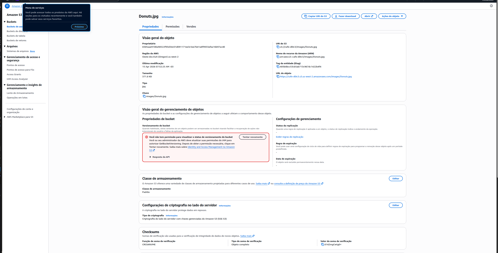
*Imagem `Donuts.jpg` exibida em nova aba do navegador após seleção no Console S3 — confirmando permissão de leitura do mediacouser sobre objetos em `cafe-d0ic3/images/`*

**Teste de upload (PUT):** Arquivo de imagem enviado com sucesso para `s3://cafe-d0ic3/images/`.


*Tela "Upload: status" mostrando 1 arquivo (40.7 KB) enviado com sucesso para `s3://cafe-d0ic3/images/` — confirmando permissão de escrita do mediacouser*

**Teste de exclusão (DELETE):** Cup-of-Hot-Chocolate.jpg excluída com sucesso.

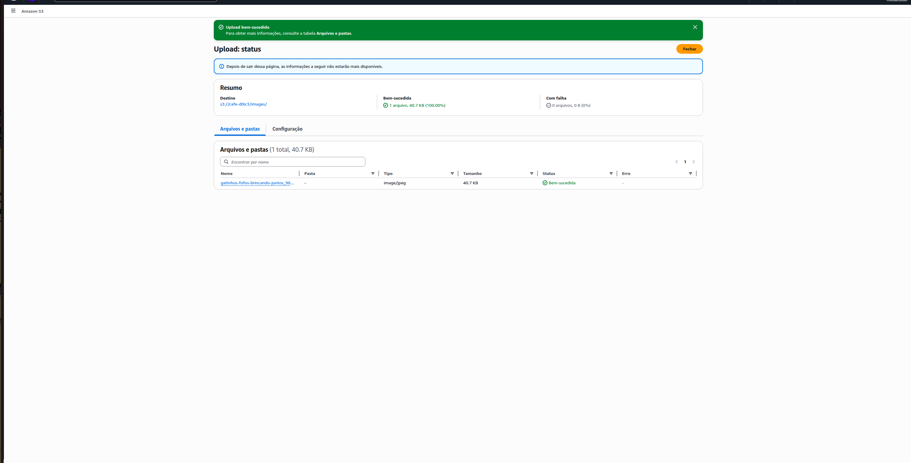
*Página "Excluir objetos" com `Cup-of-Hot-Chocolate.jpg` (308.7 KB) listado como objeto a ser excluído — campo de confirmação "excluir" aguardando digitação antes de prosseguir*

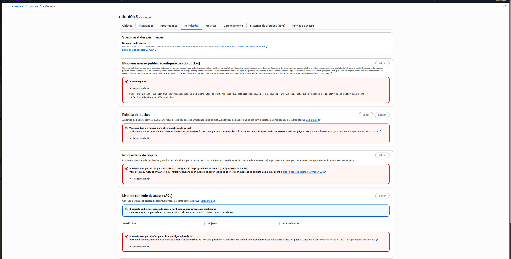
*Tela "Excluir objetos: status" confirmando "1 objeto, 308.7 KB — Excluído com êxito" e 0 falhas — validando a permissão de exclusão do mediacouser*

**Teste não autorizado (alteração de permissões):** Acesso negado ao tentar visualizar as configurações de permissão do bucket.

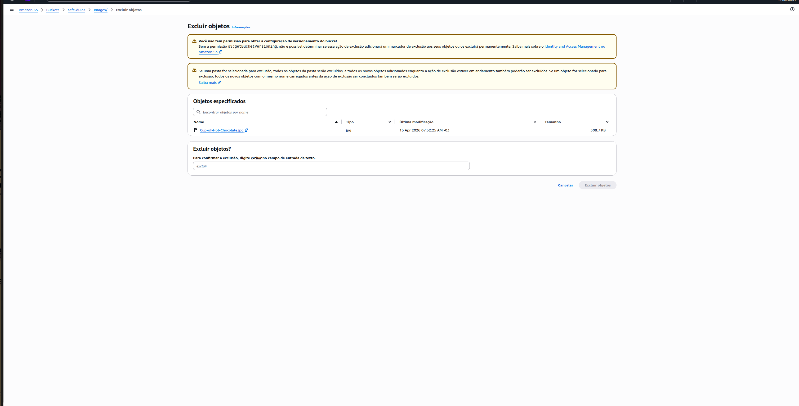
*Aba "Permissões" do bucket `cafe-d0ic3` mostrando múltiplos erros "Acesso negado": o mediacouser não tem permissão para `s3:GetBucketPublicAccessBlock`, `s3:GetBucketPolicy`, `s3:GetBucketOwnershipControls` e `s3:GetBucketAcl` — confirmando que alterações de permissão são bloqueadas como esperado*

---

### Tarefa 4: Configurar notificações de eventos no bucket S3

#### 4.1 — Criar e configurar o tópico SNS s3NotificationTopic

O tópico `s3NotificationTopic` foi criado no Amazon SNS e o ARN copiado. A política de acesso foi editada para permitir que o bucket `cafe-d0ic3` publique mensagens no tópico.

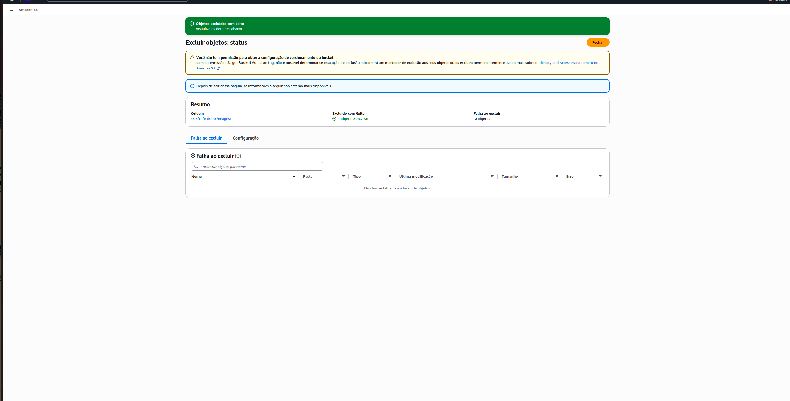
*Console SNS mostrando o tópico `s3NotificationTopic` recém-criado (tipo Padrão) com banner "Tópico criado com êxito". A aba Assinaturas ainda mostra 0 assinaturas — configuração de e-mail feita na sequência*

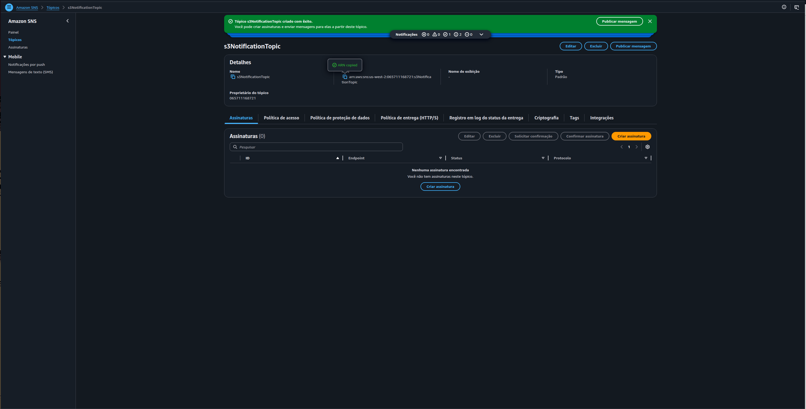
*Página "Editar tópico" do `s3NotificationTopic` com a política de acesso expandida — JSON exibindo o statement `AllowPublishFromS3` que concede `SNS:Publish` ao principal `s3.amazonaws.com`, restrito ao bucket `arn:aws:s3:::cafe-d0ic3` via condição `ArnLike`*

**Política de acesso configurada:**
```json
{
  "Version": "2008-10-17",
  "Id": "S3PublishPolicy",
  "Statement": [{
    "Sid": "AllowPublishFromS3",
    "Effect": "Allow",
    "Principal": { "Service": "s3.amazonaws.com" },
    "Action": "SNS:Publish",
    "Resource": "arn:aws:sns:us-west-2:065711168721:s3NotificationTopic",
    "Condition": {
      "ArnLike": { "aws:SourceArn": "arn:aws:s3:::cafe-d0ic3" }
    }
  }]
}
```

#### 4.2 — Associar configuração de notificação ao bucket S3

O arquivo `s3EventNotification.json` foi criado e associado ao bucket via `aws s3api put-bucket-notification-configuration`, configurando notificações para eventos `s3:ObjectCreated:*` e `s3:ObjectRemoved:*` no prefixo `images/`.

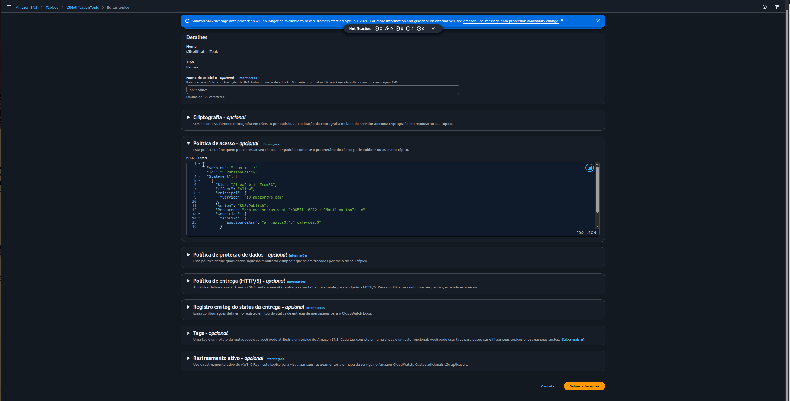
*Sequência no terminal: `vi s3EventNotification.json` (criação do arquivo de configuração), segundo `aws configure` com credenciais do voclabs/user, e execução do `aws s3api put-bucket-notification-configuration --bucket cafe-d0ic3 --notification-configuration file://s3EventNotification.json` concluído sem erro*

**Configuração de notificação:**
```json
{
  "TopicConfigurations": [{
    "TopicArn": "arn:aws:sns:us-west-2:065711168721:s3NotificationTopic",
    "Events": ["s3:ObjectCreated:*", "s3:ObjectRemoved:*"],
    "Filter": {
      "Key": {
        "FilterRules": [{ "Name": "prefix", "Value": "images/" }]
      }
    }
  }]
}
```

**E-mail de teste recebido:** Após a configuração, o S3 enviou automaticamente um `s3:TestEvent` ao tópico SNS.

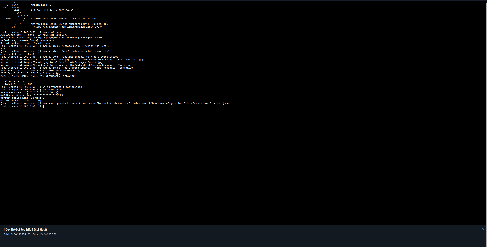
*E-mail da AWS Notifications com evento `s3:TestEvent` às 11:17Z, confirmando que a configuração de notificação foi aplicada com sucesso ao bucket `cafe-d0ic3`*

---

### Tarefa 5: Testar as notificações de eventos do bucket S3

Com o AWS CLI reconfigurado com as credenciais do `mediacouser`, foram testadas as operações previstas:

**PUT — upload do Caramel-Delight.jpg:**
```bash
aws s3api put-object \
  --bucket cafe-d0ic3 \
  --key images/Caramel-Delight.jpg \
  --body ~/new-images/Caramel-Delight.jpg
# Retornou ETag + ServerSideEncryption: AES256
```

**GET — download do Donuts.jpg:**
```bash
aws s3api get-object \
  --bucket cafe-d0ic3 \
  --key images/Donuts.jpg Donuts.jpg
# Retornou metadados — sem notificação (esperado)
```

**DELETE — exclusão do Strawberry-Tarts.jpg:**
```bash
aws s3api delete-object \
  --bucket cafe-d0ic3 \
  --key images/Strawberry-Tarts.jpg
```

**Operação não autorizada — tentativa de alterar ACL:**
```bash
aws s3api put-object-acl \
  --bucket cafe-d0ic3 \
  --key images/Donuts.jpg \
  --acl public-read
# An error occurred (AccessDenied) — BlockPublicAcls bloqueou como esperado
```

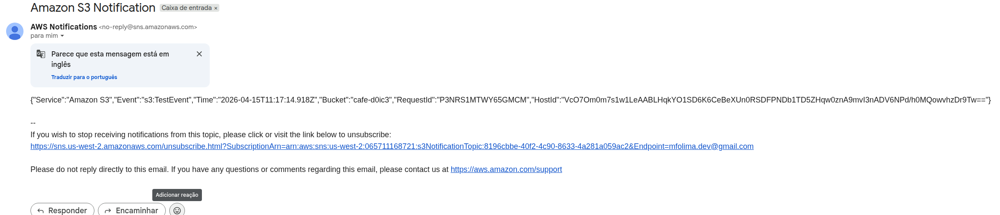
*Terminal mostrando a sequência completa da Task 5: (1) `put-object` do Caramel-Delight.jpg retornando ETag e ServerSideEncryption; (2) `get-object` do Donuts.jpg retornando metadados (ContentType, ContentLength, ETag); (3) `delete-object` do Strawberry-Tarts.jpg executado silenciosamente; (4) `put-object-acl` resultando em `AccessDenied` por bloqueio de ACL pública*

**E-mails de notificação recebidos:**

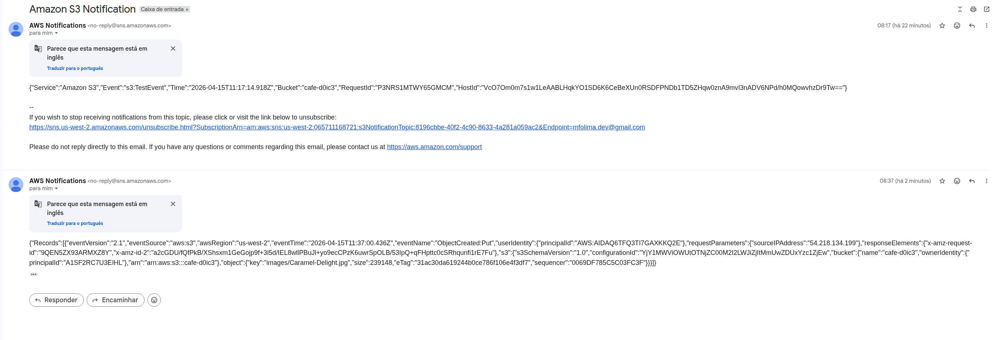
*Caixa de entrada mostrando dois e-mails da AWS Notifications: (1) às 08:17 — `s3:TestEvent` confirmando a configuração do tópico; (2) às 08:37 — evento `ObjectCreated:Put` para `images/Caramel-Delight.jpg` com detalhes completos do evento incluindo userIdentity, sourceIPAddress, bucket e object key*

---

## 🔐 Conceitos-Chave Aprendidos

### IAM — Controle de Acesso por Princípio do Menor Privilégio

A `mediaCoPolicy` exemplifica o princípio do menor privilégio: o `mediacouser` recebe exatamente as permissões necessárias (`GetObject`, `PutObject`, `DeleteObject`) restritas ao prefixo `cafe-*/images/*`, sem acesso a configurações do bucket, versionamento ou ACLs.

```
Permissões do mediacouser:
  ✅ s3:GetObject     → images/* (leitura de objetos)
  ✅ s3:PutObject     → images/* (upload de objetos)
  ✅ s3:DeleteObject  → images/* (exclusão de objetos)
  ❌ s3:GetBucketPolicy          (configuração negada)
  ❌ s3:PutObjectAcl             (alteração de ACL negada)
  ❌ s3:GetBucketPublicAccessBlock (acesso negado)
```

### S3 Event Notifications — Auditoria em Tempo Real

As notificações de eventos S3 permitem resposta imediata a alterações no bucket sem necessidade de polling. O filtro por prefixo (`images/`) garante que apenas eventos relevantes gerem notificações, reduzindo ruído.

| Evento | Notificação gerada | Caso de uso |
|---|---|---|
| `ObjectCreated:Put` | ✅ Sim | Upload de nova imagem |
| `ObjectCreated:Copy` | ✅ Sim | Cópia de objeto |
| `ObjectRemoved:Delete` | ✅ Sim | Exclusão de objeto |
| `GetObject` | ❌ Não | Download (somente leitura) |

### SNS — Desacoplamento de Notificações

O Amazon SNS atua como intermediário entre o S3 e os destinatários, permitindo escalar para múltiplos protocolos (e-mail, SMS, Lambda, SQS) sem alterar a configuração do bucket. A política de acesso do tópico restringe a publicação ao bucket específico via condição `ArnLike`.

```
S3 Event → SNS Topic → Email (Administrador)
                    → SMS
                    → Lambda (automação)
                    → SQS (fila de processamento)
```

### Block Public Access — Camada Extra de Proteção

Mesmo que a `mediaCoPolicy` não concedesse `s3:PutObjectAcl`, o **S3 Block Public Access** bloqueou a tentativa de tornar o objeto público — demonstrando que múltiplas camadas de segurança são independentes e complementares.

## 💡 Principais Aprendizados

1. **Grupos IAM simplificam o gerenciamento** — Atribuir permissões ao grupo `mediaco` e não diretamente ao `mediacouser` facilita adicionar novos usuários da empresa de mídia sem redefinir políticas individualmente.

2. **Prefixos S3 como fronteiras de acesso** — A restrição ao prefixo `cafe-*/images/*` impede que o `mediacouser` acesse ou modifique outros dados no bucket, mesmo que eles existam.

3. **Notificações de eventos ≠ logs de auditoria** — As notificações SNS são para alertas em tempo real; para auditoria completa de quem fez o quê e quando, o AWS CloudTrail é o serviço adequado.

4. **ServerSideEncryption: AES256 por padrão** — O S3 aplica criptografia SSE-S3 automaticamente em todos os objetos, sem configuração adicional necessária no lab.

5. **TestEvent automático** — Ao configurar `put-bucket-notification-configuration`, o S3 envia automaticamente um `s3:TestEvent` para validar a conectividade com o tópico SNS antes de qualquer evento real.

6. **`aws s3` vs `aws s3api`** — O `s3` oferece comandos de alto nível (`sync`, `cp`, `ls`) enquanto o `s3api` mapeia diretamente para a API REST (`put-object`, `get-object`, `delete-object`), dando mais controle sobre parâmetros como `--key` e `--body`.

## 📊 Resultados

| Métrica | Valor |
|---|---|
| Bucket S3 criado | `cafe-d0ic3` — us-west-2 |
| Imagens carregadas (sync inicial) | 3 arquivos — 1.1 MiB |
| Usuário IAM testado | `mediacouser` — grupo `mediaco` |
| Tópico SNS criado | `s3NotificationTopic` — Padrão |
| Eventos configurados | `s3:ObjectCreated:*` + `s3:ObjectRemoved:*` |
| Filtro de prefixo | `images/` |
| Operações testadas | PUT ✅ GET ✅ DELETE ✅ ACL (AccessDenied) ✅ |
| Notificações recebidas | TestEvent + ObjectCreated:Put |

## 📚 Recursos Adicionais

- [Documentação AWS CLI — s3](https://awscli.amazonaws.com/v2/documentation/api/latest/reference/s3/index.html)
- [Documentação AWS CLI — s3api](https://awscli.amazonaws.com/v2/documentation/api/latest/reference/s3api/index.html)
- [Amazon S3 — Notificações de eventos](https://docs.aws.amazon.com/pt_br/AmazonS3/latest/userguide/EventNotifications.html)
- [AWS IAM — Políticas e permissões](https://docs.aws.amazon.com/pt_br/IAM/latest/UserGuide/access_policies.html)
- [Amazon SNS — Introdução](https://docs.aws.amazon.com/pt_br/sns/latest/dg/welcome.html)
- [AWS Training and Certification](https://aws.amazon.com/training/)

## 🏆 Certificações Relacionadas

Este laboratório contribui para a preparação das seguintes certificações:

- **AWS Certified Cloud Practitioner**
- **AWS Certified Solutions Architect - Associate**
- **AWS Certified SysOps Administrator - Associate**

## 👨‍💻 Autor

**Matheus Lima**

Estudante — Escola da Nuvem | Programa Re/Start AWS

---

## 📄 Licença

Este projeto é parte do Programa Re/Start AWS e está disponível para fins de estudo e portfólio.

---

<div align="center">

[](https://aws.amazon.com/training/awsacademy/)
[](https://aws.amazon.com/s3/)
[](https://aws.amazon.com/iam/)
[](https://aws.amazon.com/sns/)

</div>
