# Lab AWS — Troubleshooting EC2 Instance Creation

## 📋 Sobre o Lab

Este laboratório faz parte do **Programa Re/Start AWS** através da **Escola da Nuvem**, 
focado em práticas de troubleshooting de infraestrutura EC2 e uso da AWS CLI para 
provisionamento de uma aplicação LAMP stack completa.

## 🎯 Objetivos

Ao concluir este laboratório, pratiquei:

- ✅ Lançar uma instância EC2 (LAMP stack) pela AWS CLI via script bash
- ✅ Identificar e corrigir um AMI ID inválido causado por região hardcoded incorreta
- ✅ Identificar e corrigir uma porta errada no Security Group (8080 → 80)
- ✅ Usar o `nmap` para diagnóstico de conectividade de rede
- ✅ Verificar o funcionamento da aplicação Café Web Application com banco de dados

## 🏗️ Arquitetura do Lab

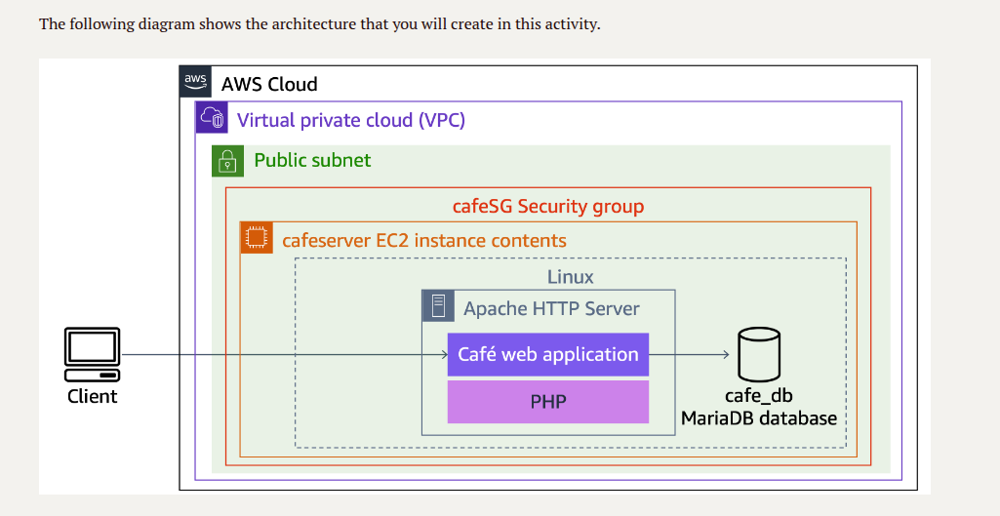
*Instância cafeserver em subnet pública dentro da Cafe VPC, protegida pelo cafeSG Security Group,
rodando Apache HTTP Server, Café Web Application em PHP e banco de dados MariaDB*

### Infraestrutura Utilizada

| Componente | Detalhes |
|---|---|
| CLI Host | Amazon Linux 2 — t3.micro — ponto de execução da AWS CLI |
| cafeserver (LAMP) | Amazon Linux 2 — t3.small — Apache + PHP + MariaDB |
| VPC | Cafe VPC — subnet pública (us-west-2a) |
| Security Group | `cafeSG` — portas 22 (SSH) e 80 (HTTP) |
| IAM Profile | `LabInstanceProfile` — permite chamadas à API EC2 |
| User Data | Script de instalação automática do LAMP stack |
```
CLI Host (EC2 Instance Connect)
    │
    └── AWS CLI
            │
    ┌───────┼───────────────┐
    │       │               │
aws ssm   aws ec2        Script bash
(AMI ID)  describe      (create-lamp-instance-v2.sh)
          (VPC/Subnet/SG)
                │
          aws ec2 run-instances
                │
          cafeserver (t3.small)
                │
         UserData → LAMP stack
                │
    ┌───────────┼───────────┐
    │           │           │
  Apache       PHP       MariaDB
    │
  /cafe/ ✅
```

## 🔧 Tecnologias e Serviços Utilizados

- **Amazon EC2** — Provisionamento de instâncias de computação na nuvem
- **AWS CLI** — Automação de infraestrutura via linha de comando
- **EC2 Instance Connect** — Acesso seguro à instância sem par de chaves fixo
- **AWS SSM Parameter Store** — Recuperação dinâmica do AMI ID mais recente
- **IAM Instance Profile** — Permissões para chamadas à API EC2 a partir da instância
- **Security Groups** — Controle de tráfego de entrada (portas 22 e 80)
- **User Data Script** — Instalação automatizada do LAMP stack na inicialização
- **nmap** — Diagnóstico de portas abertas/fechadas na instância

## 📝 Etapas Realizadas

### Tarefa 1: Conectar ao CLI Host via EC2 Instance Connect

O CLI Host foi provisionado automaticamente com o lab. A conexão foi feita pelo 
Console AWS via EC2 Instance Connect, sem necessidade de par de chaves.

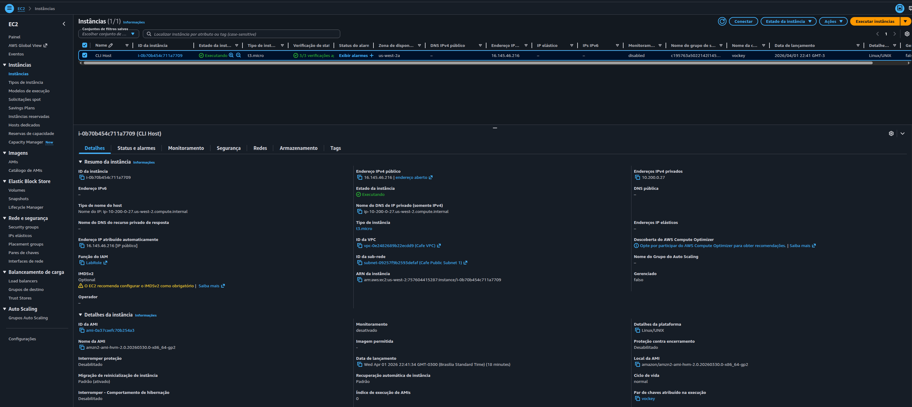
*Console EC2 mostrando a instância CLI Host em execução na região us-west-2*

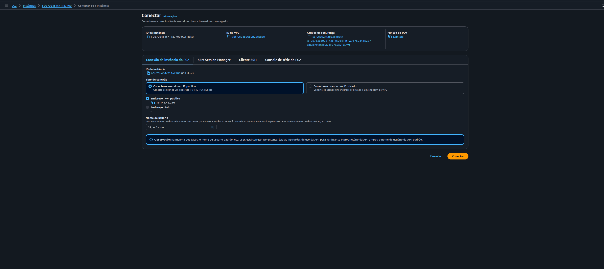
*Tela de conexão com o CLI Host via EC2 Instance Connect — sem key pair necessário*

---

### Tarefa 2: Configurar a AWS CLI

Com acesso ao CLI Host, a AWS CLI foi configurada com as credenciais do lab e a 
região correta para interagir com os serviços AWS.
```bash
aws configure
# AWS Access Key ID: <AccessKey do lab>
# AWS Secret Access Key: <SecretKey do lab>
# Default region name: us-west-2
# Default output format: json
```

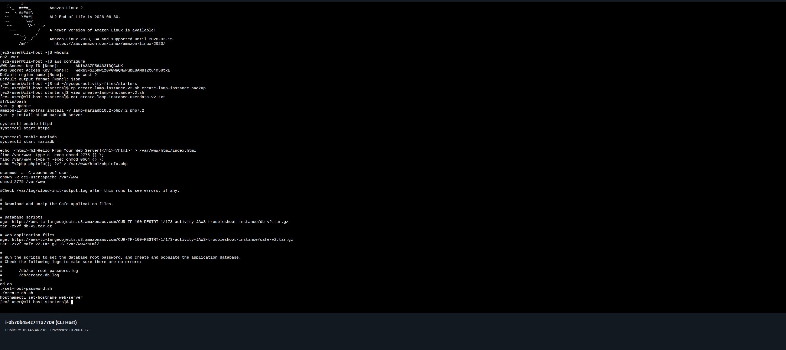
*Terminal mostrando a configuração da AWS CLI e o conteúdo do script user data — 
instalação do Apache, MariaDB e deploy da Café Web Application*

---

### Tarefa 3: Analisar e Corrigir o Script de Criação da Instância

O script `create-lamp-instance-v2.sh` foi fornecido com **dois bugs intencionais** 
que precisavam ser identificados e corrigidos.

#### Bug #1 — Região hardcoded incorreta no `run-instances`

O script descobria dinamicamente a região onde a **Cafe VPC** existia e armazenava 
em `$region`. Porém, no bloco `run-instances`, a região estava hardcoded como 
`us-east-1` em vez de usar a variável `$region`.

Como o AMI ID é **específico por região**, um AMI válido em `us-west-2` não existe 
em `us-east-1`, causando o erro `InvalidAMIID.NotFound`.

#### Bug #2 — Porta errada no Security Group

O bloco que deveria abrir a porta **80 (HTTP)** para o Apache estava configurando 
a porta **8080**, bloqueando completamente o acesso web à instância.

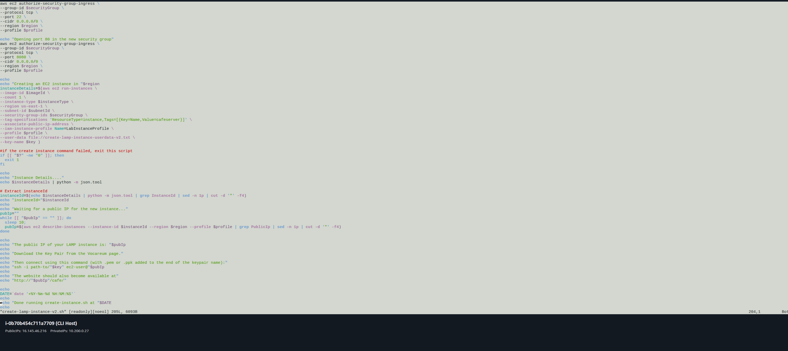
*VI mostrando `--port 8080` e `--region us-east-1` hardcoded — os dois erros do lab*

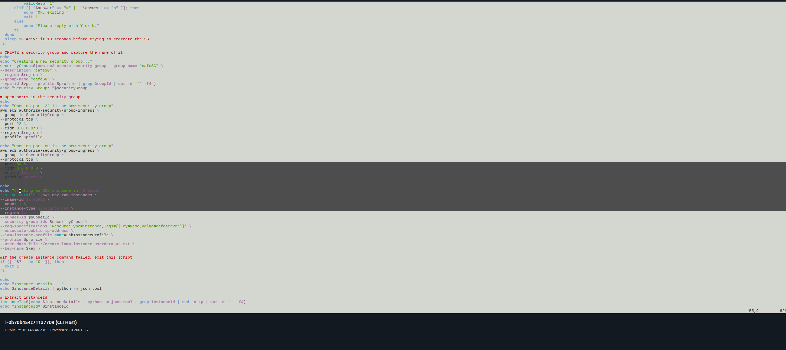
*Script após as correções: `--port 80` e `--region $region` aplicados*

**Correções aplicadas:**
```bash
# Correção 1 — região dinâmica
sed -i 's/--region us-east-1/--region $region/' create-lamp-instance-v2.sh

# Correção 2 — porta correta
sed -i 's/--port 8080/--port 80/' create-lamp-instance-v2.sh
```

---

### Tarefa 4: Executar o Script e Criar a Instância

Após as correções, o script foi executado. Ele deletou automaticamente recursos 
anteriores (instância e security group), criou um novo `cafeSG` com as portas 
corretas e lançou a instância `cafeserver`.

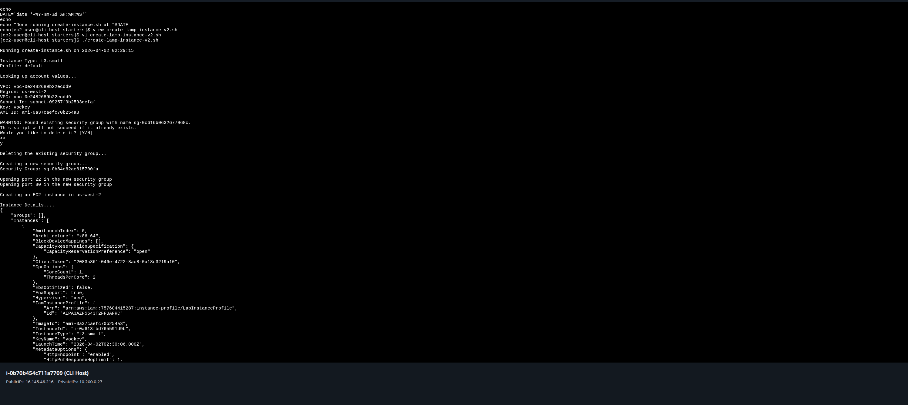
*Script em execução: SG antigo deletado, novo cafeSG criado com porta 22 e 80, 
instância sendo provisionada com run-instances*

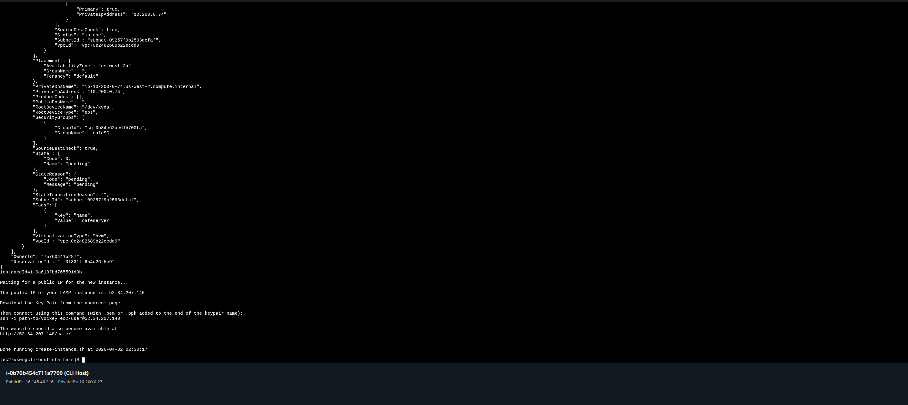
*Script concluído com sucesso — IP público da instância LAMP atribuído e exibido*

---

### Tarefa 5: Verificar Conectividade com nmap

O `nmap` foi usado para validar o estado das portas antes e depois das correções, 
diretamente do CLI Host.
```bash
sudo yum install -y nmap
nmap -Pn <public-ip>
```

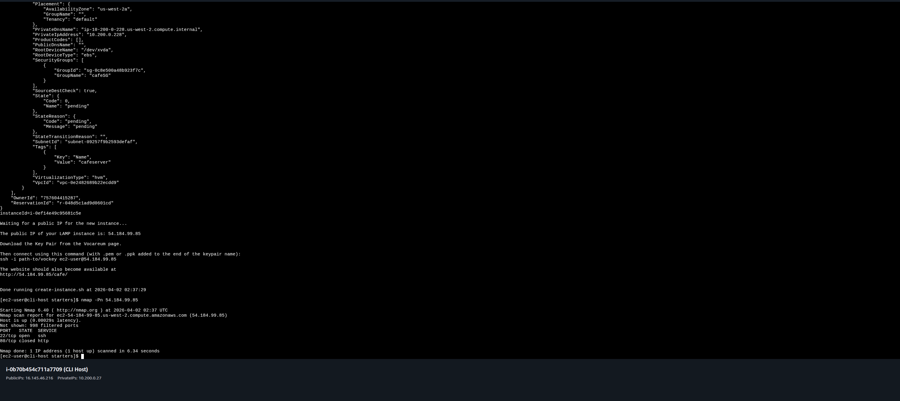
*Primeira execução: porta 22 open, porta 80 **closed** — 
Security Group correto mas Apache ainda inicializando*

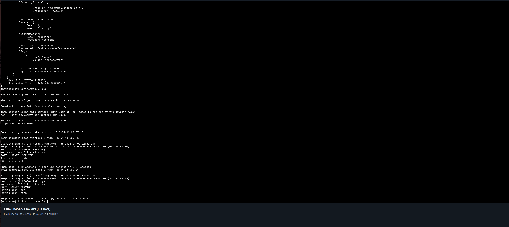
*Segunda execução após aguardar o user data: porta 22 open, porta 80 **open** — 
instância completamente funcional*

**Evolução do diagnóstico:**

| Estado nmap | Significado | Momento |
|---|---|---|
| `filtered` | Security Group bloqueando (bug #2 antes da correção) | Antes do fix |
| `closed` | SG OK, Apache ainda inicializando via user data | Logo após criar |
| `open` | Tudo funcionando — SG liberado + Apache ativo | ✅ Final |

---

### Tarefa 6: Verificar a Aplicação Café

Com a instância funcionando, a Café Web Application foi acessada pelo browser e 
testada com pedidos reais armazenados no banco MariaDB.


*Home page da Café Web Application acessível via `http://<public-ip>/cafe/` — 
Apache, PHP e MariaDB funcionando após o deploy via user data*

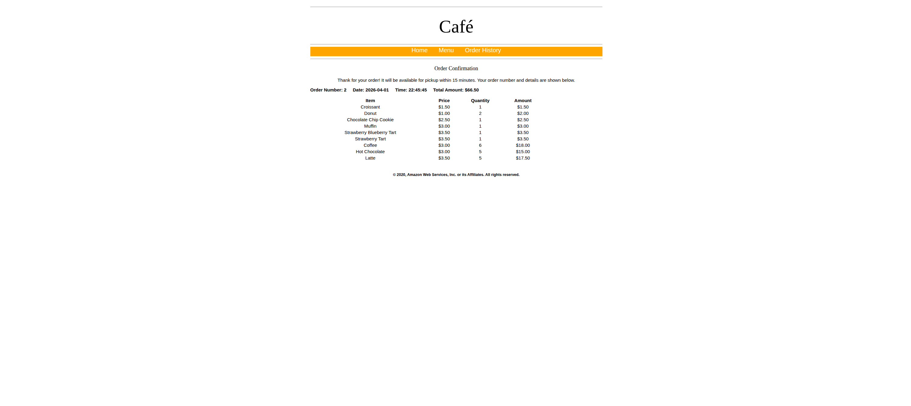
*Tela de Order Confirmation com pedido registrado no banco de dados MariaDB — 
confirmando o funcionamento completo da stack LAMP*

---

## 🔐 Conceitos-Chave Aprendidos

### AMI ID e Especificidade por Região

AMI IDs não são globais — um mesmo AMI tem IDs diferentes em cada região AWS. 
Hardcodar uma região no script enquanto o AMI é buscado dinamicamente em outra 
causa o erro `InvalidAMIID.NotFound`. A solução é sempre usar variáveis dinâmicas 
para garantir consistência.

### SSM Parameter Store para AMI Dinâmico
```bash
imageId=$(aws ssm get-parameters \
  --names '/aws/service/ami-amazon-linux-latest/amzn2-ami-hvm-x86_64-gp2' \
  --region $region | grep ami- | cut -d '"' -f4 | sed -n 2p)
```

O SSM Parameter Store garante que o AMI buscado seja sempre o mais recente para 
a região correta, evitando IDs desatualizados.

### Security Groups — Firewall Stateful

Security Groups são stateful: o tráfego de retorno de conexões permitidas é 
liberado automaticamente. A porta errada (8080 vs 80) bloqueou todo acesso HTTP 
mesmo com a instância funcionando — o SG foi o primeiro ponto de falha.

| Porta | Serviço | Uso |
|---|---|---|
| 22 | SSH | EC2 Instance Connect |
| 80 | HTTP | Apache / Café Web Application |

### nmap como Ferramenta de Diagnóstico

O `nmap -Pn` permite identificar o estado de cada porta independentemente do SO:
```bash
nmap -Pn <public-ip>
# filtered → Security Group bloqueando
# closed   → SG ok, serviço parado ou inicializando
# open     → SG ok + serviço ativo ✅
```

### User Data Script — LAMP Stack Automatizado

O user data executa na primeira inicialização e instala toda a stack sem 
intervenção manual:
```bash
#!/bin/bash
yum -y update
amazon-linux-extras install -y lamp-mariadb10.2-php7.2 php7.2
yum -y install httpd mariadb-server
systemctl enable httpd
systemctl start httpd
systemctl enable mariadb
systemctl start mariadb
# Deploy da aplicação Café
wget <s3-url>/cafe-v2.tar.gz
tar -zxvf cafe-v2.tar.gz -C /var/www/html/
```

### IAM Instance Profile

O `LabInstanceProfile` associado à CLI Host permite que a AWS CLI faça chamadas 
às APIs AWS usando credenciais temporárias via IMDS, sem necessidade de 
credenciais estáticas após o `aws configure`.

## 💡 Principais Aprendizados

1. **Sempre usar variáveis dinâmicas para região e AMI** — hardcodar região em 
scripts que buscam AMIs dinamicamente é uma fonte clássica de erro em ambientes 
multi-região.

2. **Security Group é o primeiro ponto de falha de rede** — antes de investigar 
o SO ou o serviço, sempre verificar se as inbound rules estão corretas.

3. **`nmap` revela a diferença entre filtered e closed** — fundamental para 
distinguir problema de Security Group de problema no serviço.

4. **User data demora para executar** — a instância recebe IP público antes do 
user data terminar. `80/tcp closed` logo após o lançamento é esperado e não 
indica erro.

5. **Backup antes de editar scripts** — o lab reforça a prática de fazer `cp` 
antes de modificar qualquer script em produção.

## 📊 Resultados

| Métrica | Valor |
|---|---|
| Instância criada | cafeserver — t3.small — us-west-2 |
| Bug #1 | `--region us-east-1` → `--region $region` |
| Bug #2 | `--port 8080` → `--port 80` |
| Diagnóstico de rede | nmap confirmou evolução filtered → closed → open |
| LAMP Stack | Apache + PHP + MariaDB funcionando via user data |
| Aplicação | Café Web Application acessível com pedidos no banco ✅ |

## 📚 Recursos Adicionais

- [Documentação Amazon EC2](https://docs.aws.amazon.com/ec2/)
- [AWS CLI — Referência EC2](https://awscli.amazonaws.com/v2/documentation/api/latest/reference/ec2/index.html)
- [User Data e Shell Scripts](https://docs.aws.amazon.com/AWSEC2/latest/UserGuide/user-data.html)
- [SSM Parameter Store — AMIs públicos](https://docs.aws.amazon.com/systems-manager/latest/userguide/parameter-store-public-parameters-ami.html)
- [nmap — Documentação oficial](https://nmap.org/docs.html)

## 🏆 Certificações Relacionadas

- **AWS Certified Cloud Practitioner**
- **AWS Certified Solutions Architect - Associate**
- **AWS Certified SysOps Administrator - Associate**

## 👨‍💻 Autor

**Matheus Lima**  
Estudante — Escola da Nuvem | Programa Re/Start AWS

---

<div align="center">

[](https://aws.amazon.com/training/awsacademy/)
[](https://aws.amazon.com/ec2/)
[](https://aws.amazon.com/cli/)
[](https://aws.amazon.com/ec2/)

</div>
