# Lab AWS — Using Auto Scaling in AWS (Linux)

## 📋 Sobre o Lab

Este laboratório faz parte do **Programa Re/Start AWS** através da **Escola da Nuvem**, focado em práticas de provisionamento de infraestrutura escalável e resiliente na nuvem com Amazon EC2 Auto Scaling e Application Load Balancer.

## 🎯 Objetivos

Ao concluir este laboratório, pratiquei:

- ✅ Criar uma instância EC2 via AWS CLI
- ✅ Criar uma AMI customizada via AWS CLI a partir de uma instância em execução
- ✅ Criar um Launch Template para o Auto Scaling Group
- ✅ Configurar um Application Load Balancer com Target Group
- ✅ Criar um Auto Scaling Group com política de Target Tracking (CPU ≥ 50%)
- ✅ Verificar o scale out automático ao simular carga alta na aplicação

## 🏗️ Arquitetura do Lab

### Arquitetura Inicial

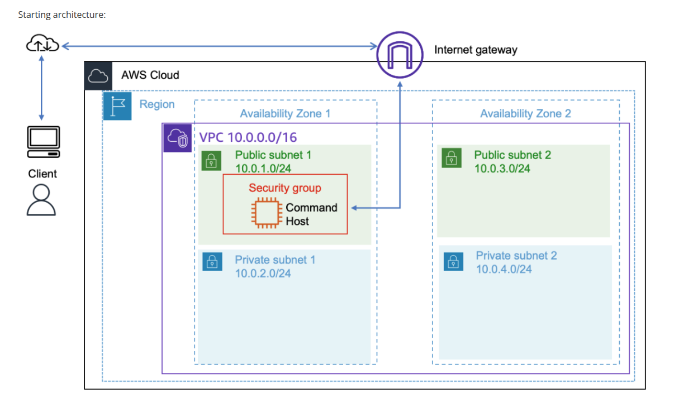

*Ponto de partida: Command Host em subnet pública com acesso à internet via Internet Gateway, dentro de uma VPC com subnets públicas e privadas em duas Availability Zones*

### Arquitetura Final

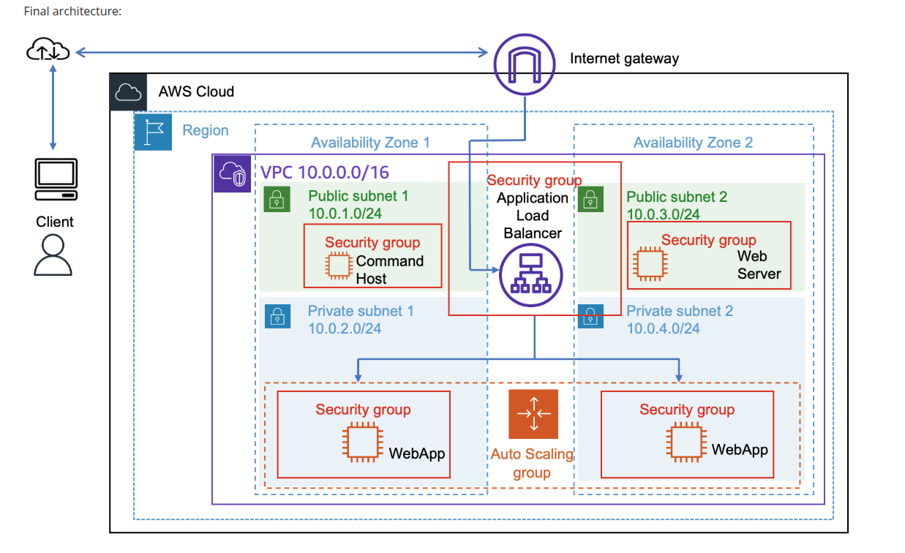

*Resultado final: Application Load Balancer nas subnets públicas distribuindo tráfego entre instâncias WebApp do Auto Scaling Group nas subnets privadas, em duas Availability Zones*

### Infraestrutura Utilizada

| Componente | Detalhes |
|---|---|
| Command Host | Amazon Linux 2 — t3.medium — acesso via EC2 Instance Connect |
| WebServer (base) | Amazon Linux 2 — t3.micro — lançado via AWS CLI com UserData |
| AMI Customizada | WebServerAMI — criada a partir do WebServer via `aws ec2 create-image` |
| Launch Template | `web-app-launch-template` — baseado na WebServerAMI, tipo t3.micro |
| Application Load Balancer | `WebServerELB` — Internet-facing, nas Public Subnets 1 e 2 |
| Target Group | `webserver-app` — HTTP:80, health check em `/index.php` |
| Auto Scaling Group | `Web App Auto Scaling Group` — desejado: 2, mín: 2, máx: 4 |
| Scaling Policy | Target Tracking — Average CPU Utilization ≥ 50% |
| VPC | Lab VPC — 10.0.0.0/16 |
| Subnets ALB | Public Subnet 1 (10.0.1.0/24) — Public Subnet 2 (10.0.3.0/24) |
| Subnets ASG | Private Subnet 1 (10.0.2.0/24) — Private Subnet 2 (10.0.4.0/24) |
| Security Group | `HTTPAccess` — porta 80 (HTTP) |
| Region | us-west-2 (Oregon) |

### Fluxo da Infraestrutura

```
Console AWS
    │
    └── EC2 Instance Connect ──► Command Host (t3.medium)
                                        │
                                   AWS CLI
                                        │
                          ┌─────────────┴──────────────┐
                          │                            │
                   aws ec2 run-instances        aws ec2 create-image
                   (WebServer + UserData)        (WebServerAMI)
                          │                            │
                    WebServer EC2              Launch Template
                    (PHP stress app)          web-app-launch-template
                                                       │
                                            Auto Scaling Group
                                           (Private Subnet 1 + 2)
                                                  │       │
                                            WebApp-AZ1  WebApp-AZ2
                                                  │       │
                                         Application Load Balancer
                                           (Public Subnet 1 + 2)
                                                    │
                                        http://WebServerELB-DNS ✅
                                                    │
                                        [Start Stress → CPU > 50%]
                                                    │
                                        CloudWatch Alarm disparado
                                                    │
                                        Scale Out: 2 → 3 instâncias ✅
```

## 🔧 Tecnologias e Serviços Utilizados

- **Amazon EC2** — Provisionamento de instâncias de computação
- **AWS CLI** — Criação de instâncias e AMIs por linha de comando
- **EC2 Instance Connect** — Acesso seguro ao Command Host sem par de chaves
- **Amazon Machine Image (AMI)** — Snapshot customizado para replicação em escala
- **Launch Template** — Template padronizado para o Auto Scaling Group
- **Application Load Balancer (ALB)** — Distribuição de tráfego entre instâncias em múltiplas AZs
- **Target Group** — Agrupamento de instâncias com health check automático
- **Amazon EC2 Auto Scaling** — Escalonamento automático baseado em métricas
- **Amazon CloudWatch** — Monitoramento de CPU e disparo de alarmes de scaling
- **Security Groups** — Controle de tráfego de entrada e saída
- **User Data Script** — Instalação automatizada da aplicação PHP na inicialização

## 📝 Etapas Realizadas

### Tarefa 1.1 — Conectar ao Command Host via EC2 Instance Connect

O Command Host foi provisionado automaticamente com o lab. O acesso foi feito diretamente pelo Console AWS, sem necessidade de par de chaves SSH.

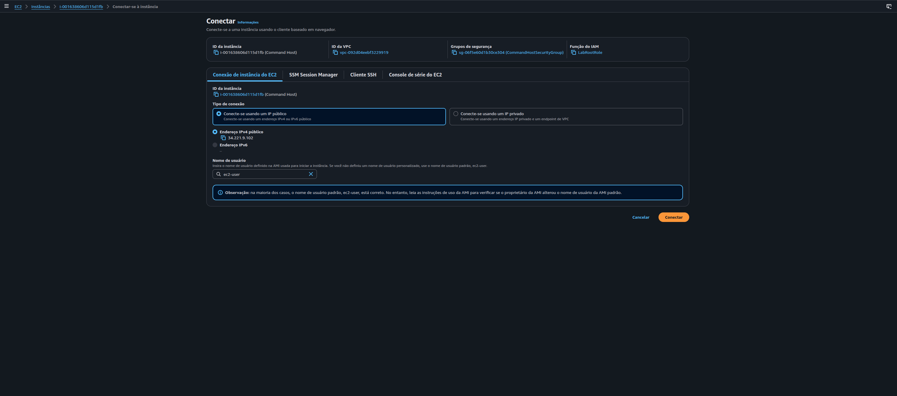

*Tela de conexão EC2 Instance Connect com o Command Host (i-001638606d115d1fb) — IP público 34.221.9.102, IP privado 10.0.1.187*

---

### Tarefa 1.2 — Configurar a AWS CLI

Com acesso ao terminal do Command Host, a região foi confirmada via metadados da instância e o AWS CLI foi configurado.

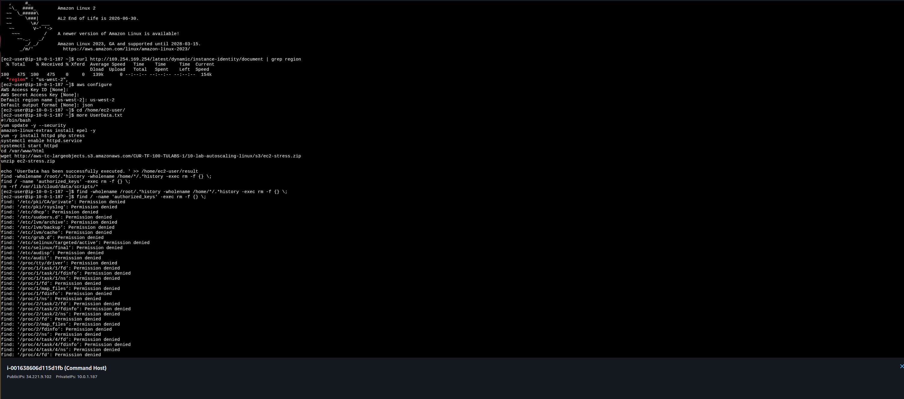

*Sequência: curl para obter a região (us-west-2), `aws configure` definindo região e output json, `cd /home/ec2-user/` e `more UserData.txt` mostrando o script de instalação do servidor web PHP*

**Comandos executados:**

```bash
# Confirmar região
curl http://169.254.169.254/latest/dynamic/instance-identity/document | grep region

# Configurar CLI
aws configure
# AWS Access Key ID: [Enter]
# AWS Secret Access Key: [Enter]
# Default region name: us-west-2
# Default output format: json

# Navegar para o diretório de trabalho
cd /home/ec2-user/

# Inspecionar o script de UserData
more UserData.txt
```

---

### Tarefa 1.3 — Criar a Instância WebServer via CLI

A instância base para criação da AMI foi lançada com o script UserData que instala o servidor web com aplicação PHP para simular carga de CPU.

#### Troubleshooting: Erro no parâmetro `--key-name`

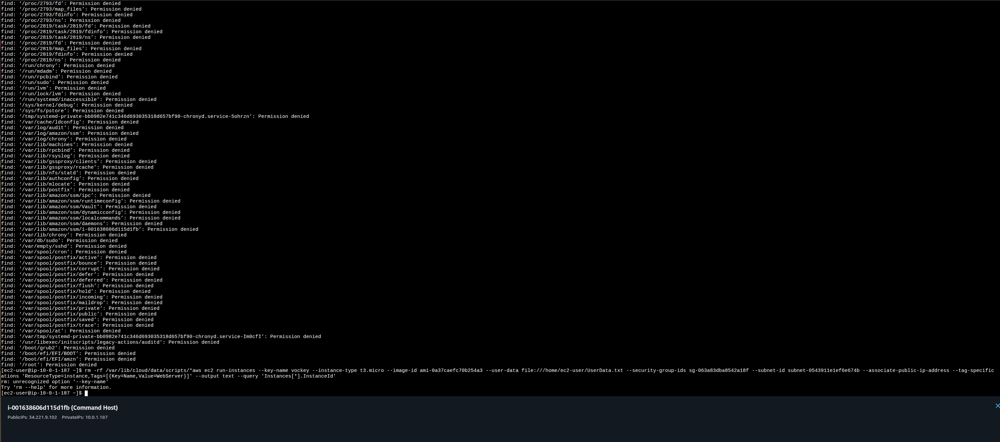

*Primeiro erro encontrado: `--key-name vockey` causou `unrecognized option '--key-name'` porque o parâmetro foi inserido antes do subcomando `run-instances`. Erro corrigido ajustando a ordem dos argumentos*

> **Aprendizado:** Na AWS CLI, a ordem dos parâmetros importa. O subcomando (`run-instances`) deve vir imediatamente após o serviço (`ec2`), e os flags devem vir depois.

#### Execução com sucesso

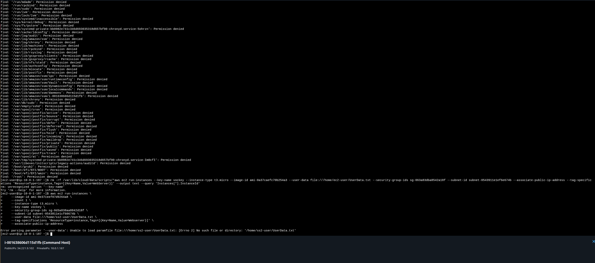

*`aws ec2 run-instances` executado corretamente — resposta JSON com detalhes da instância criada, incluindo `InstanceId: i-049c069d1e5126d6b`, estado `pending`, Security Group HTTPAccess e IP privado 10.0.1.147*

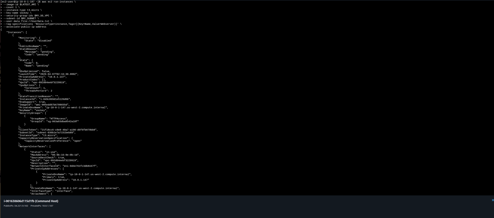

*Continuação do JSON de resposta mostrando NetworkInterfaces, Placement na us-west-2a, Tags `Name=Webserver` e confirmação do SubnetId e OwnerId*

**Comando utilizado:**

```bash
aws ec2 run-instances \
  --image-id $LATEST_AMI \
  --count 1 \
  --instance-type t3.micro \
  --security-group-ids $MY_SG_VPC \
  --subnet-id $MY_SUBNET \
  --user-data file:///home/ec2-user/UserData.txt \
  --tag-specifications 'ResourceType=instance,Tags=[{Key=Name,Value=Webserver}]' \
  --associate-public-ip-address
```

---

### Tarefa 1.4 — Criar a AMI Customizada via CLI

Com o WebServer em execução, a AMI foi criada a partir da instância para ser usada como base do Launch Template.

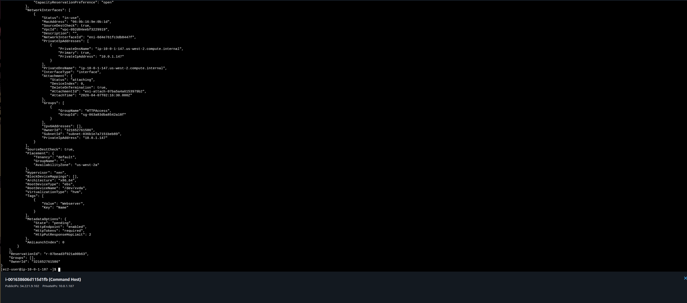

*Terminal mostrando o `aws ec2 create-image --name WebServerAMI --instance-id i-049c069d1e5126d6b` com resposta `ImageId: ami-01d4ae0b5f7894fe2` — AMI criada com sucesso*

**Comando utilizado:**

```bash
aws ec2 create-image \
  --name WebServerAMI \
  --instance-id i-049c069d1e5126d6b
# Retorno: { "ImageId": "ami-01d4ae0b5f7894fe2" }
```

> **Nota:** O comando `create-image` reinicia a instância antes de capturar o snapshot para garantir a integridade do sistema de arquivos.

---

### Tarefa 2.1 — Criar o Target Group

Antes do Load Balancer, o Target Group `webserver-app` foi criado para receber o tráfego HTTP:80 das instâncias lançadas pelo Auto Scaling.


*Tela de criação do Target Group: tipo Instâncias, nome `webserver-app`, protocolo HTTP:80, VPC Lab VPC, versão HTTP1, health check path `/index.php`*

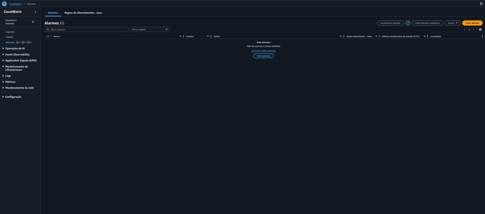

*Etapa "Registrar destinos": instâncias WebServer e Command Host disponíveis, mas nenhuma selecionada manualmente — o Auto Scaling Group registrará as instâncias automaticamente*

**Configurações aplicadas:**

- **Target type:** Instances
- **Target group name:** webserver-app
- **Protocol:** HTTP — Port: 80
- **VPC:** Lab VPC
- **Protocol version:** HTTP1
- **Health check path:** /index.php

---

### Tarefa 2.1 (cont.) — Criar o Application Load Balancer

O ALB `WebServerELB` foi criado para distribuir tráfego entre as instâncias do Auto Scaling nas duas Availability Zones.

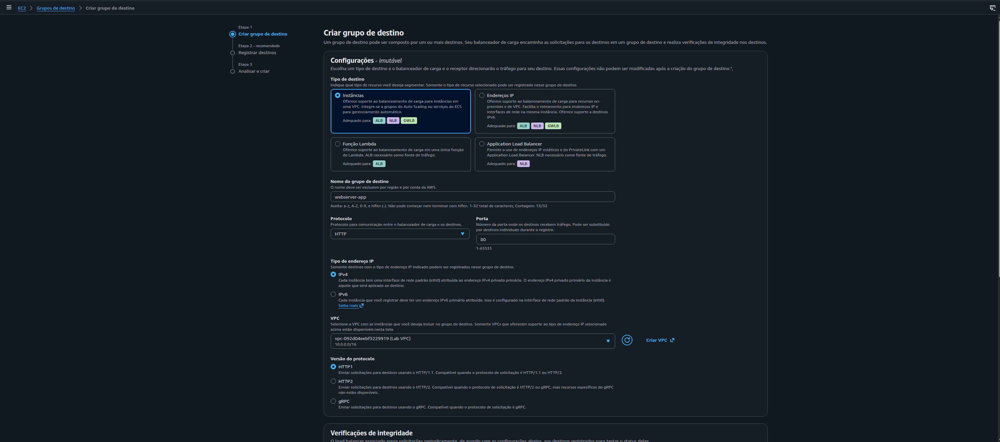

*Load Balancer WebServerELB criado com sucesso — Internet-facing, IPv4, nas AZs us-west-2a e us-west-2b (Public Subnets), listener HTTP:80 encaminhando 100% para o Target Group webserver-app. DNS: `WebServerELB-1828114662.us-west-2.elb.amazonaws.com`*

**Configurações aplicadas:**

- **Name:** WebServerELB
- **Scheme:** Internet-facing
- **IP address type:** IPv4
- **VPC:** Lab VPC
- **Availability Zones:** us-west-2a (Public Subnet 1) + us-west-2b (Public Subnet 2)
- **Security Group:** HTTPAccess (porta 80)
- **Listener:** HTTP:80 → Forward to webserver-app (100%)

---

### Tarefa 2.2 — Criar o Launch Template

O Launch Template `web-app-launch-template` foi criado usando a `WebServerAMI` para padronizar as instâncias lançadas pelo Auto Scaling Group.

**Configurações aplicadas:**

- **Name:** web-app-launch-template
- **Description:** A web server for the load test app
- **AMI:** WebServerAMI (aba My AMIs)
- **Instance type:** t3.micro
- **Key pair:** Don't include in launch template
- **Security group:** HTTPAccess

---

### Tarefa 2.3 — Criar o Auto Scaling Group

O Auto Scaling Group foi configurado para lançar instâncias nas subnets privadas, conectado ao Load Balancer, com política de escalonamento baseada em CPU.

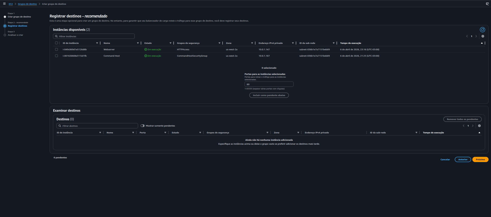

*Tela de escalabilidade do Auto Scaling Group: capacidade mínima 2, máxima 4 e política "Target Tracking" selecionada com métrica de CPU Utilization alvo de 50%*

**Configurações aplicadas:**

- **Name:** Web App Auto Scaling Group
- **Launch template:** web-app-launch-template
- **VPC:** Lab VPC
- **Subnets:** Private Subnet 1 (10.0.2.0/24) + Private Subnet 2 (10.0.4.0/24)
- **Load balancer:** Attach to existing — webserver-app | HTTP
- **Health checks:** ELB health checks habilitado
- **Desired capacity:** 2
- **Minimum capacity:** 2
- **Maximum capacity:** 4
- **Scaling policy:** Target Tracking — Average CPU Utilization — Target: 50%
- **Tag:** Name = WebApp

---

### Tarefa 3 — Verificar as Instâncias e o Target Group

Após a criação do Auto Scaling Group, as instâncias WebApp foram lançadas automaticamente e registradas no Target Group.

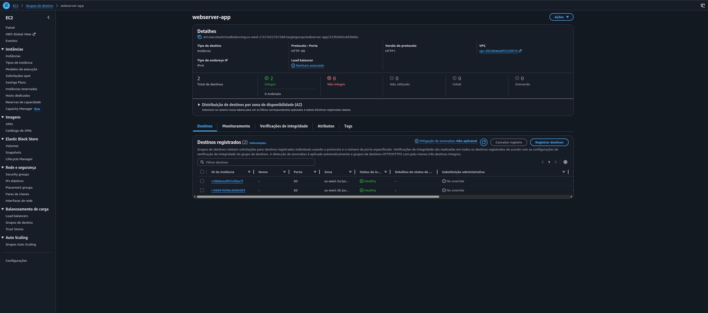

*Target Group webserver-app com 2 destinos registrados, ambos com status **Healthy**: uma instância em us-west-2a e outra em us-west-2b — confirmando que o ALB está roteando tráfego corretamente*

---

### Tarefa 4 — Testar o Auto Scaling com Carga de CPU

A aplicação foi acessada via DNS do Load Balancer e o teste de stress foi iniciado para simular alta utilização de CPU e acionar o scale out.

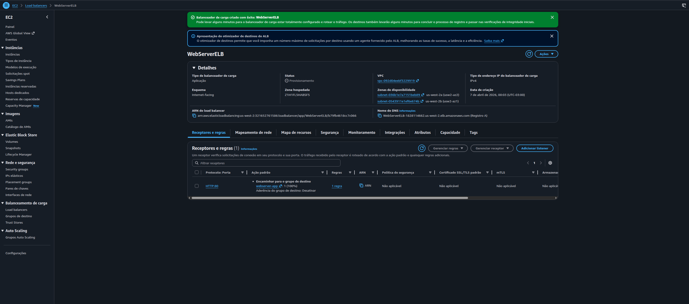

*Aplicação web acessível via DNS do WebServerELB — tela "Generate Load" com botões Start Stress e Stop Stress. Ao clicar em Start Stress, a aplicação PHP consome 100% de CPU na instância que atendeu a requisição*


*Console EC2 mostrando as 4 instâncias em execução: Command Host (t3.medium), WebServer original (t3.micro), e as duas instâncias WebApp do Auto Scaling Group nas AZs us-west-2a e us-west-2b*

---

### Resultado Final — Scale Out Confirmado

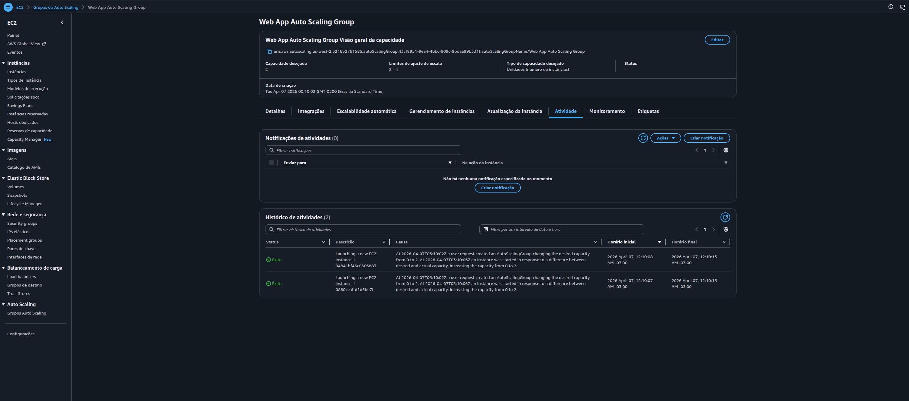

*Histórico de atividades do Auto Scaling Group logo após a criação — 2 entradas com status "Êxito" registrando o lançamento das instâncias iniciais (capacidade 0 → 2)*

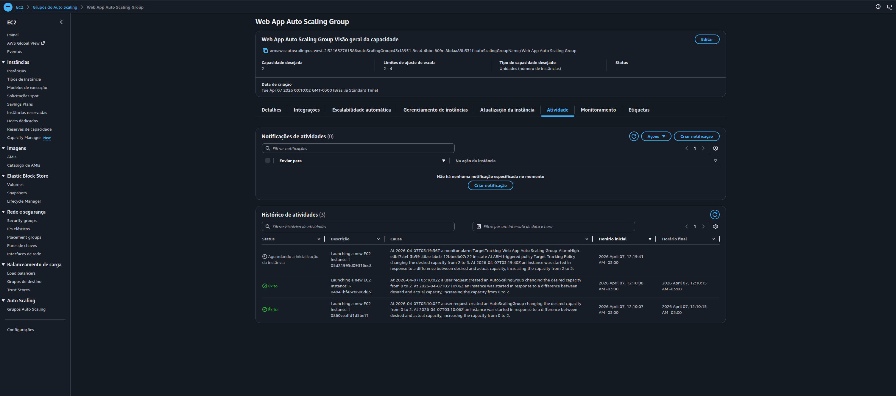

*Histórico de atividades após o Start Stress — 3ª entrada aparece: "Launching a new EC2 Instance" com causa **TargetTracking-Web App Auto Scaling Group-AlarmHigh** disparado pelo CloudWatch ao detectar CPU > 50%. Capacidade aumentada de **2 → 3** automaticamente*

## 🔐 Conceitos-Chave Aprendidos

### AMI — Amazon Machine Image

Uma AMI é um template que contém o sistema operacional, configurações e dados necessários para lançar instâncias EC2. Ao criar uma AMI customizada a partir de uma instância configurada, é possível garantir que todas as instâncias do Auto Scaling Group sejam lançadas com o mesmo ambiente de software pré-instalado — sem depender de scripts de inicialização a cada novo lançamento.

```
Instância EC2 configurada
         │
  aws ec2 create-image
         │
      WebServerAMI (snapshot do volume EBS)
         │
  Launch Template referencia a AMI
         │
  Auto Scaling Group lança N instâncias idênticas ✅
```

### Application Load Balancer — Distribuição de Tráfego

O ALB opera na Camada 7 (HTTP/HTTPS) e distribui requisições entre instâncias registradas em um Target Group. Configurado com duas AZs, ele garante alta disponibilidade: se uma AZ ficar indisponível, o tráfego é automaticamente redirecionado para as instâncias na outra AZ.

| Componente | Função |
|---|---|
| ALB (WebServerELB) | Ponto de entrada único — recebe tráfego da internet |
| Listener HTTP:80 | Define a regra de encaminhamento |
| Target Group (webserver-app) | Agrupa as instâncias e realiza health checks |
| Health Check (/index.php) | Remove instâncias não saudáveis do pool automaticamente |

### Auto Scaling — Target Tracking Policy

A política de Target Tracking monitora uma métrica e ajusta automaticamente o número de instâncias para manter o valor próximo ao alvo definido. Com CPU alvo de 50%:

```
CPU média do grupo = 80%  →  CloudWatch Alarm (AlarmHigh) dispara
                           →  Auto Scaling adiciona instância (scale out)
                           →  CPU média distribui e cai para ~50%

CPU média do grupo = 20%  →  CloudWatch Alarm (AlarmLow) dispara
                           →  Auto Scaling remove instância (scale in)
                           →  CPU média sobe para ~50%
```

O CloudWatch cria os alarmes High e Low automaticamente ao configurar a política de Target Tracking.

### Subnets Públicas vs. Privadas no Auto Scaling

| Componente | Subnet | Motivo |
|---|---|---|
| Application Load Balancer | **Pública** | Precisa receber tráfego da internet |
| Instâncias WebApp (ASG) | **Privada** | Não expostas diretamente à internet — acessadas apenas pelo ALB |

Esse padrão de arquitetura aumenta a segurança das instâncias: mesmo sem IP público, elas recebem tráfego normalmente através do Load Balancer.

### Launch Template vs. Launch Configuration

O lab usa **Launch Template** (recomendação atual da AWS) em vez do Launch Configuration (legado):

| | Launch Template | Launch Configuration |
|---|---|---|
| Versionamento | ✅ Suporta versões | ❌ Imutável |
| Spot + On-Demand misto | ✅ | ❌ |
| AWS recomenda | ✅ Sim | ⚠️ Legado |

### User Data Script — Automação na Inicialização

O UserData.txt executado na instância WebServer base instalou automaticamente:

```bash
#!/bin/bash
# Atualiza pacotes
yum update -y
# Instala Apache, PHP e o utilitário stress
amazon-linux-extras install epel -y
yum -y install httpd php stress
systemctl enable httpd.service
systemctl start httpd
# Baixa e instala a aplicação de simulação de carga
wget http://aws-tc-largeobjects.s3.amazonaws.com/.../ec2-stress.zip
cd /var/www/html
unzip ec2-stress.zip
# Limpa histórico e chaves antes da criação da AMI
find / -name 'authorized_keys' -exec rm -f {} \;
rm -rf /var/lib/cloud/data/scripts/*
```

> As últimas linhas são críticas: removem histórico e chaves SSH para garantir que a AMI criada a partir dessa instância não contenha credenciais ou dados sensíveis acidentais.

## 💡 Principais Aprendizados

1. **A ordem dos parâmetros na AWS CLI importa** — O subcomando (`run-instances`) deve vir logo após o serviço (`ec2`). Flags fora de ordem causam `unrecognized option`.

2. **AMI = ponto de consistência para escala** — Criar a AMI após configurar a instância garante que todas as réplicas do Auto Scaling sejam idênticas, sem depender de scripts de UserData complexos a cada lançamento.

3. **ALB + ASG = alta disponibilidade automática** — O Load Balancer distribui tráfego entre AZs e o Auto Scaling mantém o número de instâncias saudáveis, formando uma arquitetura resiliente a falhas de zona.

4. **Target Tracking é declarativo** — Você define "quero CPU em 50%" e a AWS calcula e executa o scaling necessário. Não é preciso definir manualmente quantas instâncias adicionar ou remover.

5. **Health Check do ALB age mais rápido que o EC2** — Instâncias com falha são removidas do Target Group antes de serem terminadas, garantindo que nenhuma requisição seja enviada para instâncias problemáticas.

6. **Instâncias em subnets privadas não precisam de IP público** — O ALB atua como proxy reverso: recebe requisições da internet e as encaminha internamente para as instâncias, que respondem pelo IP privado.

7. **O CloudWatch cria alarmes automaticamente** — Ao configurar uma política de Target Tracking no Auto Scaling, o CloudWatch cria os alarmes `AlarmHigh` e `AlarmLow` automaticamente — não é necessário configurá-los manualmente.

## 🚀 Como Reproduzir este Lab

### Pré-requisitos

- Acesso ao AWS Academy Lab
- Navegador web (Chrome, Firefox ou Edge)
- Conhecimento básico de terminal Linux e AWS CLI

### Resumo do Passo a Passo

1. **EC2 Instance Connect** → Conectar ao Command Host
2. **AWS CLI** → Configurar região e output format
3. **`aws ec2 run-instances`** → Criar instância WebServer com UserData
4. **`aws ec2 create-image`** → Criar AMI `WebServerAMI` a partir do WebServer
5. **Console EC2** → Criar Target Group `webserver-app` (HTTP:80, health check `/index.php`)
6. **Console EC2** → Criar ALB `WebServerELB` (Internet-facing, Public Subnets 1 e 2)
7. **Console EC2** → Criar Launch Template com a WebServerAMI
8. **Console EC2** → Criar Auto Scaling Group (Private Subnets, mín 2, máx 4, CPU target 50%)
9. **Aguardar** → Instâncias ficarem Healthy no Target Group
10. **Testar** → Acessar DNS do ALB → Start Stress → Observar scale out na aba Atividade

## 📊 Resultados

| Métrica | Valor |
|---|---|
| Instância base criada via CLI | ✅ WebServer (i-049c069d1e5126d6b) |
| AMI criada via CLI | ✅ WebServerAMI (ami-01d4ae0b5f7894fe2) |
| Launch Template | ✅ web-app-launch-template |
| Load Balancer | ✅ WebServerELB (Internet-facing, 2 AZs) |
| Target Group | ✅ webserver-app — 2 instâncias Healthy |
| Auto Scaling Group | ✅ Web App Auto Scaling Group (mín 2, máx 4) |
| Scaling Policy | ✅ Target Tracking — CPU ≥ 50% |
| Scale Out testado | ✅ CPU > 50% → 3ª instância lançada automaticamente |
| Causa do Scale Out | AlarmHigh (TargetTracking) disparado pelo CloudWatch |

## 📚 Recursos Adicionais

- [Documentação Amazon EC2 Auto Scaling](https://docs.aws.amazon.com/autoscaling/ec2/userguide/)
- [Application Load Balancer — Guia do Usuário](https://docs.aws.amazon.com/elasticloadbalancing/latest/application/)
- [AWS CLI — Referência EC2](https://awscli.amazonaws.com/v2/documentation/api/latest/reference/ec2/index.html)
- [Target Tracking Scaling Policies](https://docs.aws.amazon.com/autoscaling/ec2/userguide/as-scaling-target-tracking.html)
- [Launch Templates](https://docs.aws.amazon.com/AWSEC2/latest/UserGuide/ec2-launch-templates.html)
- [AWS Academy](https://aws.amazon.com/training/awsacademy/)

## 🏆 Certificações Relacionadas

Este laboratório contribui para a preparação das seguintes certificações:

- **AWS Certified Cloud Practitioner**
- **AWS Certified Solutions Architect — Associate**
- **AWS Certified SysOps Administrator — Associate**

## 👨‍💻 Autor

**Matheus Lima**  
Estudante — Escola da Nuvem | Programa Re/Start AWS

---

## 📄 Licença

Este projeto é parte do Programa Re/Start AWS e está disponível para fins de estudo e portfólio.

---

<div align="center">

[](https://aws.amazon.com/training/awsacademy/)
[](https://aws.amazon.com/ec2/)
[](https://aws.amazon.com/ec2/autoscaling/)
[](https://aws.amazon.com/elasticloadbalancing/)
[](https://aws.amazon.com/cli/)

</div>
