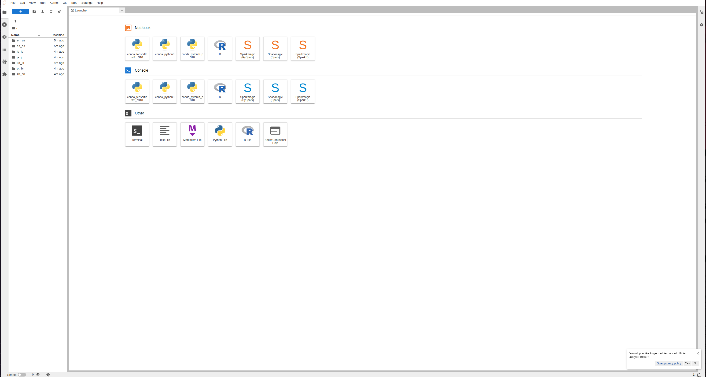
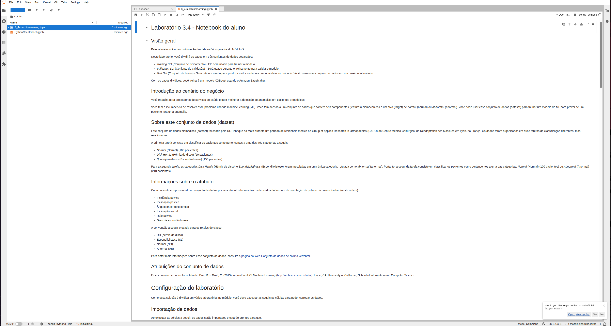
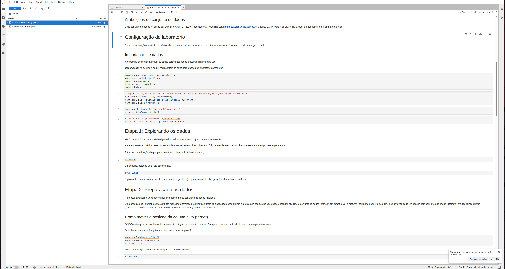
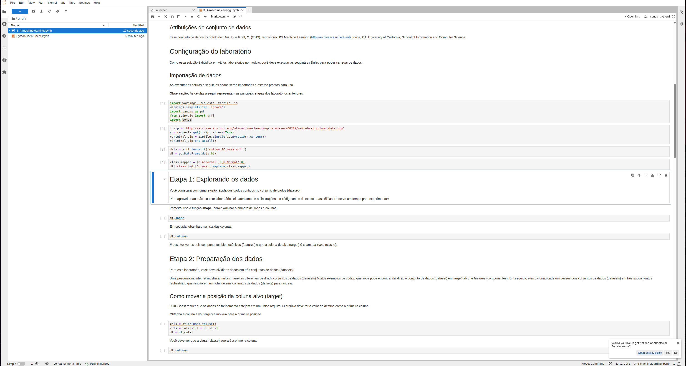
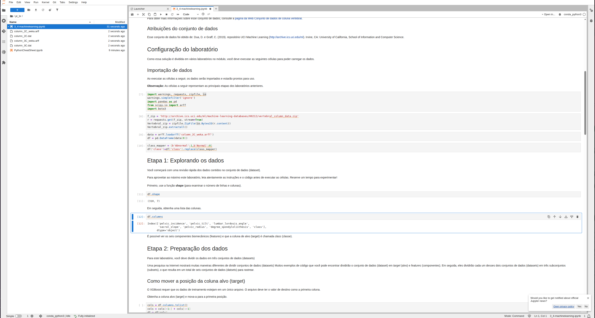
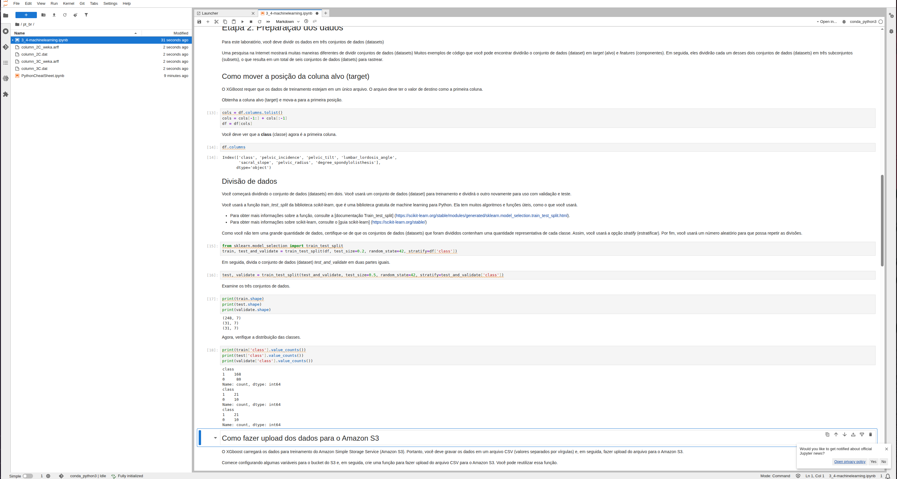
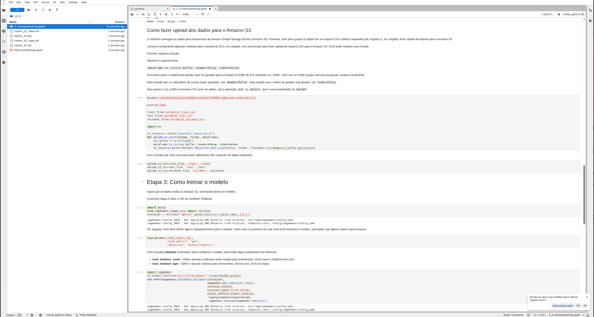
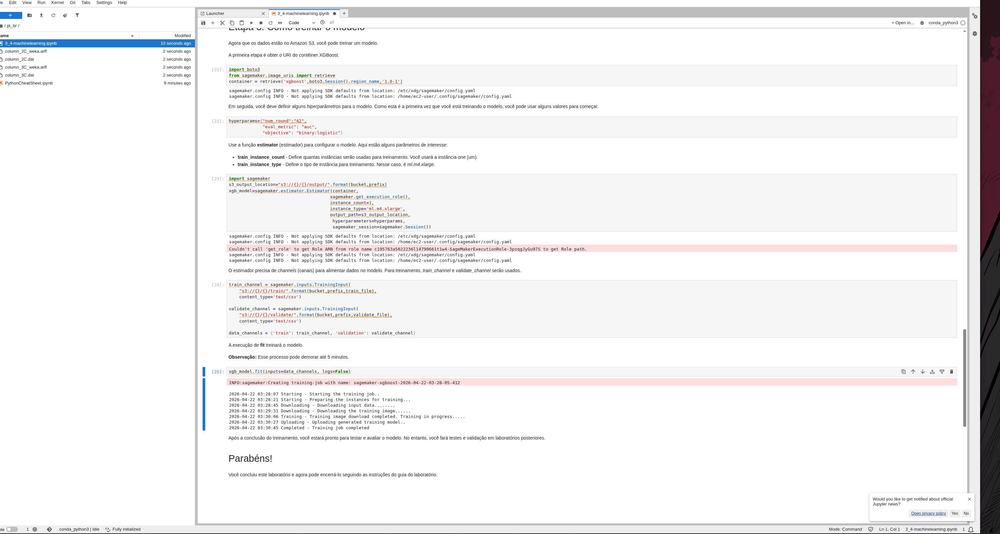

# Lab AWS - Treinando um Modelo de Machine Learning com XGBoost

## 📋 Sobre o Lab

Este laboratório faz parte do **Programa Re/Start AWS** através da **Escola da Nuvem**, com foco em machine learning aplicado na nuvem. O lab explora o dataset biomecânico da coluna vertebral e utiliza o **Amazon SageMaker** para treinar um modelo de classificação com o algoritmo **XGBoost**.

## 🎯 Objetivos

Ao concluir este laboratório, pratiquei:

- ✅ Carregar e explorar um dataset biomédico com pandas e scipy
- ✅ Dividir dados em conjuntos de treinamento, validação e teste com scikit-learn
- ✅ Fazer upload dos datasets CSV para o Amazon S3 via boto3
- ✅ Configurar um Estimator XGBoost no Amazon SageMaker
- ✅ Disparar e monitorar um Training Job gerenciado pelo SageMaker

## 🏗️ Arquitetura do Lab


*Fluxo do lab: notebook JupyterLab processa o dataset, divide os dados, faz upload para o S3 e dispara um Training Job XGBoost no SageMaker*

### Infraestrutura Utilizada

| Componente | Detalhes |
|---|---|
| Instância de Notebook | `MyNotebook` — Amazon SageMaker Notebook Instance |
| Ambiente | JupyterLab — kernel `conda_python3` |
| Dataset | UCI Vertebral Column — 310 pacientes, 6 atributos biomecânicos |
| Bucket S3 | Bucket do lab — prefixo `lab3` |
| Algoritmo | XGBoost `1.0-1` (imagem gerenciada pelo SageMaker) |
| Instância de Treino | `ml.m4.xlarge` |
| Região | `us-west-2` |

O fluxo parte do notebook JupyterLab já provisionado. O dataset é baixado diretamente do repositório UCI, processado com pandas e scikit-learn, enviado ao S3 em três arquivos CSV e usado para disparar um Training Job gerenciado pelo SageMaker.

```
JupyterLab (MyNotebook)
    │
    ├── requests.get() ──────────► UCI Repository (vertebral_column_data.zip)
    │                                    │
    ├── scipy.io.arff + pandas ──────────┘
    │   class_mapper: Abnormal→1 / Normal→0
    │
    ├── train_test_split (stratify) ──► train (248) / test (31) / validate (31)
    │
    ├── boto3 upload_s3_csv ──────────► S3 Bucket (lab3/)
    │                                      ├── vertebral_train.csv
    │                                      ├── vertebral_test.csv
    │                                      └── vertebral_validate.csv
    │
    └── sagemaker.estimator.Estimator ──► XGBoost Training Job
                                              └── model artifact → s3://.../output/
```

## 🔧 Tecnologias e Serviços Utilizados

- **Amazon SageMaker** — Instância de notebook gerenciada e execução do Training Job
- **Amazon S3** — Armazenamento dos datasets CSV e do artefato do modelo treinado
- **XGBoost** — Algoritmo de boosting para classificação binária
- **scikit-learn** — Divisão estratificada dos dados via `train_test_split`
- **pandas / scipy** — Carregamento e manipulação do dataset no formato `.arff`
- **boto3** — SDK Python para interação programática com os serviços AWS

## 📊 Sobre o Dataset

O dataset biomecânico da coluna vertebral foi criado pelo Dr. Henrique da Mota e está disponível no repositório UCI Machine Learning. Cada paciente é representado por **6 atributos biomecânicos** derivados da forma e orientação da pelve e da coluna lombar.

### Atributos (features)

| Atributo | Descrição |
|---|---|
| `pelvic_incidence` | Incidência pélvica |
| `pelvic_tilt` | Inclinação pélvica |
| `lumbar_lordosis_angle` | Ângulo da lordose lombar |
| `sacral_slope` | Inclinação sacral |
| `pelvic_radius` | Raio pélvico |
| `degree_spondylolisthesis` | Grau de espondilolistese |

### Classes (target)

| Rótulo original | Rótulo numérico | Quantidade |
|---|---|---|
| `Normal` | `0` | 100 pacientes |
| `Abnormal` | `1` | 210 pacientes |
| **Total** | — | **310 pacientes** |

## 📝 Etapas Realizadas

### Tarefa 1 e 2: Acessar o JupyterLab e Abrir o Notebook

O ambiente já estava provisionado. O acesso ao JupyterLab foi feito pelo console do SageMaker → Notebook Instances → `MyNotebook` → Open JupyterLab. O notebook do lab está em `pt_br/3_4-machinelearning.ipynb`, com kernel `conda_python3`.


*Tela inicial do JupyterLab com os kernels disponíveis — pastas do lab visíveis no painel esquerdo*


*Notebook `3_4-machinelearning.ipynb` aberto com visão geral, introdução ao cenário de negócio e descrição do dataset*

---

### Configuração do Laboratório: Importação de Dados

As primeiras células carregam as bibliotecas necessárias, baixam o dataset do UCI, convertem o arquivo `.arff` para um DataFrame pandas e mapeiam os rótulos de classe para valores numéricos.


*Células de importação executadas: bibliotecas carregadas, dataset baixado do UCI e rótulos mapeados (Abnormal→1, Normal→0)*

**Código executado:**
```python
import warnings, requests, zipfile, io
warnings.simplefilter('ignore')
import pandas as pd
from scipy.io import arff
import boto3

# Download e extração do dataset
f_zip = 'http://archive.ics.uci.edu/ml/machine-learning-databases/00212/vertebral_column_data.zip'
r = requests.get(f_zip, stream=True)
Vertebral_zip = zipfile.ZipFile(io.BytesIO(r.content))
Vertebral_zip.extractall()

# Carregamento do arquivo ARFF
data = arff.loadarff('column_2C_weka.arff')
df = pd.DataFrame(data[0])

# Conversão dos rótulos de bytes para inteiros
class_mapper = {b'Abnormal': 1, b'Normal': 0}
df['class'] = df['class'].replace(class_mapper)
```

---

### Etapa 1: Explorando os Dados

Após o carregamento, o dataset foi inspecionado com `df.shape` e `df.columns` para confirmar a estrutura esperada.


*Saída de `df.shape` retornando `(310, 7)` — 310 pacientes e 7 colunas — e `df.columns` listando os 6 atributos biomecânicos mais a coluna `class`*

**Resultados:**
```
df.shape   →  (310, 7)

df.columns →  Index(['pelvic_incidence', 'pelvic_tilt', 'lumbar_lordosis_angle',
                      'sacral_slope', 'pelvic_radius', 'degree_spondylolisthesis', 'class'])
```

---

### Etapa 2: Preparação dos Dados

#### Movendo a coluna alvo para a primeira posição

O XGBoost exige que a coluna target (`class`) seja a **primeira coluna** do arquivo de treino. A reorganização foi feita com slicing de lista.


*Coluna `class` reposicionada como primeira coluna do DataFrame — confirmado via `df.columns`*

```python
cols = df.columns.tolist()
cols = cols[-1:] + cols[:-1]
df = df[cols]
```

**Resultado:**
```
df.columns  →  Index(['class', 'pelvic_incidence', 'pelvic_tilt', 'lumbar_lordosis_angle',
                       'sacral_slope', 'pelvic_radius', 'degree_spondylolisthesis'])
```

#### Divisão dos Dados (train / test / validate)

Os dados foram divididos em três conjuntos usando `train_test_split` com `stratify`, garantindo proporção representativa de cada classe em todos os subsets.


*Saída dos shapes dos três conjuntos e distribuição de classes — divisão estratificada mantém a proporção Normal/Abnormal em todos os subsets*

```python
from sklearn.model_selection import train_test_split

# 1º split: 80% treino / 20% (test + validate)
train, test_and_validate = train_test_split(
    df, test_size=0.2, random_state=42, stratify=df['class']
)

# 2º split: divide test_and_validate em 50/50
test, validate = train_test_split(
    test_and_validate, test_size=0.5,
    random_state=42, stratify=test_and_validate['class']
)
```

**Distribuição dos conjuntos:**

| Conjunto | Shape | Abnormal (1) | Normal (0) |
|---|---|---|---|
| Treino | `(248, 7)` | 168 | 80 |
| Teste | `(31, 7)` | 21 | 10 |
| Validação | `(31, 7)` | 21 | 10 |

#### Upload dos Dados para o Amazon S3

Os três conjuntos foram convertidos para CSV em memória (sem salvar localmente) e enviados ao bucket S3 do lab usando boto3.


*Função `upload_s3_csv` definida e chamada para os três datasets — configuração do Estimator XGBoost iniciada na sequência*

```python
import os, io

s3_resource = boto3.Session().resource('s3')

def upload_s3_csv(filename, folder, dataframe):
    csv_buffer = io.StringIO()
    dataframe.to_csv(csv_buffer, header=False, index=False)
    s3_resource.Bucket(bucket).Object(
        os.path.join(prefix, folder, filename)
    ).put(Body=csv_buffer.getvalue())

upload_s3_csv(train_file,    'train',    train)
upload_s3_csv(test_file,     'test',     test)
upload_s3_csv(validate_file, 'validate', validate)
```

> **Atenção:** `header=False` e `index=False` são obrigatórios — o XGBoost não aceita cabeçalho nem índice nos arquivos de entrada CSV.

---

### Etapa 3: Treinando o Modelo XGBoost

#### Configuração do Estimator

O Estimator foi configurado com a imagem gerenciada do XGBoost, definindo hiperparâmetros iniciais, tipo de instância e localização do artefato de saída no S3.

```python
import boto3, sagemaker
from sagemaker.image_uris import retrieve

container = retrieve('xgboost', boto3.Session().region_name, '1.0-1')

hyperparams = {
    "num_round":   "42",
    "eval_metric": "auc",
    "objective":   "binary:logistic"
}

s3_output_location = "s3://{}/{}/output/".format(bucket, prefix)

xgb_model = sagemaker.estimator.Estimator(
    container,
    sagemaker.get_execution_role(),
    instance_count=1,
    instance_type='ml.m4.xlarge',
    output_path=s3_output_location,
    hyperparameters=hyperparams,
    sagemaker_session=sagemaker.Session()
)
```

**Hiperparâmetros utilizados:**

| Hiperparâmetro | Valor | Descrição |
|---|---|---|
| `num_round` | `42` | Número de rounds de boosting |
| `eval_metric` | `auc` | Métrica de avaliação durante o treino |
| `objective` | `binary:logistic` | Função objetivo para classificação binária |
| `instance_type` | `ml.m4.xlarge` | Tipo de instância para o Training Job |

#### Execução do Training Job

Os canais de treino e validação foram configurados apontando para os arquivos CSV no S3, e o método `.fit()` disparou o Training Job gerenciado.

```python
train_channel = sagemaker.inputs.TrainingInput(
    "s3://{}/{}/train/".format(bucket, prefix, train_file),
    content_type='text/csv'
)
validate_channel = sagemaker.inputs.TrainingInput(
    "s3://{}/{}/validate/".format(bucket, prefix, validate_file),
    content_type='text/csv'
)
data_channels = {'train': train_channel, 'validation': validate_channel}

xgb_model.fit(inputs=data_channels, logs=False)
```


*Log completo do Training Job — de Starting até Completed em aproximadamente 12 minutos, com upload do artefato do modelo para o S3*

**Log do Training Job:**
```
INFO:sagemaker:Creating training-job with name: sagemaker-xgboost-2026-04-22-03-28-05-412
2026-04-22 03:28:07  Starting    - Starting the training job..
2026-04-22 03:28:21  Starting    - Preparing the instances for training...
2026-04-22 03:28:45  Downloading - Downloading input data...
2026-04-22 03:29:31  Downloading - Downloading the training image......
2026-04-22 03:38:06  Training    - Training image download completed. Training in progress.....
2026-04-22 03:38:27  Uploading   - Uploading generated trained model...
2026-04-22 03:38:45  Completed   - Training job completed ✅
```

## 🔐 Conceitos-Chave Aprendidos

### Divisão Estratificada com `stratify`

O parâmetro `stratify=df['class']` no `train_test_split` garante que a **proporção de cada classe seja mantida** em todos os subsets. Com 210 Abnormal e 100 Normal, sem estratificação há risco real de desbalanceamento por conjunto.

```
Sem stratify → distribuição aleatória → risco de desbalanceamento por subset ❌
Com stratify → ~68% Abnormal / ~32% Normal mantidos em todos os conjuntos   ✅
```

### Upload em Memória com `io.StringIO`

Em vez de salvar CSVs em disco e depois fazer upload, a função usa um buffer em memória. Isso é mais eficiente e evita o uso desnecessário de armazenamento local na instância de notebook.

```python
csv_buffer = io.StringIO()
dataframe.to_csv(csv_buffer, header=False, index=False)
s3_resource.Bucket(bucket).Object(path).put(Body=csv_buffer.getvalue())
```

### Imagem Gerenciada do XGBoost vs. Script Personalizado

O SageMaker oferece **imagens Docker pré-construídas** para algoritmos como XGBoost. `retrieve('xgboost', region, '1.0-1')` obtém o URI correto para a região sem precisar configurar o ambiente manualmente.

| Abordagem | Vantagem | Desvantagem |
|---|---|---|
| Imagem gerenciada (este lab) | Zero configuração, escalável, rastreável | Menos flexibilidade de customização |
| Script personalizado | Total controle do código | Requer gerenciamento de dependências |

### Canais de Dados (`TrainingInput`)

O SageMaker separa os dados em **canais nomeados**. O XGBoost aceita `train` e `validation`, usando-os para atualizar pesos e calcular a métrica AUC a cada round, respectivamente.

```python
data_channels = {
    'train':      train_channel,    # atualiza os pesos do modelo
    'validation': validate_channel  # calcula AUC a cada round
}
```

### A Coluna Target Deve Ser a Primeira

O XGBoost do SageMaker exige que a variável alvo seja a **coluna de índice 0** no CSV. Qualquer outra ordem causa erro silencioso ou predições incorretas. Por isso o reposicionamento com `cols[-1:] + cols[:-1]` é obrigatório.

## 💡 Principais Aprendizados

1. **Coluna target na posição 0** — Requisito do XGBoost no SageMaker. Sempre confirmar com `df.columns` após o reposicionamento.

2. **`stratify` é essencial em datasets desbalanceados** — Garante que a proporção de classes seja preservada em treino, teste e validação.

3. **Training Job é assíncrono e gerenciado** — O SageMaker provisiona a instância, baixa a imagem Docker, executa o treino, salva o artefato no S3 e desliga a instância automaticamente.

4. **`header=False` e `index=False` são obrigatórios** — O XGBoost não aceita cabeçalhos nem índices nos CSVs de entrada. Qualquer um deles causa falha no parsing.

5. **O artefato fica no S3** — Após o treino, o `model.tar.gz` fica em `s3://<bucket>/<prefix>/output/<job-name>/output/`, pronto para deploy ou avaliação nos próximos labs.

## 🚀 Como Reproduzir este Lab

### Pré-requisitos
- Acesso ao AWS Academy Lab com SageMaker provisionado
- Notebook Instance `MyNotebook` em status `InService`
- Kernel `conda_python3` disponível no JupyterLab

### Resumo do Passo a Passo

1. **Acessar o JupyterLab** — Console SageMaker → Notebook Instances → MyNotebook → Open JupyterLab
2. **Abrir o notebook** — `pt_br/3_4-machinelearning.ipynb` → kernel `conda_python3`
3. **Executar células de importação** — Shift+Enter nas células [3] a [6]
4. **Explorar o dataset** — `df.shape` → `(310, 7)` | `df.columns` → 6 atributos + class
5. **Reposicionar a coluna target** — `cols[-1:] + cols[:-1]` → `class` como primeira coluna
6. **Dividir os dados** — `train_test_split` com `test_size=0.2` e `stratify`; segunda divisão 50/50
7. **Verificar distribuição** — `value_counts()` em cada subset para confirmar estratificação
8. **Fazer upload para o S3** — `upload_s3_csv()` para train, test e validate
9. **Configurar o Estimator** — `retrieve('xgboost', ...)`, hiperparâmetros e `ml.m4.xlarge`
10. **Treinar o modelo** — `xgb_model.fit(inputs=data_channels, logs=False)` — aguardar ~12 min
11. **Confirmar conclusão** — Log `Completed - Training job completed` ✅

## 📊 Resultados

| Métrica | Valor |
|---|---|
| Total de pacientes no dataset | 310 |
| Atributos biomecânicos | 6 |
| Conjunto de treino | 248 amostras (80%) |
| Conjunto de teste | 31 amostras (10%) |
| Conjunto de validação | 31 amostras (10%) |
| Algoritmo utilizado | XGBoost 1.0-1 |
| Instância de treino | `ml.m4.xlarge` |
| Rounds de boosting (`num_round`) | 42 |
| Métrica de avaliação | AUC |
| Training Job concluído com sucesso | ✅ |
| Artefato do modelo salvo no S3 | ✅ |

## 📚 Recursos Adicionais

- [Documentação Amazon SageMaker](https://docs.aws.amazon.com/sagemaker/)
- [XGBoost no SageMaker](https://docs.aws.amazon.com/sagemaker/latest/dg/xgboost.html)
- [scikit-learn train_test_split](https://scikit-learn.org/stable/modules/generated/sklearn.model_selection.train_test_split.html)
- [Dataset UCI Vertebral Column](https://archive.ics.uci.edu/ml/datasets/Vertebral+Column)
- [AWS Academy](https://aws.amazon.com/training/awsacademy/)

## 🏆 Certificações Relacionadas

Este laboratório contribui para a preparação das seguintes certificações:

- **AWS Certified Cloud Practitioner**
- **AWS Certified Machine Learning - Specialty**
- **AWS Certified Solutions Architect - Associate**

## 👨‍💻 Autor

**Matheus Lima**

Estudante — Escola da Nuvem | Programa Re/Start AWS

---

## 📄 Licença

Este projeto é parte do Programa Re/Start AWS e está disponível para fins de estudo e portfólio.

---

<div align="center">

[](https://aws.amazon.com/training/awsacademy/)
[](https://aws.amazon.com/sagemaker/)
[](https://docs.aws.amazon.com/sagemaker/latest/dg/xgboost.html)
[](https://aws.amazon.com/s3/)
[](https://www.python.org/)

</div>
